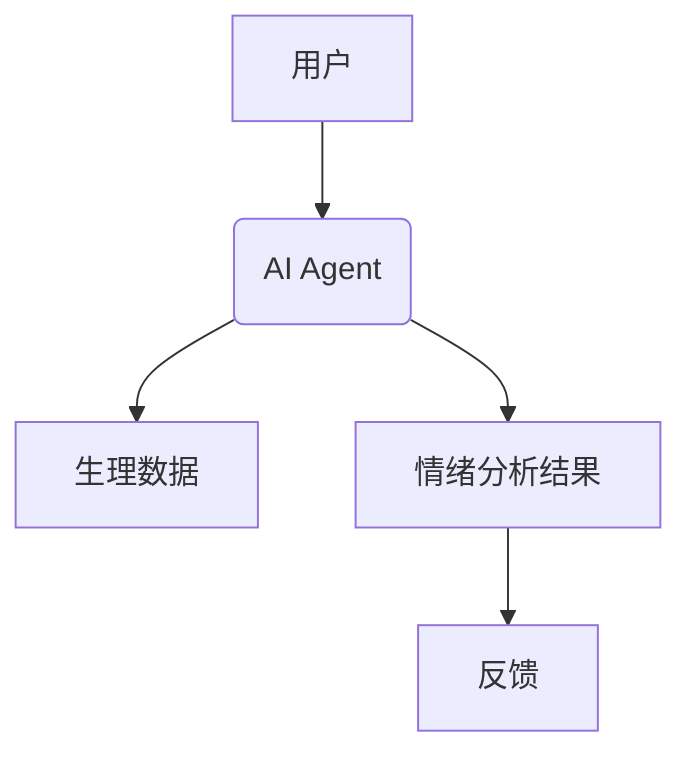
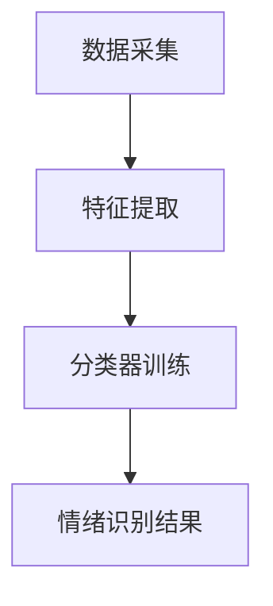
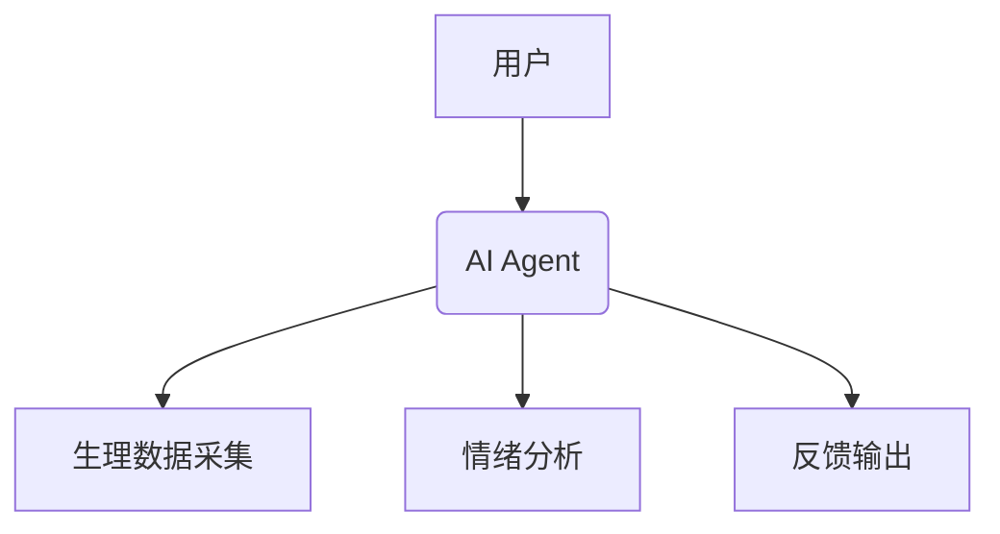

                 


# AI Agent在智能项链中的情绪监测

> 关键词：AI Agent, 智能项链, 情绪监测, 机器学习, 传感器, 可穿戴设备

> 摘要：  
本文深入探讨了AI Agent在智能项链中的情绪监测应用。首先介绍了AI Agent的基本概念及其在智能设备中的作用，分析了情绪监测的技术背景和应用场景。接着详细讲解了AI Agent的核心算法原理、数学模型以及系统架构设计，通过实际案例展示了项目的实现过程。最后总结了项目经验，并提供了最佳实践建议。

---

## 第1章: AI Agent与情绪监测的背景介绍

### 1.1 AI Agent的基本概念
AI Agent（人工智能代理）是指能够感知环境、自主决策并执行任务的智能实体。它通过传感器获取数据，结合预设算法进行分析，最终做出相应的反馈或行动。AI Agent的核心在于其智能化和自主性，能够适应不同的环境和需求。

### 1.2 情绪监测的基本概念
情绪监测是指通过技术手段分析个体的情绪状态，如高兴、愤怒、悲伤等。常见的监测方法包括基于生理信号（如心率、皮肤电活动）和行为数据（如语调、语速）的分析。

### 1.3 AI Agent在智能项链中的应用
智能项链作为一种可穿戴设备，集成AI Agent可以实时监测佩戴者的情绪状态。通过传感器收集生理数据，并结合AI算法进行分析，能够提供个性化的健康建议或情感支持。

---

## 第2章: AI Agent的核心概念与联系

### 2.1 AI Agent的核心功能
AI Agent在情绪监测中的核心功能包括：
1. **感知层**：通过传感器采集生理数据（如心率、体温）和环境数据（如光线、声音）。
2. **认知层**：利用机器学习算法分析数据，识别情绪状态。
3. **执行层**：根据分析结果，触发相应反馈（如振动提醒、灯光变化）。

### 2.2 核心概念对比分析
以下是传统传感器与AI Agent在情绪监测中的对比：

| 属性                | 传统传感器              | AI Agent                |
|---------------------|-------------------------|--------------------------|
| 数据采集方式        | 被动采集                | 主动分析与反馈          |
| 数据处理方式        | 简单信号转换            | 复杂算法分析            |
| 应用场景            | 单一功能                | 多功能集成              |

### 2.3 实体关系图
以下是AI Agent在智能项链中的实体关系图：



---

## 第3章: AI Agent的算法原理

### 3.1 基于生理信号的情绪识别算法
AI Agent通过分析心率、皮肤电活动等生理数据，结合机器学习算法进行情绪分类。以下是算法流程：



### 3.2 算法实现代码
以下是一个简单的Python代码示例：

```python
import numpy as np
from sklearn.svm import SVC

# 假设X为输入特征，y为情绪标签（0表示悲伤，1表示快乐）
X = np.array([[50, 120], [60, 80], [45, 110], [70, 60]])
y = np.array([0, 1, 0, 1])

# 训练分类器
clf = SVC()
clf.fit(X, y)

# 预测新数据
new_data = np.array([[55, 100]])
print(clf.predict(new_data))
```

### 3.3 数学模型
以下是基于支持向量机（SVM）的情绪分类模型：

$$
\text{最大化} \quad \frac{1}{2} \|\mathbf{w}\|^2 \\
\text{使得} \quad y_i (\mathbf{w} \cdot \mathbf{x}_i + b) \geq 1
$$

---

## 第4章: 系统分析与架构设计

### 4.1 系统架构图
以下是AI Agent在智能项链中的系统架构图：



### 4.2 系统功能设计
1. **数据采集模块**：负责采集用户的生理数据。
2. **情绪分析模块**：通过机器学习算法分析数据，识别情绪状态。
3. **反馈模块**：根据分析结果，提供相应的反馈（如振动提醒）。

---

## 第5章: 项目实战

### 5.1 环境安装
需要安装以下Python库：
```bash
pip install numpy scikit-learn matplotlib
```

### 5.2 核心代码实现
以下是一个简单的AI Agent实现代码：

```python
import numpy as np
from sklearn.ensemble import RandomForestClassifier

# 数据预处理
X = np.array([[50, 120], [60, 80], [45, 110], [70, 60]])
y = np.array([0, 1, 0, 1])

# 训练模型
model = RandomForestClassifier()
model.fit(X, y)

# 预测新数据
new_data = np.array([[55, 100]])
print(model.predict(new_data))
```

### 5.3 实际案例分析
假设用户在不同情境下佩戴智能项链，记录其情绪数据。通过分析数据，AI Agent能够识别用户的情绪状态，并提供相应的反馈。

---

## 第6章: 最佳实践与总结

### 6.1 小结
本文详细介绍了AI Agent在智能项链中的情绪监测技术，包括其核心概念、算法原理和系统架构设计。通过实际案例展示了项目的实现过程。

### 6.2 注意事项
- 数据采集的准确性直接影响情绪识别的效果。
- 模型的可解释性需要进一步优化。
- 隐私保护是智能设备设计中的重要问题。

### 6.3 拓展阅读
- 《机器学习实战》
- 《人工智能：一种现代的方法》

---

## 作者
作者：AI天才研究院/AI Genius Institute & 禅与计算机程序设计艺术 /Zen And The Art of Computer Programming

