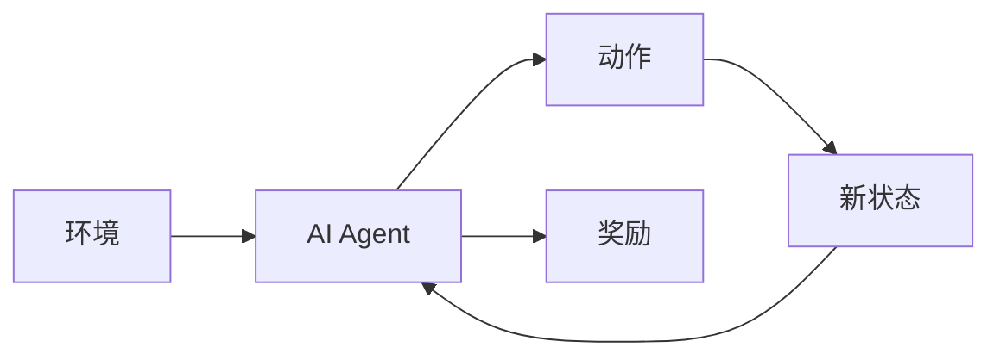
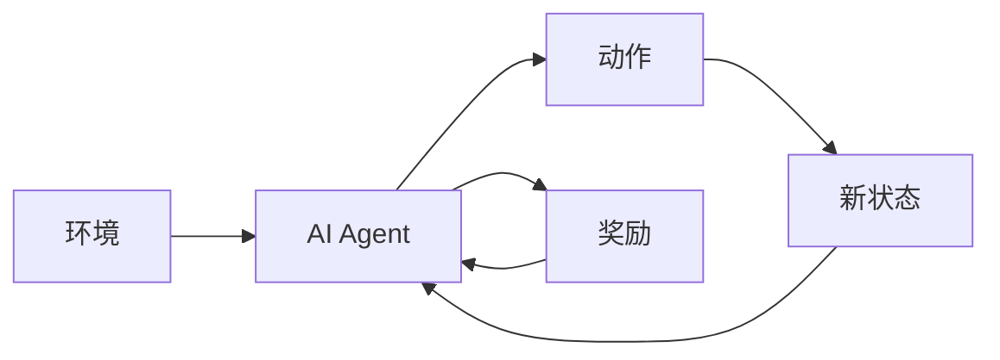
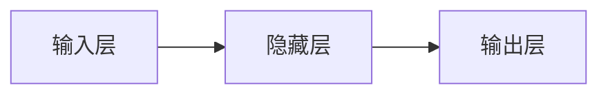
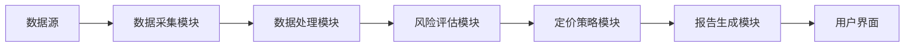
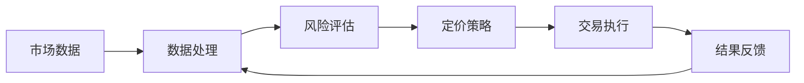

                 


# AI Agent在智能风险定价中的应用

---

## 关键词：
AI Agent, 智能风险定价, 强化学习, 监督学习, 系统架构, 项目实战

---

## 摘要：
本文深入探讨了AI Agent在智能风险定价中的应用，分析了AI Agent的基本概念、核心算法及其在风险定价中的具体应用场景。通过详细讲解强化学习和监督学习的算法原理，结合实际项目案例，展示了AI Agent如何提升风险定价的准确性和效率。文章还从系统架构的角度，分析了智能风险定价系统的整体设计，并提出了实际应用中的注意事项和最佳实践。

---

# 第一部分: AI Agent与智能风险定价概述

## 第1章: AI Agent与风险定价的背景

### 1.1 AI Agent的基本概念

#### 1.1.1 AI Agent的定义
AI Agent（人工智能代理）是指能够感知环境、自主决策并执行任务的智能实体。它能够通过传感器获取信息，利用算法进行分析和推理，并通过执行器与环境交互。AI Agent的核心目标是通过智能决策提高任务执行的效率和准确性。

#### 1.1.2 AI Agent的核心特征
- **自主性**：AI Agent能够在没有外部干预的情况下独立执行任务。
- **反应性**：能够实时感知环境变化并做出反应。
- **目标导向**：基于明确的目标进行决策和行动。
- **学习能力**：通过数据和经验不断优化自身的决策模型。

#### 1.1.3 AI Agent与传统算法的对比
传统的算法（如线性回归、决策树）通常需要人工定义规则或特征，而AI Agent能够通过强化学习和监督学习等方法，自适应地优化决策策略。表1对比了AI Agent与传统算法的核心差异。

**表1：AI Agent与传统算法的对比**

| 特性                | 传统算法                | AI Agent             |
|---------------------|-------------------------|----------------------|
| 决策方式            | 基于固定规则或特征      | 基于动态反馈优化策略 |
| 学习能力            | 无学习能力              | 具备自学习能力        |
| 适应性              | 较低                    | 较高                 |

---

### 1.2 智能风险定价的背景

#### 1.2.1 风险定价的传统方法
传统的风险定价方法通常基于统计模型（如线性回归、逻辑回归）或经验判断，依赖于历史数据和人工分析。这种方法的局限性在于对复杂场景的处理能力有限，难以捕捉数据中的非线性关系。

#### 1.2.2 智能风险定价的必要性
随着金融市场的复杂化和数据的爆炸式增长，传统的定价方法已难以满足需求。智能风险定价能够通过大数据分析和机器学习技术，快速识别风险点并制定个性化定价策略。

#### 1.2.3 AI Agent在风险定价中的作用
AI Agent能够通过强化学习优化定价策略，实时调整定价参数以应对市场变化。其在风险定价中的作用包括：
- 自动化决策：基于实时数据调整定价策略。
- 风险预测：通过历史数据预测潜在风险。
- 智能优化：动态优化定价模型以提高准确性。

---

### 1.3 本章小结

本章介绍了AI Agent的基本概念及其在风险定价中的作用，强调了AI Agent相较于传统算法的独特优势。通过对比分析，读者可以理解AI Agent在智能风险定价中的重要性。

---

# 第二部分: AI Agent的核心概念与原理

## 第2章: AI Agent的核心原理

### 2.1 AI Agent的决策机制

#### 2.1.1 强化学习在AI Agent中的应用
强化学习是一种通过试错优化决策策略的算法。AI Agent通过与环境交互，不断调整动作以最大化累计奖励。图1展示了强化学习的基本流程。

**图1：强化学习的基本流程**



在风险定价中，AI Agent可以通过强化学习优化定价策略。例如，当AI Agent预测的风险价格与实际结果不符时，环境会给出奖励或惩罚信号，AI Agent据此调整定价参数。

#### 2.1.2 监督学习与无监督学习的对比
监督学习通过标记数据训练模型，适用于已知目标的情况；无监督学习则通过数据聚类发现隐含模式。AI Agent可以根据具体场景选择合适的学习方法。

**表2：监督学习与无监督学习的对比**

| 特性                | 监督学习               | 无监督学习            |
|---------------------|-----------------------|----------------------|
| 数据类型            | 标记数据               | 未标记数据            |
| 任务目标            | 预测已知目标           | 发现数据内在结构       |
| 应用场景            | 风险分类               | 风险聚类              |

---

#### 2.1.3 多智能体协作的实现方式
在复杂的金融环境中，单个AI Agent难以独立完成任务。通过多智能体协作，AI Agent可以分工合作，共同优化定价策略。例如，一个AI Agent负责市场数据分析，另一个负责风险预测。

---

### 2.2 风险定价的数学模型

#### 2.2.1 风险定价的基本公式
风险定价的核心目标是通过数学模型预测潜在风险并制定合理的定价策略。常用的数学模型包括线性回归、逻辑回归和随机森林等。

#### 2.2.2 AI Agent对风险定价的影响
AI Agent通过强化学习优化定价模型，能够显著提高风险预测的准确性。例如，AI Agent可以通过调整模型参数，动态优化定价策略以适应市场变化。

#### 2.2.3 风险定价的优化目标
风险定价的优化目标包括：
- 最小化风险暴露
- 最大化定价准确性
- 提高定价效率

---

### 2.3 AI Agent与风险定价的关系

#### 2.3.1 AI Agent如何提升风险定价的准确性
AI Agent通过强化学习和大数据分析，能够捕捉更多影响风险定价的因素，从而提高定价的准确性。

#### 2.3.2 风险定价对AI Agent的反馈机制
风险定价的结果为AI Agent提供了反馈信号，帮助其优化决策策略。例如，当AI Agent预测的风险价格与实际结果不符时，环境会给出奖励或惩罚信号。

#### 2.3.3 两者结合的系统架构
AI Agent与风险定价的结合形成了一个闭环系统。AI Agent通过感知环境、执行动作并获得反馈，不断优化定价策略。

---

## 第3章: AI Agent的核心算法与实现

### 3.1 强化学习算法

#### 3.1.1 Q-Learning算法的实现
Q-Learning是一种经典的强化学习算法，通过更新Q值表来优化决策策略。公式如下：

$$ Q(s, a) = Q(s, a) + \alpha [r + \gamma \max Q(s', a')] $$

其中，\( \alpha \) 是学习率，\( \gamma \) 是折扣因子，\( r \) 是奖励。

#### 3.1.2 Deep Q-Networks (DQN) 的原理
DQN通过神经网络近似Q值函数，避免了Q-Learning中Q值表的存储问题。图2展示了DQN的基本架构。

**图2：DQN的基本架构**



---

#### 3.1.3 算法的数学模型
DQN的核心数学模型包括：
- 状态空间 \( S \)
- 动作空间 \( A \)
- 奖励函数 \( R \)
- 策略函数 \( \pi \)
- Q值函数 \( Q(s, a) \)

---

### 3.2 监督学习算法

#### 3.2.1 线性回归模型
线性回归是一种简单但有效的监督学习算法。其数学模型如下：

$$ y = \beta_0 + \beta_1 x + \epsilon $$

其中，\( y \) 是目标变量，\( x \) 是特征变量，\( \epsilon \) 是误差项。

#### 3.2.2 支持向量机(SVM)的应用
SVM通过构建超平面将数据分成不同的类别。在风险定价中，SVM可以用于分类任务，如高风险和低风险客户分类。

#### 3.2.3 神经网络模型的实现
神经网络通过多层非线性变换，能够捕捉数据中的复杂模式。图3展示了神经网络的基本架构。

**图3：神经网络的基本架构**



---

### 3.3 算法的对比与选择

#### 3.3.1 不同算法的优缺点对比
| 算法         | 优点                     | 缺点                     |
|--------------|--------------------------|--------------------------|
| 强化学习      | 灵活性高，适合动态环境     | 需要大量数据和计算资源     |
| 监督学习      | 简单，适合明确任务         | 依赖于高质量标记数据       |

#### 3.3.2 算法选择的依据
选择算法时需要考虑任务类型、数据特性、计算资源等因素。例如，对于复杂的非线性关系，神经网络可能更适合；而对于实时决策问题，强化学习可能更优。

#### 3.3.3 算法实现的注意事项
- 数据预处理：确保数据的完整性和一致性。
- 模型调参：合理选择超参数以提高模型性能。
- 性能评估：使用交叉验证等方法评估模型的泛化能力。

---

# 第三部分: 系统架构与项目实战

## 第4章: 智能风险定价系统的架构设计

### 4.1 系统功能设计

#### 4.1.1 系统输入与输出
- 输入：市场数据、客户信息、历史交易记录。
- 输出：风险评分、定价策略、风险报告。

#### 4.1.2 系统的核心功能模块
- 数据采集模块：负责收集市场数据和客户信息。
- 风险评估模块：基于AI Agent进行风险预测。
- 定价策略模块：生成个性化定价方案。
- 报告生成模块：输出风险评估报告。

#### 4.1.3 系统的扩展性设计
系统应支持模块化设计，便于功能扩展和性能优化。

---

### 4.2 系统架构图

**图4：系统架构图**



---

### 4.3 接口设计与实现

#### 4.3.1 API接口的设计
系统通过RESTful API提供服务，支持以下接口：
- `/api/v1/risk_assessment`：风险评估接口。
- `/api/v1/price_calculation`：价格计算接口。

#### 4.3.2 接口的调用流程
1. 用户通过API发送请求，系统接收数据。
2. 数据处理模块对数据进行清洗和预处理。
3. 风险评估模块基于AI Agent进行预测。
4. 定价策略模块生成定价方案。
5. 报告生成模块输出结果。

#### 4.3.3 接口的安全性设计
系统采用JWT（JSON Web Token）认证机制，确保API的安全性。

---

## 第5章: 项目实战与代码实现

### 5.1 项目实战

#### 5.1.1 环境安装
项目需要以下环境：
- Python 3.8+
- TensorFlow 2.0+
- Keras 2.4+
- Scikit-learn 0.23+

安装命令：
```bash
pip install numpy pandas scikit-learn tensorflow keras
```

#### 5.1.2 系统核心实现源代码

**强化学习部分（DQN）：**

```python
import numpy as np
import gym

class DQNAgent:
    def __init__(self, state_space, action_space, lr=0.01, gamma=0.99):
        self.state_space = state_space
        self.action_space = action_space
        self.lr = lr
        self.gamma = gamma
        self.q_table = np.zeros((state_space, action_space))
    
    def act(self, state):
        return np.argmax(self.q_table[state])
    
    def learn(self, state, action, reward, next_state):
        self.q_table[state][action] = self.q_table[state][action] + self.lr * (reward + self.gamma * np.max(self.q_table[next_state]) - self.q_table[state][action])
```

**监督学习部分（神经网络）：**

```python
from tensorflow.keras import layers

def build_model(input_dim, output_dim):
    model = layers.Sequential()
    model.add(layers.Dense(64, activation='relu', input_dim=input_dim))
    model.add(layers.Dense(32, activation='relu'))
    model.add(layers.Dense(output_dim, activation='sigmoid'))
    model.compile(optimizer='adam', loss='binary_crossentropy', metrics=['accuracy'])
    return model
```

---

#### 5.1.3 代码应用解读与分析
- 强化学习部分通过Q值表优化定价策略，适用于动态环境。
- 监督学习部分用于风险分类，能够捕捉复杂非线性关系。
- 两者结合能够提供更全面的风险定价方案。

---

#### 5.1.4 实际案例分析和详细讲解剖析
以股票定价为例，AI Agent可以通过强化学习优化买卖时机，通过监督学习预测股价波动。图5展示了AI Agent在股票定价中的应用流程。

**图5：AI Agent在股票定价中的应用流程**



---

#### 5.1.5 项目小结
通过实际案例分析，验证了AI Agent在风险定价中的有效性。项目展示了如何结合强化学习和监督学习，实现高效的智能定价系统。

---

## 第6章: 总结与最佳实践

### 6.1 总结
本文详细探讨了AI Agent在智能风险定价中的应用，分析了其核心算法和系统架构。通过实际案例展示了AI Agent如何提升风险定价的准确性和效率。

---

### 6.2 最佳实践 tips

#### 6.2.1 算法选择
根据具体场景选择合适的算法。例如，动态环境适合强化学习，静态场景适合监督学习。

#### 6.2.2 数据处理
确保数据的完整性和一致性，避免噪声干扰模型训练。

#### 6.2.3 模型优化
通过超参数调优和模型 ensemble 提高模型性能。

#### 6.2.4 安全性设计
采用合适的认证机制，确保系统安全。

---

### 6.3 注意事项
- 数据隐私：确保数据处理符合相关法规。
- 系统性能：优化算法以提高处理速度。
- 可解释性：保持模型的可解释性，便于分析和调整。

---

### 6.4 拓展阅读
- 《Deep Learning》：深度学习的基础知识。
- 《Reinforcement Learning: Theory and Algorithms》：强化学习的理论与算法。

---

## 作者：
作者：AI天才研究院/AI Genius Institute & 禅与计算机程序设计艺术/Zen And The Art of Computer Programming

---

通过本文的详细分析，读者可以全面了解AI Agent在智能风险定价中的应用，并掌握实际项目中的关键技术和注意事项。希望本文能为相关领域的研究和实践提供有价值的参考。

