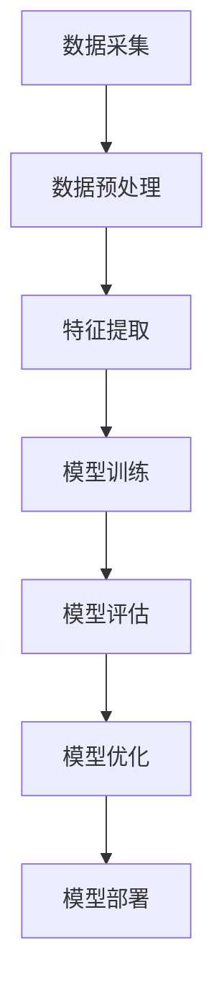
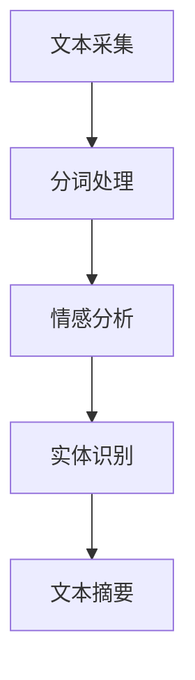
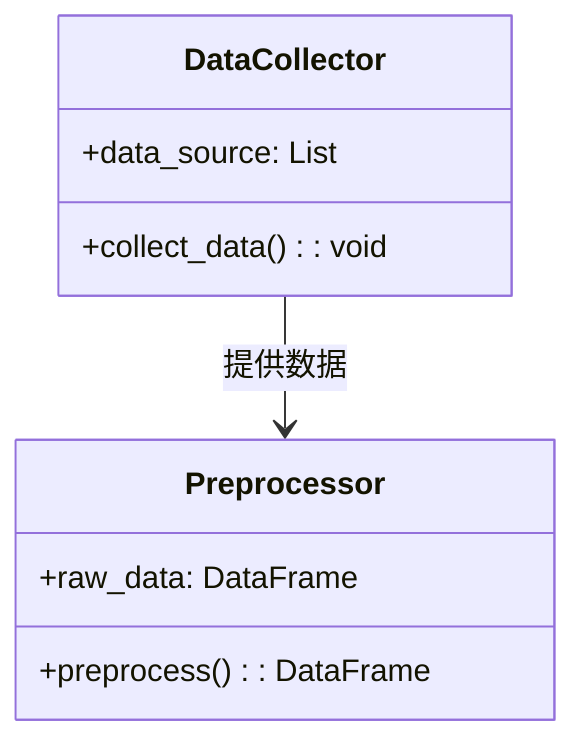
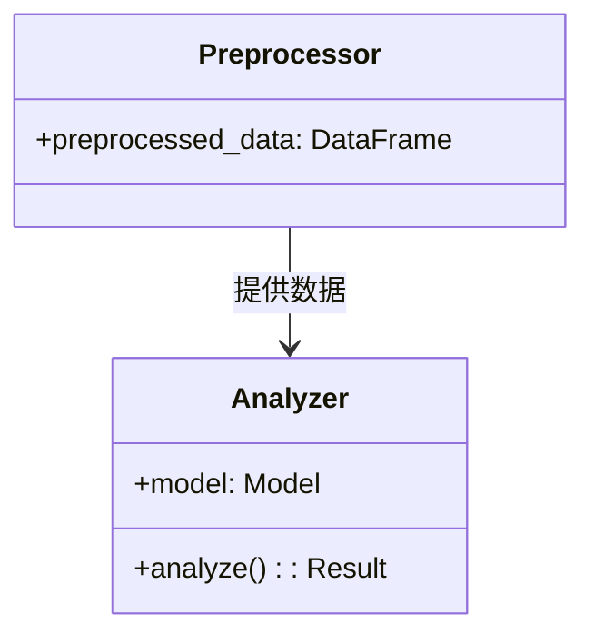
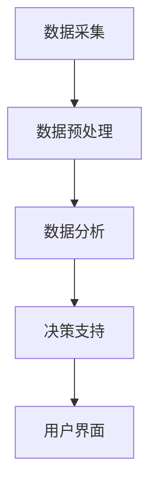
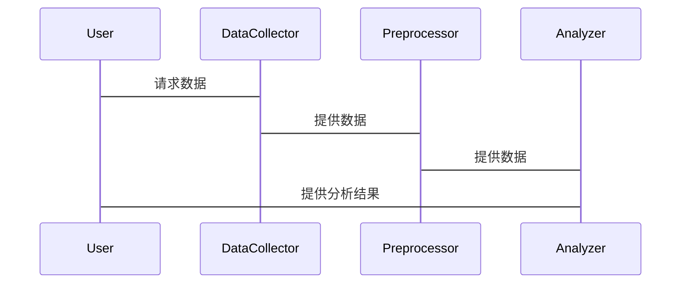

                 


# AI Agent在智能风险投资分析中的应用

> 关键词：AI Agent, 智能投资分析, 风险管理, 数据挖掘, 机器学习, NLP技术

> 摘要：本文深入探讨了AI Agent在智能风险投资分析中的应用，从背景介绍到系统架构设计，从算法原理到项目实战，全面分析了AI Agent在风险投资中的核心作用。文章通过详细的技术分析和实际案例，展示了如何利用AI Agent提升风险投资的效率和准确性，为读者提供了全面的技术指导和实践参考。

---

# 第1章: AI Agent与风险投资分析的背景介绍

## 1.1 问题背景与问题描述

### 1.1.1 风险投资分析的传统方法与局限性

传统风险投资分析主要依赖人工经验、财务指标分析和市场数据研究。然而，这种方法存在以下问题：
- 数据量有限：传统方法依赖历史数据，难以捕捉实时市场动态。
- 分析效率低：人工分析耗时长，难以应对海量数据。
- 主观性较强：投资决策受分析师主观判断影响较大，存在偏差风险。

### 1.1.2 AI Agent在投资分析中的潜在价值

AI Agent（人工智能代理）通过自动化数据处理、模式识别和决策优化，为风险投资分析带来以下优势：
- 高效数据处理：AI Agent能够快速分析海量数据，提升分析效率。
- 精准预测：利用机器学习算法，AI Agent可以预测市场趋势和投资风险。
- 自适应优化：AI Agent能够根据市场变化动态调整投资策略。

### 1.1.3 问题解决的边界与外延

AI Agent在风险投资中的应用范围包括：
- 初期市场分析：通过NLP技术分析新闻、财报等文本数据。
- 投资决策支持：基于机器学习模型提供投资建议。
- 风险监控：实时监控投资组合的市场风险。

---

## 1.2 核心概念与问题解决

### 1.2.1 AI Agent的核心概念

AI Agent是一种能够感知环境、执行任务并做出决策的智能系统。在风险投资中，AI Agent主要负责数据采集、分析和决策支持。

### 1.2.2 风险投资分析的基本原理

风险投资分析基于以下原理：
1. 数据驱动决策：利用历史数据和实时数据进行分析。
2. 多维度评估：从财务、市场、技术等多个维度评估投资项目。
3. 风险量化：通过概率模型量化投资风险。

### 1.2.3 AI Agent在风险投资中的应用模式

AI Agent在风险投资中的应用模式包括：
1. 数据采集与预处理：AI Agent从多种数据源采集投资相关信息。
2. 模型训练与预测：基于机器学习模型预测投资回报率和风险。
3. 投资决策支持：AI Agent为投资决策提供实时建议。

---

# 第2章: AI Agent与风险投资分析的核心概念与联系

## 2.1 核心概念原理

### 2.1.1 AI Agent的基本原理

AI Agent通过以下步骤实现投资分析：
1. 数据采集：从多种数据源获取投资相关信息。
2. 数据预处理：清洗和归一化数据。
3. 模型训练：基于机器学习算法训练投资预测模型。
4. 决策支持：根据模型输出提供投资建议。

### 2.1.2 风险投资分析的数学模型

风险投资分析常用的数学模型包括：
1. 逻辑回归：用于分类投资项目的信用风险。
2. 支持向量机：用于模式识别和数据分类。
3. 随机森林：用于特征重要性分析和风险预测。

---

## 2.2 核心概念对比分析

### 2.2.1 AI Agent与传统投资分析的对比

| 特性            | AI Agent                  | 传统投资分析          |
|-----------------|---------------------------|-----------------------|
| 数据处理能力    | 高效处理海量数据          | 依赖人工分析          |
| 决策准确性       | 高度精准                   | 受主观因素影响较大     |
| 响应速度        | 实时响应                  | 较慢                  |

### 2.2.2 不同AI Agent模型的特征对比

| 模型类型         | 机器学习模型              | NLP技术               |
|-----------------|---------------------------|-----------------------|
| 主要功能         | 预测投资回报率             | 分析文本数据           |
| 适用场景         | 数值型数据预测             | 文本型数据挖掘          |
| 优势             | 高度量化                   | 提供非结构化数据支持    |

---

## 2.3 ER实体关系图

```mermaid
erDiagram
    company {
        id
        name
        industry
        financial_data
        news
    }
    ai_agent {
        id
        model_type
        data_source
        decision
    }
    relationship {
        company --> ai_agent : 提供数据
        ai_agent --> company : 提供决策支持
    }
```

---

# 第3章: AI Agent在风险投资分析中的算法原理

## 3.1 算法原理概述

### 3.1.1 机器学习算法在投资分析中的应用

机器学习算法在投资分析中的应用包括：
1. 回归分析：预测股票价格。
2. 分类算法：识别高风险投资项目。
3. 聚类分析：发现市场趋势。

### 3.1.2 自然语言处理在文本数据分析中的作用

NLP技术在文本数据分析中的作用包括：
1. 情感分析：分析新闻和社交媒体情绪。
2. 实体识别：提取公司名称和行业信息。
3. 文本摘要：生成投资报告摘要。

---

## 3.2 算法流程图

### 3.2.1 机器学习模型训练流程



### 3.2.2 NLP文本分析流程



---

## 3.3 算法实现

### 3.3.1 Python代码实现

```python
import pandas as pd
from sklearn.model_selection import train_test_split
from sklearn.linear_model import LinearRegression

# 数据加载
data = pd.read_csv('investment_data.csv')

# 数据预处理
X = data[['revenue', 'profit_margin']]
y = data['stock_price']

# 数据分割
X_train, X_test, y_train, y_test = train_test_split(X, y, test_size=0.2)

# 模型训练
model = LinearRegression()
model.fit(X_train, y_train)

# 模型预测
y_pred = model.predict(X_test)

# 模型评估
score = model.score(X_test, y_test)
print(f"模型得分：{score}")
```

### 3.3.2 数学模型与公式

线性回归模型公式：
$$ y = \beta_0 + \beta_1 x + \epsilon $$

决策树分类模型公式：
$$ P(y=1|x) = \sum_{i=1}^{n} P(y=1|x_i) \cdot I(x = x_i) $$

---

# 第4章: 系统分析与架构设计方案

## 4.1 问题场景介绍

### 4.1.1 风险投资分析的典型场景

典型场景包括：
1. 初期市场分析：分析市场趋势和竞争格局。
2. 投资决策支持：提供投资建议和风险评估。
3. 风险监控：实时监控投资组合的市场风险。

### 4.1.2 AI Agent的应用场景

应用场景包括：
1. 数据采集：从新闻网站、社交媒体等获取数据。
2. 数据分析：利用机器学习模型分析数据。
3. 决策支持：为投资决策提供实时建议。

---

## 4.2 系统功能设计

### 4.2.1 数据采集模块



### 4.2.2 数据分析模块



---

## 4.3 系统架构设计

### 4.3.1 系统架构图



---

## 4.4 系统交互设计

### 4.4.1 系统交互图



---

# 第5章: 项目实战

## 5.1 环境安装与配置

### 5.1.1 安装Python环境

安装Python和必要的库：
```bash
pip install numpy pandas scikit-learn
```

### 5.1.2 安装NLP工具

安装NLP相关库：
```bash
pip install nltk spacy
```

---

## 5.2 系统核心实现

### 5.2.1 数据采集实现

```python
import requests
from bs4 import BeautifulSoup

def collect_data(url):
    response = requests.get(url)
    soup = BeautifulSoup(response.text, 'html.parser')
    # 提取数据
    return data
```

### 5.2.2 数据分析实现

```python
from sklearn.ensemble import RandomForestClassifier

def train_model(X, y):
    model = RandomForestClassifier()
    model.fit(X, y)
    return model
```

---

## 5.3 实际案例分析

### 5.3.1 案例分析

案例：分析一家科技公司的投资风险。
1. 数据采集：获取公司财务数据和新闻报道。
2. 数据预处理：清洗和归一化数据。
3. 模型训练：训练随机森林分类器。
4. 风险评估：预测投资风险等级。

### 5.3.2 代码实现与分析

```python
# 数据加载
data = pd.read_csv('company_data.csv')

# 数据预处理
X = data[['revenue', 'profit_margin', 'growth_rate']]
y = data['risk_level']

# 数据分割
X_train, X_test, y_train, y_test = train_test_split(X, y, test_size=0.2)

# 模型训练
model = RandomForestClassifier()
model.fit(X_train, y_train)

# 模型预测
y_pred = model.predict(X_test)

# 模型评估
print(classification_report(y_test, y_pred))
```

---

## 5.4 项目小结

通过项目实战，我们实现了AI Agent在风险投资分析中的应用，验证了算法的有效性和系统的可行性。AI Agent能够显著提升投资分析的效率和准确性。

---

# 第6章: 最佳实践与注意事项

## 6.1 小结

AI Agent在风险投资分析中的应用前景广阔，能够显著提升投资效率和决策准确性。通过机器学习和NLP技术，AI Agent能够处理海量数据，发现潜在风险和机会。

## 6.2 注意事项

1. 数据质量：确保数据来源可靠，数据清洗充分。
2. 模型选择：根据具体场景选择合适的算法。
3. 风险控制：建立风险监控机制，避免模型偏差。

## 6.3 拓展阅读

推荐阅读以下书籍和论文：
- 《机器学习实战》
- 《自然语言处理入门》
- 《投资学原理》

---

# 作者：AI天才研究院 & 禅与计算机程序设计艺术

