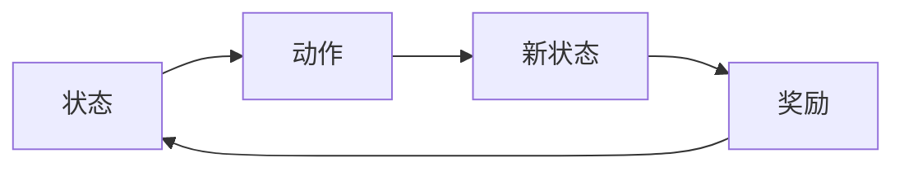
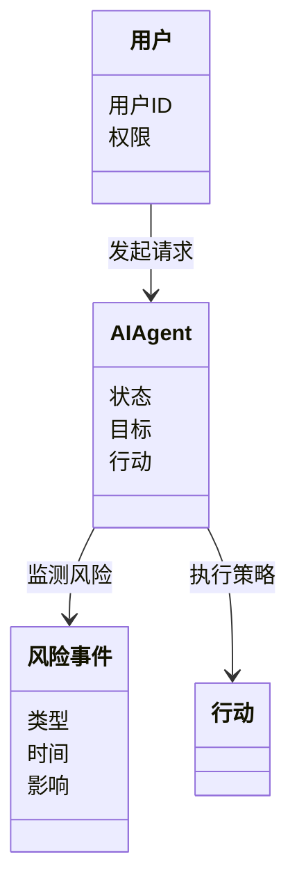
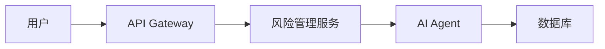
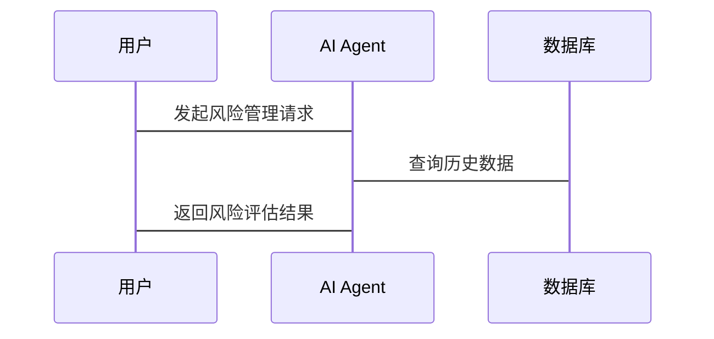

                 


---

# AI Agent在智能风险管理中的角色

**关键词**：AI Agent、风险管理、智能系统、算法原理、系统架构、项目实战

**摘要**：  
随着人工智能技术的飞速发展，AI Agent（智能体）在智能风险管理中的应用日益广泛。本文将从AI Agent的基本概念出发，深入分析其在风险管理中的角色，结合算法原理、系统架构设计及实际案例，探讨AI Agent如何助力智能风险管理的实现。通过本文的阐述，读者将全面了解AI Agent在风险管理中的核心作用及其实际应用价值。

---

## 第1章 AI Agent与风险管理的背景介绍

### 1.1 AI Agent的基本概念
AI Agent，即人工智能智能体，是一种能够感知环境、自主决策并执行任务的智能系统。它不同于传统的软件程序，具备以下核心特征：
1. **自主性**：能够在没有外部干预的情况下独立运行。
2. **反应性**：能够实时感知环境变化并做出相应反应。
3. **目标导向**：以实现特定目标为导向，优化决策过程。
4. **学习能力**：通过数据和经验不断优化自身的决策能力。

### 1.2 智能风险管理的基本概念
风险管理是指通过识别、评估和应对潜在风险，以降低其对组织或系统的影响。智能风险管理则是通过引入人工智能技术，提升风险管理的效率和准确性。其核心流程包括：
1. **风险识别**：识别潜在的危险因素。
2. **风险评估**：评估风险的可能性和影响程度。
3. **风险应对**：制定和执行应对策略。
4. **风险监控**：持续监控风险状态并调整应对措施。

### 1.3 AI Agent在风险管理中的应用背景
随着数字化转型的推进，传统的人工风险管理方式逐渐暴露出效率低下、准确度不足等问题。AI Agent的引入为智能风险管理提供了新的解决方案。AI Agent的优势在于其强大的数据处理能力、实时决策能力和自适应学习能力，使其能够在复杂多变的环境中快速响应风险。

---

## 第2章 AI Agent的核心概念与联系

### 2.1 AI Agent的核心概念
AI Agent的核心概念包括：
- **感知**：通过传感器或数据输入获取环境信息。
- **决策**：基于感知信息，通过算法选择最优行动方案。
- **行动**：执行决策结果，影响环境状态。

### 2.2 AI Agent与风险管理的实体关系分析
以下是AI Agent与风险管理相关实体的ER图：

```mermaid
er
actor: 用户
agent: AI Agent
risk: 风险事件
action: 行动
goal: 目标
dependency: 依赖关系
```

### 2.3 AI Agent的核心原理
AI Agent的核心原理包括：
1. **感知与决策机制**：通过传感器或数据源获取信息，利用算法进行分析和决策。
2. **行动执行机制**：根据决策结果执行相应的行动。
3. **自适应与学习机制**：通过机器学习算法不断优化自身的决策能力。

---

## 第3章 AI Agent的算法原理

### 3.1 基础算法介绍
1. **强化学习算法**：通过试错机制优化决策策略。
2. **监督学习算法**：基于标记数据进行分类和预测。
3. **无监督学习算法**：从无标记数据中发现模式和结构。

### 3.2 AI Agent的核心算法实现
#### 3.2.1 Q-Learning算法
Q-Learning是一种经典的强化学习算法，其流程如下：



代码实现：
```python
import numpy as np
import gym

env = gym.make('CartPole-v0')
env.seed(1)
np.random.seed(1)

Q = np.zeros([env.observation_space.shape[0], env.action_space.n])
learning_rate = 0.01
gamma = 0.99

for _ in range(1000):
    state = env.reset()
    while True:
        action = np.argmax(Q[state]) if np.max(Q[state]) > 0 else env.action_space.sample()
        next_state, reward, done, _ = env.step(action)
        Q[state][action] += learning_rate * (reward + gamma * np.max(Q[next_state]) - Q[state][action])
        state = next_state
        if done:
            break
```

---

## 第4章 系统分析与架构设计

### 4.1 问题场景介绍
假设我们正在设计一个智能金融风险管理系统，目标是实时监控金融市场中的风险因素，并通过AI Agent进行风险预警和应对。

### 4.2 系统功能设计
以下是系统的领域模型：



### 4.3 系统架构设计
以下是系统的架构图：



### 4.4 系统接口设计
系统接口包括：
1. 用户接口：用户发起风险管理请求。
2. 数据接口：获取实时市场数据。
3. 行动接口：执行风险应对策略。

### 4.5 系统交互设计
以下是系统的交互图：



---

## 第5章 项目实战

### 5.1 环境安装
安装所需的Python库：
```bash
pip install gym numpy matplotlib
```

### 5.2 核心实现
以下是AI Agent的核心代码：
```python
import gym
import numpy as np

env = gym.make('CartPole-v0')
env.seed(1)
np.random.seed(1)

Q = np.zeros([env.observation_space.shape[0], env.action_space.n])
learning_rate = 0.01
gamma = 0.99

for _ in range(1000):
    state = env.reset()
    while True:
        action = np.argmax(Q[state]) if np.max(Q[state]) > 0 else env.action_space.sample()
        next_state, reward, done, _ = env.step(action)
        Q[state][action] += learning_rate * (reward + gamma * np.max(Q[next_state]) - Q[state][action])
        state = next_state
        if done:
            break
```

### 5.3 案例分析
在金融风险管理中，AI Agent可以通过实时监控市场数据，识别潜在风险，并自动执行对冲策略。例如，在检测到市场波动加剧时，AI Agent可以自动调整投资组合，降低风险敞口。

---

## 第6章 总结与展望

### 6.1 总结
本文详细探讨了AI Agent在智能风险管理中的角色，从核心概念到算法实现，再到系统架构设计，全面阐述了AI Agent在风险管理中的应用价值。

### 6.2 注意事项
在实际应用中，需要注意以下几点：
1. 数据质量：AI Agent的决策依赖于高质量的数据。
2. 算法选择：选择适合具体场景的算法。
3. 系统安全：确保系统的安全性和稳定性。

### 6.3 未来展望
随着人工智能技术的不断发展，AI Agent在智能风险管理中的应用将更加广泛和深入。未来的研究方向包括多智能体协作、强化学习算法的优化以及风险管理的实时性提升。

---

**作者：AI天才研究院/AI Genius Institute & 禅与计算机程序设计艺术/Zen And The Art of Computer Programming**

