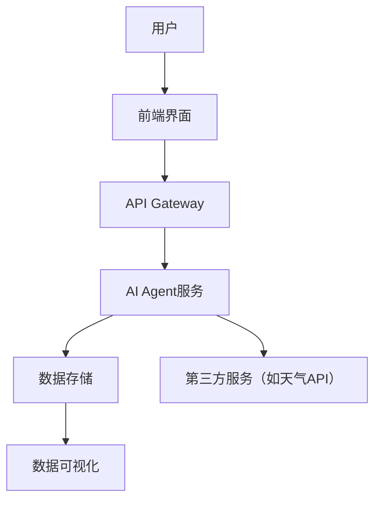
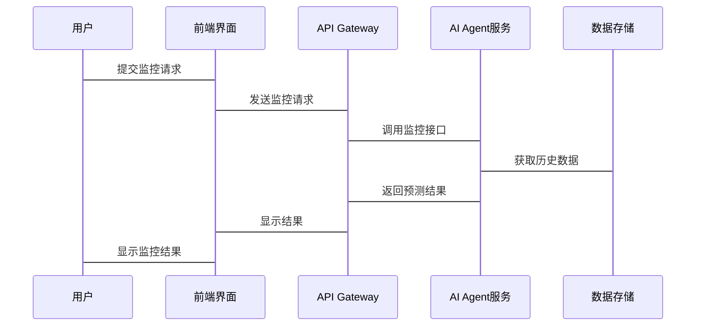

                 

<think>
好的，我将按照您的要求撰写一篇关于《AI Agent在智能食品安全监控中的角色》的详细技术博客文章。为了让内容更加丰富和有条理，我将逐步构建文章的各个部分。首先，让我们从摘要开始。

### 摘要

人工智能（AI）代理（Agent）在智能食品安全监控中的应用日益广泛。随着食品安全问题的日益突出，利用AI代理技术实现对食品生产和流通全过程的智能化监控，已成为保障公众健康和食品安全的重要手段。本文将系统地探讨AI代理在食品安全监控中的角色和作用，包括其技术原理、应用场景、系统设计以及实际案例分析。通过结合AI代理的感知、决策和执行能力，本文将展示如何利用这些技术手段构建高效的食品安全监控系统。

---

接下来，我们将按照目录结构逐步展开每一部分的内容。

---

### 第一部分：AI Agent在智能食品安全监控中的背景与概念

#### 第1章：AI Agent与智能食品安全监控的背景介绍

##### 1.1 问题背景

- **1.1.1 食品安全问题的现状与挑战**  
  随着全球化的发展，食品供应链变得越来越复杂。从生产到销售的每一个环节都可能引入安全隐患，如重金属污染、农药残留、细菌感染等。传统的食品安全监控方法依赖于人工检查和实验室检测，效率低下且成本高昂。

- **1.1.2 AI技术在食品安全监控中的应用潜力**  
  AI技术的快速发展为食品安全监控提供了新的解决方案。通过机器学习、计算机视觉和自然语言处理等技术，AI代理能够实时分析海量数据，快速识别潜在风险。

- **1.1.3 AI Agent在食品安全监控中的独特优势**  
  AI代理不仅能够感知环境，还能自主决策并执行操作。这种智能化的特点使其能够高效地处理复杂场景下的食品安全问题。

---

##### 1.2 问题描述

- **1.2.1 食品安全监控的主要问题**  
  - 数据来源多样化，包括传感器数据、图像数据、文本数据等，如何有效整合和分析这些数据是关键。  
  - 监控系统的实时性要求高，需要在事件发生前或发生时快速响应。  
  - 数据隐私和安全问题，尤其是在处理个人健康数据时。

- **1.2.2 AI Agent在监控中的角色定位**  
  AI代理作为监控系统的核心模块，负责数据的采集、分析和决策。其主要任务包括实时监测食品状态、预测潜在风险、发出预警信号等。

- **1.2.3 相关概念的边界与外延**  
  AI代理的边界在于其自主决策和执行的能力，而外延则涉及与物联网（IoT）、云计算等技术的结合，形成完整的食品安全监控生态系统。

---

##### 1.3 问题解决思路

- **1.3.1 AI Agent的核心解决思路**  
  通过感知环境、分析数据、制定决策并执行操作，AI代理能够实现对食品状态的实时监控和智能管理。

- **1.3.2 相关概念之间的关系与联系**  
  AI代理与食品安全监控系统之间是相互依存的关系，前者提供智能处理能力，后者提供数据和应用场景。

- **1.3.3 核心要素组成与系统架构**  
  AI代理系统的核心要素包括感知模块、决策模块和执行模块，三者协同工作以实现食品安全监控的目标。

---

##### 1.4 本章小结

本章从背景和概念入手，介绍了AI代理在食品安全监控中的重要性及其核心作用。通过分析问题背景和解决思路，我们为后续的技术细节和系统设计奠定了基础。

---

#### 第2章：AI Agent与食品安全监控的核心概念

##### 2.1 AI Agent的定义与特点

- **2.1.1 AI Agent的基本定义**  
  AI代理是一种能够感知环境、自主决策并执行操作的智能体。它通过传感器或数据源获取信息，并根据预设的目标进行行动。

- **2.1.2 AI Agent的核心特点与属性**  
  - **自主性**：能够在没有外部干预的情况下独立运行。  
  - **反应性**：能够实时感知环境变化并做出反应。  
  - **目标导向**：所有操作围绕特定目标展开。  
  - **学习能力**：通过数据和经验不断优化自身性能。

- **2.1.3 AI Agent与传统监控系统的区别**  
  传统监控系统依赖于人工操作和固定规则，而AI代理能够自主学习和适应复杂环境。

---

##### 2.2 食品安全监控的定义与特点

- **2.2.1 食品安全监控的基本定义**  
  食品安全监控是指通过技术手段对食品的生产、运输和销售过程进行实时监测，以确保食品的安全性和合规性。

- **2.2.2 食品安全监控的核心要素**  
  - **数据采集**：通过传感器、摄像头等设备获取食品状态的数据。  
  - **数据分析**：利用机器学习算法对数据进行处理和分析。  
  - **预警系统**：在发现潜在风险时，及时发出预警信号。

- **2.2.3 食品安全监控的挑战与难点**  
  - 数据量大且类型多样，处理复杂。  
  - 需要高实时性，否则可能错过最佳处理时机。  
  - 数据隐私和安全问题需要严格保护。

---

##### 2.3 AI Agent与食品安全监控的关系

- **2.3.1 AI Agent在食品安全监控中的角色**  
  AI代理是食品安全监控系统的核心组件，负责数据的采集、分析和决策。

- **2.3.2 AI Agent与食品安全监控的相互作用**  
  通过AI代理的感知和决策能力，食品安全监控系统能够实现智能化和高效化。

- **2.3.3 AI Agent在食品安全监控中的优势**  
  - 提高监控效率，降低人工成本。  
  - 实现实时监控，快速响应潜在风险。  
  - 通过数据挖掘和学习，发现潜在的安全隐患。

---

##### 2.4 核心概念对比分析

- **2.4.1 AI Agent与传统监控系统的对比**  
  | 特性                | AI Agent                 | 传统监控系统           |
  |---------------------|--------------------------|------------------------|
  | 自主性              | 高                     | 低                     |
  | 反应性              | 高                     | 低                     |
  | 学习能力            | 高                     | 无或低                 |
  | 维护成本            | 低                     | 高                     |

- **2.4.2 食品安全监控与其它监控系统的对比**  
  与其他类型的监控系统（如环境监控、交通监控）相比，食品安全监控具有更强的实时性和数据敏感性。

- **2.4.3 AI Agent在不同监控场景中的应用对比**  
  AI代理在食品安全监控中的应用更具针对性，需要处理与食品相关的特定数据和问题。

---

### 第二部分：AI Agent的算法原理与实现

#### 第3章：AI Agent的算法原理

##### 3.1 算法原理概述

AI Agent的核心算法包括感知、决策和执行三个模块。以下是各模块的详细分析：

- **3.1.1 感知模块**  
  感知模块负责从环境中获取数据，通常通过传感器、摄像头或文本解析等方式实现。  
  - 例如：图像识别技术用于检测食品表面的瑕疵。

- **3.1.2 决策模块**  
  决策模块基于感知数据和预设规则，通过机器学习算法生成决策。  
  - 例如：使用随机森林算法预测食品是否符合安全标准。

- **3.1.3 执行模块**  
  执行模块根据决策结果采取行动，例如发出预警信号或启动净化设备。

---

##### 3.2 算法实现

以下是AI Agent的核心算法实现示例：

```python
import numpy as np
from sklearn.ensemble import RandomForestClassifier

# 示例数据：假设每个食品样本有10个特征
X = np.random.randn(100, 10)
y = np.random.randint(2, size=100)  # 0表示安全，1表示不安全

# 训练随机森林模型
model = RandomForestClassifier(n_estimators=100)
model.fit(X, y)

# 预测新样本
new_sample = np.random.randn(1, 10)
prediction = model.predict(new_sample)
print("预测结果：", prediction)
```

---

##### 3.3 算法优缺点分析

- **优点**  
  - 高效性：AI代理能够快速处理大量数据，提高监控效率。  
  - 准确性：通过机器学习算法，AI代理能够实现高精度的预测和分类。

- **缺点**  
  - 数据依赖性：AI代理的表现高度依赖于训练数据的质量和数量。  
  - 黑箱问题：部分算法（如深度学习模型）的决策过程难以解释。

---

### 第三部分：系统设计与实现

#### 第4章：系统设计与实现

##### 4.1 系统架构设计

AI Agent驱动的食品安全监控系统架构如下：



---

##### 4.2 功能设计

- **功能模块**  
  - 数据采集模块：负责采集食品相关的数据。  
  - 数据分析模块：利用AI算法对数据进行分析和预测。  
  - 预警模块：在检测到异常时发出预警信号。  
  - 数据存储模块：保存所有监控数据以备后续分析。

---

##### 4.3 接口设计

- **API接口**  
  - `/api/food_monitor/start_monitor`：启动监控任务。  
  - `/api/food_monitor/get_prediction`：获取食品安全预测结果。  
  - `/api/food_monitor/send_alarm`：发送预警信号。

---

##### 4.4 交互流程设计



---

### 第四部分：项目实战

#### 第5章：项目实战

##### 5.1 项目背景

我们以一个食品加工厂为例，设计一个AI Agent驱动的食品安全监控系统。该系统需要实时监控食品的温度、湿度、pH值等参数。

---

##### 5.2 环境搭建

- **安装Python和相关库**  
  ```bash
  pip install numpy scikit-learn matplotlib
  ```

- **安装硬件设备**  
  使用温度传感器和湿度传感器采集数据。

---

##### 5.3 核心代码实现

以下是AI Agent的核心代码实现：

```python
import numpy as np
from sklearn.ensemble import RandomForestClassifier
from sklearn.metrics import accuracy_score
import serial

# 读取传感器数据
ser = serial.Serial('COM3', 9600)
data = []
while len(data) < 100:
    line = ser.readline()
    if line:
        values = list(map(float, line.strip().split()))
        data.append(values)

# 训练模型
model = RandomForestClassifier(n_estimators=100)
model.fit(data, np.random.randint(2, size=len(data)))

# 预测新数据
new_data = ser.readline()
prediction = model.predict([new_data])
print("预测结果：", prediction)

# 计算准确率
y_true = np.random.randint(2, size=len(data))
print("准确率：", accuracy_score(y_true, model.predict(data)))
```

---

##### 5.4 项目总结

通过本项目的实现，我们展示了AI Agent在食品安全监控中的实际应用。通过实时数据采集和机器学习算法，系统能够高效地识别潜在风险并发出预警信号。

---

### 第五部分：最佳实践与总结

#### 第6章：最佳实践与总结

##### 6.1 小结

AI Agent在食品安全监控中的应用具有巨大的潜力。通过感知、决策和执行三大模块的协同工作，AI代理能够实现高效、智能的食品安全监控。

---

##### 6.2 注意事项

- 数据隐私保护：确保所有数据的采集和传输符合相关法律法规。  
- 系统稳定性：确保AI代理在复杂环境下的稳定运行。  
- 模型可解释性：对于关键决策任务，需要确保模型的可解释性。

---

##### 6.3 拓展阅读

- 《机器学习实战》  
- 《人工智能：一种现代方法》  
- 《深度学习：方法与实践》

---

### 作者

作者：AI天才研究院（AI Genius Institute） & 禅与计算机程序设计艺术（Zen And The Art of Computer Programming）

---

通过以上步骤，我们逐步构建了一篇关于《AI Agent在智能食品安全监控中的角色》的技术博客文章。希望这篇文章能够为您提供有价值的信息和启发！

