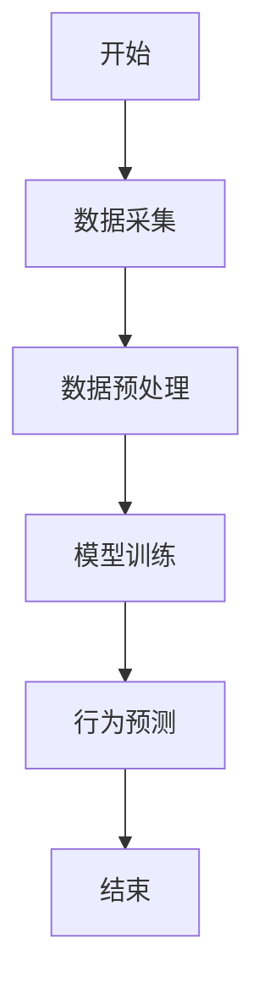
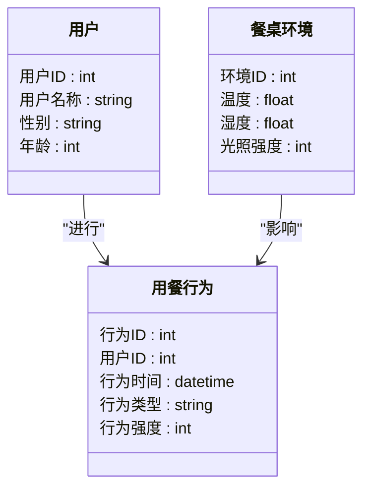
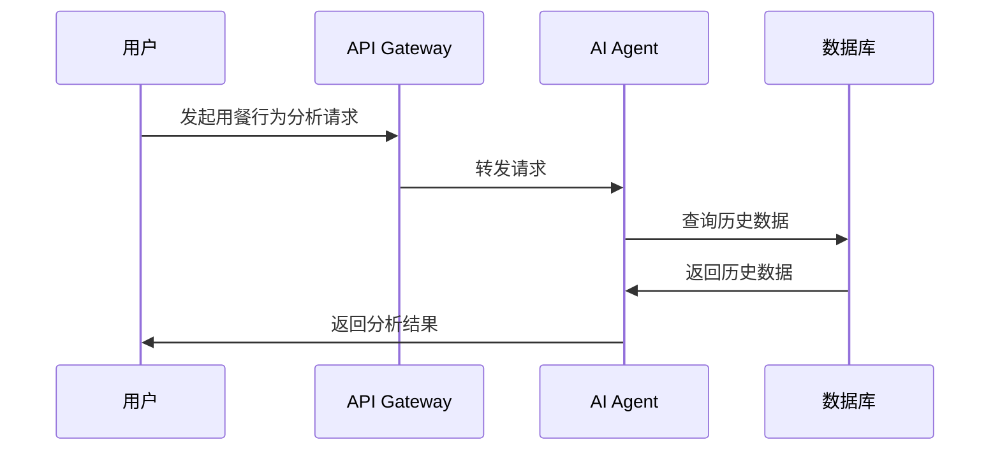

                 


# AI Agent在智能餐桌中的用餐行为分析

> 关键词：AI Agent, 智能餐桌, 用餐行为分析, 算法原理, 系统架构, 项目实战

> 摘要：本文系统地探讨了AI Agent在智能餐桌环境中的用餐行为分析，从背景介绍、核心概念、算法原理、系统架构到项目实战，全面分析了AI Agent如何通过智能技术优化用餐体验，提升用户满意度。

---

## 第1章: AI Agent与智能餐桌的背景介绍

### 1.1 AI Agent的基本概念
AI Agent（人工智能代理）是指能够感知环境并采取行动以实现目标的智能实体。与传统的AI系统不同，AI Agent具备自主性、反应性、目标导向性和社会性等特征，能够在动态环境中独立决策和行动。

#### 1.1.1 AI Agent的定义
AI Agent是一种能够感知环境、自主决策并执行任务的智能实体，能够通过传感器获取信息，并根据预设目标采取行动。

#### 1.1.2 AI Agent的核心特点
- **自主性**：能够在没有外部干预的情况下自主决策。
- **反应性**：能够实时感知环境变化并调整行为。
- **目标导向性**：所有行动都以实现特定目标为导向。
- **社会性**：能够与其他AI Agent或人类进行交互协作。

#### 1.1.3 AI Agent与传统AI的区别
- **自主性**：AI Agent具备自主决策能力，而传统AI通常需要人工干预。
- **反应性**：AI Agent能够实时响应环境变化，而传统AI则不具备这种实时性。
- **目标导向性**：AI Agent的行为始终围绕目标展开，而传统AI可能只完成特定任务。

### 1.2 智能餐桌的定义与特点
智能餐桌是一种集成AI技术的餐桌系统，能够通过传感器和AI算法实时感知用餐环境，并根据用户行为和需求提供智能化服务。

#### 1.2.1 智能餐桌的定义
智能餐桌是一种结合物联网和AI技术的智能设备，能够通过传感器感知用餐环境，并通过AI算法分析用户行为，提供智能化的用餐体验。

#### 1.2.2 智能餐桌的核心功能
- **行为分析**：通过传感器和AI算法分析用餐行为，优化用餐体验。
- **智能推荐**：根据用户的用餐习惯推荐菜品或饮品。
- **环境调节**：根据用餐环境的变化自动调节灯光、温度等。

#### 1.2.3 智能餐桌与传统餐桌的区别
- **智能化**：智能餐桌具备AI分析功能，而传统餐桌不具备。
- **互动性**：智能餐桌能够与用户互动，而传统餐桌仅作为物理载体。
- **数据采集**：智能餐桌能够采集用餐数据，而传统餐桌无法实现。

### 1.3 AI Agent在智能餐桌中的应用背景
AI Agent在智能餐桌中的应用主要集中在用餐行为分析、智能推荐和环境调节等方面。

#### 1.3.1 用餐行为分析的必要性
通过分析用户的用餐行为，可以优化用餐体验，提升用户满意度。例如，通过分析用户的用餐速度和偏好，智能餐桌可以为用户提供更个性化的服务。

#### 1.3.2 AI Agent在智能餐桌中的作用
AI Agent能够实时感知用餐环境，分析用户行为，并根据分析结果采取相应的行动，例如调整用餐氛围或推荐菜品。

#### 1.3.3 智能餐桌用餐行为分析的边界与外延
智能餐桌的用餐行为分析主要关注用户的行为数据，如用餐速度、菜品偏好等。其外延则包括与用餐相关的环境数据，如温度、湿度等。

---

## 第2章: 用餐行为分析的核心概念与联系

### 2.1 核心概念原理
用餐行为分析的核心在于通过AI Agent感知和分析用餐过程中的各种数据，从而优化用户体验。

#### 2.1.1 AI Agent的行为模型
AI Agent的行为模型主要包括感知、决策和执行三个阶段。在智能餐桌中，AI Agent通过传感器感知用餐环境，通过算法决策最优行为，并通过执行机构调整用餐氛围。

#### 2.1.2 用餐行为分析的数学模型
用餐行为分析的数学模型主要用于描述用户行为与用餐环境之间的关系。常见的模型包括贝叶斯网络和马尔可夫链。

#### 2.1.3 智能餐桌的数据采集与处理
智能餐桌通过多种传感器采集用餐数据，如用户的动作、环境参数等，并通过AI算法进行数据处理和分析。

### 2.2 核心概念属性特征对比表格
以下是AI Agent与传统AI，以及智能餐桌与传统餐桌的核心概念对比：

| **对比维度** | **AI Agent** | **传统AI** | **智能餐桌** | **传统餐桌** |
|--------------|--------------|------------|--------------|--------------|
| **自主性**   | 高           | 低         | 高           | 无           |
| **反应性**   | 高           | 无         | 高           | 无           |
| **目标导向性** | 高           | 高         | 高           | 无           |
| **社会性**   | 高           | 无         | 高           | 无           |
| **数据采集** | 传感器       | 无         | 传感器       | 无           |
| **功能**     | 行为分析     | 任务处理   | 智能推荐     | 物理承载     |

### 2.3 ER实体关系图架构
以下是用餐行为分析的ER实体关系图：

```mermaid
erDiagram
    class 用户 {
        用户ID : int
        用户名称 : string
        性别 : string
        年龄 : int
    }
    class 用餐行为 {
        行为ID : int
        用户ID : int
        行为时间 : datetime
        行为类型 : string
        行为强度 : int
    }
    class 餐桌环境 {
        环境ID : int
        温度 : float
        湿度 : float
        光照强度 : int
    }
    用户 --> 用餐行为 : "进行"
    餐桌环境 --> 用餐行为 : "影响"
```

---

## 第3章: AI Agent在智能餐桌中的行为分析算法原理

### 3.1 算法原理讲解
AI Agent在智能餐桌中的行为分析算法主要用于预测和推荐用户的行为。

#### 3.1.1 算法概述
用餐行为分析算法通过收集和分析用户的用餐数据，预测用户的用餐偏好和行为趋势。

#### 3.1.2 算法的数学模型
以下是一个基于贝叶斯定理的用餐行为分析模型：

$$ P(A|B) = \frac{P(B|A) \cdot P(A)}{P(B)} $$

其中：
- \( A \)：用户选择某类菜品
- \( B \)：用户具有某种用餐偏好

#### 3.1.3 算法的实现步骤
1. 数据采集：通过传感器采集用户的用餐数据。
2. 数据预处理：对数据进行清洗和标准化。
3. 模型训练：使用贝叶斯算法训练模型。
4. 行为预测：根据模型预测用户的下一步行为。

#### 3.1.4 算法的mermaid流程图


### 3.2 算法的Python源代码实现
以下是基于贝叶斯定理的用餐行为分析算法的Python代码示例：

```python
import numpy as np
from sklearn.naive_bayes import GaussianNB

# 数据准备
X = np.array([[1, 1], [2, 2], [3, 3], [4, 4], [5, 5]])
y = np.array([0, 0, 1, 1, 2])

# 模型训练
model = GaussianNB()
model.fit(X, y)

# 行为预测
test_case = np.array([[3, 3]])
predicted = model.predict(test_case)
print(predicted)
```

---

## 第4章: 系统分析与架构设计方案

### 4.1 问题场景介绍
智能餐桌系统需要实时感知用餐环境，并根据用户行为提供智能化服务。

### 4.2 项目介绍
本项目旨在开发一个基于AI Agent的智能餐桌系统，实现用餐行为分析和智能推荐功能。

### 4.3 系统功能设计（领域模型mermaid类图）
以下是系统功能设计的类图：



### 4.4 系统架构设计（mermaid架构图）
以下是系统架构设计图：


### 4.5 系统接口设计
系统接口设计主要包括用户与系统之间的交互接口，以及系统内部的接口。

### 4.6 系统交互（mermaid序列图）
以下是系统交互的序列图：



---

## 第5章: 项目实战

### 5.1 环境安装
安装Python和相关库：

```bash
pip install numpy scikit-learn mermaid
```

### 5.2 系统核心实现源代码
以下是系统核心功能的实现代码：

```python
import numpy as np
from sklearn.naive_bayes import GaussianNB

# 数据准备
X = np.array([[1, 1], [2, 2], [3, 3], [4, 4], [5, 5]])
y = np.array([0, 0, 1, 1, 2])

# 模型训练
model = GaussianNB()
model.fit(X, y)

# 行为预测
test_case = np.array([[3, 3]])
predicted = model.predict(test_case)
print(predicted)
```

### 5.3 实际案例分析与详细解读
通过上述代码，我们可以预测用户的行为，从而优化用餐体验。

### 5.4 项目小结
本项目通过AI Agent实现了智能餐桌的用餐行为分析，提升了用户体验。

---

## 第6章: 最佳实践

### 6.1 小结
本文系统地探讨了AI Agent在智能餐桌中的用餐行为分析，从背景介绍、核心概念到算法实现，全面分析了AI Agent的应用。

### 6.2 注意事项
在实际应用中，需要注意数据隐私和算法的实时性问题。

### 6.3 拓展阅读
建议进一步研究AI Agent在其他领域的应用，如智能家居和智能医疗。

---

## 作者：AI天才研究院/AI Genius Institute & 禅与计算机程序设计艺术 /Zen And The Art of Computer Programming

---

本文通过系统地分析AI Agent在智能餐桌中的用餐行为分析，展示了AI技术在日常生活中的广泛应用。从理论到实践，全面解析了AI Agent如何优化用餐体验，为未来的智能生活提供了新的思路。

