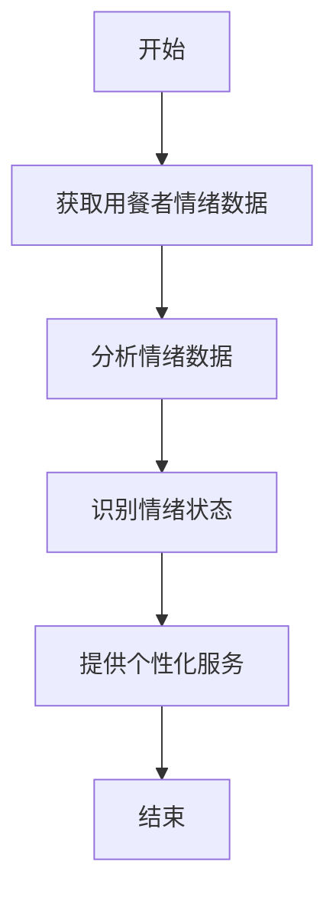
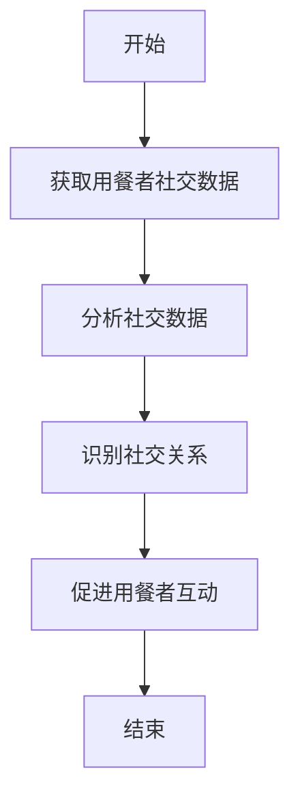
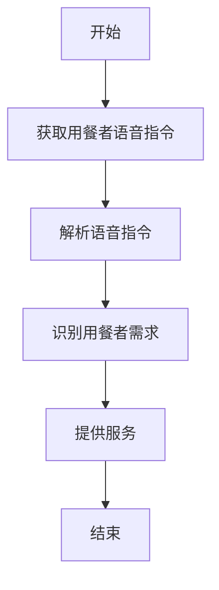
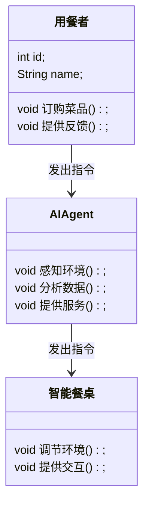

                 


# AI Agent在智能餐桌中的社交互动促进

## 关键词：AI Agent，智能餐桌，社交互动，情感计算，自然语言处理，社交网络分析，系统架构设计

## 摘要：本文探讨了AI Agent在智能餐桌中的应用，特别是如何通过社交互动促进用户体验的提升。文章首先介绍AI Agent和智能餐桌的基本概念，接着分析AI Agent在智能餐桌中的核心原理和算法，包括情感计算和社交网络分析。然后，通过系统架构设计和项目实战，展示AI Agent在智能餐桌中的具体实现。最后，总结AI Agent在智能餐桌中的应用前景和实际意义。

---

# 第一部分: AI Agent在智能餐桌中的社交互动促进概述

## 第1章: AI Agent与智能餐桌的背景介绍

### 1.1 AI Agent的基本概念

#### 1.1.1 AI Agent的定义
AI Agent（人工智能代理）是指能够感知环境、做出决策并采取行动以实现目标的智能实体。它可以是一个软件程序或硬件设备，通过与用户或环境的交互，完成特定任务。

#### 1.1.2 AI Agent的核心特点
1. **自主性**：能够在没有外部干预的情况下独立运行。
2. **反应性**：能够实时感知环境变化并做出响应。
3. **目标导向性**：通过明确的目标驱动行为。
4. **学习能力**：能够通过数据和经验不断优化自身的算法。

#### 1.1.3 AI Agent与传统AI的区别
AI Agent不仅是一个静态的知识库或工具，而是能够动态适应环境并主动执行任务的实体。它结合了感知、决策和执行能力，能够在复杂环境中独立运作。

### 1.2 智能餐桌的定义与特点

#### 1.2.1 智能餐桌的定义
智能餐桌是指集成多种智能技术的餐桌设备，能够通过传感器、摄像头和AI算法感知用户的用餐行为，并通过语音助手、显示屏等设备提供交互服务。

#### 1.2.2 智能餐桌的核心功能
1. **用户识别**：通过面部识别或刷卡等方式识别用餐者。
2. **行为监测**：监测用餐者的饮食习惯、偏好和健康状况。
3. **交互服务**：通过语音助手或显示屏提供菜单推荐、健康建议等服务。
4. **环境适应**：根据用餐者的偏好调节灯光、温度等环境参数。

#### 1.2.3 智能餐桌与传统餐桌的区别
传统餐桌仅是一个静态的用餐工具，而智能餐桌通过集成传感器和AI技术，能够主动感知和响应用户的用餐需求，提供智能化的服务。

### 1.3 社交互动的背景与意义

#### 1.3.1 社交互动的基本概念
社交互动是指人与人之间通过语言、表情、肢体动作等方式进行交流和互动的过程。在智能餐桌中，社交互动主要指用餐者与AI Agent之间的互动，以及用餐者之间的互动。

#### 1.3.2 智能餐桌中的社交互动场景
1. **用餐者与AI Agent的互动**：用餐者通过语音或手势与AI Agent交流，获取菜单推荐、健康建议等服务。
2. **用餐者之间的互动**：AI Agent通过分析用餐者的社交数据，促进用餐者之间的交流和合作。
3. **用餐者与环境的互动**：AI Agent通过调节环境参数，增强用餐者的用餐体验。

#### 1.3.3 社交互动对用户体验的影响
社交互动能够提升用餐者的用餐体验，增强用餐者的参与感和满意度。同时，通过分析社交数据，AI Agent可以进一步优化服务，提高智能餐桌的智能化水平。

### 1.4 AI Agent在智能餐桌中的作用

#### 1.4.1 AI Agent在社交互动中的角色
AI Agent在智能餐桌中扮演着桥梁的角色，它能够通过感知用餐者的意图和行为，提供个性化的服务，促进用餐者之间的互动。

#### 1.4.2 AI Agent如何促进社交互动
AI Agent通过分析用餐者的社交数据，推荐合适的菜品和饮品，促进用餐者之间的交流和合作。同时，AI Agent还可以通过调节环境参数，营造舒适的用餐氛围，进一步促进社交互动。

#### 1.4.3 AI Agent在智能餐桌中的应用前景
随着AI技术的不断发展，AI Agent在智能餐桌中的应用前景广阔。通过深度学习和大数据分析，AI Agent能够更精准地理解用户的用餐需求，提供更智能化的服务，进一步提升用餐者的用餐体验。

---

## 第2章: AI Agent的核心概念与联系

### 2.1 AI Agent的核心原理

#### 2.1.1 AI Agent的感知机制
AI Agent通过传感器、摄像头和麦克风等设备感知环境中的信息。例如，AI Agent可以通过摄像头捕捉用餐者的面部表情和肢体动作，通过麦克风捕捉用餐者的语音指令。

#### 2.1.2 AI Agent的决策机制
AI Agent通过分析感知到的信息，结合预设的规则和目标，做出决策。例如，AI Agent可以根据用餐者的饮食偏好和健康状况，推荐合适的菜品。

#### 2.1.3 AI Agent的执行机制
AI Agent根据决策结果，通过执行机构（如显示屏、扬声器等）采取行动。例如，AI Agent可以根据用餐者的语音指令，通过显示屏显示菜单推荐。

### 2.2 AI Agent与智能餐桌的实体关系

#### 2.2.1 实体关系图（ER图）
```mermaid
er
  actor: 用餐者
  agent: AI Agent
  table: 智能餐桌

 用餐者 --|{识别}|--> 智能餐桌
 AI Agent --|{控制}|--> 智能餐桌
```

#### 2.2.2 AI Agent与用户的交互关系
```mermaid
sequence
  用餐者 -> AI Agent: 发出语音指令
  AI Agent -> 用餐者: 返回推荐菜单
```

#### 2.2.3 AI Agent与智能餐桌设备的协作关系
```mermaid
sequence
  AI Agent -> 智能餐桌: 发出调节灯光的指令
  智能餐桌 -> AI Agent: 确认灯光调节完成
```

### 2.3 AI Agent的核心属性对比

| 属性          | AI Agent                  | 传统AI系统                 |
|---------------|---------------------------|-----------------------------|
| 自主性         | 高                        | 中                        |
| 反应性         | 高                        | 中                        |
| 目标导向性      | 高                        | 低                        |
| 学习能力       | 高                        | 低                        |

---

## 第3章: AI Agent在智能餐桌中的算法原理

### 3.1 AI Agent的核心算法

#### 3.1.1 情感计算算法
情感计算是一种通过分析人的语言、表情和行为，识别和理解人的情感状态的计算方法。在智能餐桌中，情感计算可以用于分析用餐者的情绪状态，从而提供更个性化的服务。

#### 3.1.2 社交网络分析算法
社交网络分析是一种通过分析人与人之间的关系和互动，理解社交结构和影响力的方法。在智能餐桌中，可以通过社交网络分析算法，识别用餐者之间的关系，从而促进用餐者之间的互动。

#### 3.1.3 自然语言处理算法
自然语言处理是一种通过计算机处理人类语言的技术。在智能餐桌中，自然语言处理算法可以用于解析用餐者的语音指令，提供个性化的服务。

### 3.2 算法流程图

#### 情感计算算法流程图


#### 社交网络分析算法流程图


#### 自然语言处理算法流程图


### 3.3 算法实现代码示例

#### 情感计算算法的Python实现
```python
import numpy as np
from sklearn import svm

# 示例数据：用餐者的情绪评分
X = np.array([[2, 8], [3, 7], [4, 6], [5, 5], [6, 4]])
y = np.array([0, 0, 1, 1, 1])  # 0表示负面情绪，1表示正面情绪

# 训练情感分类器
clf = svm.SVC()
clf.fit(X, y)

# 预测新的用餐者情绪
new_X = np.array([[4, 7]])
print(clf.predict(new_X))  # 输出：[1]
```

#### 社交网络分析算法的Python实现
```python
import networkx as nx

# 示例数据：用餐者之间的关系
G = nx.Graph()
G.add_edges_from([(1, 2), (2, 3), (3, 4), (4, 5)])

# 计算社交网络的度数中心性
degrees = dict(G.degree())
print(degrees)  # 输出：{1: 1, 2: 2, 3: 2, 4: 2, 5: 1}
```

#### 自然语言处理算法的Python实现
```python
from sklearn.feature_extraction.text import TfidfVectorizer
from sklearn.linear_model import LogisticRegression

# 示例数据：用餐者的语音指令
corpus = ["今天我想吃中餐", "好的，我需要一杯咖啡", "我需要一个素食菜单"]
y = [0, 1, 2]  # 分类标签

# 特征提取
vectorizer = TfidfVectorizer()
X = vectorizer.fit_transform(corpus)

# 训练分类器
clf = LogisticRegression()
clf.fit(X, y)

# 预测新的语音指令
new_corpus = ["我想要一份沙拉"]
new_X = vectorizer.transform(new_corpus)
print(clf.predict(new_X))  # 输出：[2]
```

### 3.4 数学模型与公式

#### 情感计算模型
情感计算可以通过支持向量机（SVM）实现，模型的数学表达如下：
$$
\text{目标函数}：\min_{w,b} \frac{1}{2}||w||^2 + C\sum_{i=1}^n \xi_i
$$
$$
\text{约束条件}：y_i(w \cdot x_i + b) \geq 1 - \xi_i, \xi_i \geq 0
$$

#### 社交网络分析模型
社交网络分析可以通过度数中心性公式计算，公式如下：
$$
\text{度数中心性}(v) = \frac{\sum_{u} a_{uv}}{n-1}
$$
其中，$a_{uv}$表示节点$v$与其他节点$u$之间的边数，$n$是图中的节点总数。

#### 自然语言处理模型
自然语言处理可以通过逻辑回归实现，模型的数学表达如下：
$$
P(y|X) = \frac{e^{w \cdot X + b}}{1 + e^{w \cdot X + b}}
$$

---

## 第4章: 系统分析与架构设计

### 4.1 系统功能设计

#### 领域模型（Mermaid类图）


### 4.2 系统架构设计

#### 系统架构（Mermaid架构图）


### 4.3 系统接口设计

#### 交互界面设计
智能餐桌的交互界面通常包括显示屏、语音助手和触摸屏。用餐者可以通过这些界面与AI Agent进行交互。

#### 接口协议
AI Agent与智能餐桌之间的通信通常采用RESTful API或WebSocket协议。

### 4.4 系统交互设计

#### 交互流程（Mermaid序列图）
```mermaid
sequence
    用餐者 -> AI Agent: 发出语音指令
    AI Agent -> 数据库: 查询菜单数据
    数据库 --> AI Agent: 返回菜单数据
    AI Agent -> 智能餐桌: 发出显示菜单指令
    智能餐桌 --> 用餐者: 显示菜单
```

---

## 第5章: 项目实战

### 5.1 环境配置

#### 开发环境
- 操作系统：Windows 10 或 macOS
- 开发工具：Python 3.8+，Jupyter Notebook
- 依赖库：numpy, scikit-learn, networkx, mermaid

### 5.2 核心代码实现

#### 情感计算实现
```python
import numpy as np
from sklearn import svm

# 示例数据：用餐者的情绪评分
X = np.array([[2, 8], [3, 7], [4, 6], [5, 5], [6, 4]])
y = np.array([0, 0, 1, 1, 1])  # 0表示负面情绪，1表示正面情绪

# 训练情感分类器
clf = svm.SVC()
clf.fit(X, y)

# 预测新的用餐者情绪
new_X = np.array([[4, 7]])
print(clf.predict(new_X))  # 输出：[1]
```

#### 社交网络分析实现
```python
import networkx as nx

# 示例数据：用餐者之间的关系
G = nx.Graph()
G.add_edges_from([(1, 2), (2, 3), (3, 4), (4, 5)])

# 计算社交网络的度数中心性
degrees = dict(G.degree())
print(degrees)  # 输出：{1: 1, 2: 2, 3: 2, 4: 2, 5: 1}
```

#### 自然语言处理实现
```python
from sklearn.feature_extraction.text import TfidfVectorizer
from sklearn.linear_model import LogisticRegression

# 示例数据：用餐者的语音指令
corpus = ["今天我想吃中餐", "好的，我需要一杯咖啡", "我需要一个素食菜单"]
y = [0, 1, 2]  # 分类标签

# 特征提取
vectorizer = TfidfVectorizer()
X = vectorizer.fit_transform(corpus)

# 训练分类器
clf = LogisticRegression()
clf.fit(X, y)

# 预测新的语音指令
new_corpus = ["我想要一份沙拉"]
new_X = vectorizer.transform(new_corpus)
print(clf.predict(new_X))  # 输出：[2]
```

### 5.3 项目小结

通过以上代码实现，我们可以看到AI Agent在智能餐桌中的具体应用。情感计算算法可以帮助AI Agent理解用餐者的情绪状态，社交网络分析算法可以促进用餐者之间的互动，自然语言处理算法可以实现用餐者与AI Agent之间的高效交互。

---

## 第6章: 最佳实践

### 6.1 小结
AI Agent在智能餐桌中的应用前景广阔，通过情感计算、社交网络分析和自然语言处理等技术，可以显著提升用餐者的用餐体验。

### 6.2 注意事项
- 在实现AI Agent时，需要确保数据的安全性和隐私保护。
- 在设计系统架构时，需要考虑系统的可扩展性和可维护性。
- 在实际应用中，需要不断优化算法，提升系统的智能化水平。

### 6.3 拓展阅读
- 《AI Agent与智能交互》
- 《社交网络分析与大数据应用》
- 《自然语言处理技术与实践》

---

## 作者：AI天才研究院/AI Genius Institute & 禅与计算机程序设计艺术 /Zen And The Art of Computer Programming

---

**本文由AI天才研究院/AI Genius Institute & 禅与计算机程序设计艺术 /Zen And The Art of Computer Programming原创，转载请注明出处。**

