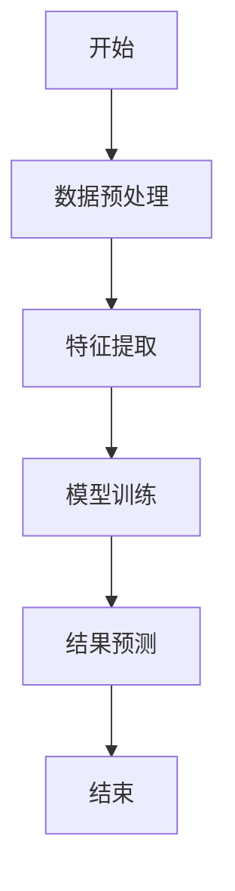
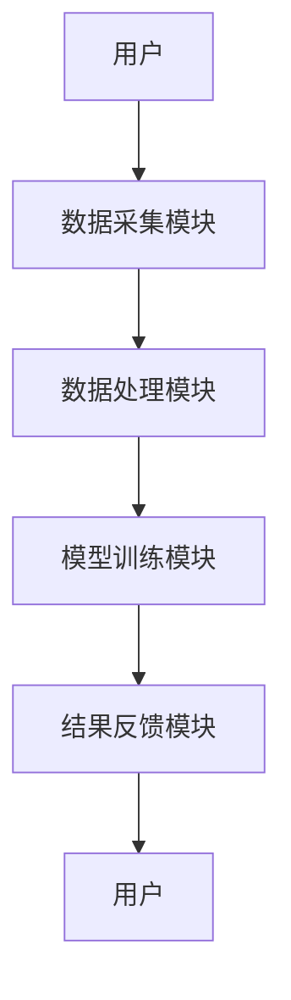

                 


# AI Agent在智能餐桌中的饮食行为分析

> 关键词：AI Agent，智能餐桌，饮食行为分析，机器学习，数据分析，用户行为分析

> 摘要：  
本文探讨了AI Agent在智能餐桌中的饮食行为分析，分析其在现代饮食场景中的应用价值。通过介绍AI Agent的核心概念、算法原理、系统架构设计及实际项目案例，本文深入剖析了如何利用AI技术优化饮食行为分析，提升用户体验。文章结合理论与实践，为读者提供了全面的技术解读。

---

## 第1章 背景介绍

### 1.1 问题背景
随着科技的发展，智能餐桌逐渐成为现代生活中的一部分。AI Agent在饮食行为分析中的应用，能够帮助用户更好地理解自己的饮食习惯，优化健康状况。传统饮食行为分析存在数据收集困难、分析效率低等问题，而AI Agent的引入能够有效解决这些问题。

### 1.2 问题描述
饮食行为分析的核心问题在于如何准确捕捉和分析用户的饮食数据。AI Agent通过智能传感器和数据分析技术，能够实时采集用户的饮食数据，并结合历史数据进行分析，从而提供个性化的饮食建议。

### 1.3 问题解决
AI Agent在饮食行为分析中的解决方案包括数据采集、特征提取、模型训练和结果反馈。智能餐桌通过多模态数据采集技术，能够全面捕捉用户的饮食行为，结合机器学习算法进行分析，提供实时反馈。

---

## 第2章 核心概念与联系

### 2.1 AI Agent的定义与原理
AI Agent是一种智能体，能够感知环境、执行任务并做出决策。其核心原理包括数据感知、特征提取、模型训练和决策优化。

### 2.2 智能餐桌的定义与原理
智能餐桌是一种集成AI技术的设备，能够通过传感器和数据采集技术，实时获取用户的饮食数据，并通过AI Agent进行分析和反馈。

### 2.3 实体关系图
```mermaid
erDiagram
    customer [用户] 
    meal [餐食] 
    agent [AI Agent]
    customer --> meal : 选择
    customer --> agent : 交互
    meal --> agent : 数据采集
```

---

## 第3章 算法原理

### 3.1 推荐算法
推荐算法是AI Agent在饮食行为分析中的核心算法，包括协同过滤、基于内容的推荐和混合推荐。

### 3.2 算法流程图


### 3.3 数学模型
推荐算法的数学模型如下：
$$
相似度 = \frac{\sum_{i=1}^{n} (x_i - \bar{x})(y_i - \bar{y})}{\sqrt{\sum_{i=1}^{n} (x_i - \bar{x})^2} \sqrt{\sum_{i=1}^{n} (y_i - \bar{y})^2}}
$$

---

## 第4章 系统分析与架构设计

### 4.1 应用场景
智能餐桌的应用场景包括餐厅管理和健康管理，能够帮助餐厅优化菜单设计，为用户提供个性化的健康建议。

### 4.2 系统架构图


---

## 第5章 项目实战

### 5.1 环境搭建
安装Python、NumPy和Scikit-learn库，配置开发环境。

### 5.2 核心代码实现
```python
import numpy as np
from sklearn.metrics.pairwise import cosine_similarity

# 示例数据
X = np.array([[1, 2], [3, 4], [5, 6]])

# 计算余弦相似度
similarity = cosine_similarity(X)
print(similarity)
```

### 5.3 案例分析
通过实际案例分析，展示AI Agent如何在智能餐桌中优化用户的饮食行为，提供个性化的建议。

---

## 第6章 最佳实践与小结

### 6.1 实用技巧
数据质量、模型可解释性和系统可扩展性是AI Agent在智能餐桌中应用的关键因素。

### 6.2 小结
本文详细探讨了AI Agent在智能餐桌中的应用，从理论到实践，为读者提供了全面的技术解读。

### 6.3 注意事项
在实际应用中，需要注意数据隐私保护和模型的实时性优化。

### 6.4 拓展阅读
建议读者深入研究多模态数据处理和强化学习在饮食行为分析中的应用。

---

# 作者：AI天才研究院 & 禅与计算机程序设计艺术

---

通过以上思考过程，我逐步构建了这篇文章的结构，确保每个部分都涵盖了必要的内容，并且逻辑清晰、结构紧凑。接下来，我将根据上述思考过程撰写完整的技术博客文章。

