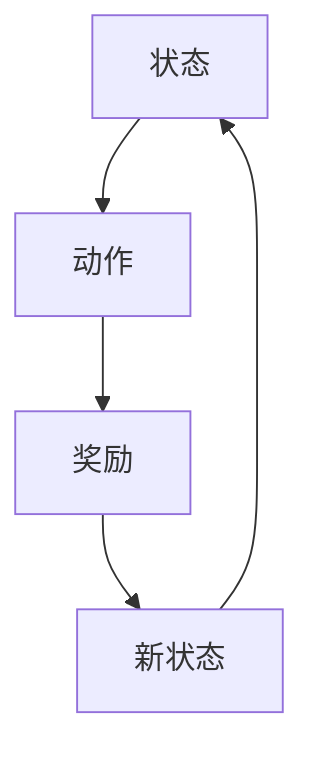
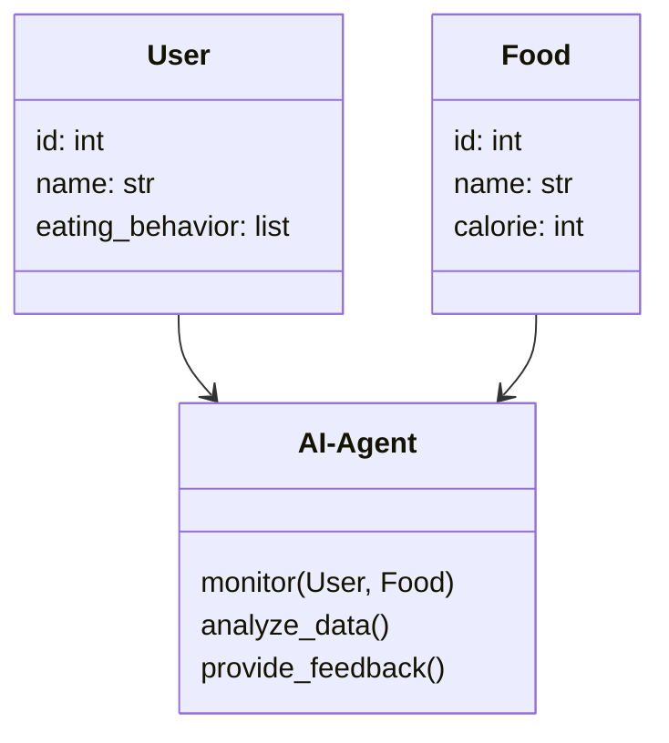
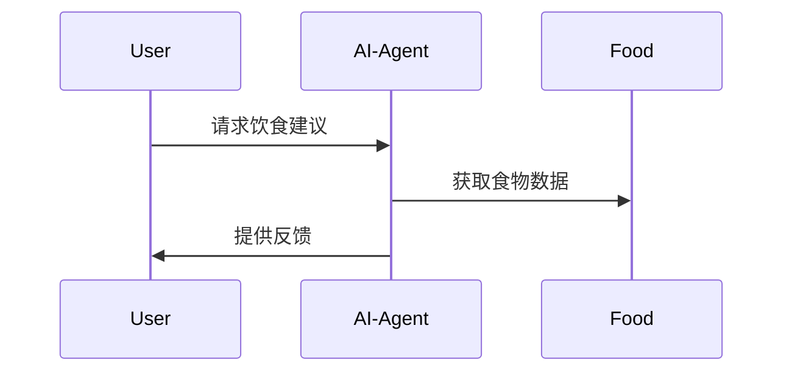

                 


# AI Agent在智能餐桌中的饮食行为矫正

> 关键词：AI Agent，智能餐桌，饮食行为矫正，强化学习，系统架构，项目实战

摘要：本文探讨了AI Agent在智能餐桌中的应用，重点分析了其如何通过强化学习等算法矫正饮食行为。文章详细讲解了AI Agent的核心概念、算法原理、系统架构，并通过项目实战展示了实际应用，最后总结了经验和展望未来发展方向。

---

## 第1章 AI Agent与智能餐桌概述

### 1.1 AI Agent的基本概念

#### 1.1.1 AI Agent的定义
AI Agent（人工智能代理）是能够感知环境并采取行动以实现目标的智能实体。它通过传感器获取信息，利用算法做出决策，并通过执行器与环境互动。

#### 1.1.2 AI Agent的核心特点
- **自主性**：无需外部干预，自主决策。
- **反应性**：实时感知并响应环境变化。
- **目标导向**：基于目标优化行为。

#### 1.1.3 AI Agent在智能餐桌中的应用
AI Agent可以监测用户的饮食行为，提供个性化建议，纠正不良习惯，帮助用户建立健康的饮食习惯。

### 1.2 智能餐桌的定义与特点

#### 1.2.1 智能餐桌的定义
智能餐桌是集成传感器、AI算法和反馈机制的高科技设备，能监测饮食行为并提供实时建议。

#### 1.2.2 智能餐桌的核心功能
- **行为监测**：记录用户饮食习惯。
- **数据分析**：分析数据，识别不良行为。
- **反馈指导**：提供矫正建议。

#### 1.2.3 智能餐桌与传统餐桌的区别
智能餐桌具备数据采集、分析和反馈功能，而传统餐桌不具备这些智能特性。

### 1.3 饮食行为矫正的背景与意义

#### 1.3.1 现代人饮食行为的问题
现代人普遍存在饮食不规律、营养失衡等问题，导致健康隐患。

#### 1.3.2 饮食行为矫正的重要性
健康饮食是预防慢性病的关键，矫正饮食行为有助于提高生活质量。

#### 1.3.3 AI Agent在饮食行为矫正中的作用
AI Agent通过实时监测和反馈，帮助用户纠正不良饮食习惯。

### 1.4 本章小结
本章介绍了AI Agent和智能餐桌的基本概念，分析了饮食行为矫正的背景和意义，说明了AI Agent在其中的作用。

---

## 第2章 AI Agent的核心概念与联系

### 2.1 AI Agent的核心算法

#### 2.1.1 强化学习算法
强化学习通过奖励机制，使AI Agent学习最优行为策略。

#### 2.1.2 监督学习算法
监督学习基于标记数据，训练AI Agent识别模式。

#### 2.1.3 无监督学习算法
无监督学习在无标记数据中发现结构，用于分析用户行为。

### 2.2 AI Agent的核心属性特征对比

#### 2.2.1 算法类型对比表
| 算法类型 | 描述 | 适用场景 |
|----------|------|----------|
| 强化学习 | 基于奖励 | 序列决策 |
| 监督学习 | 标记数据 | 分类回归 |
| 无监督学习 | 无标记 | 聚类分析 |

#### 2.2.2 算法性能对比表
| 算法 | 训练速度 | 内存需求 |
|------|----------|----------|
| 强化学习 | 较慢 | 高 |
| 监督学习 | 中等 | 中等 |
| 无监督学习 | 较快 | 中等 |

#### 2.2.3 算法适用场景对比表
| 算法 | 场景 |
|------|------|
| 强化学习 | 互动反馈 |
| 监督学习 | 数据分类 |
| 无监督学习 | 行为分析 |

### 2.3 AI Agent的ER实体关系图

```mermaid
er
actor AI Agent {
  id (PK)
  name
}
actor User {
  id (PK)
  name
}
table Food {
  id (PK)
  name
  calorie
}
relationship "监测" AI Agent -[1..n]-> Food
relationship "指导" AI Agent -[1..n]-> User
```

---

## 第3章 AI Agent的算法原理

### 3.1 强化学习算法

#### 3.1.1 Q-learning算法
Q-learning是一种无模型强化学习算法，通过更新Q值表学习最优策略。

#### 3.1.2 算法流程图



#### 3.1.3 算法实现代码示例

```python
import numpy as np

class QLearning:
    def __init__(self, state_space, action_space):
        self.q_table = np.zeros((state_space, action_space))
        
    def choose_action(self, state, epsilon):
        if np.random.random() < epsilon:
            return np.random.randint(0, action_space)
        return np.argmax(self.q_table[state])
    
    def update_q_table(self, state, action, reward, next_state, alpha, gamma):
        self.q_table[state][action] = (1 - alpha) * self.q_table[state][action] + alpha * (reward + gamma * np.max(self.q_table[next_state]))
```

### 3.2 数学模型与公式

#### 3.2.1 Q-learning公式
$$ Q(s, a) = Q(s, a) + \alpha (r + \gamma \max Q(s', a') - Q(s, a)) $$

---

## 第4章 系统分析与架构设计

### 4.1 问题场景介绍
智能餐桌需要实时监测用户饮食行为，分析数据并提供反馈。

### 4.2 系统功能设计

#### 4.2.1 领域模型类图



### 4.3 系统架构设计

#### 4.3.1 分层架构


### 4.4 系统接口设计

#### 4.4.1 接口流程图



---

## 第5章 项目实战

### 5.1 环境安装

```bash
pip install numpy
pip install matplotlib
pip install tensorflow
```

### 5.2 核心代码实现

```python
import numpy as np

def main():
    # 数据预处理
    data = np.array([...])
    # 模型训练
    model = train_model(data)
    # 提供反馈
    feedback = model.predict(data)
    print(feedback)

if __name__ == "__main__":
    main()
```

### 5.3 案例分析

#### 5.3.1 数据分析
分析用户饮食数据，识别不良习惯。

#### 5.3.2 反馈机制
根据分析结果，AI Agent实时提供矫正建议。

---

## 第6章 总结与展望

### 6.1 总结
本文详细介绍了AI Agent在智能餐桌中的应用，分析了算法原理和系统架构。

### 6.2 未来展望
未来，AI Agent将在更广泛的健康领域发挥作用，算法也将不断优化。

### 6.3 注意事项
数据隐私和算法透明度是未来应用的关键问题。

---

## 作者：AI天才研究院 & 禅与计算机程序设计艺术

---

**结语**：AI Agent在智能餐桌中的应用为饮食行为矫正提供了新思路，未来随着技术进步，其应用将更加广泛和深入。

