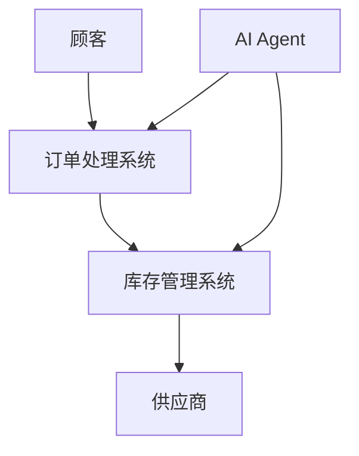
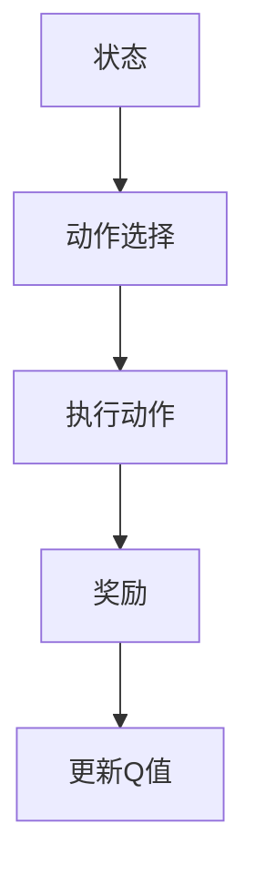
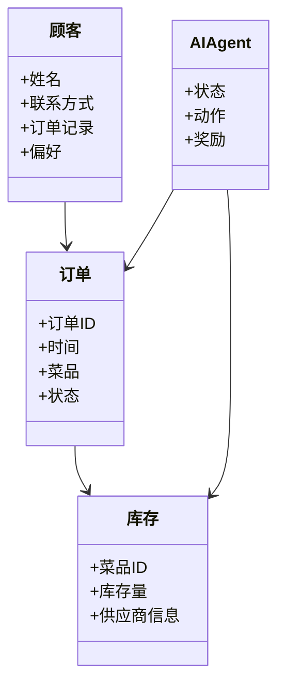
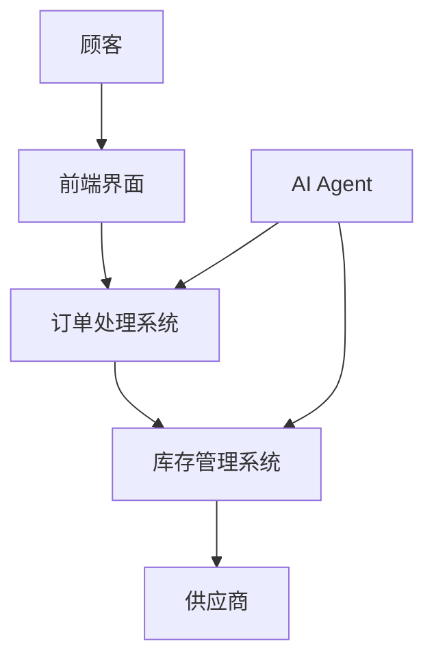
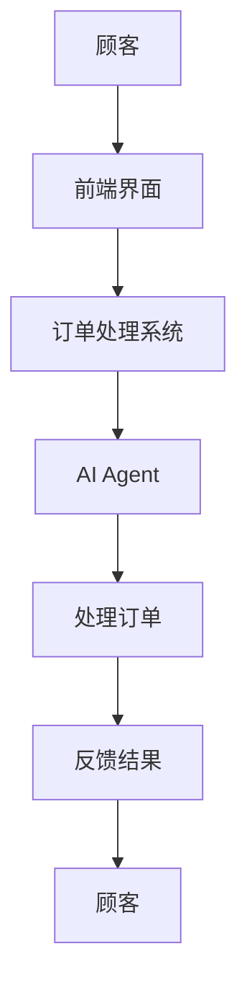

                 


# AI Agent在智能餐饮管理中的实践

> 关键词：AI Agent，智能餐饮管理，强化学习，算法原理，系统架构设计

> 摘要：本文详细探讨了AI Agent在智能餐饮管理中的应用，从基本概念到算法原理，再到系统架构设计，结合实际案例，全面分析了AI Agent如何优化餐饮管理流程，提升运营效率和客户体验。

---

# 第一部分: AI Agent在智能餐饮管理中的背景与概念

## 第1章: AI Agent与智能餐饮管理概述

### 1.1 AI Agent的基本概念

#### 1.1.1 AI Agent的定义与核心特征

AI Agent，即人工智能代理，是一种能够感知环境、自主决策并采取行动以实现特定目标的智能体。AI Agent的核心特征包括：

- **自主性**：能够在没有外部干预的情况下独立运作。
- **反应性**：能够实时感知环境变化并做出反应。
- **目标导向性**：所有行动均以实现特定目标为导向。
- **学习能力**：通过数据和经验不断优化自身行为。

#### 1.1.2 AI Agent与传统管理系统的区别

传统的管理系统通常依赖于固定的规则和流程，而AI Agent能够根据实时数据和环境变化自主调整策略。例如，在餐饮管理中，AI Agent可以动态调整订单处理优先级，而传统系统则可能按照固定顺序处理订单。

#### 1.1.3 AI Agent在餐饮行业的应用潜力

AI Agent在餐饮行业的应用潜力巨大，尤其是在订单管理、库存优化、客户体验提升等方面。通过AI Agent，餐饮企业可以实现更高效的资源分配和更个性化的客户服务。

### 1.2 智能餐饮管理的背景与挑战

#### 1.2.1 餐饮行业数字化转型的现状

随着科技的发展，餐饮行业正逐步从传统的手工管理向数字化管理转型。越来越多的企业开始采用智能化系统来提升运营效率。

#### 1.2.2 智能餐饮管理的核心问题

智能餐饮管理的核心问题包括：

- **订单处理效率**：如何快速处理大量订单，减少等待时间。
- **库存管理**：如何实时监控库存，避免浪费和缺货。
- **客户体验**：如何提供个性化的服务，提升客户满意度。

#### 1.2.3 AI Agent在解决这些问题中的作用

AI Agent可以通过实时数据分析和自主决策，帮助餐饮企业解决上述问题。例如，AI Agent可以根据历史数据预测客流量，提前调整库存和员工排班。

---

# 第二部分: AI Agent的核心概念与原理

## 第2章: AI Agent的核心原理与架构

### 2.1 AI Agent的基本原理

#### 2.1.1 知识表示与推理

知识表示是AI Agent进行推理的基础。常见的知识表示方法包括：

- **规则表示法**：通过预定义的规则进行推理。
- **框架表示法**：通过框架结构表示知识。
- **语义网络**：通过节点和边表示概念及其关系。

#### 2.1.2 行为规划与决策

行为规划与决策是AI Agent的核心功能之一。常见的决策方法包括：

- **基于规则的决策**：根据预定义的规则进行决策。
- **基于模型的决策**：通过构建模型模拟不同决策的后果，选择最优决策。
- **基于机器学习的决策**：通过训练模型进行预测和决策。

#### 2.1.3 人机交互与反馈机制

人机交互是AI Agent与人类用户或系统交互的关键环节。通过反馈机制，AI Agent可以不断优化自身的决策和行为。

### 2.2 AI Agent的类型与特点

#### 2.2.1 基于规则的AI Agent

基于规则的AI Agent通过预定义的规则进行推理和决策。优点是简单易懂，缺点是灵活性较差。

#### 2.2.2 基于模型的AI Agent

基于模型的AI Agent通过构建模型来模拟环境和行为，从而进行决策。优点是灵活性高，缺点是计算复杂。

#### 2.2.3 基于机器学习的AI Agent

基于机器学习的AI Agent通过训练数据进行预测和决策。优点是适应性强，缺点是需要大量数据和计算资源。

### 2.3 AI Agent在餐饮管理中的实体关系图

以下是一个简单的实体关系图，展示了AI Agent在餐饮管理中的应用：



---

# 第三部分: AI Agent的算法原理与数学模型

## 第3章: AI Agent的核心算法

### 3.1 基于强化学习的AI Agent算法

#### 3.1.1 强化学习的基本原理

强化学习是一种通过试错方法来优化决策的算法。AI Agent通过与环境交互，获得奖励或惩罚，从而优化自身的策略。

#### 3.1.2 Q-learning算法

Q-learning是一种经典的强化学习算法。其数学公式如下：

$$ Q(s,a) = Q(s,a) + \alpha (r + \gamma \max Q(s',a') - Q(s,a)) $$

其中：
- \( Q(s,a) \)：当前状态下采取行动 \( a \) 的价值。
- \( \alpha \)：学习率。
- \( r \)：奖励。
- \( \gamma \)：折扣因子。
- \( s' \)：下一个状态。

#### 3.1.3 算法流程图

以下是一个Q-learning算法的流程图：



### 3.2 基于监督学习的AI Agent算法

#### 3.2.1 监督学习的基本原理

监督学习是一种通过训练数据预测目标值的算法。AI Agent可以通过监督学习预测未来的订单量或客户偏好。

#### 3.2.2 线性回归模型

线性回归是一种简单的监督学习算法。其数学公式如下：

$$ y = \theta_0 x + \theta_1 $$

其中：
- \( y \)：预测值。
- \( x \)：输入值。
- \( \theta_0 \) 和 \( \theta_1 \)：参数。

### 3.3 算法实现的数学模型

#### 3.3.1 Q-learning算法的数学公式

$$ Q(s,a) = Q(s,a) + \alpha (r + \gamma \max Q(s',a') - Q(s,a)) $$

#### 3.3.2 线性回归模型的数学公式

$$ y = \theta_0 x + \theta_1 $$

---

# 第四部分: AI Agent的系统分析与架构设计

## 第4章: 智能餐饮管理系统的分析与设计

### 4.1 系统需求分析

#### 4.1.1 功能需求

智能餐饮管理系统需要实现以下功能：

- **订单管理**：实时处理订单，优化订单处理顺序。
- **库存管理**：实时监控库存，自动补货。
- **客户管理**：记录客户信息，提供个性化服务。

#### 4.1.2 性能需求

系统需要满足以下性能需求：

- 响应时间：小于1秒。
- 吞吐量：每分钟处理100个订单。

#### 4.1.3 边界与外延

系统的边界包括前端界面和后端处理模块，外延包括与供应商和客户的交互。

### 4.2 系统功能设计

#### 4.2.1 领域模型设计

以下是智能餐饮管理系统的领域模型：



### 4.3 系统架构设计

#### 4.3.1 系统架构图

以下是智能餐饮管理系统的架构图：



#### 4.3.2 接口设计

系统主要接口包括：

- **顾客接口**：处理顾客订单和查询。
- **库存接口**：监控库存并通知供应商补货。
- **AI Agent接口**：与订单处理系统和库存管理系统交互。

#### 4.3.3 交互流程图

以下是AI Agent与订单处理系统的交互流程图：



---

## 第五章: 项目实战

### 5.1 智能点餐系统实现

#### 5.1.1 环境安装

需要安装以下工具和库：

- Python 3.8+
- TensorFlow 2.0+
- Scikit-learn 0.24+

#### 5.1.2 核心代码实现

以下是AI Agent的核心代码实现：

```python
import numpy as np
from collections import deque

class AI-Agent:
    def __init__(self, state_space, action_space):
        self.state_space = state_space
        self.action_space = action_space
        self.Q = np.zeros((state_space, action_space))
        self.alpha = 0.1
        self.gamma = 0.9

    def get_action(self, state):
        if np.random.random() < 0.1:
            return np.random.randint(self.action_space)
        else:
            return np.argmax(self.Q[state])

    def update_Q(self, state, action, reward, next_state):
        self.Q[state, action] = self.Q[state, action] + self.alpha * (reward + self.gamma * np.max(self.Q[next_state]) - self.Q[state, action])

# 示例用法
state_space = 10
action_space = 4
agent = AI-Agent(state_space, action_space)
state = 0
action = agent.get_action(state)
reward = 1
next_state = 1
agent.update_Q(state, action, reward, next_state)
```

#### 5.1.3 案例分析

通过上述代码，AI Agent可以根据当前状态选择最优行动，并根据反馈更新Q值，从而优化决策过程。

---

## 第六章: 最佳实践与展望

### 6.1 最佳实践

- **数据质量**：确保数据的准确性和完整性。
- **算法选择**：根据具体问题选择合适的算法。
- **系统优化**：定期优化系统架构和算法参数。

### 6.2 未来展望

随着AI技术的不断发展，AI Agent在智能餐饮管理中的应用将更加广泛和深入。未来，可以通过多智能体协作、强化学习和深度学习的结合，进一步提升系统的智能化水平。

---

# 作者：AI天才研究院/AI Genius Institute & 禅与计算机程序设计艺术 /Zen And The Art of Computer Programming

---

这篇文章详细介绍了AI Agent在智能餐饮管理中的应用，从基本概念到算法原理，再到系统架构设计，结合实际案例，全面分析了AI Agent如何优化餐饮管理流程，提升运营效率和客户体验。希望本文能为餐饮行业的智能化转型提供有益的指导和实践方案。

