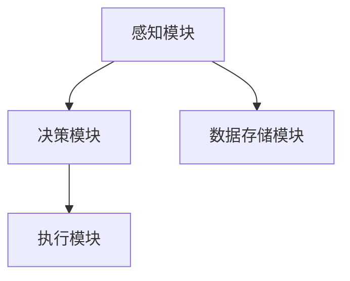
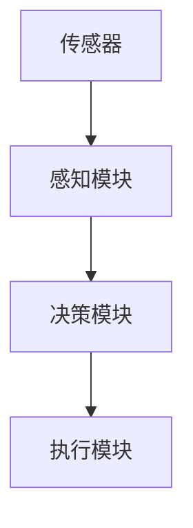

                 


# AI Agent在智能鱼缸中的生态平衡维护

## 关键词
- AI Agent
- 生态平衡
- 智能鱼缸
- 机器学习
- 系统架构

## 摘要
本文探讨了AI Agent在智能鱼缸中的应用，重点分析了其在维护生态平衡中的作用。通过详细的技术分析，包括感知、决策和执行机制，结合系统架构设计和项目实战，展示了如何利用AI技术实现智能鱼缸的高效管理。文章还讨论了机器学习算法的应用、数学模型的构建以及系统优化策略，为读者提供了全面的技术见解。

---

# 第1章: AI Agent与智能鱼缸概述

## 1.1 AI Agent的基本概念
### 1.1.1 什么是AI Agent
AI Agent（人工智能代理）是一种能够感知环境、自主决策并执行任务的智能实体。在智能鱼缸中，AI Agent通过传感器收集数据，利用算法做出决策，执行维护生态平衡的操作。

### 1.1.2 AI Agent的核心特征
- **自主性**：无需外部干预，自主完成任务。
- **反应性**：实时感知环境变化并做出反应。
- **目标导向**：以维护生态平衡为目标，优化决策。
- **学习能力**：通过机器学习不断优化性能。

### 1.1.3 AI Agent在智能鱼缸中的应用
AI Agent在智能鱼缸中用于监测水质、控制光照、调节温度等，确保鱼缸内的生态平衡。

## 1.2 智能鱼缸的背景与现状
### 1.2.1 智能鱼缸的发展历程
从传统鱼缸到智能鱼缸，技术的进步使鱼缸管理更加自动化和智能化。

### 1.2.2 当前智能鱼缸的主要技术特点
- 智能传感器：实时监测水质、温度、光照等参数。
- 自动控制：通过AI Agent自动调节环境条件。
- 数据分析：利用大数据优化生态平衡。

### 1.2.3 智能鱼缸的市场与应用前景
随着人们对智能家居的需求增加，智能鱼缸市场潜力巨大，广泛应用于家庭、办公室和公共场所。

## 1.3 生态平衡的定义与重要性
### 1.3.1 生态平衡的定义
生态平衡指生态系统中各组成部分的动态平衡，确保生物生存和繁殖的健康环境。

### 1.3.2 生态平衡在智能鱼缸中的意义
维持生态平衡可以延长鱼缸内生物的寿命，提升观赏性，减少维护成本。

### 1.3.3 扰乱生态平衡的常见因素
- **水质变化**：氨氮、亚硝酸盐浓度过高。
- **温度波动**：温度剧烈变化影响生物代谢。
- **光照不足**：影响植物光合作用和鱼的生长。

## 1.4 AI Agent在生态平衡维护中的作用
### 1.4.1 AI Agent如何感知环境
通过传感器实时监测鱼缸内的环境参数，如温度、湿度、光照强度等。

### 1.4.2 AI Agent如何决策与执行
AI Agent根据感知到的数据，结合预设的规则或机器学习模型，做出决策并执行操作，如调节水泵、开关灯光等。

### 1.4.3 AI Agent维护生态平衡的优势
- **高效性**：快速响应环境变化。
- **精准性**：基于数据进行精准控制。
- **可持续性**：通过学习不断优化控制策略。

## 1.5 本章小结
本章介绍了AI Agent的基本概念、智能鱼缸的发展现状、生态平衡的定义及其重要性，以及AI Agent在维护生态平衡中的作用。

---

# 第2章: AI Agent的核心原理与技术

## 2.1 AI Agent的基本原理
### 2.1.1 AI Agent的感知机制
AI Agent通过传感器感知环境，获取实时数据，如温度、湿度、光照强度等。

### 2.1.2 AI Agent的决策机制
基于感知数据，AI Agent利用算法进行分析，做出决策。常见的算法包括规则引擎和机器学习模型。

### 2.1.3 AI Agent的执行机制
根据决策结果，AI Agent通过执行器（如水泵、灯光控制器）执行操作，调节环境条件。

## 2.2 机器学习在AI Agent中的应用
### 2.2.1 机器学习的基本概念
机器学习是一种人工智能技术，通过数据训练模型，使其能够进行预测和决策。

### 2.2.2 常见的机器学习算法
- **监督学习**：如决策树、随机森林，用于分类和回归任务。
- **无监督学习**：如聚类，用于发现数据中的模式。
- **强化学习**：通过奖励机制优化决策策略。

### 2.2.3 机器学习在智能鱼缸中的应用
AI Agent可以利用机器学习模型预测水质变化，优化控制策略。

## 2.3 AI Agent的数学模型与算法
### 2.3.1 感知模型
$$
\text{感知数据} = f(\text{传感器输入})
$$

### 2.3.2 决策模型
$$
\text{决策} = g(\text{感知数据}, \text{历史数据})
$$

### 2.3.3 执行模型
$$
\text{执行动作} = h(\text{决策})
$$

## 2.4 系统设计与优化
### 2.4.1 系统设计原则
- **模块化**：各功能模块独立，便于维护和升级。
- **可扩展性**：支持未来功能的扩展和升级。
- **实时性**：快速响应环境变化，确保生态平衡。

## 2.5 本章小结
本章详细讲解了AI Agent的核心原理，包括感知、决策和执行机制，并介绍了机器学习在智能鱼缸中的应用，提出了系统设计与优化的原则。

---

# 第3章: 系统架构与实现

## 3.1 系统架构设计
### 3.1.1 系统功能模块
- **感知模块**：负责采集环境数据。
- **决策模块**：基于数据做出决策。
- **执行模块**：执行具体的控制操作。
- **数据存储模块**：存储历史数据，用于分析和优化。

### 3.1.2 系统架构图


## 3.2 数据流设计
### 3.2.1 数据流图


### 3.2.2 数据处理流程
1. 传感器采集数据。
2. 感知模块处理数据。
3. 决策模块分析数据，做出决策。
4. 执行模块执行操作。

## 3.3 传感器与执行器的交互
### 3.3.1 传感器类型
- 水温传感器
- 光照强度传感器
- 氨氮传感器

### 3.3.2 执行器类型
- 水泵
- 灯光控制器
- 加热器

## 3.4 系统接口设计
### 3.4.1 API接口
- **GET /sensors**：获取传感器数据。
- **POST /control**：发送控制指令。

### 3.4.2 接口协议
- HTTP
- MQTT

## 3.5 本章小结
本章详细设计了AI Agent系统的架构，包括功能模块、数据流设计、传感器与执行器的交互以及系统接口设计。

---

# 第4章: 项目实战与实现

## 4.1 项目环境搭建
### 4.1.1 硬件设备
- RPi（树莓派）
- 各类传感器（DHT11、MQ-135）
- 执行器（水泵、LED灯）

### 4.1.2 软件环境
- Python 3.8+
- TensorFlow 2.0+
- Flask

## 4.2 核心功能实现
### 4.2.1 感知模块实现
```python
import Adafruit_DHT

def get_sensor_data():
    humidity, temperature = Adafruit_DHT.read_retry(11, 4)
    return {"湿度": humidity, "温度": temperature}
```

### 4.2.2 决策模块实现
```python
def decide(action, data):
    # 简单的决策逻辑
    if data["湿度"] > 60:
        return "开启除湿器"
    elif data["温度"] < 25:
        return "加热"
    else:
        return "无动作"
```

### 4.2.3 执行模块实现
```python
import RPi.GPIO as GPIO

def control_system(action):
    if action == "开启除湿器":
        # 控制除湿器
        pass
    elif action == "加热":
        # 控制加热器
        pass
```

## 4.3 系统测试与优化
### 4.3.1 测试用例设计
- 测试传感器数据采集的准确性。
- 测试决策模块的响应速度。
- 测试执行模块的正确性。

### 4.3.2 性能优化
- 使用缓存技术减少重复计算。
- 并行处理传感器数据。

## 4.4 本章小结
本章通过具体的项目实战，详细讲解了AI Agent系统的实现过程，包括环境搭建、核心功能实现、系统测试与优化。

---

# 第5章: 数学模型与算法优化

## 5.1 生态平衡的数学模型
### 5.1.1 水质模型
$$
\text{氨氮浓度} = k \times \text{鱼的数量} - c \times \text{硝化细菌数量}
$$

### 5.1.2 温度模型
$$
\text{温度} = \text{初始温度} + \Delta t \times \text{时间}
$$

## 5.2 AI Agent的决策模型
### 5.2.1 线性回归模型
$$
y = a x + b
$$

### 5.2.2 分类模型
$$
P(y|x) = \frac{e^{w x + b}}{1 + e^{w x + b}}
$$

## 5.3 算法优化策略
### 5.3.1 参数调整
- 学习率优化
- 正则化参数调整

### 5.3.2 模型选择
- 使用更复杂的模型（如深度学习）提升性能。

## 5.4 本章小结
本章通过数学建模和算法优化，进一步提升了AI Agent的决策能力，确保生态平衡的高效维护。

---

# 第6章: 系统实现与优化

## 6.1 系统实现细节
### 6.1.1 系统架构优化
- 使用微服务架构，提高系统的可扩展性。

### 6.1.2 数据存储优化
- 使用数据库索引优化查询速度。

## 6.2 性能优化策略
### 6.2.1 并行处理
- 使用多线程或异步编程提高处理效率。

### 6.2.2 系统监控
- 实时监控系统运行状态，及时发现和解决问题。

## 6.3 测试与调试
### 6.3.1 功能测试
- 单元测试
- 集成测试

### 6.3.2 性能测试
- 负载测试
- 压力测试

## 6.4 本章小结
本章详细讲解了系统的实现细节和优化策略，确保AI Agent在智能鱼缸中的高效运行。

---

# 第7章: 总结与展望

## 7.1 全文总结
本文详细探讨了AI Agent在智能鱼缸中的应用，从理论到实践，全面分析了其在维护生态平衡中的作用。

## 7.2 未来展望
随着技术的进步，AI Agent将更加智能化，未来的智能鱼缸将更加高效和人性化。

---

# 作者
作者：AI天才研究院/AI Genius Institute  
作者：禅与计算机程序设计艺术/Zen And The Art of Computer Programming

