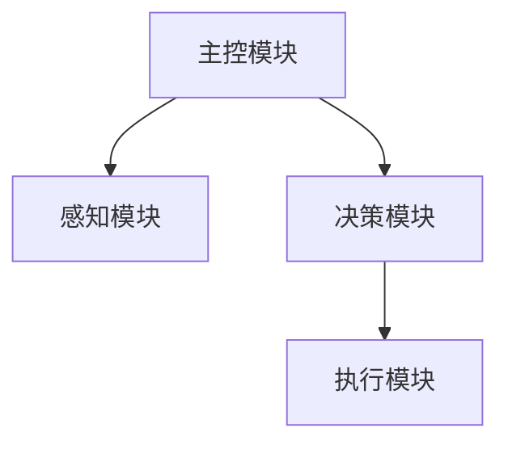
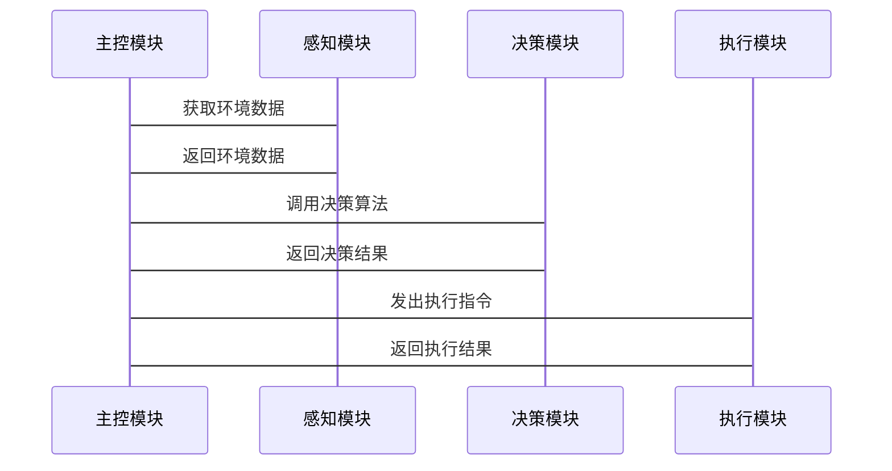

                 


# AI Agent在机器人控制中的应用：自主导航与任务执行

> **关键词**：AI Agent，机器人控制，自主导航，任务执行，路径规划，强化学习

> **摘要**：本文系统地探讨了AI Agent在机器人控制中的应用，特别是自主导航与任务执行的核心技术。通过分析路径规划、避障算法、强化学习等方法，结合实际案例和系统架构设计，展示了AI Agent如何实现复杂的机器人控制任务。文章内容涵盖了从基础概念到算法实现，再到系统设计的全过程，旨在为读者提供全面而深入的技术指导。

---

# 第1章 AI Agent与机器人控制概述

## 1.1 AI Agent的基本概念

### 1.1.1 什么是AI Agent
AI Agent（智能体）是能够感知环境、做出决策并执行动作的实体。它可以是一个软件程序或物理设备，通过传感器获取信息，并通过执行器与环境交互。AI Agent的核心在于其自主性、反应性和社会性。

### 1.1.2 AI Agent的核心特征
- **自主性**：AI Agent能够独立决策，无需外部干预。
- **反应性**：能够实时感知环境变化并做出响应。
- **社会性**：能够与其他AI Agent或人类进行协作或竞争。

### 1.1.3 AI Agent在机器人控制中的作用
AI Agent为机器人提供了智能决策和执行能力，使其能够完成复杂的任务，如导航、避障和目标识别。

---

## 1.2 机器人控制的基本原理

### 1.2.1 机器人控制的定义
机器人控制是指通过算法和程序，使机器人按照预设目标或动态需求完成特定动作的过程。

### 1.2.2 机器人控制的分类
- **行为控制**：基于当前状态做出反应。
- **任务控制**：基于目标分解和优先级排序。

### 1.2.3 AI Agent在机器人控制中的地位
AI Agent是机器人控制的核心，负责感知、决策和执行。

---

## 1.3 自主导航与任务执行的背景

### 1.3.1 自主导航的定义与特点
自主导航是指机器人在无外部干预的情况下，能够从起点移动到目标点，避开障碍物。

### 1.3.2 任务执行的定义与特点
任务执行是指机器人根据任务要求，完成特定目标的操作，如物体识别、抓取等。

### 1.3.3 自主导航与任务执行的结合
通过结合自主导航和任务执行，机器人能够完成复杂的综合性任务，如物流配送和工业装配。

---

## 1.4 本章小结

### 1.4.1 核心概念回顾
- AI Agent的基本概念和特征。
- 机器人控制的定义和分类。
- 自主导航与任务执行的背景。

### 1.4.2 未来发展趋势
随着AI技术的进步，AI Agent在机器人控制中的应用将更加智能化和多样化。

---

# 第2章 AI Agent在机器人控制中的核心概念

## 2.1 AI Agent的基本原理

### 2.1.1 感知与决策
- **感知**：通过传感器获取环境信息。
- **决策**：基于感知信息做出动作选择。

### 2.1.2 行为与执行
- **行为规划**：制定动作序列。
- **执行**：通过执行器完成动作。

### 2.1.3 状态与反馈
- **状态**：当前环境和自身状态。
- **反馈**：执行结果对后续决策的影响。

---

## 2.2 自主导航的核心算法

### 2.2.1 路径规划算法
- **A*算法**：基于图搜索的路径规划算法。
- **RRT算法**：基于采样的路径规划算法。

### 2.2.2 避障算法
- **概率图方法**：如概率栅格地图。
- **深度学习方法**：基于CNN的障碍物检测。

### 2.2.3 多目标导航策略
- **多目标优化**：同时考虑多个目标。
- **动态权重分配**：根据环境动态调整目标权重。

---

## 2.3 任务执行的逻辑框架

### 2.3.1 任务分解
- **层次分解**：将大任务分解为子任务。
- **序列分解**：将任务分解为时间序列。

### 2.3.2 任务优先级
- **静态优先级**：任务优先级固定。
- **动态优先级**：根据环境变化调整优先级。

### 2.3.3 任务执行的反馈机制
- **闭环控制**：根据反馈调整执行。

---

## 2.4 本章小结

### 2.4.1 核心概念总结
- AI Agent的基本原理。
- 自主导航和任务执行的核心算法。

### 2.4.2 算法特点对比
- A*算法适用于静态环境，RRT算法适用于动态环境。

---

# 第3章 自主导航算法的数学模型与实现

## 3.1 路径规划算法

### 3.1.1 A*算法的数学模型
$$f(n) = g(n) + h(n)$$
其中，$g(n)$是当前节点到起点的代价，$h(n)$是当前节点到目标的估算代价。

### 3.1.2 RRT算法的数学模型
$$f(n) = \sqrt{(x_i - x_j)^2 + (y_i - y_j)^2}$$
其中，$f(n)$是节点之间的距离。

---

## 3.2 避障算法

### 3.2.1 基于概率图的避障
- 使用概率栅格地图表示环境，通过概率分布判断障碍物位置。

### 3.2.2 基于深度学习的避障
- 使用卷积神经网络（CNN）检测障碍物。

### 3.2.3 基于强化学习的避障
- 通过强化学习训练避障策略。

---

## 3.3 多目标导航策略

### 3.3.1 多目标优化
- 使用拉格朗日乘数法优化多个目标函数。

### 3.3.2 动态权重分配
- 根据环境动态调整目标权重。

### 3.3.3 路径重规划
- 根据环境变化实时调整路径。

---

## 3.4 本章小结

### 3.4.1 算法实现总结
- A*算法适用于静态环境。
- RRT算法适用于动态环境。

### 3.4.2 算法优缺点分析
- A*算法计算复杂度较高，RRT算法鲁棒性较好。

---

# 第4章 任务执行的算法实现

## 4.1 强化学习在任务执行中的应用

### 4.1.1 Q-Learning算法
$$Q(s,a) = r + \gamma \max Q(s',a')$$
其中，$s$是当前状态，$a$是动作，$r$是奖励，$\gamma$是折扣因子。

### 4.1.2 DQN算法
- 使用深度神经网络近似Q值函数。

### 4.1.3 策略梯度算法
$$\nabla \theta = \mathbb{E}[ \nabla \log \pi_\theta(a|s) Q(s,a) ]$$
其中，$\theta$是参数，$\pi_\theta(a|s)$是策略函数。

---

## 4.2 基于视觉的任务执行

### 4.2.1 视觉识别
- 使用CNN进行物体识别。

### 4.2.2 视觉跟踪
- 使用KCF算法进行目标跟踪。

---

## 4.3 本章小结

### 4.3.1 核心算法总结
- Q-Learning适用于简单任务，DQN适用于复杂任务。

### 4.3.2 算法适用场景
- 强化学习适用于动态和不确定环境。

---

# 第5章 系统架构设计

## 5.1 系统功能模块

### 5.1.1 感知模块
- 传感器数据处理。

### 5.1.2 决策模块
- 算法实现。

### 5.1.3 执行模块
- 执行器控制。

---

## 5.2 系统架构图


---

## 5.3 系统接口设计
- **输入接口**：传感器数据。
- **输出接口**：执行器指令。

---

## 5.4 系统交互流程图


---

## 5.5 本章小结

### 5.5.1 系统架构总结
- 分层设计，模块化实现。

### 5.5.2 架构优缺点
- 优点：模块独立，便于扩展。
- 缺点：通信开销较大。

---

# 第6章 项目实战

## 6.1 环境安装

```bash
pip install gym numpy matplotlib
```

---

## 6.2 核心代码实现

### 6.2.1 A*算法实现
```python
def a_star(start, goal, grid):
    # 初始化优先队列
    open_set = {start}
    came_from = {}
    g_score = {start: 0}
    f_score = {start: heuristic(start, goal)}
    
    while open_set:
        current = heappop(open_set)
        if current == goal:
            return reconstruct_path(came_from, current)
        for neighbor in neighbors(current, grid):
            tentative_g_score = g_score[current] + cost(current, neighbor)
            if neighbor not in g_score or tentative_g_score < g_score[neighbor]:
                came_from[neighbor] = current
                g_score[neighbor] = tentative_g_score
                f_score[neighbor] = g_score[neighbor] + heuristic(neighbor, goal)
                heappush(open_set, neighbor)
    return None
```

---

## 6.3 案例分析

### 6.3.1 自主导航案例
- **场景**：机器人在动态环境中导航。
- **算法选择**：RRT算法。

### 6.3.2 任务执行案例
- **场景**：机器人识别并抓取目标物体。
- **算法选择**：强化学习。

---

## 6.4 项目总结

### 6.4.1 核心代码总结
- A*算法适用于静态环境。
- RRT算法适用于动态环境。

### 6.4.2 项目经验总结
- 算法选择需根据环境动态调整。
- 系统设计需注重模块化和可扩展性。

---

# 第7章 总结与展望

## 7.1 本章总结

### 7.1.1 核心内容回顾
- AI Agent在机器人控制中的应用。
- 自主导航与任务执行的核心算法。

### 7.1.2 重要结论
- AI Agent是实现智能机器人控制的关键技术。

---

## 7.2 未来展望

### 7.2.1 技术发展
- 更高效的路径规划算法。
- 更智能的强化学习方法。

### 7.2.2 应用领域
- 工业自动化。
- 服务机器人。

---

# 附录

## 附录A 工具与库

### 1. Python库
- `gym`：强化学习环境。
- `numpy`：数值计算。

### 2. 开发工具
- `PyCharm`：代码编辑器。
- `Jupyter`：数据分析工具。

---

## 附录B 参考文献

1. Russell, S., & Norvig, P. (2010). Artificial Intelligence: A Modern Approach.
2. LaValle, S. M. (2006). Planning Algorithms.

---

# 作者

作者：AI天才研究院/AI Genius Institute & 禅与计算机程序设计艺术 /Zen And The Art of Computer Programming

