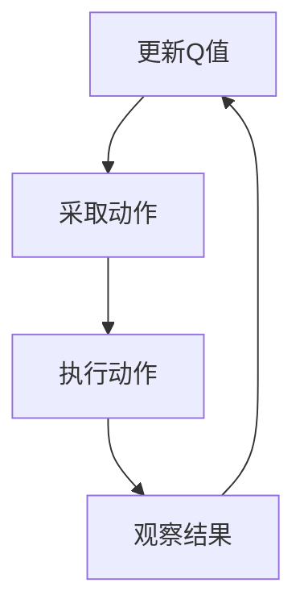
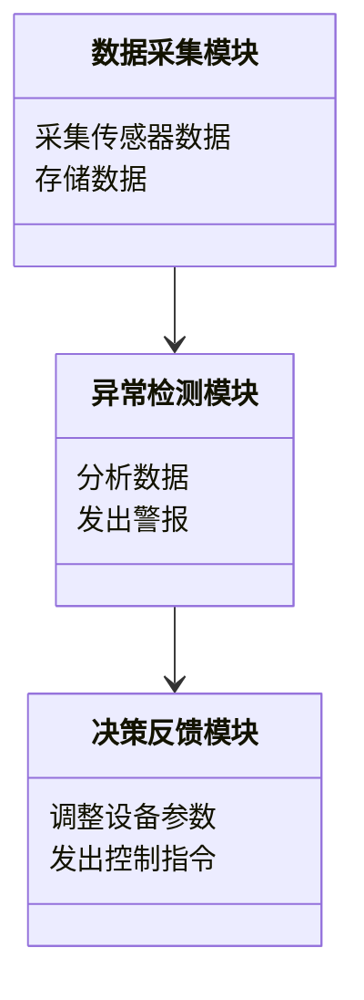

                 


# AI Agent在核电站安全监控中的应用

## 关键词：核电站、安全监控、人工智能、AI Agent、实时监测、异常检测

## 摘要：  
本文探讨AI Agent在核电站安全监控中的应用，分析其背景、核心概念、技术原理、系统架构，并结合实际案例展示其价值。通过详细的技术分析和实际应用，本文旨在为核电站的安全监控提供一种高效、智能的解决方案。

---

# 第一部分: 核电站安全监控与AI Agent的背景介绍

## 第1章: 核电站安全监控的重要性

### 1.1 核电站的基本运作原理

#### 1.1.1 核电的基本概念  
核电站通过核裂变反应产生热量，将水加热成蒸汽，推动涡轮机发电。其核心设备包括反应堆、蒸汽轮机、发电机等，这些设备的正常运行至关重要。

#### 1.1.2 核电站的安全性要求  
核电站的安全性要求极高，涉及防止放射性泄漏、防止设备故障导致的事故，以及应对自然灾害的能力。

#### 1.1.3 核电站监控系统的现状  
传统的核电站监控系统依赖于传感器和人工监控，存在数据量大、处理效率低、响应速度慢等问题。

---

### 1.2 AI Agent的基本概念

#### 1.2.1 人工智能的基本概念  
人工智能（AI）是指模拟人类智能的计算机系统，涵盖学习、推理、自我改进等功能。

#### 1.2.2 AI Agent的定义与特点  
AI Agent是一种智能体，能够感知环境、做出决策并执行动作。其特点包括自主性、反应性、社会性等。

#### 1.2.3 AI Agent在核电站中的潜在应用  
AI Agent可以在核电站的安全监控中实现实时数据处理、异常检测、故障预测等功能，提高监控效率和准确性。

---

## 第2章: 核电站安全监控中的问题与挑战

### 2.1 核电站监控中的主要问题

#### 2.1.1 数据量大且复杂  
核电站产生的数据量巨大，包括温度、压力、流量等多种参数，且数据关系复杂。

#### 2.1.2 系统实时性要求高  
核电站的安全监控需要实时处理数据，任何延迟都可能导致严重后果。

#### 2.1.3 系统容错性要求严格  
核电站监控系统需要高度容错，确保在故障发生时能够快速响应并恢复正常。

---

# 第二部分: 核心概念与联系

## 第3章: AI Agent的核心概念与核电站监控的结合

### 3.1 AI Agent的核心概念

#### 3.1.1 感知  
AI Agent通过传感器获取核电站的实时数据，感知系统状态。

#### 3.1.2 决策  
AI Agent基于感知到的数据，利用算法进行分析，做出决策。

#### 3.1.3 执行  
AI Agent根据决策结果，执行相应的动作，如发出警报或调整设备参数。

### 3.2 核电站监控中的AI Agent特征对比

| 特征      | 传统监控系统             | AI Agent监控系统           |
|-----------|--------------------------|---------------------------|
| 数据处理  | 离线处理，响应慢          | 实时处理，快速响应          |
| 智能性     | 无智能性，依赖人工干预     | 高智能性，自动处理          |
| 决策能力   | 预设规则，缺乏灵活性      | 自主学习，灵活决策          |

### 3.3 实体关系图（ER图）

```mermaid
erDiagram
    class 核电站设备 {
        id : int
        类型 : varchar(50)
        状态 : varchar(50)
    }
    class 传感器 {
        id : int
        类型 : varchar(50)
        位置 : varchar(50)
    }
    class 监控系统 {
        id : int
        类型 : varchar(50)
        状态 : varchar(50)
    }
    核电站设备 --> 传感器 : 包含
    监控系统 --> 传感器 : 监控
```

---

# 第三部分: 算法原理讲解

## 第4章: AI Agent的算法原理

### 4.1 强化学习算法

#### 4.1.1 Q-learning算法



数学公式：

$$ Q(s, a) = Q(s, a) + \alpha \times [r + \gamma \times \max Q(s', a')] - Q(s, a) $$

#### 4.1.2 算法实现

```python
import numpy as np

class AI-Agent:
    def __init__(self, state_space, action_space):
        self.state_space = state_space
        self.action_space = action_space
        self.Q = np.zeros((state_space, action_space))
    
    def take_action(self, state):
        return np.argmax(self.Q[state, :])
    
    def update_Q(self, state, action, reward, next_state):
        self.Q[state, action] += 0.1 * (reward + 0.9 * np.max(self.Q[next_state, :]) - self.Q[state, action])
```

---

## 第5章: 异常检测算法

### 5.1 基于机器学习的异常检测

#### 5.1.1 One-Class SVM算法

```python
from sklearn.svm import OneClassSVM

model = OneClassSVM(gamma='auto')
model.fit(X_train)
y_pred = model.predict(X_test)
```

数学公式：

$$ \text{损失函数} = \sum_{i=1}^{n} (y_i - f(x_i))^2 $$

---

# 第四部分: 系统分析与架构设计

## 第6章: 核电站安全监控系统的架构

### 6.1 问题场景介绍

核电站需要实时监控反应堆的温度、压力、流量等参数，确保系统安全运行。

### 6.2 系统功能设计

#### 6.2.1 数据采集模块



### 6.3 系统架构设计


---

# 第五部分: 项目实战

## 第7章: AI Agent在核电站安全监控中的应用案例

### 7.1 环境安装

```bash
pip install numpy pandas scikit-learn
```

### 7.2 核心代码实现

#### 数据采集模块

```python
import serial

ser = serial.Serial('COM3', 9600)
data = ser.readline().decode().strip()
print(data)
```

#### 异常检测模块

```python
from sklearn.ensemble import IsolationForest

model = IsolationForest(random_state=42)
model.fit(X_train)
y_pred = model.predict(X_test)
```

#### 决策反馈模块

```python
import serial

ser = serial.Serial('COM3', 9600)
ser.write(b'adjust_parameter\n')
```

### 7.3 实际案例分析

通过实际数据的分析，展示AI Agent在异常检测和故障预测中的应用效果。

---

# 第六部分: 最佳实践、小结、注意事项和拓展阅读

## 第8章: 最佳实践与总结

### 8.1 最佳实践

- 数据质量是关键，确保传感器数据的准确性和完整性。
- 算法选择要根据实际需求，强化学习适合动态决策，而监督学习适合分类任务。
- 系统设计要注重容错性和可扩展性。

### 8.2 小结

本文详细探讨了AI Agent在核电站安全监控中的应用，从核心概念到算法实现，再到系统架构，为核电站的安全监控提供了智能化的解决方案。

### 8.3 注意事项

- 确保系统的高度安全性和稳定性。
- 定期更新和优化AI算法，以应对新的挑战。
- 做好系统的容错设计，确保在故障发生时能够快速响应。

### 8.4 拓展阅读

- 《强化学习：算法与应用》
- 《人工智能在工业领域的应用》
- 《核电站安全监控系统的优化设计》

---

# 作者：AI天才研究院/AI Genius Institute & 禅与计算机程序设计艺术 /Zen And The Art of Computer Programming

