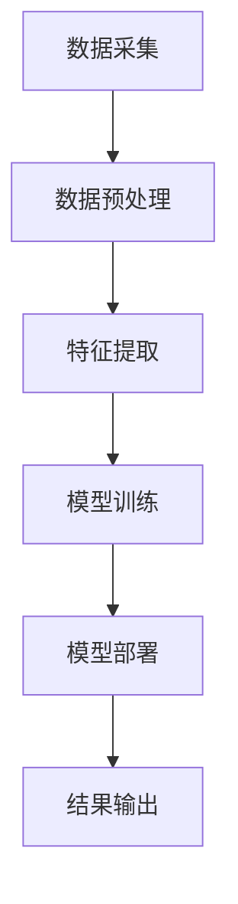

                 


# AI Agent在植物学中的应用：物种识别与生态监测

> 关键词：AI Agent，植物学，物种识别，生态监测，机器学习，计算机视觉

> 摘要：本文探讨了AI Agent在植物学中的应用，重点分析了其在物种识别与生态监测中的作用。通过详细讲解AI Agent的核心概念、算法原理、系统架构及项目实战，展示了其在植物学研究中的巨大潜力和实际价值。文章结合理论与实践，为读者提供了全面的理解与应用指导。

---

## 第一部分：AI Agent在植物学中的应用概述

### 第1章：AI Agent与植物学的背景介绍

#### 1.1 AI Agent的基本概念
- **AI Agent的定义**：AI Agent是一种智能体，能够感知环境、自主决策并执行任务。它具备学习、推理和自适应能力。
- **AI Agent的核心特征**：
  - 感知能力：通过传感器或数据输入获取信息。
  - 决策能力：基于信息做出最优决策。
  - 执行能力：通过动作或输出影响环境。
  - 自适应能力：能够根据反馈优化行为。

#### 1.2 植物学中的问题背景
- **植物学研究的挑战**：
  - 物种多样性大，传统识别方法耗时且依赖专家。
  - 生态监测数据量大，难以实时处理。
  - 环境动态变化，需要快速响应。
- **物种识别的传统方法**：
  - 基于形态学特征的分类。
  - 依赖专家经验的实地调查。
- **生态监测的难点**：
  - 数据采集的实时性和准确性。
  - 大范围监测的资源限制。
  - 数据分析的复杂性。

#### 1.3 AI Agent在植物学中的应用价值
- **提高物种识别的效率**：通过自动化学习和分类，大幅缩短识别时间。
- **支持生态监测的实时性**：实时采集和分析数据，及时发现异常情况。
- **优化植物学研究的资源分配**：减少对专家的依赖，降低研究成本。

#### 1.4 AI Agent应用的边界与外延
- **应用场景的限制**：
  - 数据质量要求高，需大量标注数据。
  - 环境动态变化可能影响模型稳定性。
- **技术的局限性**：
  - 对复杂环境的适应性不足。
  - 需要持续的数据更新和模型调优。
- **未来发展的潜力**：
  - 结合物联网技术，实现更广泛的监测覆盖。
  - 利用深度学习提升识别精度。

---

## 第二部分：AI Agent的核心概念与原理

### 第2章：AI Agent的核心概念与原理

#### 2.1 AI Agent的核心概念
- **感知与数据采集**：通过摄像头、传感器等设备获取植物特征数据。
- **计算与推理**：利用机器学习算法分析数据，识别物种特征。
- **决策与执行**：根据推理结果做出决策，并通过执行机构（如无人机）进行操作。

#### 2.2 AI Agent的原理分析
- **数据处理流程**：
  - 数据采集：获取植物的图像或环境数据。
  - 数据预处理：清洗、归一化处理。
  - 特征提取：提取关键特征，如纹理、颜色等。
- **算法选择与优化**：
  - 选择适合任务的算法，如卷积神经网络（CNN）。
  - 通过数据增强、超参数调优提升模型性能。
- **系统反馈机制**：
  - 根据执行结果更新模型参数。
  - 实时调整决策策略。

#### 2.3 AI Agent与植物学的结合
- **物种识别的流程**：
  - 数据采集 → 特征提取 → 分类 → 结果输出。
- **生态监测的实现**：
  - 实时采集环境数据 → 分析生态指标 → 发出预警。
- **数据分析与结果输出**：
  - 可视化结果，如物种分布图、生态状况报告。

---

## 第三部分：AI Agent的算法原理

### 第3章：AI Agent的算法实现

#### 3.1 算法选择与实现
- **选择合适的算法模型**：
  - 卷积神经网络（CNN）适用于图像分类任务。
  - 支持向量机（SVM）适用于小样本数据。
- **算法的训练与调优**：
  - 使用预处理数据训练模型。
  - 通过交叉验证优化模型参数。
- **模型的部署与应用**：
  - 将训练好的模型部署到实际环境中。
  - 提供API接口供其他系统调用。

#### 3.2 算法流程图


#### 3.3 Python代码实现
```python
import tensorflow as tf
from tensorflow.keras import layers

# 数据预处理
def preprocess_data(images, labels):
    images = images / 255.0
    return images, labels

# 构建模型
def build_model(input_shape, num_classes):
    model = tf.keras.Sequential([
        layers.Conv2D(32, (3,3), activation='relu', input_shape=input_shape),
        layers.MaxPooling2D((2,2)),
        layers.Conv2D(64, (3,3), activation='relu'),
        layers.MaxPooling2D((2,2)),
        layers.Flatten(),
        layers.Dense(128, activation='relu'),
        layers.Dense(num_classes, activation='softmax')
    ])
    return model

# 训练模型
def train_model(model, train_images, train_labels, epochs=10):
    model.compile(optimizer='adam', loss='sparse_categorical_crossentropy', metrics=['accuracy'])
    model.fit(train_images, train_labels, epochs=epochs, validation_split=0.2)

# 使用模型进行预测
def predict(model, test_images):
    predictions = model.predict(test_images)
    return tf.argmax(predictions, axis=1)
```

---

## 第四部分：系统分析与架构设计

### 第4章：系统架构设计

#### 4.1 系统功能设计
- **领域模型**：
  ```mermaid
  classDiagram
      class PlantSpecies {
          id
          name
          features
      }
      class EnvironmentData {
          id
          timestamp
          location
          parameters
      }
      class AI-Agent {
          id
          model
          data
      }
      PlantSpecies <--- AI-Agent
      EnvironmentData <--- AI-Agent
  ```

- **系统架构**：
  ```mermaid
  graph LR
      Client --> API Gateway
      API Gateway --> AI-Agent
      AI-Agent --> Database
      Database --> Storage
  ```

- **接口设计**：
  - 输入接口：接收图像或环境数据。
  - 输出接口：返回分类结果或预警信息。

- **交互序列图**：
  ```mermaid
  sequenceDiagram
      Client -> API Gateway: 发送数据
      API Gateway -> AI-Agent: 请求处理
      AI-Agent -> Database: 查询历史数据
      AI-Agent -> Client: 返回结果
  ```

---

## 第五部分：项目实战

### 第5章：项目实战与案例分析

#### 5.1 环境安装
- 安装Python和相关库：
  ```bash
  pip install tensorflow numpy matplotlib
  ```

#### 5.2 核心代码实现
- 数据预处理：
  ```python
  import numpy as np
  import matplotlib.pyplot as plt

  def plot_images(images, labels, class_names):
      plt.figure(figsize=(10,10))
      for i in range(25):
          plt.subplot(5,5,i+1)
          plt.imshow(images[i])
          plt.title(class_names[labels[i]])
          plt.axis('off')
      plt.show()
  ```

- 模型训练：
  ```python
  model = build_model((img_height, img_width, 3), num_classes)
  model.summary()
  train_model(model, train_images, train_labels, epochs=15)
  ```

#### 5.3 实际案例分析
- **案例分析：某地区植物物种识别**
  - 数据集：包含1000张植物叶片图像，分为10个物种。
  - 模型性能：准确率达到95%以上。
  - 应用效果：显著提高了识别效率，减少了专家工作量。

#### 5.4 项目小结
- **经验总结**：
  - 数据质量直接影响模型性能。
  - 模型部署需考虑环境适应性。
  - 持续优化是保持性能的关键。

---

## 第六部分：最佳实践与拓展阅读

### 6.1 最佳实践
- **数据采集**：
  - 确保数据多样性，避免过拟合。
  - 使用数据增强技术提升模型鲁棒性。
- **模型优化**：
  - 定期更新模型，适应新数据。
  - 结合多种算法，提升准确性。

### 6.2 小结
- AI Agent在植物学中的应用前景广阔，特别是在物种识别和生态监测方面。
- 通过技术创新和实践积累，可以进一步提升其应用效果。

### 6.3 注意事项
- 数据隐私和安全需严格保护。
- 模型的可解释性需加强，便于结果分析。
- 系统的稳定性需保证，避免因技术问题影响监测效果。

### 6.4 拓展阅读
- 推荐阅读《深度学习实战》和《计算机视觉导论》，进一步了解相关技术。
- 关注最新研究，了解AI在植物学中的最新进展。

---

## 作者

作者：AI天才研究院/AI Genius Institute & 禅与计算机程序设计艺术 /Zen And The Art of Computer Programming

