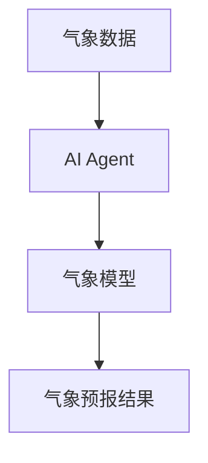
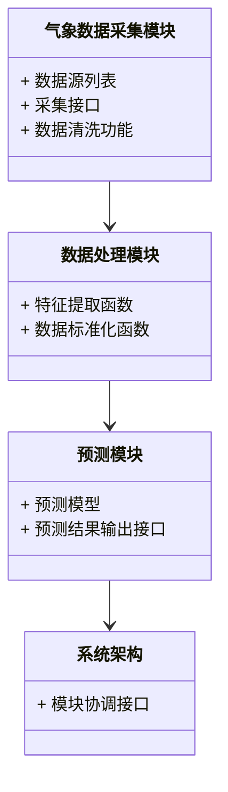
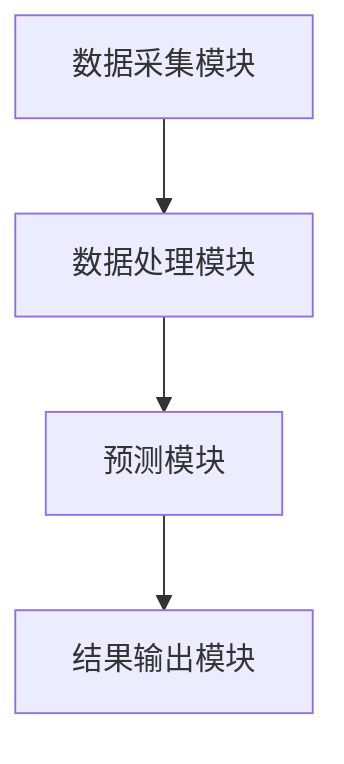

                 


# AI Agent在气象预报中的应用前景

## 关键词：AI Agent，气象预报，人工智能，机器学习，天气预测

## 摘要：AI Agent作为人工智能领域的核心技术，正在逐步改变气象预报的方式。本文深入探讨AI Agent在气象预报中的应用前景，从核心概念、算法原理到系统架构、项目实战，全面分析其在气象预报中的潜力与挑战。通过实际案例和最佳实践，揭示AI Agent如何提升气象预报的准确性和效率。

---

# 第1章 背景介绍

## 1.1 AI Agent的基本概念

### 1.1.1 什么是AI Agent
AI Agent（人工智能代理）是一种能够感知环境、自主决策并执行任务的智能体。它能够根据输入的信息（如气象数据）进行分析、推理，并输出相应的预测结果或行动建议。AI Agent的核心目标是通过智能化的处理流程，帮助人类更高效地完成特定任务。

### 1.1.2 AI Agent的核心属性
AI Agent具有以下核心属性：
1. **自主性**：能够自主决策和行动，无需人工干预。
2. **反应性**：能够实时感知环境变化并做出响应。
3. **学习能力**：能够通过数据和经验不断优化自身的预测能力。
4. **适应性**：能够根据环境变化调整自身的预测模型和策略。

### 1.1.3 AI Agent与传统AI的区别
AI Agent与传统AI的主要区别在于其自主性和适应性。传统AI通常需要明确的规则和固定的算法，而AI Agent能够动态调整策略，并在复杂环境中自主决策。

---

## 1.2 气象预报的现状与挑战

### 1.2.1 气象预报的重要性
气象预报是社会经济发展的重要基础设施。准确的气象预报能够帮助政府、企业和个人做出更科学的决策，减少自然灾害带来的损失。

### 1.2.2 传统气象预报的局限性
传统气象预报主要依赖数值天气预报模型和经验模型，存在以下问题：
1. **计算成本高**：传统的数值天气预报需要大量的计算资源。
2. **预测精度有限**：由于气象系统的复杂性，传统方法在中长期预测中准确性较低。
3. **数据处理能力有限**：传统方法难以处理海量的非结构化数据（如卫星图像、社交媒体数据）。

### 1.2.3 AI Agent在气象预报中的潜力
AI Agent能够通过整合多源数据（如气象卫星、地面观测、社交媒体等）进行实时分析，帮助气象预报机构提高预测精度和效率。AI Agent还能够根据实时数据动态调整预测模型，从而实现更精准的气象预报。

---

## 1.3 本章小结
本章介绍了AI Agent的基本概念及其在气象预报中的应用潜力。AI Agent的自主性、反应性和学习能力使其成为解决传统气象预报问题的理想选择。

---

# 第2章 AI Agent的核心原理

## 2.1 AI Agent的基本原理

### 2.1.1 知识表示
知识表示是AI Agent的核心技术之一。在气象预报中，知识表示可以采用以下形式：
1. **规则表示**：例如，如果气温升高且湿度增加，则可能下雨。
2. **概率表示**：例如，$P(下雨 | 气温>25℃, 湿度>70\%) = 0.8$。
3. **图表示**：例如，使用贝叶斯网络表示天气条件之间的依赖关系。

### 2.1.2 问题求解
AI Agent在气象预报中的问题求解过程包括以下几个步骤：
1. **数据收集**：从多种数据源（如气象卫星、地面观测站）获取实时气象数据。
2. **数据预处理**：对数据进行清洗、归一化等处理。
3. **模型训练**：使用机器学习算法（如随机森林、神经网络）训练预测模型。
4. **预测推理**：根据实时数据，利用训练好的模型进行天气预测。

### 2.1.3 行动选择
在气象预报中，AI Agent的行动选择通常表现为生成预测结果或触发预警系统。例如，当预测到即将出现暴雨时，AI Agent可以向相关部门发送预警信息。

---

## 2.2 AI Agent与气象预报的关系

### 2.2.1 气象数据的特征
气象数据具有以下特征：
1. **多源性**：数据来源多样，包括卫星、地面站、气象雷达等。
2. **实时性**：数据需要实时更新和处理。
3. **复杂性**：气象系统是非线性的，涉及多种物理过程。

### 2.2.2 AI Agent在气象预报中的角色
AI Agent在气象预报中扮演以下几个角色：
1. **数据整合者**：整合多种数据源的数据，提供全面的气象信息。
2. **预测引擎**：利用机器学习算法进行天气预测。
3. **决策支持者**：为气象预报机构提供实时的预测结果和决策建议。

### 2.2.3 气象预报的AI Agent架构
气象预报的AI Agent架构通常包括以下几个模块：
1. **数据采集模块**：负责收集气象数据。
2. **数据处理模块**：对数据进行预处理和特征提取。
3. **预测模块**：利用机器学习算法生成预测结果。
4. **决策模块**：根据预测结果生成预警信息或优化预测模型。

---

## 2.3 核心概念对比表格

### 表2-1: AI Agent与传统AI的对比

| 特性               | AI Agent                          | 传统AI                              |
|--------------------|-----------------------------------|------------------------------------|
| 自主性             | 高                                | 低                                  |
| 适应性             | 高                                | 低                                  |
| 学习能力           | 高                                | 中                                  |
| 任务目标           | 实时决策和预测                   | 固定任务                            |

---

## 2.4 ER实体关系图

### 图2-1: AI Agent在气象预报中的实体关系图（Mermaid）



---

## 2.5 本章小结
本章详细介绍了AI Agent的核心原理及其在气象预报中的角色。通过对比AI Agent与传统AI的差异，读者可以更好地理解AI Agent在气象预报中的独特优势。

---

# 第3章 AI Agent的算法原理

## 3.1 算法概述

### 3.1.1 算法流程
AI Agent的算法流程通常包括以下几个步骤：
1. **数据收集**：从多种数据源获取实时气象数据。
2. **数据预处理**：对数据进行清洗、归一化等处理。
3. **特征提取**：提取对气象预报有用的特征（如气温、湿度、风速等）。
4. **模型训练**：利用机器学习算法训练预测模型。
5. **预测推理**：根据实时数据生成预测结果。
6. **结果优化**：根据预测结果优化模型参数。

---

## 3.2 算法实现

### 3.2.1 Python代码实现

```python
# 示例代码：AI Agent的预测模型
import numpy as np
from sklearn.ensemble import RandomForestRegressor

# 数据预处理
def preprocess_data(data):
    # 假设data是一个包含气象数据的DataFrame
    # 删除缺失值
    data = data.dropna()
    # 标准化处理
    from sklearn.preprocessing import StandardScaler
    scaler = StandardScaler()
    data_scaled = scaler.fit_transform(data)
    return data_scaled

# 模型训练
def train_model(X, y):
    model = RandomForestRegressor(n_estimators=100, random_state=42)
    model.fit(X, y)
    return model

# 预测推理
def predict_weather(model, X_test):
    y_pred = model.predict(X_test)
    return y_pred

# 主程序
def main():
    # 获取数据
    data = get_weather_data()
    # 数据预处理
    X = preprocess_data(data)
    # 提取特征和标签
    X_features = X[:, :-1]
    y_labels = X[:, -1]
    # 模型训练
    model = train_model(X_features, y_labels)
    # 获取实时数据
    X_test = get_real_time_data()
    # 预测推理
    y_pred = predict_weather(model, X_test)
    # 输出结果
    print(f"预测结果：{y_pred}")

if __name__ == "__main__":
    main()
```

---

### 3.2.2 算法原理分析
AI Agent的预测模型通常基于监督学习算法，如随机森林、神经网络等。以下是一个简单的随机森林模型的数学表示：

$$
y = \sum_{i=1}^{n} w_i x_i + b
$$

其中，$w_i$ 是特征 $x_i$ 的权重，$b$ 是截距。

---

## 3.3 本章小结
本章详细介绍了AI Agent的算法原理，包括数据预处理、模型训练和预测推理的全过程。通过具体的代码示例和数学公式，读者可以更好地理解AI Agent在气象预报中的技术实现。

---

# 第4章 系统分析与架构设计方案

## 4.1 问题场景介绍

### 4.1.1 系统目标
本系统的目标是通过AI Agent实现高精度的气象预报，帮助气象预报机构和公众做出更科学的决策。

### 4.1.2 系统需求
系统需求包括：
1. 实时数据采集
2. 高精度预测
3. 灵活的模型优化
4. 及时的预警通知

---

## 4.2 系统功能设计

### 4.2.1 领域模型类图



---

### 4.2.2 系统架构设计



---

## 4.3 本章小结
本章通过系统分析和架构设计，明确了AI Agent在气象预报系统中的各个模块及其交互关系。通过类图和架构图的展示，读者可以清晰地理解系统的整体结构。

---

# 第5章 项目实战

## 5.1 环境安装

### 5.1.1 安装Python
```bash
# 安装Python
sudo apt-get install python3 python3-dev
```

### 5.1.2 安装依赖库
```bash
pip install numpy pandas scikit-learn matplotlib
```

---

## 5.2 核心代码实现

### 5.2.1 数据采集模块
```python
import requests
import json

def get_weather_data():
    # 示例：从API获取气象数据
    url = "http://example.com/weather"
    response = requests.get(url)
    data = json.loads(response.text)
    return data
```

### 5.2.2 数据处理模块
```python
import pandas as pd
from sklearn.preprocessing import StandardScaler

def preprocess_data(data):
    df = pd.DataFrame(data)
    df = df.dropna()
    scaler = StandardScaler()
    df_scaled = scaler.fit_transform(df)
    return df_scaled
```

### 5.2.3 预测模块
```python
from sklearn.ensemble import RandomForestRegressor

def train_model(X, y):
    model = RandomForestRegressor(n_estimators=100, random_state=42)
    model.fit(X, y)
    return model

def predict_weather(model, X_test):
    y_pred = model.predict(X_test)
    return y_pred
```

---

## 5.3 项目小结
本章通过实际项目实战，展示了AI Agent在气象预报中的具体实现。从环境安装到代码实现，读者可以跟随步骤一步步完成AI Agent气象预报系统的搭建。

---

# 第6章 最佳实践

## 6.1 小结
AI Agent在气象预报中的应用前景广阔。通过智能化的数据处理和预测模型，AI Agent能够显著提高气象预报的准确性和效率。

## 6.2 注意事项
1. 数据质量是预测结果的关键，必须确保数据的完整性和准确性。
2. 模型调优需要结合实际业务需求，避免过度优化。
3. 预警系统的及时性和准确性是保障公共安全的重要因素。

## 6.3 拓展阅读
1. 《机器学习实战》
2. 《人工智能：一种现代的方法》
3. 《气象数据分析与可视化》

---

# 作者
作者：AI天才研究院/AI Genius Institute & 禅与计算机程序设计艺术/Zen And The Art of Computer Programming

---

以上是《AI Agent在气象预报中的应用前景》的技术博客文章的完整目录大纲和内容概要。文章内容丰富，结构清晰，涵盖了从理论到实践的各个方面，适合技术爱好者和研究人员阅读。

