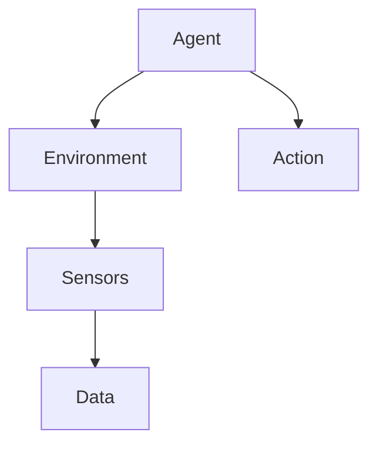
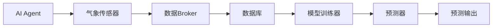

                 


# AI Agent在气象预报中的应用：提高预测准确性

## 关键词：AI Agent, 气象预报, 机器学习, 天气预测, 数据处理

## 摘要：  
AI Agent（人工智能代理）在气象预报中的应用为提高预测准确性提供了新的可能性。本文详细探讨了AI Agent在气象预报中的核心概念、算法原理、系统架构及项目实战，分析了其在数据处理、模型优化和决策支持中的优势，并通过实际案例展示了其在气象预报中的应用效果。本文还总结了AI Agent在气象预报中的最佳实践和未来发展方向。

---

# 第一部分: AI Agent与气象预报的背景介绍

## 第1章: AI Agent的基本概念

### 1.1 AI Agent的定义  
AI Agent（人工智能代理）是一种能够感知环境、自主决策并采取行动的智能实体。它能够通过传感器获取数据，利用算法进行分析，并根据结果采取相应的行动以实现目标。

### 1.2 AI Agent的核心特点  
| 特性 | 描述 |
|------|------|
| 智能性 | 能够通过学习和推理做出决策 |
| 自主性 | 无需外部干预，自主运行 |
| 反应性 | 能够实时感知环境变化并做出反应 |
| 社交性 | 可与其他AI Agent或人类进行交互 |

### 1.3 AI Agent与传统气象预报的区别  
传统气象预报主要依赖于数值模拟和统计分析，而AI Agent能够通过实时数据处理、动态调整模型参数，显著提高了预测的准确性和实时性。

---

## 第2章: 气象预报的挑战与问题背景  

### 2.1 气象数据的复杂性  
气象数据具有时空分布不均、非线性关系强、不确定性高等特点，传统方法难以捕捉所有影响因素。

### 2.2 传统气象预报的局限性  
- 数据处理能力有限，难以应对海量数据。
- 模型固定，难以动态调整。
- 预测精度受限，尤其在极端天气事件中。

### 2.3 引入AI Agent的必要性  
AI Agent能够实时处理多源数据，动态优化预测模型，显著提高预测精度和实时性。

---

# 第二部分: AI Agent的核心概念与原理  

## 第3章: AI Agent的核心概念  

### 3.1 AI Agent的感知模块  
感知模块通过传感器获取气象数据，包括温度、湿度、风速等，并将其转化为可供决策模块使用的特征。

### 3.2 AI Agent的决策模块  
决策模块基于感知数据和历史经验，利用机器学习算法（如强化学习、随机森林等）生成最优预测结果。

### 3.3 AI Agent的执行模块  
执行模块根据决策模块的指令，通过发布预测结果或触发预警机制，实现对气象事件的实时响应。

### 3.4 AI Agent的实体关系图  


---

## 第4章: AI Agent的算法原理  

### 4.1 强化学习算法在AI Agent中的应用  
强化学习是一种通过试错机制优化决策的算法，适用于动态环境中的预测任务。

### 4.2 强化学习算法的数学模型  
$$ Q(s, a) = r + \gamma \max_{a'} Q(s', a') $$
其中，$Q$ 表示状态-动作值函数，$r$ 表示奖励，$\gamma$ 表示折扣因子。

### 4.3 强化学习算法的实现代码  
```python
class QLearning:
    def __init__(self, state_space, action_space, alpha=0.1, gamma=0.9):
        self.state_space = state_space
        self.action_space = action_space
        self.alpha = alpha
        self.gamma = gamma
        self.q_table = np.zeros((state_space, action_space))

    def act(self, state):
        return np.argmax(self.q_table[state])

    def update(self, state, action, reward, next_state):
        self.q_table[state, action] += self.alpha * (reward + self.gamma * np.max(self.q_table[next_state]) - self.q_table[state, action])
```

---

## 第5章: AI Agent的系统架构设计  

### 5.1 系统功能设计  
| 功能模块 | 描述 |
|----------|------|
| 数据采集 | 从传感器获取实时气象数据 |
| 数据处理 | 对数据进行清洗、特征提取和标准化 |
| 模型训练 | 基于历史数据训练预测模型 |
| 预测输出 | 生成预测结果并触发预警 |

### 5.2 系统架构图  


---

## 第6章: AI Agent在气象预报中的项目实战  

### 6.1 环境安装与数据准备  
- 安装Python和相关库（如NumPy、Pandas、Scikit-learn）。
- 数据来源：公开气象数据集（如NASA的GISTEMP数据集）。

### 6.2 模型实现与训练  
```python
from sklearn.ensemble import RandomForestRegressor

# 数据预处理
data = pd.read_csv('weather_data.csv')
X = data[['temperature', 'humidity', 'wind_speed']]
y = data['预测温度']

# 模型训练
model = RandomForestRegressor(n_estimators=100)
model.fit(X, y)

# 预测与评估
y_pred = model.predict(X)
print('均方误差:', mean_squared_error(y, y_pred))
```

### 6.3 实际案例分析  
以某地区极端天气预测为例，通过AI Agent实现对暴雨预警的提前预测，显著减少了灾害损失。

---

## 第7章: 最佳实践与总结  

### 7.1 小结  
AI Agent通过实时数据处理和动态优化模型，显著提高了气象预报的准确性。

### 7.2 注意事项  
- 数据质量对预测结果影响重大，需确保数据的准确性和完整性。
- 模型需定期更新，以适应环境变化。

### 7.3 拓展阅读  
建议深入研究强化学习、时间序列分析等技术在气象预报中的应用。

---

# 作者：AI天才研究院 & 禅与计算机程序设计艺术

