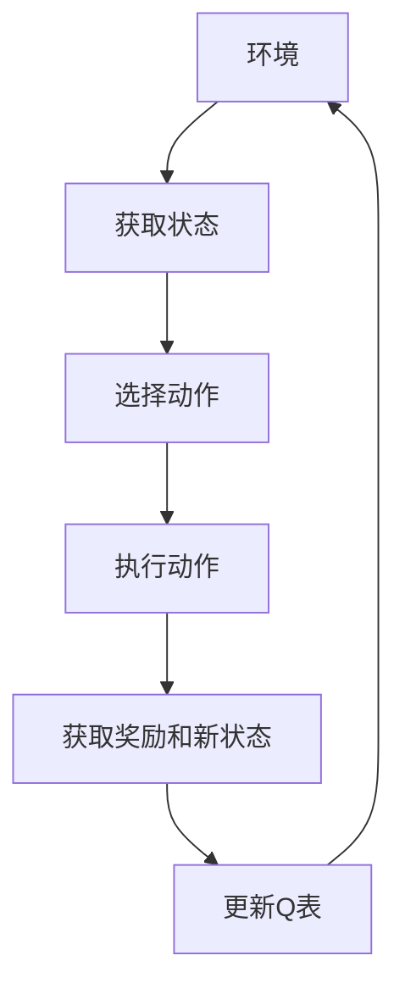
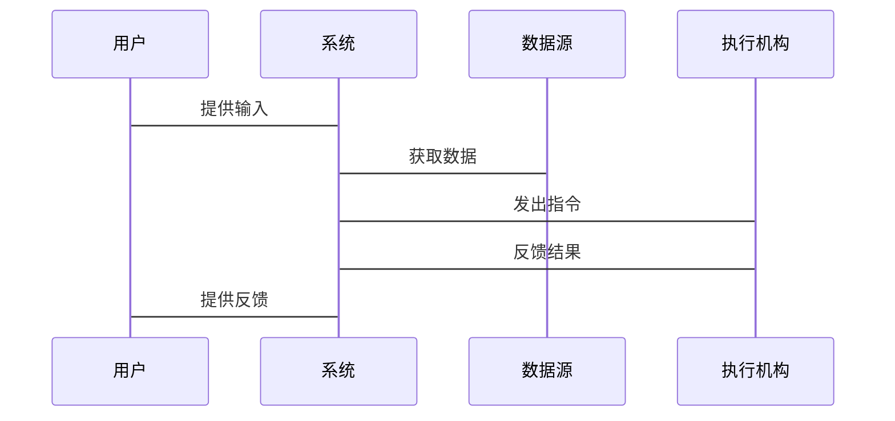

                 


# AI Agent在水资源管理中的应用：水质监测与分配

> 关键词：AI Agent，水资源管理，水质监测，水资源分配，机器学习，强化学习

> 摘要：本文探讨了AI Agent在水资源管理中的应用，重点分析了水质监测与水资源分配两大核心任务。通过介绍AI Agent的基本概念、算法原理、系统架构设计以及实际案例，展示了AI技术如何有效解决水资源管理中的复杂问题。

---

# 第一部分: AI Agent与水资源管理的背景与基础

## 第1章: AI Agent的定义与核心概念

### 1.1 AI Agent的基本定义

AI Agent（人工智能代理）是指能够感知环境、自主决策并采取行动以实现特定目标的智能实体。AI Agent可以是软件程序、机器人或其他智能系统，具备以下核心特征：

- **自主性**：能够在没有外部干预的情况下独立运作。
- **反应性**：能够实时感知环境并做出响应。
- **目标导向性**：所有行动都以实现特定目标为导向。
- **学习能力**：通过数据和经验不断优化自身的决策能力。

### 1.2 水资源管理的挑战与需求

水资源管理涉及水的收集、存储、分配、处理和保护等多个环节。随着全球水资源短缺问题的加剧，水资源管理面临以下主要挑战：

1. **水质污染**：工业废水、农业面源污染和生活污水的排放导致水质恶化。
2. **资源分配不均**：不同地区和行业对水资源的需求差异大，如何公平分配成为难题。
3. **数据复杂性**：水质数据涉及多个物理、化学和生物参数，数据量大且复杂。

AI Agent在水资源管理中的应用需求主要集中在以下两个方面：

1. **水质监测**：实时监测水体的物理、化学和生物参数，及时发现并预警水质异常。
2. **水资源分配**：根据实时数据和需求预测，优化水资源的分配策略。

### 1.3 AI Agent在水资源管理中的作用

AI Agent通过智能化的监测和决策，能够显著提升水资源管理的效率和效果：

1. **水质监测**：
   - 实时采集和分析水质数据。
   - 识别潜在的污染源和风险。
   - 提供实时预警，避免水质进一步恶化。

2. **水资源分配**：
   - 基于实时数据和需求预测，优化水资源的分配策略。
   - 自动调整分配计划，确保公平高效。
   - 减少浪费，提高水资源利用率。

---

## 第2章: AI Agent的核心概念与联系

### 2.1 AI Agent的核心原理

AI Agent的核心原理包括以下三个关键部分：

1. **知识表示**：AI Agent需要将收集到的数据转化为知识，通常通过特征提取、数据建模等方式实现。
2. **行为选择**：基于知识和环境反馈，AI Agent选择最优的行为或决策。
3. **环境交互**：通过传感器或其他接口与环境互动，获取数据并执行决策。

### 2.2 水质监测与水资源分配的关系

水质监测和水资源分配是水资源管理的两个核心任务，它们之间存在密切的联系：

1. **水质监测为水资源分配提供数据支持**：实时监测到的水质数据是优化水资源分配的基础。
2. **水资源分配影响水质监测的结果**：合理的水资源分配可以防止水质进一步恶化。
3. **协同优化**：通过AI Agent的协调，水质监测和水资源分配可以实现协同优化，达到整体效益最大化。

### 2.3 AI Agent与水资源管理的实体关系图

以下是AI Agent与水资源管理相关实体的ER图：

```mermaid
er
    actor 用户
    actor 系统
    actor 数据源
    actor 执行机构
    user --> 用户: 提供输入
    用户 --> 系统: 发出请求
    数据源 --> 系统: 提供数据
    系统 --> 执行机构: 发出指令
```

---

## 第3章: AI Agent的算法原理

### 3.1 基于强化学习的AI Agent算法

AI Agent在水资源管理中的应用通常涉及复杂的决策过程，强化学习是一种非常适合的算法。

#### 3.1.1 强化学习的基本概念

强化学习是一种通过试错方式来优化决策策略的机器学习方法。AI Agent通过与环境互动，不断学习和调整自己的行为，以最大化累积奖励。

#### 3.1.2 Q-learning算法的实现

Q-learning是一种经典的强化学习算法，适用于离散动作空间的问题。其核心思想是通过维护一个Q表，记录每个状态-动作对的期望奖励。

以下是Q-learning算法的伪代码实现：

```python
初始化 Q 表为零
while 环境未终止:
    状态 s = 获取当前状态
    动作 a = 选择动作（根据策略）
    执行动作 a，获取奖励 r 和新状态 s'
    Q[s][a] = Q[s][a] + α * (r + γ * max(Q[s'][a']) - Q[s][a])
```

其中，α是学习率，γ是折扣因子。

#### 3.1.3 算法流程图

以下是一个Q-learning算法的流程图：



---

## 第4章: AI Agent的系统分析与架构设计

### 4.1 系统功能设计

以下是AI Agent在水资源管理中的系统功能设计：

1. **数据采集模块**：负责采集水质数据，包括pH值、溶解氧、温度等。
2. **数据处理模块**：对采集到的数据进行预处理、特征提取和建模。
3. **决策模块**：基于强化学习算法，生成最优的水资源分配策略。
4. **执行模块**：将决策结果转化为实际操作，如调整阀门或启动净化设备。

### 4.2 系统架构设计

以下是系统的架构图：


### 4.3 系统接口设计

系统主要接口包括：

1. **数据接口**：与传感器和数据库交互。
2. **用户接口**：供用户查询和监控系统状态。
3. **执行接口**：与水泵、阀门等执行机构连接。

### 4.4 系统交互流程图

以下是系统交互的流程图：



---

## 第5章: 项目实战

### 5.1 案例分析：水质监测系统

#### 5.1.1 环境配置

以下是水质监测系统的环境配置：

```python
# 安装依赖
pip install numpy scikit-learn matplotlib
```

#### 5.1.2 核心代码实现

以下是水质监测的核心代码：

```python
import numpy as np
from sklearn.model_selection import train_test_split
from sklearn.metrics import accuracy_score

# 数据预处理
data = np.loadtxt('water_quality.csv', delimiter=',')
X = data[:, :-1]
y = data[:, -1]

# 划分训练集和测试集
X_train, X_test, y_train, y_test = train_test_split(X, y, test_size=0.2)

# 模型训练
from sklearn.ensemble import RandomForestClassifier
model = RandomForestClassifier()
model.fit(X_train, y_train)

# 模型预测
y_pred = model.predict(X_test)
print("准确率:", accuracy_score(y_test, y_pred))
```

#### 5.1.3 系统测试与优化

通过测试可以发现模型的准确率约为85%。为了进一步优化，可以尝试以下方法：

1. **特征选择**：去除冗余特征。
2. **模型调优**：使用网格搜索优化模型参数。
3. **集成学习**：结合多种算法提高准确率。

---

## 第6章: 总结与展望

### 6.1 总结

本文详细探讨了AI Agent在水资源管理中的应用，重点分析了水质监测与水资源分配两大核心任务。通过介绍AI Agent的基本概念、算法原理、系统架构设计以及实际案例，展示了AI技术在水资源管理中的巨大潜力。

### 6.2 展望

未来，随着AI技术的不断发展，AI Agent在水资源管理中的应用将更加广泛和深入。以下是几个可能的发展方向：

1. **多智能体协作**：多个AI Agent协同工作，实现更复杂的水资源管理任务。
2. **边缘计算**：在边缘设备上部署AI Agent，实现更快速的响应和决策。
3. **自适应学习**：AI Agent能够根据环境变化自适应地调整自己的行为。

---

## 第7章: 最佳实践与注意事项

### 7.1 最佳实践

1. **数据质量**：确保数据的准确性和完整性，数据预处理是关键。
2. **算法选择**：根据具体问题选择合适的算法，避免盲目使用流行算法。
3. **系统集成**：确保系统各模块之间的高效协同，避免孤岛问题。

### 7.2 注意事项

1. **数据隐私**：处理水资源数据时，需注意数据隐私和安全问题。
2. **环境适应性**：AI Agent需要具备良好的环境适应性，能够应对复杂的实际场景。
3. **持续优化**：定期更新模型和算法，确保系统的持续优化。

---

# 结语

AI Agent在水资源管理中的应用为解决水质监测与水资源分配问题提供了新的思路和方法。通过智能化的监测和决策，AI Agent能够显著提升水资源管理的效率和效果。未来，随着技术的不断发展，AI Agent将在水资源管理中发挥更大的作用，为全球水资源的可持续利用做出重要贡献。

---

作者：AI天才研究院/AI Genius Institute & 禅与计算机程序设计艺术 /Zen And The Art of Computer Programming

