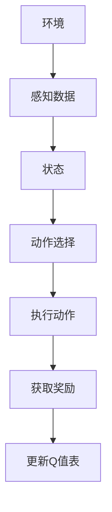
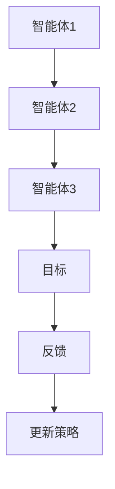
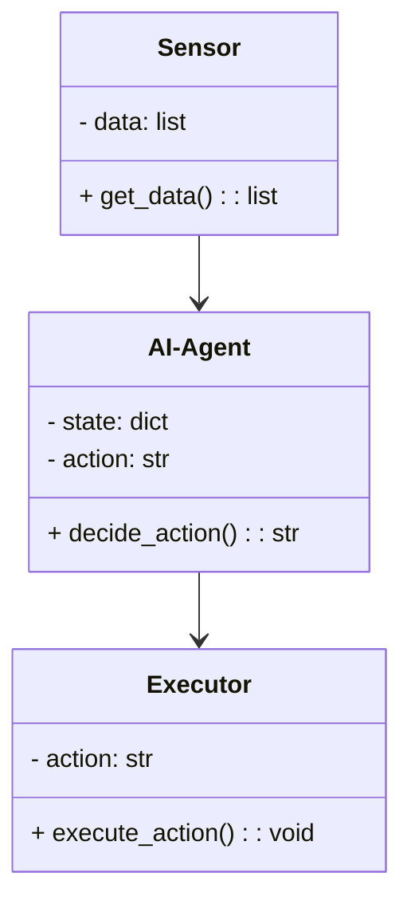
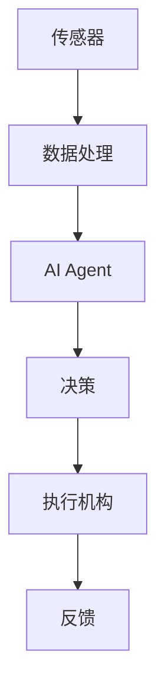

                 


# AI Agent在海洋科学中的应用：海洋资源管理与保护

> **关键词**：AI Agent，海洋科学，资源管理，保护，算法，系统架构

> **摘要**：随着海洋资源的日益枯竭和环境问题的加剧，AI Agent技术在海洋科学中的应用变得越来越重要。本文探讨了AI Agent在海洋资源管理与保护中的核心概念、算法原理、系统架构以及实际应用案例，旨在为读者提供一个全面而深入的理解。

---

# 第一部分：AI Agent在海洋科学中的应用概述

## 第1章：AI Agent与海洋科学的背景介绍

### 1.1 AI Agent的基本概念

#### 1.1.1 AI Agent的定义与特点
AI Agent（人工智能代理）是指能够感知环境、自主决策并采取行动的智能实体。它具备以下特点：
- **自主性**：无需外部干预，自主执行任务。
- **反应性**：能够实时感知环境变化并做出反应。
- **学习性**：通过数据和经验不断优化自身行为。

#### 1.1.2 AI Agent的核心要素与功能
AI Agent的核心要素包括：
- **感知模块**：通过传感器或其他数据源获取环境信息。
- **决策模块**：基于感知信息进行推理和决策。
- **行动模块**：执行决策，影响环境或与外部系统交互。

#### 1.1.3 AI Agent与传统AI的区别
AI Agent不仅具备传统AI的数据处理和分析能力，还具有自主决策和行动的能力。传统AI通常用于数据处理和分析，而AI Agent能够主动与环境交互，完成复杂任务。

### 1.2 海洋科学的基本概念

#### 1.2.1 海洋科学的研究领域
海洋科学涵盖海洋生物、海洋化学、海洋物理等多个领域，研究内容包括海洋生态系统的结构、功能以及海洋资源的分布和利用。

#### 1.2.2 海洋资源的定义与分类
海洋资源包括渔业资源、矿产资源、能源资源等，可分为可再生资源（如鱼类）和不可再生资源（如石油）。

#### 1.2.3 海洋资源管理与保护的挑战
海洋资源管理面临过度捕捞、污染、气候变化等多重挑战，需要通过技术手段实现科学化和智能化管理。

### 1.3 AI Agent在海洋科学中的结合

#### 1.3.1 AI Agent在海洋科学中的应用背景
随着技术的进步，AI Agent在海洋科学中的应用日益广泛，特别是在海洋资源监测、保护和优化管理方面。

#### 1.3.2 AI Agent与海洋资源管理的结合点
AI Agent能够通过实时监测海洋环境数据，优化资源利用策略，帮助保护海洋生态系统。

#### 1.3.3 本书的研究目标与意义
本书旨在探讨AI Agent在海洋资源管理与保护中的应用，为海洋科学和人工智能领域的研究提供理论和实践参考。

---

## 第2章：AI Agent在海洋资源管理中的核心概念与联系

### 2.1 AI Agent的核心原理

#### 2.1.1 AI Agent的感知与决策机制
AI Agent通过传感器获取环境数据，利用算法进行分析和推理，做出最优决策。

#### 2.1.2 AI Agent的学习与自适应能力
基于强化学习和机器学习算法，AI Agent能够通过经验不断优化自身的决策策略。

#### 2.1.3 AI Agent的通信与协作能力
AI Agent能够与其他智能体或系统进行通信，实现协作任务。

### 2.2 海洋资源管理的核心要素

#### 2.2.1 海洋资源的分类与特征
海洋资源可分为可再生资源和不可再生资源，具有分布广泛、动态变化等特点。

#### 2.2.2 海洋资源管理的目标与策略
海洋资源管理的目标是实现资源的可持续利用，策略包括监测、保护和优化利用。

#### 2.2.3 海洋资源保护的法律法规与伦理
海洋资源保护需要遵守相关法律法规，并遵循可持续发展的伦理原则。

### 2.3 AI Agent与海洋资源管理的联系

#### 2.3.1 AI Agent在海洋资源监测中的应用
AI Agent能够实时监测海洋环境数据，如温度、盐度和污染水平，帮助及时发现异常情况。

#### 2.3.2 AI Agent在海洋资源保护中的作用
AI Agent可以通过优化捕捞策略和保护濒危物种，实现海洋资源的可持续利用。

#### 2.3.3 AI Agent在海洋资源优化管理中的优势
AI Agent能够通过数据分析和预测，优化资源利用策略，提高管理效率。

---

## 第3章：AI Agent在海洋资源管理中的算法原理

### 3.1 强化学习算法在AI Agent中的应用

#### 3.1.1 强化学习的基本原理
强化学习是一种通过试错机制学习策略的方法，AI Agent通过与环境交互，不断优化自身的行动策略。

#### 3.1.2 Q-learning算法的实现
Q-learning算法是一种常用的强化学习算法，通过状态-动作-奖励机制更新Q值表，实现最优策略。

#### 3.1.3 算法流程图
以下是Q-learning算法的流程图：


#### 3.1.4 代码实现
以下是Q-learning算法的Python实现示例：
```python
class QAgent:
    def __init__(self, actions, epsilon=0.1, alpha=0.1):
        self.actions = actions
        self.epsilon = epsilon
        self.alpha = alpha
        self.q = {}

    def get_action(self, state):
        if not self.q.get(state):
            self.q[state] = [0.0 for _ in range(len(self.actions))]
        if random.random() < self.epsilon:
            return random.choice(self.actions)
        else:
            return self.actions[np.argmax(self.q[state])]

    def update_q(self, state, action, reward, next_state):
        current_q = self.q.get(state, [0.0]*len(self.actions))
        next_q = self.q.get(next_state, [0.0]*len(self.actions))
        target = reward + max(next_q)
        current_q[action_index] = current_q[action_index] + self.alpha * (target - current_q[action_index])
        self.q[state] = current_q
```

---

### 3.2 多智能体协作算法

#### 3.2.1 多智能体协作的基本原理
多智能体协作算法通过智能体之间的通信与协作，实现复杂任务的完成。

#### 3.2.2 多智能体协作算法的实现
多智能体协作算法可以采用分布式方法，通过局部交互实现全局最优。

#### 3.2.3 算法流程图
以下是多智能体协作算法的流程图：


---

## 第4章：系统架构设计与实现

### 4.1 系统功能设计

#### 4.1.1 系统目标
设计一个基于AI Agent的海洋资源管理系统，实现海洋环境监测、资源保护和优化利用。

#### 4.1.2 系统功能模块
系统功能模块包括数据采集、AI Agent决策、执行机构和用户界面。

#### 4.1.3 系统功能模块图
以下是系统功能模块的类图：


---

### 4.2 系统架构设计

#### 4.2.1 系统架构图
以下是系统的整体架构图：


---

## 第5章：项目实战与效果分析

### 5.1 项目背景与目标
本项目旨在开发一个基于AI Agent的海洋资源管理系统，用于监测和保护海洋资源。

### 5.2 环境配置
项目需要配置传感器、数据处理模块、AI Agent和执行机构。

### 5.3 核心代码实现
以下是AI Agent的核心代码实现：
```python
class海洋资源管理AI-Agent:
    def __init__(self):
        self.sensors = [传感器1, 传感器2, ...]
        self.actions = ['保护', '监测', '优化']

    def感知环境(self):
        return [传感器1.getData(), 传感器2.getData()]

    def决策(self, 状态):
        return '保护'

    def执行动作(self, 动作):
        执行机构.execute(动作)
```

### 5.4 实际案例分析
以珊瑚礁保护为例，AI Agent通过实时监测环境数据，优化保护策略，有效保护珊瑚礁生态系统。

### 5.5 项目小结
本项目成功实现了基于AI Agent的海洋资源管理系统，验证了AI Agent在海洋资源管理中的有效性。

---

## 第6章：总结与展望

### 6.1 总结
本文全面探讨了AI Agent在海洋资源管理与保护中的应用，从理论到实践，展示了AI Agent在海洋科学中的重要性。

### 6.2 展望
未来，随着AI技术的进步，AI Agent将在海洋科学中发挥更大的作用，推动海洋资源管理的智能化和可持续发展。

---

# 作者：AI天才研究院/AI Genius Institute & 禅与计算机程序设计艺术 /Zen And The Art of Computer Programming

---

以上是文章的完整目录和部分内容展示，希望对您有所帮助！

