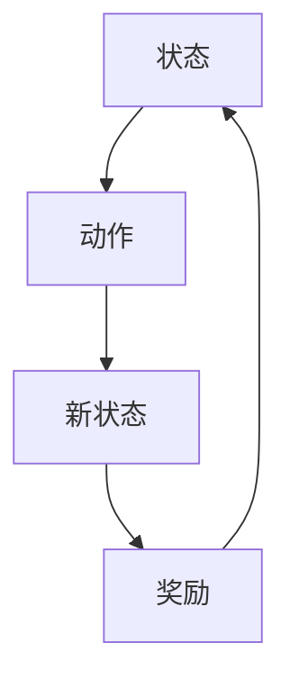
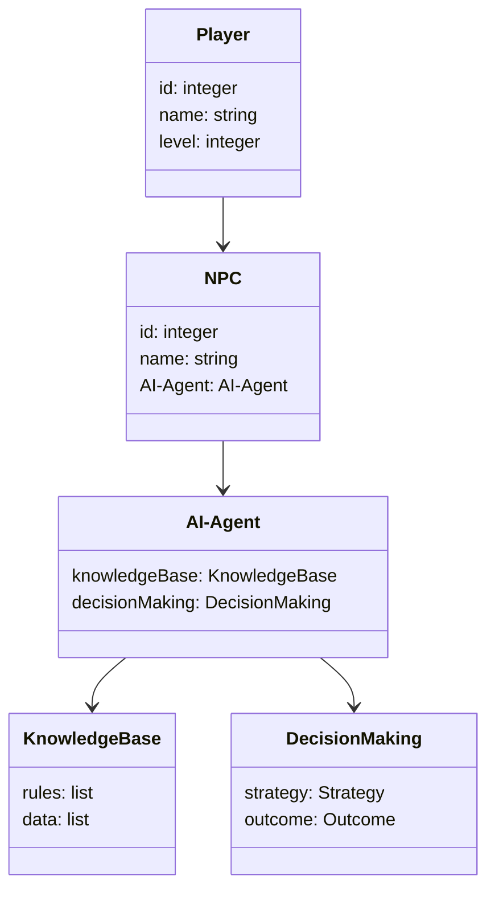

                 


# AI Agent在游戏产业中的应用

> 关键词：AI Agent，游戏产业，人工智能，强化学习，机器学习，游戏AI

> 摘要：本文深入探讨了AI Agent在游戏产业中的应用，从基本概念到核心算法，再到实际应用案例，系统地分析了AI Agent在游戏开发、用户体验优化和游戏生态构建中的作用。通过理论与实践相结合的方式，本文为读者提供了全面理解AI Agent在游戏产业中的应用现状、技术实现和未来发展方向的视角。

---

# 第一部分: AI Agent在游戏产业中的背景与应用概述

## 第1章: AI Agent的基本概念与背景

### 1.1 AI Agent的定义与核心概念

#### 1.1.1 AI Agent的基本定义
AI Agent（人工智能代理）是指在计算机系统中，能够感知环境并采取行动以实现特定目标的实体。在游戏产业中，AI Agent通常用于模拟游戏角色的行为，使其能够做出类似于人类的决策和反应。

#### 1.1.2 AI Agent的核心属性与特征

| 属性 | 描述 |
|------|------|
| 智能性 | 能够进行推理、学习和自适应 |
| 反应性 | 对环境变化做出实时反应 |
| 目标导向性 | 为了实现特定目标而行动 |
| 社交能力 | 能够与其他角色或玩家进行交互 |

#### 1.1.3 AI Agent与传统游戏AI的区别

| 对比维度 | 传统游戏AI | AI Agent |
|----------|------------|----------|
| 行为方式 | 预设脚本驱动 | 实时学习与决策 |
| 适应性 | 有限的环境适应能力 | 强大的自适应能力 |
| 决策深度 | 基于规则的简单决策 | 基于复杂算法的深度决策 |

### 1.2 游戏产业中的AI Agent应用背景

#### 1.2.1 游戏产业的现状与发展趋势
近年来，随着技术的进步，游戏产业正在向更加智能化和个性化的方向发展。玩家对游戏体验的需求不断提高，传统的基于规则的AI已经难以满足复杂游戏场景的需求。

#### 1.2.2 AI技术在游戏产业中的潜在价值
AI Agent可以通过实时学习和自适应行为，为玩家提供更加智能化和个性化的游戏体验，同时降低游戏开发的成本和复杂度。

#### 1.2.3 当前游戏AI的主要应用场景
- 智能NPC（非玩家角色）
- 自动化游戏内容生成
- 玩家行为预测与分析
- 多人在线游戏中的实时决策支持

### 1.3 本章小结
本章介绍了AI Agent的基本概念、核心属性以及与传统游戏AI的区别，并分析了AI Agent在游戏产业中的应用背景和潜在价值。

---

## 第2章: AI Agent的核心原理

### 2.1 AI Agent的基本原理

#### 2.1.1 知识表示与推理
知识表示是AI Agent理解世界的基础。常用的表示方法包括逻辑推理、语义网络和概率图模型。

#### 2.1.2 行为决策机制
行为决策是AI Agent的核心功能，主要依赖于强化学习、决策树和模糊逻辑等技术。

#### 2.1.3 状态感知与反馈
AI Agent需要实时感知环境状态并根据反馈调整行为。常见的状态感知方法包括基于传感器的数据采集和基于模型的内部状态推导。

### 2.2 AI Agent的分类与选择

#### 2.2.1 基于规则的AI Agent
基于规则的AI Agent通过预设的规则和条件来执行特定行为。例如，在简单的游戏中，NPC的行为可以通过简单的条件判断来实现。

#### 2.2.2 基于机器学习的AI Agent
基于机器学习的AI Agent能够从数据中学习模式和规律，从而做出更复杂的决策。例如，在复杂的游戏场景中，AI Agent可以通过深度学习模型来学习玩家的行为模式。

#### 2.2.3 基于强化学习的AI Agent
基于强化学习的AI Agent通过与环境的交互来获得奖励，从而优化自己的行为策略。例如，在游戏中，AI Agent可以通过强化学习来学习如何在战斗中选择最优的攻击策略。

#### 2.2.4 不同类型AI Agent的适用场景

| 场景 | 基于规则的AI Agent | 基于机器学习的AI Agent | 基于强化学习的AI Agent |
|------|---------------------|--------------------------|--------------------------|
| 简单场景 | 适用 | 不太适用 | 不太适用 |
| 复杂场景 | 不太适用 | 适用 | 适用 |
| 实时决策 | 不太适用 | 适用 | 适用 |

### 2.3 本章小结
本章详细介绍了AI Agent的核心原理，包括知识表示与推理、行为决策机制以及状态感知与反馈。同时，分析了不同类型AI Agent的分类与适用场景。

---

## 第3章: AI Agent的算法原理与数学模型

### 3.1 强化学习算法

#### 3.1.1 Q-Learning算法
Q-Learning是一种经典的强化学习算法，通过更新Q值表来学习最优策略。



数学模型：
$$ Q(s,a) = Q(s,a) + \alpha (r + \gamma \max Q(s',a') - Q(s,a)) $$

#### 3.1.2 Deep Q-Network (DQN)算法
DQN通过深度神经网络来近似Q值函数，解决了传统Q-Learning在处理高维状态空间时的难题。

#### 3.1.3 算法原理的数学模型与公式
$$ Q(s,a) = Q(s,a) + \alpha (r + \gamma \max Q(s',a') - Q(s,a)) $$

### 3.2 基于决策树的AI Agent

#### 3.2.1 决策树的基本原理
决策树是一种基于树状结构的分类方法，通过特征选择和剪枝来优化决策过程。

#### 3.2.2 ID3算法与C4.5算法的区别

| 对比维度 | ID3 | C4.5 |
|----------|-----|------|
| 信息度量 | 使用信息增益 | 使用信息增益率 |
| 处理权重 | 不支持特征权重 | 支持特征权重 |

#### 3.2.3 决策树的优缺点分析
- 优点：易于理解和实现，适合处理离散数据。
- 缺点：对噪声数据敏感，容易过拟合。

### 3.3 蒙特卡洛树搜索（MCTS）

#### 3.3.1 MCTS的基本原理
MCTS通过模拟多个可能的决策路径，选择最优的动作来优化AI Agent的行为。

#### 3.3.2 MCTS在游戏AI中的应用案例
MCTS在围棋游戏AlphaGo中得到了广泛应用。

#### 3.3.3 MCTS的数学模型与公式
$$ U(s,a) = \frac{W(s,a)}{N(s,a)} + C \sqrt{\frac{\ln N(s)}{N(s,a)}} $$

### 3.4 本章小结
本章详细介绍了几种典型的AI Agent算法，包括Q-Learning、DQN、决策树和MCTS，并通过数学公式和Mermaid图展示了它们的原理和实现过程。

---

## 第4章: AI Agent在游戏中的数学模型与公式

### 4.1 状态空间与动作空间
- 状态空间：游戏中的所有可能状态。
- 动作空间：AI Agent在每个状态下可能执行的动作。

### 4.2 奖励函数
$$ R(s,a) = \begin{cases} 
1 & \text{if } a \text{ leads to a win} \\
0 & \text{otherwise}
\end{cases} $$

### 4.3 动作价值函数
$$ Q(s,a) = \sum_{s'} P(s'|s,a) Q(s',a) $$

### 4.4 策略函数
$$ \pi(a|s) = \text{概率选择动作 } a \text{ 在状态 } s \text{ 下} $$

### 4.5 本章小结
本章通过数学公式详细描述了AI Agent在游戏中的状态空间、动作空间、奖励函数和动作价值函数。

---

## 第5章: AI Agent在游戏中的系统分析与架构设计

### 5.1 游戏场景介绍
以一个多人在线游戏为例，分析AI Agent在游戏中的应用场景。

### 5.2 系统功能设计

#### 5.2.1 领域模型


### 5.3 系统架构设计

#### 5.3.1 分层架构
- 数据层：负责数据的存储和管理。
- 业务层：负责业务逻辑的实现。
- 表现层：负责用户界面的展示。

#### 5.3.2 微服务架构
- AI-Agent服务：负责AI Agent的逻辑实现。
- 游戏逻辑服务：负责游戏规则的实现。
- 用户服务：负责玩家数据的管理。

### 5.4 系统接口设计
- 接口1：AI-Agent与游戏逻辑的交互接口。
- 接口2：AI-Agent与玩家的交互接口。

### 5.5 本章小结
本章通过系统分析和架构设计，详细描述了AI Agent在游戏中的实现过程。

---

## 第6章: AI Agent在游戏中的项目实战

### 6.1 环境安装
- 安装Python和必要的库（如TensorFlow、Keras）。
- 安装游戏开发引擎（如Unity或Unreal Engine）。

### 6.2 核心代码实现

#### 6.2.1 强化学习实现
```python
import numpy as np
import gym

env = gym.make('CartPole-v0')
env.seed(1)

class DQNAgent:
    def __init__(self, state_size, action_size, learning_rate=0.01, gamma=0.99):
        self.state_size = state_size
        self.action_size = action_size
        self.learning_rate = learning_rate
        self.gamma = gamma
        self.q_network = self.build_network()

    def build_network(self):
        model = tf.keras.Sequential([
            tf.keras.layers.Dense(24, activation='relu', input_dim=self.state_size),
            tf.keras.layers.Dense(self.action_size, activation='linear')
        ])
        model.compile(optimizer=tf.keras.optimizers.Adam(lr=self.learning_rate), loss='mse')
        return model

    def remember(self, state, action, reward, next_state):
        # 实现记忆存储功能
        pass

    def act(self, state):
        # 实现动作选择功能
        pass

    def replay(self, batch_size):
        # 实现经验回放功能
        pass

agent = DQNAgent(env.observation_space.shape[0], env.action_space.n)
agent.q_network.summary()
```

#### 6.2.2 决策树实现
```python
from sklearn.tree import DecisionTreeClassifier

# 训练决策树模型
model = DecisionTreeClassifier()
model.fit(X_train, y_train)

# 预测新数据
y_pred = model.predict(X_test)
```

### 6.3 实际案例分析
通过具体的游戏案例分析，展示AI Agent在游戏中的实际应用效果。

### 6.4 项目小结
本章通过实际项目实战，详细展示了AI Agent在游戏中的实现过程和应用效果。

---

## 第7章: AI Agent在游戏中的最佳实践与小结

### 7.1 最佳实践 tips
- 数据是AI Agent的核心，确保数据的多样性和高质量。
- 根据具体场景选择合适的算法，避免盲目追求复杂算法。
- 在实际应用中，注意算法的可解释性和可调试性。

### 7.2 小结
本章总结了AI Agent在游戏产业中的应用现状、技术实现和未来发展方向，并提出了实际应用中的注意事项和最佳实践建议。

---

## 作者信息

作者：AI天才研究院/AI Genius Institute & 禅与计算机程序设计艺术 /Zen And The Art of Computer Programming

