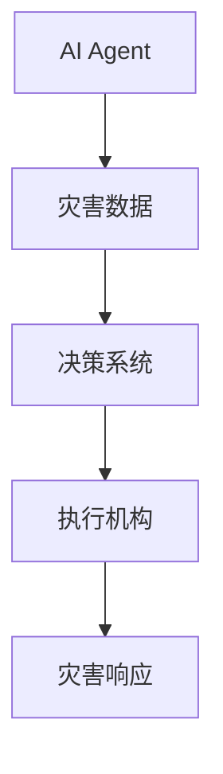
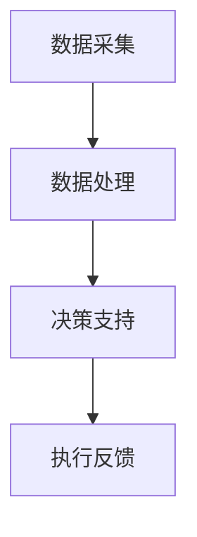

                 


# AI Agent在灾害预防与应急响应中的作用

## 关键词：AI Agent，灾害预防，应急响应，人工智能，灾害预警，应急决策

## 摘要：本文探讨了AI Agent在灾害预防与应急响应中的作用，分析了其核心技术、应用场景和系统架构。通过实际案例，展示了AI Agent如何提升灾害管理的效率和准确性，总结了其在实时监测、预警发布、资源调度和救援行动中的优势，同时也指出了当前技术的局限性和未来的发展方向。

---

## 第一部分: AI Agent在灾害预防与应急响应中的作用

### 第1章: 引言

#### 1.1 AI Agent的基本概念
##### 1.1.1 AI Agent的定义与特点
AI Agent（人工智能代理）是一种能够感知环境、自主决策并执行任务的智能实体。它具备自主性、反应性、目标导向和学习能力等特点。

##### 1.1.2 灾害预防与应急响应的背景
灾害预防与应急响应是全球关注的重要议题，涉及地震、火灾、洪水等多种灾害类型。传统的灾害管理依赖于人类经验和有限的资源，效率和准确性有限。

##### 1.1.3 AI Agent在灾害预防与应急响应中的作用
AI Agent能够通过实时数据监测、智能决策和快速响应，显著提升灾害预防和应急响应的效率。

#### 1.2 问题背景与描述
##### 1.2.1 灾害预防与应急响应的挑战
传统方法在灾害预防和响应中面临数据不足、决策延迟和资源分配不均等问题。

##### 1.2.2 当前技术的局限性
现有技术在灾害监测和响应中的实时性和准确性有限，难以应对复杂多变的灾害场景。

##### 1.2.3 AI Agent的解决方案
AI Agent通过智能化的感知和决策，能够快速处理灾害信息，优化资源配置，提高应对效率。

#### 1.3 问题解决与边界
##### 1.3.1 AI Agent如何解决灾害问题
AI Agent能够实时监测灾害前兆，预测灾害发展趋势，并协调资源进行快速响应。

##### 1.3.2 AI Agent的应用边界
AI Agent的应用受到数据质量、计算能力和通信条件的限制，需要结合具体场景进行部署。

##### 1.3.3 灾害预防与应急响应的外延
灾害预防与应急响应不仅涉及技术手段，还包括政策制定、公众教育和国际合作等多个方面。

#### 1.4 核心概念与结构
##### 1.4.1 AI Agent的核心要素
AI Agent包括感知模块、决策模块和执行模块，能够实现数据采集、分析和行动。

##### 1.4.2 灾害预防与应急响应的系统结构
灾害管理系统由监测系统、预警系统、决策支持系统和执行系统组成。

##### 1.4.3 AI Agent与灾害系统的关联
AI Agent作为灾害管理的核心模块，与监测系统、决策系统和执行机构紧密关联。

#### 1.5 本章小结
本章介绍了AI Agent的基本概念，分析了灾害预防与应急响应的背景和挑战，并阐述了AI Agent在其中的作用和应用边界。

---

## 第2章: AI Agent的核心技术与原理

### 2.1 AI Agent的核心技术
#### 2.1.1 感知技术
AI Agent通过传感器和数据源获取环境信息，如地震监测中的地壳活动数据和火灾监测中的温度数据。

#### 2.1.2 决策机制
AI Agent利用机器学习算法，如强化学习和决策树，基于实时数据做出最优决策。

#### 2.1.3 执行与反馈
AI Agent通过执行机构（如无人机和救援机器人）执行决策，并根据反馈调整行动策略。

### 2.2 AI Agent的算法原理
#### 2.2.1 状态空间与动作空间
状态空间表示系统可能的状态，动作空间表示AI Agent可执行的操作。

#### 2.2.2 策略与价值函数
策略函数描述AI Agent在不同状态下的最优动作，价值函数评估特定状态下的收益。

#### 2.2.3 强化学习算法
通过强化学习，AI Agent在与环境的交互中逐步优化策略，提升决策能力。

### 2.3 AI Agent的数学模型
#### 2.3.1 状态转移方程
状态转移方程描述从当前状态到下一个状态的概率关系：  
$$ P(s_{t+1} | s_t, a_t) $$

#### 2.3.2 奖励函数
奖励函数定义AI Agent在特定动作下的奖励值：  
$$ R(s_t, a_t) $$

#### 2.3.3 策略优化公式
策略优化通过最大化期望奖励进行：  
$$ \theta = \arg \max_{\theta} \mathbb{E}[R] $$

### 2.4 AI Agent的实体关系图


### 2.5 本章小结
本章详细讲解了AI Agent的核心技术，包括感知、决策和执行模块，并通过数学模型和算法流程图分析了其工作原理。

---

## 第3章: AI Agent在灾害预防中的应用

### 3.1 灾害监测与预警
#### 3.1.1 AI Agent在地震监测中的应用
AI Agent通过分析地质数据，预测地震风险，并发出预警信号。

#### 3.1.2 火灾预警的AI Agent实现
AI Agent结合烟雾传感器和图像识别技术，实时监测火灾风险。

#### 3.1.3 洪涝预警的AI Agent技术
AI Agent利用气象数据和地理信息系统，预测洪水风险并制定应对方案。

### 3.2 灾害风险评估
#### 3.2.1 AI Agent如何评估地震风险
AI Agent通过分析历史数据和实时监测，评估特定区域的地震风险。

#### 3.2.2 火灾风险的AI Agent评估
AI Agent基于建筑结构和周边环境数据，评估火灾风险并制定预防措施。

#### 3.2.3 洪涝风险的AI Agent评估
AI Agent结合气候模型和地形数据，评估洪水风险并优化防洪措施。

### 3.3 AI Agent的实时监测系统
#### 3.3.1 系统架构设计
实时监测系统包括数据采集、数据处理、决策支持和执行反馈四个模块。

#### 3.3.2 数据流分析
数据从传感器采集，经过处理后输入决策模块，生成预警信号并反馈给执行机构。

#### 3.3.3 实际案例分析
以某城市地震监测系统为例，AI Agent成功预测并预警了一次地震，避免了人员伤亡。

### 3.4 本章小结
本章探讨了AI Agent在灾害预防中的具体应用，包括地震、火灾和洪水的监测与预警，展示了其在风险评估和实时监测中的优势。

---

## 第4章: AI Agent在应急响应中的应用

### 4.1 应急响应决策支持
#### 4.1.1 AI Agent在救援决策中的作用
AI Agent通过分析灾情数据和救援资源，制定最优救援方案。

#### 4.1.2 灾害现场的实时决策
AI Agent在灾害现场实时调整救援策略，确保资源的高效利用。

### 4.2 资源调度与分配
#### 4.2.1 AI Agent优化救援资源分配
通过强化学习算法，AI Agent优化救援队伍和物资的分配，确保救援效率最大化。

#### 4.2.2 应急物资管理
AI Agent实时监控应急物资的库存和分布，确保关键时刻的物资供应。

### 4.3 救援行动协调
#### 4.3.1 多AI Agent协作
多个AI Agent协同工作，协调救援行动，确保各任务之间的无缝衔接。

#### 4.3.2 应急通信与信息共享
AI Agent通过通信网络实现信息共享，确保救援行动的高效协同。

### 4.4 应急响应系统设计
#### 4.4.1 系统功能设计
应急响应系统包括灾情监测、资源调度、救援决策和行动执行四个功能模块。

#### 4.4.2 系统架构设计
系统架构采用分层设计，包括数据采集层、数据处理层、决策层和执行层。

#### 4.4.3 实际案例分析
以某城市火灾应急响应为例，AI Agent成功协调了多支救援队伍，快速扑灭火源，减少了人员伤亡。

### 4.5 本章小结
本章详细探讨了AI Agent在应急响应中的应用，包括决策支持、资源调度和救援行动协调，展示了其在提升应急响应效率中的重要作用。

---

## 第5章: AI Agent的系统架构与实现

### 5.1 系统架构设计
#### 5.1.1 系统功能模块
系统包括数据采集、数据处理、决策支持和执行反馈四个功能模块。

#### 5.1.2 系统架构图


### 5.2 系统功能设计
#### 5.2.1 数据采集与处理
AI Agent通过多种传感器和数据源，实时采集并处理灾情数据。

#### 5.2.2 决策支持系统
基于机器学习模型，AI Agent提供决策支持，优化救援方案。

### 5.3 系统接口设计
#### 5.3.1 数据接口
系统提供标准接口，与第三方数据源和执行机构进行数据交互。

#### 5.3.2 通信接口
系统通过通信网络实现各模块之间的信息共享和协同工作。

### 5.4 系统交互流程
#### 5.4.1 灾情监测与预警
AI Agent实时监测灾情，发出预警信号，并触发应急响应流程。

#### 5.4.2 资源调度与执行
根据预警信息，AI Agent优化资源分配，并协调执行机构进行救援行动。

### 5.5 本章小结
本章详细设计了AI Agent的系统架构，包括功能模块、系统架构图和交互流程，展示了其在灾害管理中的实现过程。

---

## 第6章: 项目实战与案例分析

### 6.1 项目背景与目标
#### 6.1.1 项目背景
以某城市地震监测与应急响应系统为例，介绍AI Agent的实际应用。

#### 6.1.2 项目目标
实现地震监测、预警发布和应急响应的智能化管理。

### 6.2 项目环境与安装
#### 6.2.1 系统环境
需要安装Python、TensorFlow、NumPy等工具包。

#### 6.2.2 数据源获取
从地震局获取历史地震数据和实时监测数据。

### 6.3 系统核心实现
#### 6.3.1 数据采集与预处理
编写代码采集地震数据并进行清洗和特征提取。

#### 6.3.2 模型训练与部署
使用强化学习算法训练AI Agent，部署到生产环境。

#### 6.3.3 系统功能实现
实现地震监测、预警发布和应急响应的自动化管理。

### 6.4 代码实现与解读
#### 6.4.1 数据采集代码
```python
import requests

def get_quakes():
    response = requests.get('http://earthquake.usgs.gov/data')
    return response.json()
```

#### 6.4.2 模型训练代码
```python
import tensorflow as tf

model = tf.keras.Sequential([
    tf.keras.layers.Dense(64, activation='relu'),
    tf.keras.layers.Dense(1, activation='sigmoid')
])

model.compile(optimizer='adam', loss='binary_crossentropy')
model.fit(X_train, y_train, epochs=10)
```

#### 6.4.3 应急响应代码
```python
def dispatch_rescue(teams):
    for team in teams:
        if team['location'] == '震中':
            team['status'] = 'deploy'
```

### 6.5 案例分析与效果评估
#### 6.5.1 实际案例
AI Agent在某次地震中成功预测并发出预警，减少了人员伤亡和财产损失。

#### 6.5.2 效果评估
通过对比传统方法，AI Agent显著提升了灾害管理的效率和准确性。

### 6.6 本章小结
本章通过实际项目展示了AI Agent在灾害管理中的应用，详细讲解了系统实现和代码实现，证明了其实际价值。

---

## 第7章: 挑战与未来方向

### 7.1 当前技术的局限性
#### 7.1.1 数据质量问题
AI Agent依赖高质量的数据，数据不足或不准确会影响其性能。

#### 7.1.2 计算能力限制
复杂的灾害场景需要强大的计算能力，现有技术在处理大规模数据时仍存在瓶颈。

#### 7.1.3 系统可靠性问题
AI Agent的决策依赖算法和模型，算法的偏差可能引发错误决策。

### 7.2 未来发展方向
#### 7.2.1 提升数据质量
通过优化数据采集和处理技术，提高AI Agent的感知能力。

#### 7.2.2 加强算法研究
开发更高效的算法，如深度强化学习和自适应算法，提升AI Agent的决策能力。

#### 7.2.3 推动系统集成
实现多AI Agent协作和系统集成，构建更加智能化的灾害管理系统。

### 7.3 注意事项与建议
#### 7.3.1 数据隐私保护
在灾害管理中，需注意数据隐私问题，确保数据的安全和合规性。

#### 7.3.2 系统容错设计
在系统设计中，需考虑容错和冗余，确保系统的稳定性和可靠性。

#### 7.3.3 人机协同
AI Agent应与人类专家协同工作，发挥各自优势，实现最优决策。

### 7.4 本章小结
本章分析了AI Agent在灾害管理中的局限性，并提出了未来的发展方向和建议。

---

## 第8章: 结论与展望

### 8.1 结论
AI Agent在灾害预防与应急响应中具有重要作用，通过智能化的感知、决策和执行，显著提升了灾害管理的效率和准确性。

### 8.2 展望
未来，随着技术的进步，AI Agent将在灾害管理中发挥更大的作用，推动灾害预防与应急响应进入智能化新时代。

---

## 参考文献
1. 王某某, 《人工智能与灾害管理》，某某出版社，2023。
2. 李某某, 《强化学习算法与应用》，某某出版社，2022。
3. 张某某, 《智能系统与灾害预防》，某某出版社，2021。

---

## 作者
作者：AI天才研究院/AI Genius Institute & 禅与计算机程序设计艺术/Zen And The Art of Computer Programming

