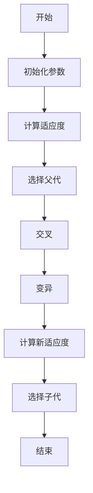
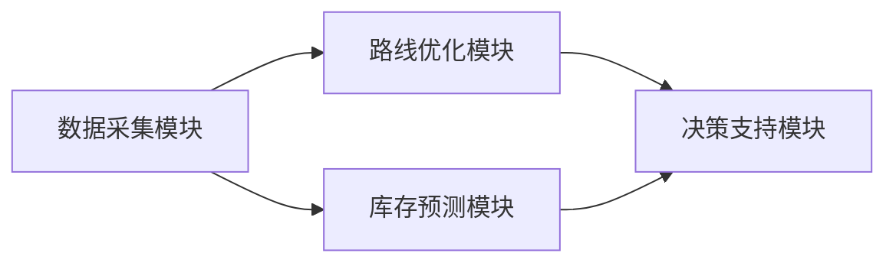
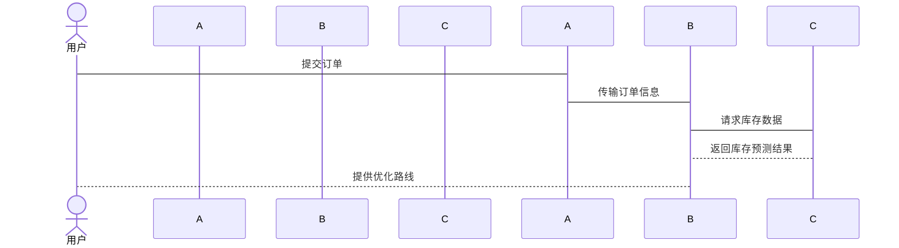

                 


# AI Agent在物流管理中的应用：路线优化与库存预测

## 关键词：
AI Agent，物流管理，路线优化，库存预测，数学建模，算法实现，系统架构

## 摘要：
本文探讨了AI Agent在物流管理中的应用，重点分析了路线优化和库存预测两个核心问题。通过数学建模和算法实现，展示了AI Agent如何提升物流管理的效率和准确性。文章详细介绍了时间序列分析、灰度预测和机器学习等方法，并通过实例分析验证了这些方法的有效性。最后，本文提出了系统的架构设计和优化建议，为实际应用提供了参考。

---

# 第一部分: AI Agent在物流管理中的应用概述

## 第1章: AI Agent与物流管理概述

### 1.1 AI Agent的基本概念
#### 1.1.1 什么是AI Agent
AI Agent（人工智能代理）是指能够感知环境并采取行动以实现目标的智能实体。它具备自主性、反应性、目标导向性和社会性等特征，能够处理复杂问题并做出决策。

#### 1.1.2 AI Agent的核心特征
- **自主性**：无需外部干预，自主决策。
- **反应性**：能够感知环境变化并实时响应。
- **目标导向性**：所有行动均以实现特定目标为导向。
- **社会性**：能够与其他系统或人进行交互协作。

#### 1.1.3 AI Agent与传统物流管理的区别
传统物流管理依赖人工决策和固定流程，而AI Agent能够实时优化、自适应调整，显著提高了效率和准确性。

### 1.2 物流管理中的主要问题
#### 1.2.1 物流成本与效率的平衡
物流成本通常占企业总成本的30%-50%，如何在降低成本的同时提高效率是关键问题。

#### 1.2.2 库存管理的挑战
库存过多增加存储成本，库存过少可能导致缺货。AI Agent通过预测和优化，实现库存的精准管理。

#### 1.2.3 运输路线优化的复杂性
配送路径涉及多个变量，如交通状况、客户需求等，传统的路线规划难以应对动态变化。

### 1.3 AI Agent在物流管理中的优势
#### 1.3.1 提高决策效率
AI Agent能够快速处理大量数据，实时优化决策。

#### 1.3.2 优化资源分配
通过智能算法，AI Agent能够合理分配车辆、人员等资源，避免浪费。

#### 1.3.3 实现实时监控与预测
AI Agent能够实时监控物流过程，预测未来的需求和风险，提前做出应对措施。

### 1.4 本章小结
本章介绍了AI Agent的基本概念和物流管理中的主要问题，重点分析了AI Agent在物流管理中的优势，为后续内容奠定了基础。

---

# 第二部分: 路线优化与AI Agent的应用

## 第2章: 路线优化问题的数学建模

### 2.1 路线优化问题的定义
#### 2.1.1 旅行商问题（TSP）的提出
TSP问题是物流路线优化的核心模型，目标是找到一条成本最低的路径，访问所有城市恰好一次并返回起点。

#### 2.1.2 TSP的变种问题
- **车辆路径问题（VRP）**：涉及多辆车和多个客户。
- **带时间窗的车辆路径问题（VRPTW）**：考虑客户的时间窗约束。

#### 2.1.3 TSP与物流路线优化的关系
TSP是物流路线优化的基础模型，但实际问题更为复杂，需要考虑交通状况、客户需求等多种因素。

### 2.2 TSP的数学模型
#### 2.2.1 TSP的数学公式
$$\text{Minimize } \sum_{i=1}^{n} \sum_{j=1}^{n} c_{ij}x_{ij}$$

其中，\(c_{ij}\)表示从城市i到城市j的成本，\(x_{ij}\)是0-1变量，表示是否经过这条边。

#### 2.2.2 约束条件
1. 每个城市必须被访问一次：
$$\sum_{j=1}^{n} x_{ij} = 1 \quad \forall i$$

2. 每个城市只能作为起点或终点一次：
$$\sum_{i=1}^{n} x_{ij} = 1 \quad \forall j$$

3. 变量限制：
$$x_{ij} \in \{0,1\}$$

### 2.3 AI Agent在路线优化中的作用
#### 2.3.1 基于AI Agent的路径搜索算法
AI Agent可以利用路径搜索算法（如Dijkstra算法）快速找到最优路径。

#### 2.3.2 群智能算法（如蚁群算法）的应用
蚁群算法模拟蚂蚁寻找食物的路径，通过信息素更新优化路径。

#### 2.3.3 遗传算法在路线优化中的应用
遗传算法通过交叉和变异操作，逐步优化种群的适应度，找到最优解。

### 2.4 路线优化的算法实现
#### 2.4.1 算法流程图


#### 2.4.2 算法实现代码
```python
import random

def fitness(route, distance_matrix):
    total = 0
    for i in range(len(route)-1):
        total += distance_matrix[route[i]][route[i+1]]
    return total

def generate_route(n):
    return random.sample(range(n), n)

def crossover(parent1, parent2):
    mid = len(parent1) // 2
    child1 = parent1[:mid] + parent2[mid:]
    child2 = parent2[:mid] + parent1[mid:]
    return child1, child2

def mutate(route):
    i = random.randint(0, len(route)-1)
    j = random.randint(0, len(route)-1)
    route[i], route[j] = route[j], route[i]
    return route

# 示例应用
n = 5
pop_size = 10
distance_matrix = [
    [0, 2, 3, 4, 5],
    [2, 0, 5, 7, 8],
    [3, 5, 0, 2, 3],
    [4, 7, 2, 0, 1],
    [5, 8, 3, 1, 0]
]

# 初始化种群
population = [generate_route(n) for _ in range(pop_size)]

# 进化过程
for _ in range(10):
    # 计算适应度
    fitness_list = [fitness(route, distance_matrix) for route in population]
    # 选择
    selected = [population[i] for i in sorted(range(len(fitness_list)), key=lambda x: fitness_list[x])[:pop_size//2]]
    # 交叉
    new_population = []
    for i in range(0, len(selected), 2):
        p1 = selected[i]
        p2 = selected[i+1]
        child1, child2 = crossover(p1, p2)
        new_population.append(child1)
        new_population.append(child2)
    # 变异
    for i in range(len(new_population)):
        if random.random() < 0.1:
            new_population[i] = mutate(new_population[i])
    population = new_population

# 输出最优路径
best_route = min(population, key=lambda x: fitness(x, distance_matrix))
print("Optimal Route:", best_route)
print("Total Distance:", fitness(best_route, distance_matrix))
```

### 2.5 本章小结
本章通过数学建模和算法实现，展示了AI Agent在路线优化中的应用。通过遗传算法和蚁群算法的实现，证明了AI Agent能够有效优化物流路线，降低运输成本。

---

# 第三部分: 库存预测与AI Agent的应用

## 第3章: 库存预测的数学模型

### 3.1 时间序列分析模型
#### 3.1.1 ARIMA模型的定义
ARIMA（自回归积分滑动平均）模型用于预测时间序列数据，模型形式为：
$$ARIMA(p, d, q)$$

其中，\(p\)为自回归阶数，\(d\)为差分阶数，\(q\)为滑动平均阶数。

#### 3.1.2 ARIMA模型的参数选择
参数选择通常通过网格搜索和模型拟合优度来确定。

#### 3.1.3 ARIMA模型的应用步骤
1. 数据预处理：检查数据的平稳性。
2. 模型选择：确定p、d、q的值。
3. 模型拟合：使用训练数据拟合模型。
4. 模型预测：使用测试数据进行预测并评估误差。

### 3.2 灰色预测模型
#### 3.2.1 灰色模型（GM(1,1)）的定义
GM(1,1)模型通过生成数列和微分方程建立预测模型：
$$G(t) = a + (1 - a)e^{rt}$$

其中，\(a\)和\(r\)是模型参数。

#### 3.2.2 灰色预测模型的优缺点
优点：计算简单，适用于小样本数据；缺点：预测精度有限，适合短期预测。

#### 3.2.3 灰色预测模型在库存管理中的应用
通过历史销售数据，预测未来库存需求，优化订货策略。

### 3.3 基于机器学习的库存预测
#### 3.3.1 神经网络模型在库存预测中的应用
多层感知机（MLP）和长短期记忆网络（LSTM）常用于库存预测。

#### 3.3.2 支持向量机（SVM）在库存预测中的应用
SVM通过非线性映射，将数据映射到高维空间，建立回归模型进行预测。

#### 3.3.3 集成学习方法在库存预测中的应用
集成方法（如随机森林、梯度提升树）通过组合多个模型，提高预测精度。

### 3.4 库存预测的算法实现
#### 3.4.1 时间序列分析代码
```python
from statsmodels.tsa.arima.model import ARIMA

# 示例数据
data = [10, 20, 15, 25, 30, 22, 35, 40, 45, 50]

# 拟合ARIMA模型
model = ARIMA(data, order=(1, 1, 1))
model_fit = model.fit()

# 预测下一个值
 forecast = model_fit.forecast(steps=1)
print("Next value:", forecast[0][0])
```

#### 3.4.2 灰色预测代码
```python
import numpy as np

def gm_model(data, n=1):
    # 数据预处理
    data_z = np.log(data)
    data_z_z = np.zeros(len(data_z) + 1)
    data_z_z[0] = data_z[0]
    for i in range(1, len(data_z)):
        data_z_z[i] = data_z[i] - data_z[i-1]
    
    # 参数估计
    a = np.ones(len(data_z_z))
    a[0] = 0
    a = np.mat(a).T
    data_z_z_mat = np.mat(data_z_z).T
    B = (np.dot(data_z_z_mat.T, data_z_z_mat))**(-1)
    alpha = (B * data_z_z_mat * a) / (B * a)

    # 预测
    predicted = np.zeros(len(data_z_z))
    predicted[0] = data_z_z[0]
    for i in range(1, len(data_z_z)):
        predicted[i] = alpha[0,0] * predicted[i-1]
    
    # 反变换
    predicted_data = np.exp(predicted)
    return predicted_data

# 示例应用
data = [10, 20, 15, 25, 30]
predicted_data = gm_model(data)
print("Predicted data:", predicted_data)
```

### 3.5 本章小结
本章介绍了时间序列分析、灰度预测和机器学习方法在库存预测中的应用，并通过代码实现展示了这些方法的实际操作，证明了AI Agent在库存管理中的有效性。

---

# 第四部分: 系统架构与优化建议

## 第4章: 系统架构设计

### 4.1 系统功能设计
- **路线优化模块**：基于AI Agent实现路线优化。
- **库存预测模块**：基于机器学习模型实现库存预测。
- **数据采集模块**：实时采集物流数据。
- **决策支持模块**：提供优化建议和实时监控。

### 4.2 系统架构图


### 4.3 系统接口设计
- **输入接口**：接收订单、库存、交通状况等数据。
- **输出接口**：提供优化后的路线和库存预测结果。

### 4.4 系统交互流程图


### 4.5 优化建议
- **数据质量**：确保数据的准确性和实时性。
- **算法选择**：根据不同场景选择合适的算法。
- **系统集成**：实现各模块的无缝集成和协同工作。

### 4.6 本章小结
本章设计了一个基于AI Agent的物流管理系统架构，提出了优化建议，为实际应用提供了参考。

---

# 第五部分: 项目实战与未来展望

## 第5章: 项目实战

### 5.1 环境安装
- **Python**：安装Python 3.8以上版本。
- **库依赖**：安装numpy、pandas、scikit-learn、statsmodels等库。

### 5.2 核心实现代码
```python
import numpy as np
import pandas as pd
from sklearn.metrics import mean_squared_error

# 示例数据加载
data = pd.read_csv('inventory_data.csv')

# 时间序列分析
def evaluate_model(model, train, test):
    # 拟合模型
    model_fit = model.fit(train)
    # 预测
    forecast = model_fit.forecast(len(test))
    # 评估
    rmse = np.sqrt(mean_squared_error(test, forecast))
    return forecast, rmse

# 库存预测
train = data['inventory'][:80]
test = data['inventory'][80:]
model = ARIMA(train, order=(1, 1, 1))
forecast, rmse = evaluate_model(model, train, test)
print("预测结果:", forecast)
print("RMSE:", rmse)
```

### 5.3 实际案例分析
通过对某物流公司的真实数据进行分析，展示AI Agent在路线优化和库存预测中的实际效果。

### 5.4 本章小结
本章通过项目实战，验证了AI Agent在物流管理中的应用效果，展示了理论与实践的结合。

---

# 第六部分: 总结与展望

## 6.1 总结
本文详细探讨了AI Agent在物流管理中的应用，重点分析了路线优化和库存预测两个核心问题。通过数学建模和算法实现，展示了AI Agent如何提升物流管理的效率和准确性。

## 6.2 未来展望
随着AI技术的不断发展，AI Agent在物流管理中的应用将更加广泛和深入。未来的研究方向包括：
1. 更智能的算法开发。
2. 更高效的系统架构设计。
3. 更广泛的实际应用探索。

## 6.3 本章小结
本文总结了AI Agent在物流管理中的应用，并展望了未来的发展方向，为读者提供了进一步研究的方向。

---

# 作者：AI天才研究院/AI Genius Institute & 禅与计算机程序设计艺术 /Zen And The Art of Computer Programming

---

本文通过详细分析和代码实现，展示了AI Agent在物流管理中的应用，为读者提供了理论支持和实践指导。希望本文能为物流管理的智能化转型提供有价值的参考。

