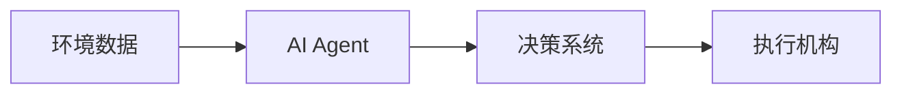
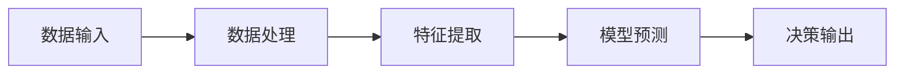
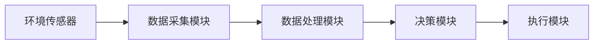

                 


# AI Agent在环境保护中的应用

> 关键词：AI Agent，环境保护，智能监测，数据处理，决策优化

> 摘要：本文深入探讨了AI Agent在环境保护中的应用，从基本概念到技术原理，再到实际应用，详细分析了AI Agent在环境监测、治理和管理中的重要作用。通过案例分析和系统设计，展示了AI Agent如何助力环境保护，为未来的环保技术发展提供了新的思路。

---

# 第一部分: AI Agent 在环境保护中的应用概述

## 第1章: AI Agent 的基本概念与环境保护背景

### 1.1 AI Agent 的定义与核心概念

AI Agent（人工智能代理）是一种能够感知环境、自主决策并采取行动的智能实体。它具备以下核心属性：

- **自主性**：AI Agent能够在没有外部干预的情况下自主运行。
- **反应性**：能够实时感知环境变化并做出反应。
- **目标导向**：具备明确的目标，能够采取最优行动。
- **学习能力**：通过数据和经验不断优化自身性能。

AI Agent与传统AI系统的主要区别在于其自主性和目标导向性，能够在动态环境中灵活应对各种挑战。

### 1.2 环境保护的背景与挑战

环境保护是全球关注的焦点，随着工业化和城市化的快速发展，环境问题日益严重。传统环境保护手段依赖于人工监测和治理，效率低下且覆盖面有限。AI Agent的引入为环境保护提供了新的解决方案。

### 1.3 AI Agent 在环境保护中的应用现状

AI Agent在环境保护中的应用主要集中在以下几个方面：

- **环境监测**：通过传感器和数据处理技术，实时监测空气质量、水质、噪声等环境指标。
- **环境治理**：通过智能决策系统，优化污染治理方案，提高治理效率。
- **环境管理**：通过数据分析和预测模型，辅助环境管理部门制定科学的管理策略。

---

## 第2章: AI Agent 的核心概念与联系

### 2.1 AI Agent 的核心概念

AI Agent的核心概念包括感知、决策和行动三个主要环节。通过感知环境获取数据，通过决策算法制定行动方案，并通过执行机构实现目标。

### 2.2 AI Agent 的技术原理

AI Agent的技术原理主要包括感知算法、决策算法和学习优化算法。感知算法用于数据采集和处理，决策算法用于制定行动方案，学习优化算法用于提升系统的智能性。

### 2.3 AI Agent 的实体关系图



---

## 第3章: AI Agent 的算法原理

### 3.1 感知算法

感知算法用于从环境中获取数据并进行预处理。常用的感知算法包括：

- **数据采集**：通过传感器获取环境数据。
- **数据预处理**：对数据进行清洗、归一化等处理。
- **特征提取**：提取数据中的关键特征。

### 3.2 决策算法

决策算法用于根据感知数据制定行动方案。常用的决策算法包括：

- **规则引擎**：基于预设规则进行决策。
- **机器学习模型**：基于训练数据进行预测和决策。
- **强化学习模型**：通过试错优化决策策略。

### 3.3 算法流程图



### 3.4 数学模型与公式

- **感知模型**：$$ y = f(x) $$
- **决策模型**：$$ p(y|x) = \text{softmax}(Wx + b) $$

---

## 第4章: 系统分析与架构设计

### 4.1 问题场景介绍

AI Agent在环境保护中的应用场景包括环境监测、污染治理和环境管理。每个场景都需要不同的系统设计和算法支持。

### 4.2 系统功能设计

- **环境监测**：实时采集环境数据，进行异常检测和预警。
- **污染治理**：优化污染处理方案，提高治理效率。
- **环境管理**：提供决策支持，辅助环境政策制定。

### 4.3 系统架构设计



### 4.4 系统接口设计

系统接口设计包括数据接口、用户接口和第三方服务接口。数据接口用于与传感器和数据库交互，用户接口用于与用户交互，第三方服务接口用于与外部服务交互。

---

## 第5章: 项目实战

### 5.1 环境安装

安装所需的环境包括Python、AI框架（如TensorFlow、PyTorch）和相关库（如Pandas、NumPy）。

### 5.2 核心功能实现

以下是环境监测系统的Python代码示例：

```python
import numpy as np
from sklearn import linear_model

# 数据预处理
data = np.array([[1, 2], [3, 4], [5, 6]])
X = data[:, 0]
y = data[:, 1]

# 训练模型
model = linear_model.LinearRegression()
model.fit(X.reshape(-1, 1), y)

# 预测
new_X = np.array([[7]])
prediction = model.predict(new_X.reshape(-1, 1))
print(prediction)
```

### 5.3 实际案例分析

通过实际案例分析，展示了AI Agent在环境保护中的应用效果和优化空间。

---

## 第6章: 最佳实践与总结

### 6.1 最佳实践

- **数据质量**：确保数据的准确性和完整性。
- **模型优化**：定期更新模型，提升预测精度。
- **系统维护**：定期检查和维护系统，确保稳定运行。

### 6.2 小结

AI Agent在环境保护中的应用前景广阔，通过感知、决策和执行的协同工作，能够显著提升环境保护的效率和效果。

### 6.3 注意事项

- **数据隐私**：注意环境数据的隐私保护。
- **系统安全性**：确保系统的安全性，防止恶意攻击。
- **可扩展性**：设计时考虑系统的可扩展性，方便未来的升级和优化。

### 6.4 拓展阅读

建议读者进一步阅读相关领域的书籍和论文，深入了解AI Agent在环境保护中的更多应用。

---

# 作者：AI天才研究院 & 禅与计算机程序设计艺术

