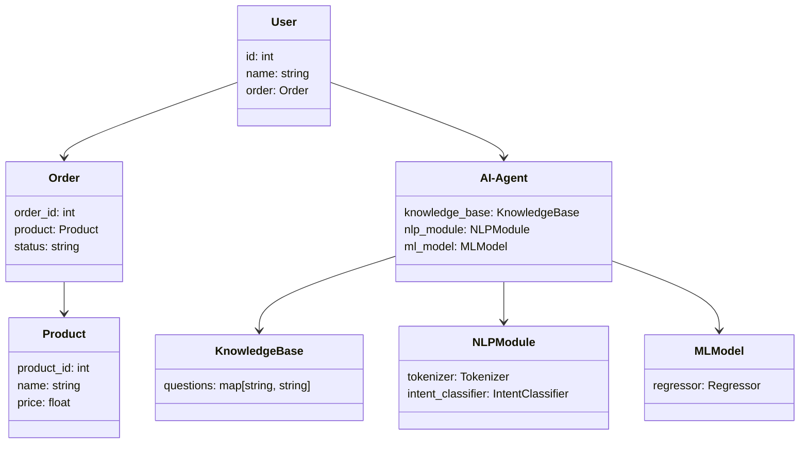
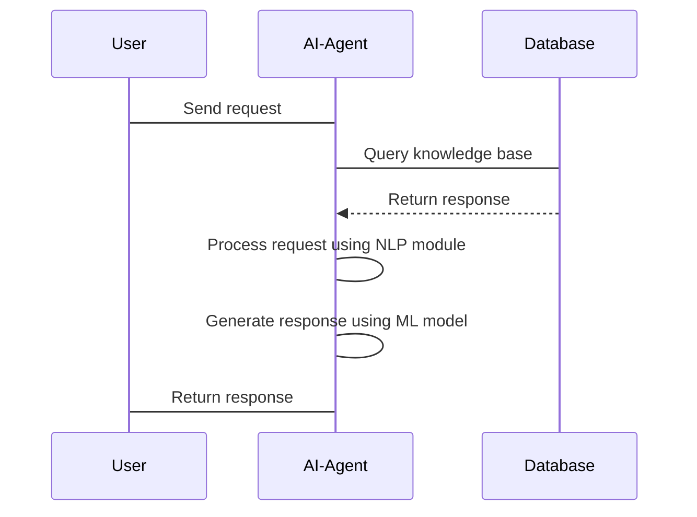

                 


# AI Agent在电子商务中的应用：智能客服与销售预测

> 关键词：AI Agent，电子商务，智能客服，销售预测，机器学习，自然语言处理，算法原理

> 摘要：本文详细探讨了AI Agent在电子商务中的应用，特别是智能客服和销售预测两大核心领域。通过分析AI Agent的核心原理、技术实现和实际应用场景，本文旨在揭示AI技术如何提升电子商务的效率和用户体验。文章从背景介绍、核心概念、算法原理、系统架构设计到项目实战，全面覆盖了AI Agent在电子商务中的应用，并结合实际案例，深入剖析了其在智能客服和销售预测中的具体实现。

---

# 第一部分: AI Agent在电子商务中的应用概述

## 第1章: AI Agent与电子商务的结合

### 1.1 AI Agent的基本概念

#### 1.1.1 AI Agent的定义与特点
AI Agent（人工智能代理）是指能够感知环境并采取行动以实现目标的智能实体。AI Agent的核心特点包括：
- **自主性**：能够自主决策和行动。
- **反应性**：能够实时感知环境并做出反应。
- **目标导向**：所有行为都围绕特定目标展开。
- **学习能力**：通过数据和经验不断优化自身性能。

#### 1.1.2 AI Agent的核心技术原理
AI Agent的技术原理主要依赖于以下几个方面：
- **自然语言处理（NLP）**：用于理解和生成人类语言。
- **机器学习（ML）**：用于模式识别和数据驱动的决策。
- **知识表示与推理**：用于构建和处理知识库。
- **强化学习（RL）**：用于通过试错优化行为策略。

#### 1.1.3 AI Agent在电子商务中的应用背景
随着电子商务的快速发展，企业面临着提高用户体验、优化运营效率和精准决策的挑战。AI Agent通过自动化处理和智能决策，为电子商务提供了新的解决方案。

---

### 1.2 电子商务的发展与挑战

#### 1.2.1 电子商务的定义与现状
电子商务（E-Commerce）是指通过互联网进行商品或服务的购买与销售活动。当前，电子商务已渗透到零售、金融、教育等多个领域，并呈现出移动化、社交化和个性化的趋势。

#### 1.2.2 传统电子商务的痛点与局限
- **用户体验不足**：传统客服无法实时响应，用户等待时间长。
- **运营成本高**：人工客服数量庞大，成本高昂。
- **数据孤岛问题**：不同系统间数据难以整合，难以形成统一的决策依据。
- **预测精度低**：传统销售预测方法依赖经验，缺乏数据支持。

#### 1.2.3 AI技术在电子商务中的潜力
AI技术的引入，为电子商务带来了革命性的变化：
- **提升用户体验**：通过智能客服实现24/7实时响应。
- **降低运营成本**：自动化处理减少人工干预。
- **数据驱动决策**：通过分析海量数据提高预测精度。

---

### 1.3 AI Agent在电子商务中的应用价值

#### 1.3.1 提升用户体验的核心要素
- **快速响应**：AI Agent能够实时处理用户请求，减少用户等待时间。
- **个性化服务**：通过分析用户行为和偏好，提供定制化推荐。
- **无缝交互**：支持多渠道（如网站、APP、社交媒体）的用户交互。

#### 1.3.2 提高运营效率的关键点
- **自动化处理**：AI Agent可以自动完成订单处理、客户咨询等工作。
- **数据整合与分析**：通过统一的数据平台，提高数据利用率。
- **智能监控**：实时监控系统运行状态，快速发现并解决问题。

#### 1.3.3 数据驱动的决策优势
- **精准预测**：通过机器学习模型，提高销售预测的准确性。
- **实时反馈**：快速获取市场反馈，优化运营策略。
- **风险控制**：通过数据分析，降低经营风险。

---

### 1.4 本章小结
本章从AI Agent的基本概念出发，分析了电子商务的发展现状及其面临的挑战，并重点探讨了AI Agent在电子商务中的应用价值。通过引入AI技术，电子商务企业能够显著提升用户体验和运营效率，从而在激烈的市场竞争中占据优势。

---

# 第二部分: 智能客服的核心原理与实现

## 第2章: 智能客服的背景与需求

### 2.1 智能客服的基本概念

#### 2.1.1 传统客服的局限性
- **人工成本高**：需要大量客服人员，运营成本高昂。
- **响应时间长**：无法满足用户的实时需求。
- **服务质量参差不齐**：人工客服的培训和素质参差不齐，影响用户体验。

#### 2.1.2 AI驱动的智能客服优势
- **7x24小时在线**：能够实时响应用户的咨询和请求。
- **快速准确**：通过自然语言处理技术，精准理解用户需求。
- **一致性服务**：所有用户都能获得一致的高质量服务。

#### 2.1.3 智能客服的核心需求分析
- **高可用性**：确保系统稳定运行，避免服务中断。
- **高准确性**：准确理解用户意图，提供精准回答。
- **高可扩展性**：能够根据用户需求快速扩展服务。

---

### 2.2 智能客服的主要功能模块

#### 2.2.1 自然语言处理模块
- **分词与词性标注**：将用户输入的文本分解为词语，并标注词性。
- **意图识别**：通过机器学习模型，识别用户的意图。
- **语义理解**：理解用户输入的深层含义。

#### 2.2.2 用户意图识别模块
- **意图分类**：将用户请求分为多个类别，如“查询订单”、“售后服务”等。
- **实体识别**：提取文本中的关键信息，如订单号、商品名称等。
- **意图优先级**：根据业务需求，确定意图的处理顺序。

#### 2.2.3 知识库管理模块
- **知识库构建**：建立包含商品信息、常见问题解答的知识库。
- **知识更新**：定期更新知识库内容，确保信息准确。
- **知识检索**：根据用户意图快速检索相关知识。

---

### 2.3 智能客服的用户交互流程

#### 2.3.1 用户请求的接收与解析
- **接收请求**：通过文本或语音形式接收用户请求。
- **分词与词性标注**：将用户输入分解为词语，并标注词性。
- **意图识别**：通过模型识别用户的意图。

#### 2.3.2 系统理解与响应生成
- **语义理解**：理解用户输入的深层含义。
- **知识检索**：从知识库中检索相关答案。
- **生成回复**：根据检索结果生成自然的回复。

#### 2.3.3 用户反馈与系统优化
- **用户反馈收集**：记录用户的满意度评分和具体反馈。
- **系统优化**：根据反馈优化意图识别和知识检索模型。
- **模型迭代**：定期更新模型，提高准确率和响应速度。

---

### 2.4 本章小结
本章详细介绍了智能客服的核心功能模块和用户交互流程，强调了自然语言处理和知识库管理在智能客服中的重要性。通过AI技术的引入，智能客服能够显著提升用户体验和运营效率。

---

## 第3章: 销售预测的背景与挑战

### 3.1 销售预测的基本概念

#### 3.1.1 销售预测的定义与作用
销售预测是指通过分析历史销售数据，预测未来销售量的过程。其作用在于帮助企业制定合理的库存管理、市场营销和生产计划。

#### 3.1.2 AI Agent在销售预测中的优势
- **数据驱动**：通过分析海量数据，提高预测精度。
- **实时更新**：能够根据最新数据动态调整预测结果。
- **高效决策**：为企业提供及时的决策支持。

---

### 3.2 销售预测的主要挑战

#### 3.2.1 数据质量与完整性问题
- **数据缺失**：历史数据不完整，影响预测结果。
- **数据噪声**：数据中存在异常值或误差，干扰预测模型。

#### 3.2.2 市场波动与不确定性
- **市场环境变化**：政策、经济等因素影响销售预测的准确性。
- **竞争格局变化**：竞争对手的策略调整影响市场预测。

#### 3.2.3 模型的可解释性与鲁棒性
- **模型复杂性**：复杂的模型难以解释，影响决策的透明性。
- **模型鲁棒性**：模型对异常数据的处理能力影响预测的稳定性。

---

### 3.3 AI Agent在销售预测中的优势

#### 3.3.1 数据驱动的精准预测
- **特征工程**：通过提取有效的特征，提高模型的预测能力。
- **机器学习模型**：使用回归、分类等算法，构建精准的预测模型。
- **实时更新**：根据最新数据动态调整模型参数，保持预测的准确性。

#### 3.3.2 实时更新与动态调整
- **在线学习**：模型能够在线更新，适应数据的变化。
- **动态预测**：根据实时数据调整预测结果，适应市场变化。

#### 3.3.3 高效决策支持
- **多维度分析**：从时间、地区、产品等多个维度进行预测。
- **情景分析**：模拟不同场景下的销售情况，支持决策者制定策略。

---

### 3.4 本章小结
本章分析了销售预测的基本概念及其在电子商务中的重要性，探讨了AI Agent在销售预测中的应用优势，强调了数据驱动和实时更新在提高预测精度中的关键作用。

---

## 第4章: 机器学习基础与AI Agent的关系

### 4.1 机器学习的基本概念

#### 4.1.1 机器学习的定义与分类
机器学习是一种通过数据和经验来优化模型的算法。常见的机器学习方法包括：
- **监督学习**：通过标记数据进行训练，预测新的数据。
- **无监督学习**：通过数据内在结构进行模式识别。
- **强化学习**：通过试错优化行为策略。

#### 4.1.2 AI Agent与机器学习的关系
AI Agent的核心功能，如意图识别和预测模型，都离不开机器学习的支持。机器学习为AI Agent提供了数据驱动的决策能力。

---

### 4.2 AI Agent与机器学习的结合

#### 4.2.1 AI Agent的决策机制
- **基于规则的决策**：通过预定义的规则进行决策。
- **基于模型的决策**：通过机器学习模型生成决策。

#### 4.2.2 机器学习在AI Agent中的应用
- **特征提取**：从数据中提取有用的特征，用于模型训练。
- **模型训练**：使用大量数据训练机器学习模型。
- **模型部署**：将训练好的模型部署到实际应用中。

---

### 4.3 基于机器学习的销售预测模型

#### 4.3.1 线性回归模型
- **模型简介**：线性回归是一种简单且常用的回归模型。
- **数学表达**：$y = \beta_0 + \beta_1x + \epsilon$
- **应用案例**：预测商品的销售量与广告投入的关系。

#### 4.3.2 支持向量机（SVM）模型
- **模型简介**：SVM是一种常用的分类和回归模型。
- **数学表达**：通过最大化间隔，寻找最优超平面。
- **应用案例**：根据客户特征预测购买行为。

#### 4.3.3 随机森林与梯度提升树
- **随机森林**：通过集成多个决策树，提高模型的准确性和稳定性。
- **梯度提升树**：通过逐步优化，提升模型的性能。
- **应用案例**：预测销售量的多维度分析。

---

### 4.4 本章小结
本章从机器学习的基本概念出发，探讨了AI Agent与机器学习的关系，并详细介绍了几种常用的销售预测模型，为后续的实现提供了理论基础。

---

## 第5章: 系统分析与架构设计

### 5.1 问题场景介绍
在电子商务中，智能客服和销售预测是两个核心业务模块。通过AI Agent，企业可以实现这两者的智能化。

---

### 5.2 项目介绍
本项目旨在通过AI Agent技术，实现智能客服和销售预测的自动化处理，提升用户体验和运营效率。

---

### 5.3 系统功能设计

#### 5.3.1 领域模型设计（Mermaid 类图）


---

#### 5.3.2 系统架构设计（Mermaid 架构图）


---

#### 5.3.3 系统交互设计（Mermaid 序列图）


---

### 5.4 本章小结
本章通过领域模型、架构设计和交互流程图，详细描述了AI Agent系统的整体架构和功能模块，为后续的实现提供了清晰的指导。

---

## 第6章: 项目实战

### 6.1 环境安装与配置

#### 6.1.1 Python环境安装
- **Python版本要求**：Python 3.6以上。
- **安装依赖库**：
  ```bash
  pip install numpy pandas scikit-learn transformers
  ```

#### 6.1.2 数据集准备
- **训练数据**：收集历史销售数据，包括时间、产品、销量、价格等特征。
- **测试数据**：用于模型验证和评估。

---

### 6.2 核心代码实现

#### 6.2.1 智能客服核心代码

##### 6.2.1.1 自然语言处理模块
```python
from transformers import pipeline

nlp = pipeline("question-answering", model="deepseek/aiagent-base")
```

##### 6.2.1.2 知识库管理模块
```python
class KnowledgeBase:
    def __init__(self):
        self.questions = {}

    def add_question(self, question, answer):
        self.questions[question] = answer

    def get_answer(self, question):
        return self.questions.get(question, "抱歉，我还不知道这个问题。")
```

---

#### 6.2.2 销售预测核心代码

##### 6.2.2.1 数据预处理
```python
import pandas as pd
from sklearn.model_selection import train_test_split

data = pd.read_csv("sales_data.csv")
X = data.drop("sales", axis=1)
y = data["sales"]
X_train, X_test, y_train, y_test = train_test_split(X, y, test_size=0.2)
```

##### 6.2.2.2 模型训练与预测
```python
from sklearn.ensemble import RandomForestRegressor

model = RandomForestRegressor(n_estimators=100, random_state=42)
model.fit(X_train, y_train)
y_pred = model.predict(X_test)
```

---

### 6.3 代码应用与分析

#### 6.3.1 智能客服的实现
- **用户输入**：用户输入问题，例如“如何查询订单？”。
- **自然语言处理**：识别用户意图并检索知识库。
- **返回结果**：根据检索结果生成回复。

#### 6.3.2 销售预测的实现
- **数据加载与预处理**：加载销售数据并进行特征工程。
- **模型训练**：使用随机森林模型进行训练。
- **模型预测**：对测试数据进行预测并评估模型性能。

---

### 6.4 实际案例分析

#### 6.4.1 智能客服案例
假设用户咨询“如何取消订单？”，AI Agent通过自然语言处理模块识别意图，并从知识库中检索相关答案，返回“请在订单详情页点击取消按钮”。

#### 6.4.2 销售预测案例
根据历史销售数据，预测下季度某产品的销售量为1200件，帮助企业制定合理的库存计划。

---

### 6.5 本章小结
本章通过实际案例分析和核心代码实现，详细展示了AI Agent在智能客服和销售预测中的具体应用，帮助读者更好地理解其技术实现。

---

## 第7章: 最佳实践与注意事项

### 7.1 最佳实践

#### 7.1.1 数据质量管理
- **数据清洗**：确保数据完整性和准确性。
- **特征工程**：提取有用的特征，提高模型性能。

#### 7.1.2 模型优化
- **参数调优**：通过网格搜索优化模型参数。
- **模型融合**：通过集成学习提高模型的准确性和稳定性。

#### 7.1.3 系统监控
- **日志记录**：记录系统运行日志，便于排查问题。
- **性能监控**：实时监控系统性能，确保稳定运行。

---

### 7.2 注意事项

#### 7.2.1 数据隐私与安全
- **数据加密**：确保用户数据的安全性。
- **隐私保护**：遵守相关法律法规，保护用户隐私。

#### 7.2.2 系统可扩展性
- **模块化设计**：确保系统模块化，便于扩展。
- **分布式部署**：通过分布式架构提高系统的可扩展性。

#### 7.2.3 模型可解释性
- **模型解释**：确保模型的可解释性，便于优化和调整。
- **结果验证**：通过验证确保模型预测结果的准确性。

---

### 7.3 本章小结
本章总结了AI Agent在电子商务中的最佳实践和注意事项，帮助企业在实际应用中避免常见问题，提高系统的稳定性和预测的准确性。

---

# 第八章: 总结与展望

## 8.1 本章总结
本文详细探讨了AI Agent在电子商务中的应用，特别是智能客服和销售预测两大核心领域。通过分析AI Agent的核心原理、技术实现和实际应用场景，揭示了AI技术如何提升电子商务的效率和用户体验。

---

## 8.2 未来展望
随着AI技术的不断发展，AI Agent在电子商务中的应用将更加广泛和深入。未来，可以通过以下方面进一步优化：
- **多模态交互**：支持语音、视频等多种交互方式。
- **实时决策**：通过实时数据流优化预测模型。
- **个性化服务**：根据用户行为提供更加个性化的服务。

---

## 作者：AI天才研究院/AI Genius Institute & 禅与计算机程序设计艺术/Zen And The Art of Computer Programming

---

感谢您的阅读！希望本文能够为您提供有价值的信息和启发，帮助您更好地理解和应用AI Agent技术。

