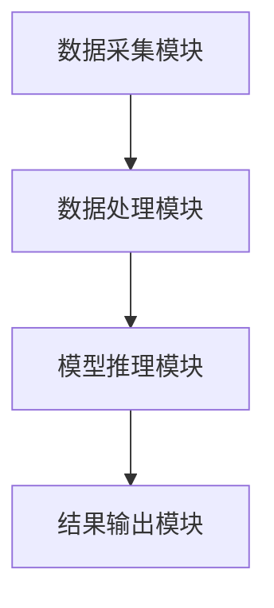
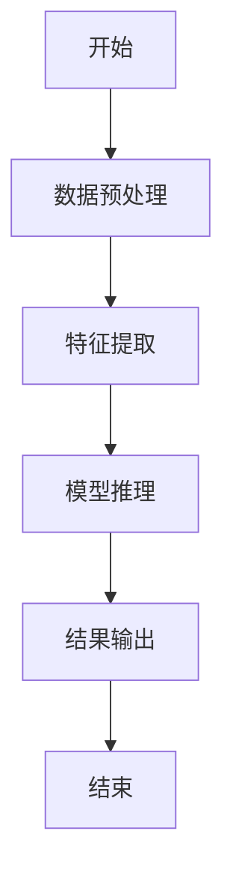

                 


# AI Agent在社交媒体中的应用：内容审核与趋势分析

## 关键词：AI Agent, 社交媒体, 内容审核, 趋势分析, 机器学习, 自然语言处理, 系统架构

## 摘要：  
随着社交媒体的快速发展，内容审核和趋势分析成为保障网络环境健康和用户体验的重要任务。AI Agent作为一种智能化的解决方案，能够高效地处理海量数据，实时分析用户行为和内容信息。本文将深入探讨AI Agent在社交媒体中的应用，分析其在内容审核中的核心作用，并结合具体案例，详细阐述AI Agent在趋势分析中的技术实现和实际应用。通过对系统架构、算法原理和项目实战的详细讲解，本文旨在为读者提供全面的技术视角，帮助其理解AI Agent在社交媒体中的重要价值。

---

# 第1章: AI Agent与社交媒体的结合

## 1.1 AI Agent的基本概念

### 1.1.1 什么是AI Agent
AI Agent（人工智能代理）是一种能够感知环境、自主决策并执行任务的智能系统。它通过数据输入、模型推理和决策输出，帮助用户完成复杂任务。AI Agent的核心特征包括自主性、反应性、目标导向性和学习能力。

### 1.1.2 AI Agent的核心特征
- **自主性**：AI Agent能够独立运行，无需人工干预。
- **反应性**：能够实时感知环境变化并做出响应。
- **目标导向性**：通过设定目标，优化决策过程。
- **学习能力**：通过机器学习算法不断优化自身的性能。

### 1.1.3 社交媒体中的AI Agent应用场景
AI Agent在社交媒体中的应用包括内容审核、用户行为分析、舆情监控和个性化推荐等。这些应用能够显著提升社交媒体的运行效率和用户体验。

## 1.2 社交媒体的基本概念

### 1.2.1 社交媒体的定义与特点
社交媒体是基于互联网的平台，允许用户创建、分享和互动内容。其特点包括实时性、交互性和社交性。

### 1.2.2 社交媒体的主要功能
- **内容发布**：用户可以分享文字、图片、视频等内容。
- **用户互动**：通过评论、点赞和私信等方式进行互动。
- **信息传播**：信息可以快速传播，形成广泛影响力。

### 1.2.3 社交媒体的用户行为分析
用户行为分析是理解用户需求、优化平台体验的关键。AI Agent能够通过分析用户的点击、浏览和互动行为，挖掘用户的兴趣和偏好。

## 1.3 AI Agent在社交媒体中的结合

### 1.3.1 AI Agent与社交媒体的结合背景
社交媒体的海量数据和复杂场景对人工处理提出了巨大挑战。AI Agent的智能化和自动化能力为解决这些问题提供了新的可能性。

### 1.3.2 AI Agent在社交媒体中的主要应用领域
- **内容审核**：通过AI Agent自动识别并过滤有害信息。
- **舆情监控**：实时分析用户情绪，识别潜在的舆论风险。
- **个性化推荐**：基于AI Agent的推荐算法，为用户提供个性化内容。

### 1.3.3 AI Agent与社交媒体结合的优势
- **高效性**：AI Agent能够快速处理大量数据，显著提升效率。
- **准确性**：通过机器学习算法，AI Agent能够实现高精度的分析和判断。
- **实时性**：AI Agent能够实时响应用户行为和内容变化。

## 1.4 本章小结

---

# 第2章: AI Agent在内容审核中的应用

## 2.1 内容审核的基本概念

### 2.1.1 内容审核的定义
内容审核是指对社交媒体上的文本、图片、视频等信息进行检查，确保其符合平台的规则和政策。

### 2.1.2 内容审核的主要目标
- **过滤有害信息**：识别并删除违法、淫秽、暴力等内容。
- **保护用户隐私**：防止个人信息泄露和滥用。
- **维护平台秩序**：营造健康、有序的网络环境。

### 2.1.3 内容审核的常见挑战
- **数据量大**：社交媒体每天产生海量数据，人工审核效率低下。
- **内容多样性**：内容形式多样，审核难度较高。
- **法律法规复杂**：不同地区对内容审核的要求差异大。

## 2.2 AI Agent在内容审核中的作用

### 2.2.1 AI Agent如何提升内容审核效率
通过自动化处理和机器学习算法，AI Agent能够快速识别和分类内容，显著提升审核效率。

### 2.2.2 AI Agent在内容审核中的核心功能
- **自动分类**：基于自然语言处理技术，对文本内容进行分类。
- **异常检测**：识别潜在的有害信息和违规内容。
- **实时监控**：实时分析用户发布的内容，快速响应潜在风险。

### 2.2.3 AI Agent在内容审核中的优势
- **高效性**：AI Agent能够快速处理大量数据，显著提升审核效率。
- **准确性**：通过深度学习算法，AI Agent能够实现高精度的分类和识别。
- **可扩展性**：AI Agent可以根据需求灵活扩展，适应不同的审核场景。

## 2.3 基于AI Agent的内容审核流程

### 2.3.1 内容审核的典型流程
1. **数据输入**：用户发布的内容进入审核系统。
2. **特征提取**：AI Agent提取内容的关键特征，如文本情感、关键词等。
3. **模型推理**：基于预训练的机器学习模型，进行内容分类和判断。
4. **结果输出**：输出审核结果，如“通过”或“需人工复核”。

### 2.3.2 AI Agent在内容审核中的具体步骤
1. **数据预处理**：对输入的内容进行清洗和标准化处理。
2. **特征提取**：提取文本中的关键词、情感倾向等特征。
3. **模型推理**：基于训练好的分类模型，进行内容分类。
4. **结果输出**：将审核结果反馈给系统或用户。

### 2.3.3 AI Agent与人工审核的结合
- **人工复核**：对于AI Agent判定为“可疑”的内容，需要人工进一步审核。
- **反馈优化**：人工审核的结果可以用于优化AI Agent的模型和算法。

## 2.4 本章小结

---

# 第3章: AI Agent在趋势分析中的应用

## 3.1 趋势分析的基本概念

### 3.1.1 趋势分析的定义
趋势分析是指通过对历史数据的分析，预测未来的趋势和变化。

### 3.1.2 趋势分析的主要方法
- **时间序列分析**：基于时间数据的变化趋势，预测未来的走势。
- **关联规则挖掘**：发现数据中的关联规则，识别潜在的趋势。
- **机器学习模型**：利用回归、聚类和分类等算法，进行趋势预测。

### 3.1.3 趋势分析在社交媒体中的重要性
- **舆论引导**：通过趋势分析，识别潜在的舆论热点，及时进行引导。
- **商业决策**：帮助企业发现市场趋势，优化产品和服务。
- **用户行为预测**：通过分析用户行为趋势，优化用户体验。

## 3.2 AI Agent在趋势分析中的作用

### 3.2.1 AI Agent如何支持趋势分析
通过实时数据采集和机器学习算法，AI Agent能够快速分析数据，识别潜在的趋势和模式。

### 3.2.2 AI Agent在趋势分析中的核心功能
- **实时数据采集**：持续采集社交媒体上的数据，确保分析的实时性。
- **模式识别**：通过机器学习算法，识别数据中的模式和趋势。
- **预测分析**：基于历史数据，预测未来的趋势和变化。

### 3.2.3 AI Agent在趋势分析中的优势
- **高效性**：AI Agent能够快速处理大量数据，显著提升分析效率。
- **准确性**：通过深度学习算法，AI Agent能够实现高精度的趋势预测。
- **灵活性**：AI Agent可以根据需求，灵活调整分析模型和参数。

## 3.3 AI Agent在趋势分析中的具体应用

### 3.3.1 舆情监控
AI Agent可以通过分析社交媒体上的用户评论和情感倾向，识别潜在的舆论风险。

### 3.3.2 市场预测
AI Agent可以通过分析用户行为和市场数据，帮助企业预测市场趋势，优化产品和服务。

### 3.3.3 用户行为预测
AI Agent可以通过分析用户的历史行为数据，预测用户的未来行为，优化用户体验。

## 3.4 本章小结

---

# 第4章: 系统架构与实现

## 4.1 系统架构设计

### 4.1.1 系统功能设计
- **数据采集模块**：负责采集社交媒体上的数据。
- **数据处理模块**：对采集的数据进行清洗和标准化处理。
- **模型推理模块**：基于预训练的模型，进行内容分类和趋势分析。
- **结果输出模块**：将分析结果反馈给系统或用户。

### 4.1.2 系统架构图


### 4.1.3 系统接口设计
- **数据接口**：用于与社交媒体平台的数据接口对接。
- **模型接口**：用于与机器学习模型的接口对接。
- **用户接口**：用于与用户的交互界面对接。

## 4.2 算法实现

### 4.2.1 算法流程图


### 4.2.2 算法实现代码
```python
import pandas as pd
from sklearn.model import LinearRegression

# 数据预处理
data = pd.read_csv('data.csv')
data_cleaned = data.dropna()

# 特征提取
X = data_cleaned[['feature1', 'feature2']]
y = data_cleaned['target']

# 模型训练
model = LinearRegression()
model.fit(X, y)

# 模型推理
new_data = pd.DataFrame({'feature1': [x1], 'feature2': [x2]})
prediction = model.predict(new_data)
```

## 4.3 本章小结

---

# 第5章: 项目实战与案例分析

## 5.1 项目背景

### 5.1.1 项目介绍
本项目旨在利用AI Agent技术，实现社交媒体内容的自动审核和趋势分析。

### 5.1.2 项目目标
- **内容审核**：自动识别并过滤有害信息。
- **趋势分析**：预测未来的舆论趋势和用户行为。

## 5.2 项目实现

### 5.2.1 环境安装
- **Python 3.8以上**
- **机器学习库（如Scikit-learn、TensorFlow）**
- **数据处理库（如Pandas、NumPy）**

### 5.2.2 核心代码实现
```python
def content_review(text):
    # 特征提取
    features = extract_features(text)
    
    # 模型推理
    model = load_model('content_model.pkl')
    prediction = model.predict(features)
    
    return prediction

def trend_analysis(data):
    # 数据预处理
    processed_data = preprocess_data(data)
    
    # 模型推理
    model = load_model('trend_model.pkl')
    prediction = model.predict(processed_data)
    
    return prediction
```

### 5.2.3 代码解读与分析
- **内容审核函数**：`content_review`函数接收文本输入，提取特征后，通过预训练的模型进行分类，返回审核结果。
- **趋势分析函数**：`trend_analysis`函数接收数据输入，预处理后，通过预训练的模型进行预测，返回趋势分析结果。

## 5.3 实际案例分析

### 5.3.1 案例介绍
以某社交媒体平台为例，分析AI Agent在内容审核和趋势分析中的实际应用。

### 5.3.2 案例分析
- **内容审核**：AI Agent能够快速识别并过滤违法、淫秽等内容。
- **趋势分析**：AI Agent能够预测未来的舆论趋势，帮助企业制定相应的策略。

## 5.4 本章小结

---

# 第6章: 最佳实践与注意事项

## 6.1 最佳实践

### 6.1.1 数据质量
确保数据的完整性和准确性，避免因数据质量问题影响模型的性能。

### 6.1.2 模型优化
通过不断优化模型参数和结构，提升模型的准确性和效率。

### 6.1.3 人机结合
在实际应用中，建议将AI Agent与人工审核相结合，确保审核结果的准确性和全面性。

## 6.2 注意事项

### 6.2.1 数据隐私
在处理用户数据时，必须遵守相关的隐私保护法规，确保用户数据的安全性和隐私性。

### 6.2.2 模型泛化能力
在模型设计中，需要注意模型的泛化能力，避免因过拟合或欠拟合导致模型性能下降。

### 6.2.3 系统稳定性
在系统设计中，需要考虑系统的稳定性和容错能力，确保系统在异常情况下仍能正常运行。

## 6.3 未来展望

随着技术的不断发展，AI Agent在社交媒体中的应用将更加广泛和深入。未来，AI Agent将更加智能化和个性化，能够更好地满足用户的需求和期望。

## 6.4 本章小结

---

# 作者：AI天才研究院/AI Genius Institute & 禅与计算机程序设计艺术 /Zen And The Art of Computer Programming

