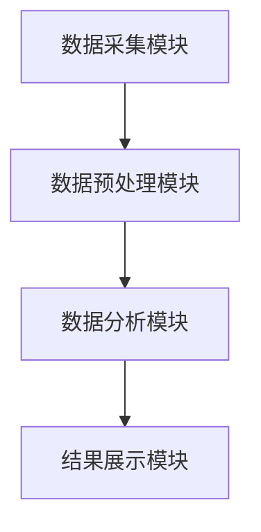
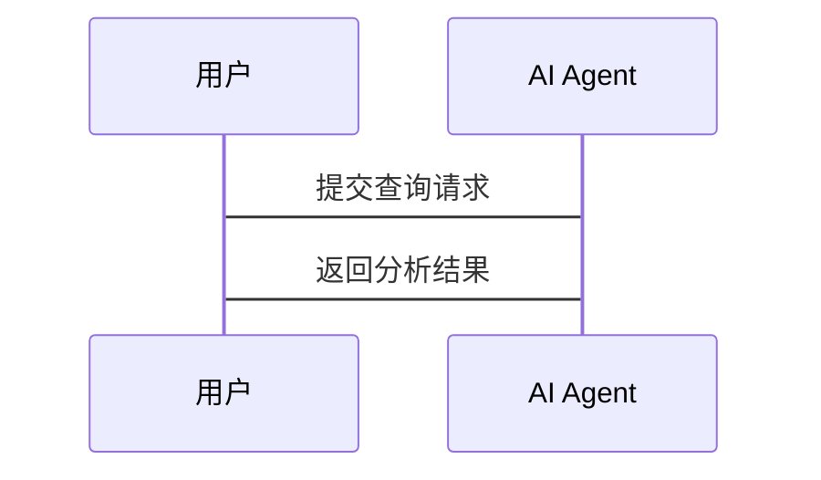

                 


---

# AI Agent在社交媒体分析中的应用

> 关键词：AI Agent，社交媒体分析，自然语言处理，机器学习，深度学习

> 摘要：本文系统地探讨了AI Agent在社交媒体分析中的应用，从核心概念、算法原理到系统架构，再到实战项目，全面解析了AI Agent如何提升社交媒体分析的效率和准确性。通过详细的技术分析和实际案例，本文为读者提供了从理论到实践的完整指南。

---

## 第1章 AI Agent与社交媒体分析概述

### 1.1 AI Agent的基本概念

#### 1.1.1 什么是AI Agent
AI Agent（人工智能代理）是一种能够感知环境并采取行动以实现目标的智能实体。它通过接收输入数据，执行处理，并输出结果来与用户交互。

#### 1.1.2 AI Agent的核心特点
| 特性 | 描述 |
|------|------|
| 智能性 | 能够理解、推理和学习 |
| 自适应性 | 能够根据环境变化调整行为 |
| 交互性 | 能够与用户或其他系统进行交互 |

#### 1.1.3 AI Agent与传统算法的区别
AI Agent不仅能够执行任务，还能通过学习和适应提升性能，而传统算法通常基于固定的规则。

### 1.2 社交媒体分析的背景与挑战

#### 1.2.1 社交媒体数据的特点
社交媒体数据具有实时性、多样性、海量性等特点，需要高效的方法进行处理和分析。

#### 1.2.2 社交媒体分析的主要挑战
| 挑战 | 描述 |
|------|------|
| 数据多样性 | 包括文本、图片、视频等多种类型 |
| 数据量大 | 需要高效的处理方法 |
| 网络效应 | 数据间存在复杂的关联 |

#### 1.2.3 社交媒体分析的典型应用场景
- 情感分析
- 舆情监控
- 用户画像

### 1.3 AI Agent在社交媒体分析中的作用

#### 1.3.1 AI Agent如何提升社交媒体分析的效率
AI Agent能够自动化处理数据，快速生成分析结果，提高效率。

#### 1.3.2 AI Agent在社交媒体分析中的核心优势
- 高效性
- 智能性
- 实时性

#### 1.3.3 AI Agent在社交媒体分析中的未来发展趋势
随着技术进步，AI Agent将更加智能化，能够处理更复杂的数据和任务。

---

## 第2章 AI Agent的核心概念与算法原理

### 2.1 AI Agent的构成与工作原理

#### 2.1.1 AI Agent的构成要素
| 要素 | 描述 |
|------|------|
| 感知器 | 接收环境输入 |
| 决策器 | 处理输入并做出决策 |
| 行动器 | 执行决策 |

#### 2.1.2 AI Agent的基本工作流程
1. 接收输入数据
2. 数据预处理
3. 数据分析与推理
4. 生成输出结果

### 2.2 AI Agent的核心算法与技术

#### 2.2.1 自然语言处理（NLP）在AI Agent中的应用
NLP用于文本的理解和生成，是AI Agent处理社交媒体文本的核心技术。

#### 2.2.2 机器学习算法在AI Agent中的应用
机器学习算法用于模式识别和预测，如情感分析和主题建模。

#### 2.2.3 深度学习技术在AI Agent中的应用
深度学习技术用于处理复杂的非结构化数据，如图像和视频。

### 2.3 AI Agent的决策机制与优化策略

#### 2.3.1 基于规则的决策机制
通过预定义的规则进行决策，适用于简单场景。

#### 2.3.2 基于数据驱动的决策机制
通过学习数据模式进行决策，适用于复杂场景。

#### 2.3.3 AI Agent的优化与进化策略
通过强化学习不断优化决策策略。

---

## 第3章 基于AI Agent的社交媒体情感分析

### 3.1 情感分析的基本概念与挑战

#### 3.1.1 情感分析的定义与目标
情感分析旨在识别和分类文本中的情感倾向。

#### 3.1.2 情感分析的主要挑战
- 多样性
- 噪声干扰
- 领域迁移

### 3.2 基于AI Agent的情感分析算法实现

#### 3.2.1 基于词袋模型的情感分析算法
词袋模型将文本表示为词汇的集合，常用于分类任务。

#### 3.2.2 基于词嵌入模型的情感分析算法
词嵌入模型（如Word2Vec）将词汇映射到向量空间，捕捉语义信息。

#### 3.2.3 基于深度学习的情感分析算法
深度学习模型（如LSTM和BERT）能够处理复杂的文本结构。

### 3.3 情感分析的优化与提升

#### 3.3.1 数据增强技术在情感分析中的应用
通过数据增强技术增加数据多样性，提升模型鲁棒性。

#### 3.3.2 跨模态数据融合在情感分析中的应用
结合文本、图像等多种模态数据，提高分析精度。

#### 3.3.3 情感分析结果的可视化与解释
通过可视化工具展示分析结果，并提供可解释性。

---

## 第4章 AI Agent的系统架构与实现

### 4.1 系统架构设计的基本原则

#### 4.1.1 系统架构设计的目标
确保系统的高效性、可扩展性和可维护性。

#### 4.1.2 系统架构设计的主要原则
| 原则 | 描述 |
|------|------|
| 分层设计 | 将系统划分为多个层次，降低耦合性 |
| 模块化设计 | 将功能分解为独立模块，便于开发和维护 |

### 4.2 AI Agent的系统功能模块设计

#### 4.2.1 数据采集模块
负责从社交媒体平台获取数据，包括文本、图片和视频等。

#### 4.2.2 数据预处理模块
对原始数据进行清洗、转换和标注，为后续分析做准备。

#### 4.2.3 数据分析模块
使用NLP、机器学习和深度学习技术对数据进行分析和处理。

#### 4.2.4 结果展示模块
将分析结果以可视化形式呈现，便于用户理解和使用。

### 4.3 系统架构设计

#### 4.3.1 系统架构图


### 4.4 系统接口设计

#### 4.4.1 API接口
提供RESTful API，方便其他系统调用AI Agent的功能。

### 4.5 系统交互设计

#### 4.5.1 交互流程


---

## 第5章 项目实战：AI Agent在社交媒体分析中的应用

### 5.1 环境安装与配置

#### 5.1.1 安装Python
```bash
python --version
pip install --upgrade pip
```

#### 5.1.2 安装必要的库
```bash
pip install numpy
pip install pandas
pip install scikit-learn
pip install transformers
```

### 5.2 核心功能实现

#### 5.2.1 数据采集模块实现
使用Twitter API采集推文数据。

#### 5.2.2 数据预处理模块实现
对文本数据进行清洗和分词。

#### 5.2.3 情感分析算法实现
使用预训练模型进行情感分类。

#### 5.2.4 结果展示模块实现
将分析结果以图表形式展示。

### 5.3 实际案例分析

#### 5.3.1 案例背景
分析某品牌在社交媒体上的用户反馈。

#### 5.3.2 数据处理与分析
使用NLP技术进行文本分析，生成用户情感分布图。

#### 5.3.3 分析结果解读
解读分析结果，为企业提供决策支持。

### 5.4 项目小结

---

## 第6章 总结与展望

### 6.1 本章小结
总结全文内容，强调AI Agent在社交媒体分析中的重要性。

### 6.2 注意事项
在实际应用中，需注意数据隐私和模型解释性问题。

### 6.3 拓展阅读
推荐相关领域的书籍和论文，供读者深入学习。

---

## 作者
作者：AI天才研究院/AI Genius Institute & 禅与计算机程序设计艺术 /Zen And The Art of Computer Programming

