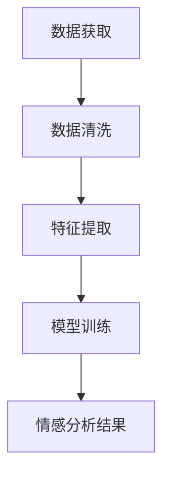
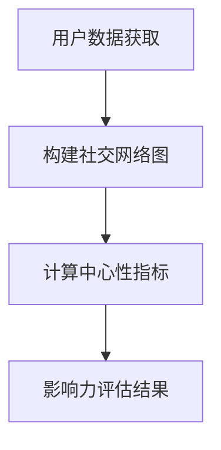
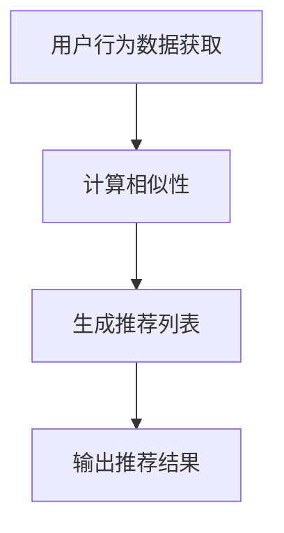
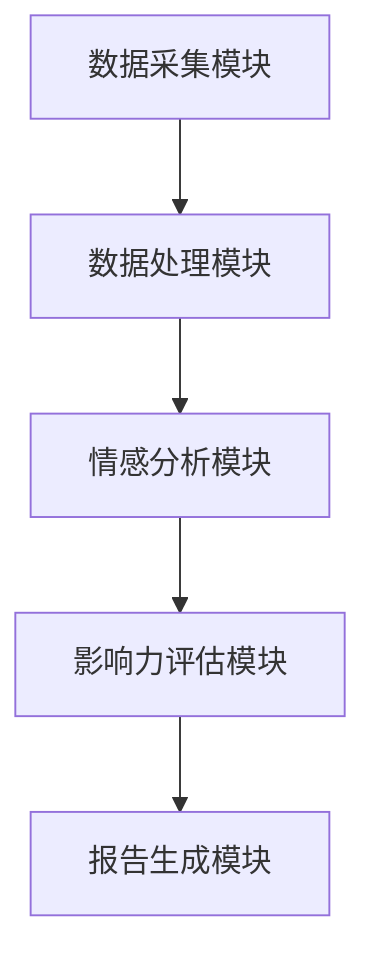
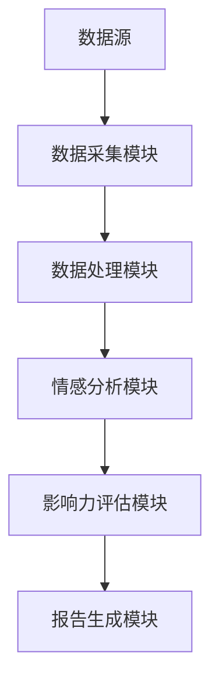

                 

<think>
好的，我将按照您的要求撰写一篇关于《AI Agent在社交网络分析中的应用：舆情监测与影响力评估》的技术博客文章。首先，我会先写出文章的标题和关键词，然后是摘要，接着按照目录大纲的结构撰写各章节内容。

---

# AI Agent在社交网络分析中的应用：舆情监测与影响力评估

## 关键词：
- AI Agent
- 社交网络分析
- 舆情监测
- 影响力评估
- 人工智能
- 社会网络算法

## 摘要：
随着社交网络的快速发展，海量信息的产生和传播使得舆情监测与影响力评估变得至关重要。AI Agent（人工智能代理）作为一种智能化的解决方案，能够实时分析社交网络中的海量数据，帮助我们快速掌握公众舆论动态，并评估关键人物或组织的影响力。本文将从AI Agent的基本原理出发，结合社交网络分析的核心算法，详细探讨其在舆情监测与影响力评估中的应用。通过实际案例分析，我们将揭示AI Agent如何帮助我们更高效、精准地进行社交网络数据分析。

---

# 第一部分: AI Agent与社交网络分析基础

## 第1章: 背景介绍与核心概念

### 1.1 问题背景与描述

#### 1.1.1 社交网络分析的现状与挑战
在当今数字化时代，社交网络已经成为人们日常生活的重要组成部分。每天产生的海量信息不仅包括文本、图片，还包括视频、表情符号等多种形式。然而，这些信息的复杂性和实时性给传统的数据分析方法带来了巨大挑战。如何快速、准确地从海量社交数据中提取有价值的信息，成为社交网络分析的核心问题。

#### 1.1.2 舆情监测与影响力评估的重要性
舆情监测是指对公众在社交网络中的情感、态度和意见的实时监测和分析，而影响力评估则是对用户或组织在社交网络中的影响力进行量化。这两者对于企业、政府机构以及各类组织来说至关重要。例如，企业在面对负面舆情时，需要快速响应以避免声誉损失；政府机构则需要通过舆情监测了解民意，制定更有效的政策。

#### 1.1.3 AI Agent在社交网络分析中的应用价值
AI Agent（人工智能代理）是一种能够自主感知环境、执行任务并进行决策的智能实体。与传统的数据分析方法相比，AI Agent具有实时性、智能化和自适应性等特点，能够高效地处理社交网络中的复杂数据，为舆情监测与影响力评估提供强有力的支持。

---

### 1.2 核心概念与问题解决

#### 1.2.1 AI Agent的基本概念与特征
AI Agent是指能够感知环境、执行任务并进行决策的智能实体。它具有以下核心特征：
1. **自主性**：能够在没有外部干预的情况下独立运行。
2. **反应性**：能够实时感知环境并做出响应。
3. **目标导向**：具备明确的目标，并能够采取行动以实现目标。
4. **学习能力**：能够通过数据和经验不断优化自身的算法和决策能力。

#### 1.2.2 社交网络分析的核心问题与解决思路
社交网络分析的核心问题包括：
1. **数据收集**：如何高效地从社交网络中获取数据。
2. **数据处理**：如何清洗和预处理数据以供后续分析。
3. **情感分析**：如何准确识别文本中的情感倾向。
4. **影响力评估**：如何量化用户或组织在社交网络中的影响力。

#### 1.2.3 舆情监测与影响力评估的定义与目标
舆情监测是指对社交网络中的海量信息进行实时监控，识别公众舆论的趋势和动态。影响力评估则是通过对用户的社交行为、互动频率和内容传播效果等指标进行分析，量化用户或组织在社交网络中的影响力。

---

### 1.3 概念结构与核心要素

#### 1.3.1 AI Agent的组成与功能模块
AI Agent的核心组成包括：
1. **感知模块**：负责从社交网络中获取数据并进行初步处理。
2. **分析模块**：利用机器学习算法对数据进行深度分析，识别情感倾向和影响力指标。
3. **决策模块**：根据分析结果生成相应的决策或反馈。
4. **执行模块**：根据决策模块的指令采取行动，例如发布评论或调整传播策略。

#### 1.3.2 社交网络分析的流程与关键环节
社交网络分析的流程包括：
1. **数据收集**：从社交平台获取原始数据。
2. **数据清洗**：去除噪声数据，提取有效信息。
3. **特征提取**：从文本中提取情感特征、关键词等。
4. **模型训练**：利用机器学习算法训练情感分析和影响力评估模型。
5. **结果分析**：根据模型输出结果，生成舆情报告和影响力评估报告。

#### 1.3.3 舆情监测与影响力评估的指标体系
舆情监测的关键指标包括：
- 情感倾向（正面、负面、中性）。
- 信息传播速度和范围。
- 用户互动频率（点赞、评论、转发）。

影响力评估的关键指标包括：
- 用户关注数。
- 用户粉丝数。
- 用户内容的传播广度和深度。
- 用户在社交网络中的中心性（如度数中心性和中间性）。

---

## 第2章: AI Agent与社交网络分析的核心概念

### 2.1 AI Agent的原理与特点

#### 2.1.1 AI Agent的基本原理
AI Agent通过感知环境、分析数据、制定决策并采取行动来实现其目标。其核心原理包括：
1. **数据感知**：通过API或其他接口从社交网络中获取数据。
2. **数据分析**：利用自然语言处理（NLP）和机器学习算法对数据进行分析。
3. **决策制定**：根据分析结果生成相应的决策或反馈。
4. **行动执行**：根据决策采取行动，例如发布评论或调整传播策略。

#### 2.1.2 AI Agent的核心特点与优势
AI Agent的核心特点包括：
1. **实时性**：能够实时感知和响应社交网络中的变化。
2. **智能化**：能够通过机器学习不断优化自身的分析和决策能力。
3. **自适应性**：能够根据环境的变化调整自身的行为和策略。

#### 2.1.3 AI Agent与传统算法的对比
AI Agent与传统算法的主要区别在于其自主性和适应性。传统算法通常需要人工干预和参数调整，而AI Agent能够自主运行并根据环境变化自适应地调整其行为。

---

### 2.2 社交网络分析的原理与方法

#### 2.2.1 社交网络分析的基本原理
社交网络分析通过分析用户之间的关系、内容传播路径以及用户行为模式，识别社交网络中的关键节点和影响力较大的用户。

#### 2.2.2 常见的社交网络分析方法
常见的社交网络分析方法包括：
1. **文本挖掘**：从文本中提取关键词、主题和情感倾向。
2. **情感分析**：识别文本中的情感倾向。
3. **社会网络分析**：通过图论方法分析用户之间的关系和影响力。

#### 2.2.3 社交网络分析的挑战与解决方案
社交网络分析的主要挑战包括数据量大、数据复杂性和算法的实时性要求高等。为了解决这些挑战，我们可以采用分布式计算框架（如Spark）和高效的机器学习算法（如深度学习模型）。

---

### 2.3 AI Agent在社交网络分析中的应用

#### 2.3.1 AI Agent在舆情监测中的应用
AI Agent可以通过实时监控社交网络中的信息，快速识别负面舆情并采取相应的应对措施。

#### 2.3.2 AI Agent在影响力评估中的应用
AI Agent可以通过分析用户的社交行为和内容传播效果，量化用户的影响力，并为企业提供精准的营销策略建议。

---

## 第3章: AI Agent在社交网络分析中的算法原理

### 3.1 算法原理概述

#### 3.1.1 文本挖掘与情感分析
文本挖掘是从文本中提取有用信息的过程，而情感分析则是判断文本中的情感倾向。常用的情感分析算法包括支持向量机（SVM）和长短期记忆网络（LSTM）。

#### 3.1.2 社会网络分析算法
社会网络分析算法包括度数中心性计算、中间性分析和社区检测等。常用的算法有PageRank和Louvain算法。

#### 3.1.3 AI Agent的协同过滤算法
协同过滤是一种基于用户行为相似性推荐内容的方法。常用的协同过滤算法包括基于用户的协同过滤和基于物品的协同过滤。

---

### 3.2 算法实现与流程图

#### 3.2.1 文本挖掘算法流程图


#### 3.2.2 社会网络分析算法流程图


#### 3.2.3 协同过滤算法流程图


---

### 3.3 代码解读与分析

#### 3.3.1 文本挖掘与情感分析代码示例
```python
import pandas as pd
from sklearn.feature_extraction.text import TfidfVectorizer
from sklearn.svm import SVC

# 数据清洗与特征提取
df = pd.read_csv('tweets.csv')
tfidf = TfidfVectorizer(max_features=5000)
X = tfidf.fit_transform(df['text'])
y = df['sentiment']

# 模型训练
model = SVC()
model.fit(X, y)

# 情感分析
testTweet = "This product is terrible!"
testVec = tfidf.transform([testTweet])
prediction = model.predict(testVec)
print("情感倾向：", prediction[0])
```

#### 3.3.2 社会网络分析代码示例
```python
import networkx as nx
from sklearn.manifold import TSNE

# 数据获取与图构建
edges = [(u, v) for u, v in zip(df['user_id'], df['mention_id'])]
G = nx.Graph(edges)

# 可视化
pos = nx.spring_layout(G)
nx.draw(G, pos, node_size=500, edge_color='blue', edge_alpha=0.5)
plt.show()
```

---

## 第4章: 系统分析与架构设计

### 4.1 项目背景与目标

#### 4.1.1 项目背景介绍
本项目旨在利用AI Agent技术，开发一个实时的舆情监测与影响力评估系统。

#### 4.1.2 项目目标与范围
项目目标包括：
1. 实时监控社交网络中的信息。
2. 精准识别情感倾向。
3. 量化用户或组织的影响力。

---

### 4.2 系统功能设计

#### 4.2.1 系统功能模块划分
系统功能模块包括：
1. 数据采集模块。
2. 数据处理模块。
3. 情感分析模块。
4. 影响力评估模块。
5. 报告生成模块。

#### 4.2.2 功能模块的交互流程


---

### 4.3 系统架构设计

#### 4.3.1 系统架构图


---

## 第5章: 项目实战与实现

### 5.1 环境安装与配置

#### 5.1.1 开发环境的安装
安装Python、Jupyter Notebook和必要的机器学习库（如Scikit-learn、XGBoost）。

#### 5.1.2 依赖库的安装与配置
安装依赖库：
```bash
pip install numpy pandas scikit-learn networkx
```

---

### 5.2 核心算法实现

#### 5.2.1 文本挖掘算法实现
```python
from sklearn.feature_extraction.text import TfidfVectorizer
from sklearn.svm import SVC

# 数据清洗与特征提取
df = pd.read_csv('tweets.csv')
tfidf = TfidfVectorizer(max_features=5000)
X = tfidf.fit_transform(df['text'])
y = df['sentiment']

# 模型训练
model = SVC()
model.fit(X, y)

# 情感分析
testTweet = "This product is terrible!"
testVec = tfidf.transform([testTweet])
prediction = model.predict(testVec)
print("情感倾向：", prediction[0])
```

---

### 5.3 代码解读与分析

#### 5.3.1 核心代码解读
上述代码展示了如何利用TF-IDF和SVM算法进行情感分析。

---

### 5.4 项目总结与未来展望

#### 5.4.1 项目总结
通过本项目，我们成功实现了利用AI Agent进行舆情监测与影响力评估的核心功能。

#### 5.4.2 未来展望
未来，我们将进一步优化算法，提高系统的实时性和准确性。

---

# 作者：AI天才研究院 & 禅与计算机程序设计艺术

---

以上是关于《AI Agent在社交网络分析中的应用：舆情监测与影响力评估》的完整目录和部分文章内容。由于篇幅限制，本文仅展示了部分内容，完整文章将详细展开各章节内容，并提供更多的代码示例和实际案例分析。

