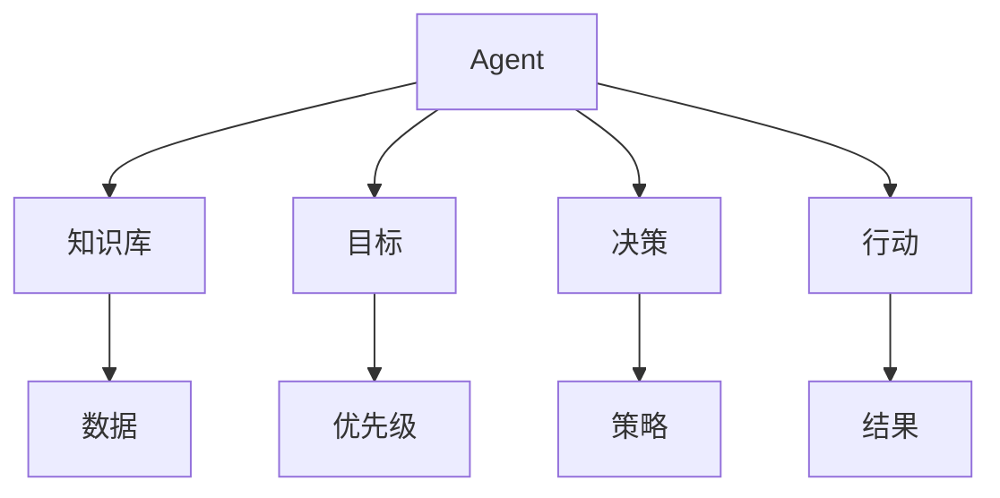
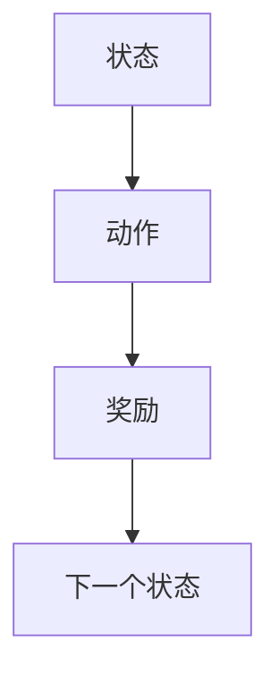
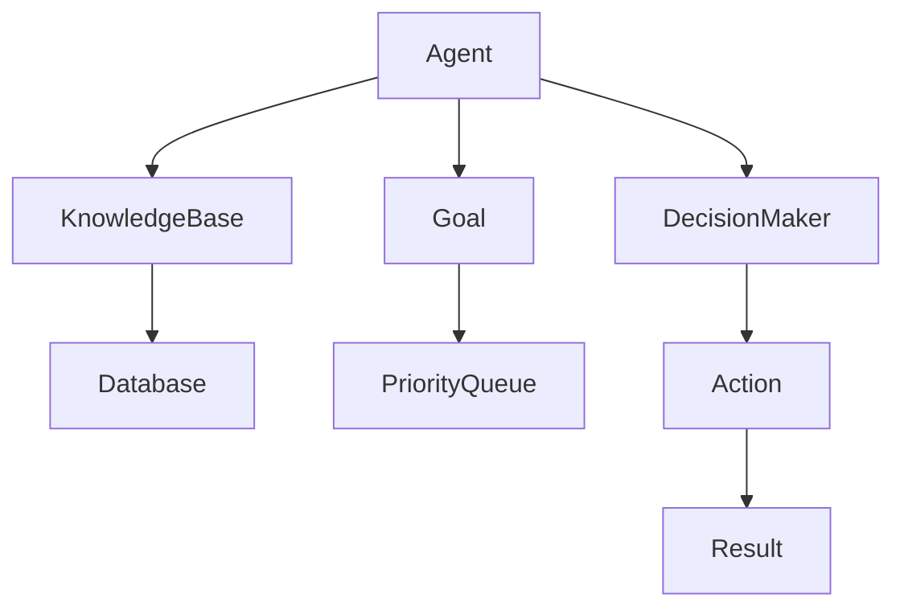

                 


# AI Agent在科研领域的应用：加速科学发现

> 关键词：AI Agent, 科研应用, 科学发现, 人工智能, 知识表示, 决策推理

> 摘要：本文探讨了AI Agent在科研领域的应用，分析了其如何通过自动化数据处理、知识整合与推理、实验设计优化等手段加速科学发现。文章从AI Agent的基本概念出发，深入探讨其核心原理、算法实现、系统架构，并通过实际案例展示其在不同科研领域的具体应用，最后总结了AI Agent在科研中的最佳实践与未来发展方向。

---

## 第一部分: AI Agent的基本概念与背景

### 第1章: AI Agent的基本概念与背景

#### 1.1 AI Agent的定义与特点
- **AI Agent的基本定义**  
  AI Agent（人工智能代理）是一种能够感知环境、执行目标导向行动的智能体。它通过感知输入信息，利用内部模型进行推理，制定决策并执行行动以实现目标。
- **AI Agent的核心特点**  
  - **自主性**：无需外部干预，自主决策。
  - **反应性**：能实时感知环境变化并做出反应。
  - **目标导向性**：所有行动均以实现特定目标为导向。
  - **学习能力**：通过经验改进性能。

#### 1.2 科研领域中的AI Agent应用现状
- **当前AI Agent在科研中的主要应用领域**  
  - **自然科学**：如物理、化学、天文学的研究。
  - **工程与技术**：如机器人技术、自动驾驶等领域的研究。
  - **医学与生物科学**：如疾病诊断、基因研究等。
- **AI Agent在科研中的优势与局限性**  
  - **优势**：提高研究效率，辅助发现新知识，降低实验成本。
  - **局限性**：依赖数据质量，处理复杂问题时可能受限。

---

### 第2章: AI Agent在科研中的核心作用

#### 2.1 AI Agent如何加速科学发现
- **数据处理与分析的自动化**  
  AI Agent能够快速处理海量数据，提取有用信息，发现数据中的模式和关系。
- **知识整合与推理能力**  
  AI Agent能够整合不同领域的知识，通过推理得出新的结论。
- **实验设计与优化的辅助作用**  
  AI Agent可以帮助设计实验方案，预测实验结果，优化实验参数。

#### 2.2 AI Agent在科研中的具体应用场景
- **自然科学领域的应用**  
  - 在天文学中，AI Agent用于分析星系数据，发现新星体。
  - 在物理学中，AI Agent用于模拟粒子运动，预测实验结果。
- **工程与技术领域的应用**  
  - 在机器人技术中，AI Agent用于路径规划和任务分配。
  - 在自动驾驶中，AI Agent用于实时决策和环境感知。
- **医学与生物科学领域的应用**  
  - 在疾病诊断中，AI Agent用于分析病灶图像，辅助医生诊断。
  - 在基因研究中，AI Agent用于分析基因序列，预测疾病风险。

---

### 第3章: AI Agent的核心概念与联系

#### 3.1 AI Agent的核心原理
- **知识表示与推理机制**  
  AI Agent通过知识表示（如符号逻辑、语义网络）来表示问题，并通过推理算法（如逻辑推理、概率推理）来推导新知识。
- **目标设定与决策过程**  
  AI Agent通过设定目标，并基于当前状态和可能的动作，选择最优行动方案。
- **学习与自适应能力**  
  AI Agent通过机器学习算法（如强化学习、监督学习）不断优化自身性能。

#### 3.2 AI Agent的实体关系架构


---

## 第二部分: AI Agent的算法原理与实现

### 第4章: AI Agent的算法原理

#### 4.1 基于强化学习的AI Agent算法

- **算法实现**  
  下面是一个简单的强化学习算法示例：
  ```python
  class AI-Agent:
      def __init__(self, state_space, action_space):
          self.state_space = state_space
          self.action_space = action_space
          self.model = self.build_model()

      def build_model(self):
          # 构建神经网络模型
          pass

      def act(self, state):
          # 根据当前状态选择动作
          pass

      def learn(self, state, action, reward, next_state):
          # 更新模型参数
          pass
  ```

- **数学模型与公式**  
  强化学习的目标是最优化奖励函数：
  $$ J(\theta) = \mathbb{E}[R_t] $$
  其中，$\theta$ 是模型参数，$R_t$ 是累积奖励。

---

### 第5章: AI Agent的系统架构设计

#### 5.1 系统功能设计
- **领域模型**  
  下面是一个简单的领域模型类图：
  ```mermaid
  classDiagram
      class Agent {
          - knowledge_base: KnowledgeBase
          - goal: Goal
          - decision_maker: DecisionMaker
          + act()
          + perceive()
      }
      class KnowledgeBase {
          + get_info()
      }
      class Goal {
          + is_achieved()
      }
      class DecisionMaker {
          + make_decision()
      }
  ```

#### 5.2 系统架构图


---

### 第6章: 项目实战与案例分析

#### 6.1 环境安装与代码实现
- **环境安装**  
  安装必要的库：
  ```bash
  pip install numpy matplotlib tensorflow
  ```

- **核心代码实现**  
  下面是一个简单的AI Agent实现：
  ```python
  import numpy as np
  import tensorflow as tf

  class SimpleAgent:
      def __init__(self, input_dim, output_dim):
          self.model = tf.keras.Sequential([
              tf.keras.layers.Dense(64, activation='relu', input_dim=input_dim),
              tf.keras.layers.Dense(output_dim, activation='linear')
          ])
          self.model.compile(optimizer='adam', loss='mse')

      def act(self, state):
          return self.model.predict(np.array([state]))[0]

      def train(self, state, target):
          self.model.fit(np.array([state]), np.array([target]), epochs=1, verbose=0)
  ```

#### 6.2 案例分析与应用解读
- **案例分析**  
  在药物发现中，AI Agent可以用于分析化合物的结构，预测其生物活性。
- **详细讲解**  
  AI Agent通过分析大量化合物数据，利用机器学习模型预测潜在药物分子，显著提高药物研发效率。

---

## 第三部分: 最佳实践与总结

### 第7章: 最佳实践与总结

#### 7.1 小结
- AI Agent在科研中的应用前景广阔，能够显著加速科学发现。
- 在实际应用中，需要结合具体问题选择合适的算法和架构。

#### 7.2 注意事项
- 数据质量对AI Agent的性能影响重大，需确保数据的准确性和完整性。
- 在实际应用中，需考虑系统的可解释性和透明性。

#### 7.3 拓展阅读
- 推荐阅读《强化学习导论》（刘德军）。
- 关注AI Agent在医疗领域的最新应用进展。

---

## 作者：AI天才研究院 & 禅与计算机程序设计艺术

---

通过以上结构，文章详细探讨了AI Agent在科研中的应用，从概念到实现，再到具体案例，为读者提供了全面的知识和实践指导。

