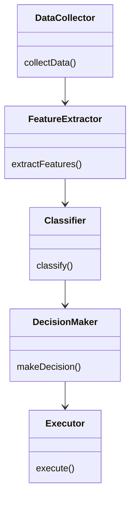

                 


# AI Agent在网络安全中的威胁检测

> 关键词：AI Agent，网络安全，威胁检测，机器学习，深度学习，强化学习

> 摘要：本文探讨了AI Agent在网络安全中的应用，特别是其在威胁检测方面的能力。通过分析AI Agent的核心原理、算法实现、系统架构设计以及实际案例，本文展示了如何利用AI技术提升网络安全威胁检测的效率和准确性。文章还总结了最佳实践和未来发展方向，为相关领域的研究者和实践者提供了有价值的参考。

---

# 第1章: AI Agent与网络安全威胁检测概述

## 1.1 AI Agent的基本概念

### 1.1.1 AI Agent的定义与特点
AI Agent（人工智能代理）是指能够感知环境、做出决策并执行操作的智能实体。它通常具备以下特点：
- **自主性**：能够独立运行，无需外部干预。
- **反应性**：能够实时感知环境变化并做出响应。
- **目标导向**：具有明确的目标，能够优化决策以实现目标。
- **学习能力**：能够通过经验改进性能。

### 1.1.2 网络安全威胁检测的挑战
网络安全威胁检测面临以下挑战：
- **复杂性**：网络攻击手段多样化，难以通过传统规则检测。
- **实时性**：需要快速响应，避免攻击造成损失。
- **数据量大**：网络日志和流量数据庞大，需要高效处理。

### 1.1.3 AI Agent在威胁检测中的优势
AI Agent的优势体现在：
- **自动化**：能够自动分析数据，识别异常行为。
- **自适应性**：能够根据新数据不断优化检测模型。
- **高效性**：通过机器学习算法快速处理海量数据。

---

## 1.2 网络安全威胁检测的背景与现状

### 1.2.1 网络安全威胁的种类与特征
网络安全威胁主要包括：
- **病毒**：通过感染文件传播。
- **木马**：伪装成无害程序，窃取信息。
- **DDoS攻击**：通过流量攻击耗尽服务器资源。
- **钓鱼攻击**：欺骗用户泄露敏感信息。

### 1.2.2 传统威胁检测方法的局限性
传统方法依赖规则匹配，难以应对新型攻击方式。

### 1.2.3 AI Agent技术的引入与应用
AI Agent通过机器学习和深度学习技术，能够发现隐藏在数据中的异常模式。

---

## 1.3 AI Agent在威胁检测中的核心作用

### 1.3.1 AI Agent的感知能力
AI Agent通过传感器或日志收集数据，进行特征提取。

### 1.3.2 AI Agent的决策能力
基于感知数据，AI Agent利用算法做出威胁判断。

### 1.3.3 AI Agent的执行能力
根据决策结果，执行阻断或告警等操作。

---

## 1.4 本章小结
本章介绍了AI Agent的基本概念及其在网络安全威胁检测中的作用，分析了传统方法的局限性，为后续章节奠定了基础。

---

# 第2章: AI Agent的核心原理

## 2.1 AI Agent的感知模块

### 2.1.1 数据采集与预处理
AI Agent通过网络日志、流量数据等多源数据进行采集，并进行清洗和标准化。

### 2.1.2 特征提取与表示
利用统计特征或深度学习特征提取技术，将原始数据转换为高维特征向量。

### 2.1.3 感知模型的构建与训练
采用监督或无监督学习方法训练感知模型，提取威胁特征。

---

## 2.2 AI Agent的决策模块

### 2.2.1 决策规则的制定
基于预设规则或历史数据，制定决策策略。

### 2.2.2 基于概率的决策模型
利用贝叶斯网络等概率模型进行威胁概率评估。

### 2.2.3 决策优化与强化学习
通过强化学习不断优化决策策略，提高检测准确率。

---

## 2.3 AI Agent的执行模块

### 2.3.1 响应策略
根据决策结果，执行阻断、隔离或告警等操作。

### 2.3.2 执行模块的设计
设计高效的执行机制，确保快速响应。

---

## 2.4 本章小结
本章详细讲解了AI Agent的核心原理，包括感知、决策和执行模块的设计与实现。

---

# 第3章: AI Agent算法原理

## 3.1 监督学习算法

### 3.1.1 分类算法
常用的支持向量机（SVM）和随机森林（RF）算法。

### 3.1.2 分类器的损失函数
$$ L = -\sum_{i=1}^n y_i \log p(y_i) + (1 - y_i) \log (1 - p(y_i)) $$

### 3.1.3 模型优化
通过网格搜索优化模型参数，提升分类性能。

---

## 3.2 无监督学习算法

### 3.2.1 聚类算法
K-means和DBSCAN算法在异常检测中的应用。

### 3.2.2 聚类模型的评估
使用轮廓系数评估聚类效果。

---

## 3.3 强化学习算法

### 3.3.1 强化学习框架
马尔可夫决策过程（MDP）模型。

### 3.3.2 策略网络
通过策略梯度方法优化策略网络参数。

$$ \theta_{t+1} = \theta_t + \alpha \nabla J(\theta_t) $$

---

## 3.4 本章小结
本章详细讲解了AI Agent中常用的监督学习、无监督学习和强化学习算法，及其在网络威胁检测中的应用。

---

# 第4章: AI Agent威胁检测系统架构设计

## 4.1 系统功能设计

### 4.1.1 领域模型
使用mermaid类图展示系统各模块的关系。



---

## 4.2 系统架构设计

### 4.2.1 系统架构
使用mermaid架构图展示系统整体架构。

```mermaid
archi
    title AI Agent Threat Detection System Architecture
    client ---(get data)--> DataCollector
    DataCollector --> FeatureExtractor
    FeatureExtractor --> Classifier
    Classifier --> DecisionMaker
    DecisionMaker --> Executor
    Executor --> Database
```

---

## 4.3 接口设计

### 4.3.1 数据接口
定义数据输入输出接口规范。

### 4.3.2 API接口
提供RESTful API供其他系统调用。

---

## 4.4 本章小结
本章详细设计了AI Agent威胁检测系统的架构和接口，为后续实现奠定了基础。

---

# 第5章: AI Agent威胁检测系统实现

## 5.1 环境搭建

### 5.1.1 工具安装
安装Python、TensorFlow、Scikit-learn等工具。

## 5.2 核心代码实现

### 5.2.1 数据预处理代码
```python
import pandas as pd
from sklearn.preprocessing import StandardScaler

# 加载数据
data = pd.read_csv('network_logs.csv')

# 数据清洗
data.dropna(inplace=True)
data = pd.get_dummies(data)

# 标准化处理
scaler = StandardScaler()
data_scaled = scaler.fit_transform(data)
```

### 5.2.2 模型训练代码
```python
from sklearn.model_selection import train_test_split
from sklearn.svm import SVC

# 划分训练集和测试集
X_train, X_test, y_train, y_test = train_test_split(data_scaled, data['label'], test_size=0.2)

# 训练分类器
model = SVC()
model.fit(X_train, y_train)
```

### 5.2.3 模型评估代码
```python
from sklearn.metrics import accuracy_score

# 模型预测
y_pred = model.predict(X_test)

# 计算准确率
accuracy = accuracy_score(y_test, y_pred)
print(f'Accuracy: {accuracy}')
```

---

## 5.3 本章小结
本章详细展示了AI Agent威胁检测系统的实现过程，包括环境搭建和核心代码实现。

---

# 第6章: AI Agent在网络安全中的应用与未来展望

## 6.1 应用案例分析

### 6.1.1 病毒检测
通过AI Agent实时监控文件行为，识别病毒特征。

### 6.1.2 网络入侵检测
基于流量分析，识别DDoS攻击。

## 6.2 最佳实践

### 6.2.1 数据预处理的重要性
确保数据质量，避免模型误判。

### 6.2.2 模型的可解释性
选择可解释性较强的模型，便于分析和优化。

## 6.3 未来展望

### 6.3.1 AI Agent与区块链的结合
利用区块链技术增强数据安全性和不可篡改性。

### 6.3.2 多模态学习
结合文本、图像等多种数据源，提升检测能力。

---

## 6.4 本章小结
本章总结了AI Agent在网络安全中的应用，并展望了未来的发展方向。

---

# 附录

## 附录A: 数据集
常用的网络安全数据集包括KDD Cup、NSL-KDD等。

## 附录B: 工具与库
- Python库：Scikit-learn、TensorFlow
- 开发工具：Jupyter、VS Code

---

# 作者

作者：AI天才研究院/AI Genius Institute & 禅与计算机程序设计艺术 /Zen And The Art of Computer Programming

---

通过以上结构，文章详细讲解了AI Agent在网络安全中的应用，从基础概念到算法实现再到系统设计，层层递进，为读者提供了全面的知识体系。

