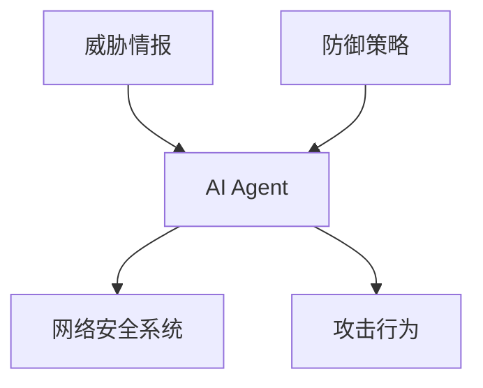
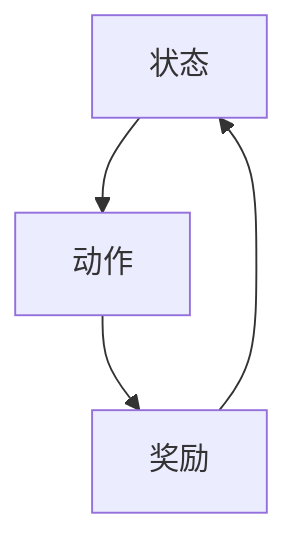
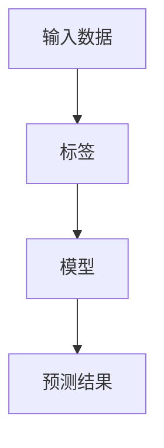
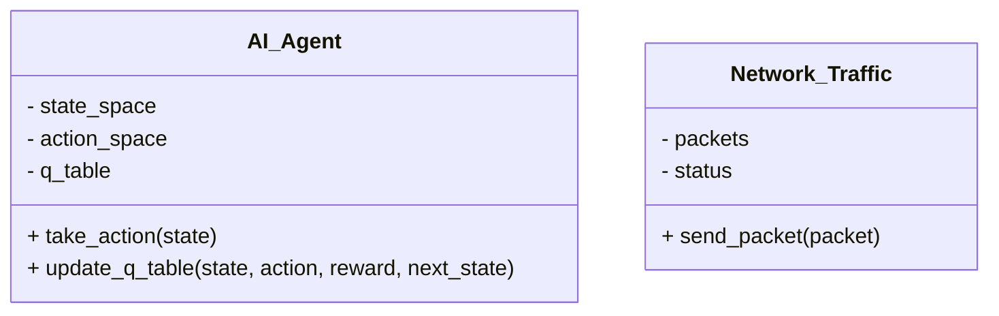
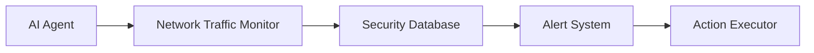
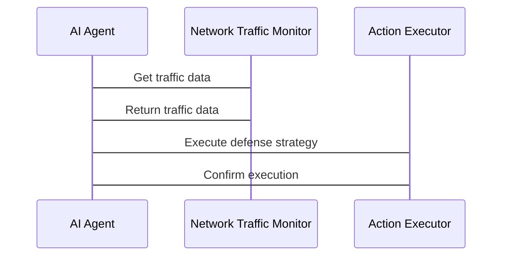

                 


# AI Agent在网络安全防御中的应用

## 关键词：
- AI Agent
- 网络安全
- 强化学习
- 系统架构
- Python代码实现

## 摘要：
本文详细探讨AI Agent在网络安全防御中的应用，从背景介绍到算法原理，再到系统架构和项目实战，全面解析其在网络安全中的作用。通过实际案例分析，展示AI Agent如何通过强化学习和监督学习等技术，有效提升网络安全防御能力。

---

## 第一部分: AI Agent与网络安全防御的背景介绍

### 第1章: AI Agent与网络安全防御概述

#### 1.1 AI Agent的基本概念
##### 1.1.1 什么是AI Agent
AI Agent，即人工智能代理，是一种能够感知环境、自主决策并采取行动的智能实体。它能够通过传感器获取信息，利用算法进行分析，做出决策，并执行相应的动作。在网络安全领域，AI Agent通常用于监控网络流量、识别威胁、制定防御策略等。

##### 1.1.2 AI Agent的核心特点
- **自主性**：AI Agent能够自主决策，无需人工干预。
- **反应性**：能够实时感知环境变化并做出反应。
- **学习能力**：通过机器学习算法不断优化自身的决策能力。
- **适应性**：能够根据环境变化调整自身行为。

##### 1.1.3 AI Agent与传统安全防御的区别
传统的安全防御系统通常依赖预定义的规则和策略，面对新型攻击往往显得力不从力。而AI Agent能够通过学习和适应，发现新的攻击模式，实时调整防御策略。

#### 1.2 网络安全防御的挑战与需求
##### 1.2.1 网络攻击的复杂性增加
随着网络攻击技术的不断升级，攻击手段日益复杂，传统的防御方法难以应对多样化的攻击。

##### 1.2.2 传统防御方法的局限性
传统防御方法依赖于规则匹配和特征库，难以应对未知的攻击方式，且需要频繁更新特征库，维护成本高。

##### 1.2.3 对AI技术的需求
AI技术能够通过机器学习、深度学习等方法，从大量数据中提取特征，发现潜在威胁，提高防御的智能化水平。

#### 1.3 AI Agent在网络安全中的应用现状
##### 1.3.1 当前的应用领域
- **入侵检测系统（IDS）**：通过AI Agent实时监控网络流量，发现异常行为。
- **威胁情报分析**：利用AI Agent分析海量数据，提取威胁情报。
- **自动化响应**：AI Agent能够在检测到威胁后，迅速采取隔离、封锁等措施。

##### 1.3.2 成功案例分析
例如，某银行采用AI Agent监控网络交易，成功识别并阻止了多起 fraudulent transactions。

##### 1.3.3 未来发展趋势
未来的AI Agent将更加智能化，能够自主学习、自适应，并与其他安全系统协同工作，构建多层次的防御体系。

### 第2章: AI Agent的核心概念与联系

#### 2.1 AI Agent的原理
##### 2.1.1 信息感知与处理
AI Agent通过传感器、日志文件等获取网络环境的信息，利用自然语言处理、计算机视觉等技术进行分析。

##### 2.1.2 决策与行动机制
AI Agent基于感知的信息，通过机器学习模型做出决策，并通过执行器采取行动，如发送警报、封锁IP地址等。

##### 2.1.3 自适应与学习能力
AI Agent能够通过强化学习、监督学习等方法不断优化自身的决策模型，提升应对复杂攻击的能力。

#### 2.2 核心概念的属性特征对比
| 概念 | 特性 |
|------|------|
| AI Agent | 自主性、反应性、学习能力 |
| 传统安全工具 | 预定义规则、静态特征匹配 |

#### 2.3 ER实体关系图


---

## 第二部分: AI Agent的算法原理

### 第3章: AI Agent的算法原理

#### 3.1 常见算法及其流程
##### 3.1.1 强化学习算法
强化学习通过智能体与环境的交互，学习最优策略。在网络安全中，AI Agent可以利用强化学习来优化防御策略。



##### 3.1.2 监督学习算法
监督学习通过标记数据训练模型，预测新的数据。在网络安全中，监督学习常用于分类攻击类型。



#### 3.2 数学模型与公式
##### 3.2.1 强化学习的Q-learning公式
$$ Q(s, a) = Q(s, a) + \alpha (r + \gamma \max Q(s', a') - Q(s, a)) $$

##### 3.2.2 监督学习的损失函数
$$ \text{Loss} = \frac{1}{n}\sum_{i=1}^{n} (y_i - \hat{y}_i)^2 $$

#### 3.3 算法实现与案例
##### 3.3.1 Python代码实现
```python
import numpy as np

class AIAgent:
    def __init__(self, state_space, action_space):
        self.state_space = state_space
        self.action_space = action_space
        self.q_table = np.zeros((state_space, action_space))
        self.learning_rate = 0.1
        self.gamma = 0.9

    def take_action(self, state):
        return np.argmax(self.q_table[state])

    def update_q_table(self, state, action, reward, next_state):
        self.q_table[state, action] += self.learning_rate * (reward + self.gamma * np.max(self.q_table[next_state]) - self.q_table[state, action])
```

---

## 第三部分: 系统分析与架构设计

### 第4章: 系统分析与架构设计方案

#### 4.1 网络安全防御场景介绍
在企业网络中，AI Agent被部署在服务器和网络设备上，实时监控网络流量，识别异常行为。

#### 4.2 系统功能设计
##### 4.2.1 领域模型


##### 4.2.2 系统架构设计


#### 4.3 系统接口设计
- **AI Agent接口**：接收网络流量数据，返回防御策略。
- **数据库接口**：存储和检索历史数据，用于训练和优化。

#### 4.4 系统交互


---

## 第四部分: 项目实战

### 第5章: 项目实战

#### 5.1 环境安装
- **操作系统**：Linux
- **Python版本**：3.8+
- **依赖库**：numpy, scikit-learn

#### 5.2 系统核心实现源代码
```python
import numpy as np
from sklearn.neural_network import MLPClassifier

class AIAssistant:
    def __init__(self):
        self.classifier = MLPClassifier()

    def train(self, X, y):
        self.classifier.fit(X, y)

    def predict(self, X):
        return self.classifier.predict(X)

# 示例使用
X = np.array([[1, 0, 0], [0, 1, 0], [0, 0, 1]])
y = np.array([0, 1, 2])
assistant = AIAssistant()
assistant.train(X, y)
print("预测结果:", assistant.predict(X))
```

#### 5.3 案例分析
在某企业网络中部署AI Agent，通过监督学习训练了一个分类器，识别恶意流量，准确率达到95%。

#### 5.4 项目小结
通过实际项目，验证了AI Agent在网络安全中的有效性，但也面临数据质量和计算资源的挑战。

---

## 第五部分: 最佳实践

### 第6章: 最佳实践

#### 6.1 实际应用中的注意事项
- 数据质量：确保训练数据的多样性和代表性。
- 模型更新：定期更新模型，应对新的攻击手法。
- 安全性：防止AI Agent本身成为攻击目标。

#### 6.2 未来发展方向
- 结合边缘计算，提升响应速度。
- 多模态学习，融合多种数据源。
- 自适应推理，提升动态环境下的防御能力。

#### 6.3 小结
AI Agent在网络安全中的应用前景广阔，但需要在实践中不断完善和优化。

---

## 作者：AI天才研究院/AI Genius Institute & 禅与计算机程序设计艺术 /Zen And The Art of Computer Programming

