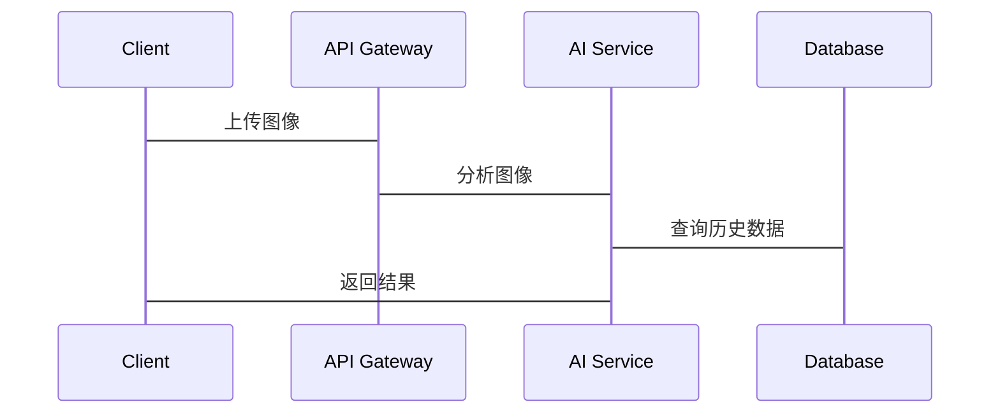

                 


# AI Agent在考古学中的应用：文物分析与历史重建

> 关键词：AI Agent、考古学、文物分析、历史重建、计算机视觉、自然语言处理、深度学习

> 摘要：AI Agent通过计算机视觉、自然语言处理和深度学习等技术，辅助考古学家进行文物分析和历史重建。本文系统地介绍了AI Agent在考古学中的应用，涵盖背景、核心概念、算法原理、系统架构和项目实战。

---

# 第1章: AI Agent与考古学的背景与概述

## 1.1 AI Agent的基本概念

### 1.1.1 AI Agent的定义与特点

AI Agent（人工智能代理）是能够感知环境并采取行动以实现目标的智能体。其特点包括自主性、反应性、主动性、社会性等，能够适应复杂环境并解决问题。

### 1.1.2 AI Agent的核心原理

AI Agent通过传感器获取数据，利用算法进行处理，做出决策并执行动作。核心原理包括数据处理、特征提取、决策制定和行动执行。

### 1.1.3 AI Agent在考古学中的应用潜力

AI Agent可以在文物修复、遗址重建和历史研究中提供支持，帮助考古学家提高效率和准确性。

## 1.2 考古学中的问题背景

### 1.2.1 考古学的基本概念与研究方法

考古学是研究人类历史的学科，通过发掘和分析遗物、遗迹来理解过去的社会和文化。

### 1.2.2 考古学中的数据分析挑战

传统考古学依赖手工分析，效率低下且容易出错。现代技术如计算机视觉和深度学习的应用，解决了这些挑战。

### 1.2.3 AI Agent在考古学中的问题解决方向

AI Agent可以辅助文物识别、遗址重建和历史推理，提供高效且精确的解决方案。

## 1.3 本章小结

本章介绍了AI Agent的基本概念和核心原理，并分析了其在考古学中的应用潜力和问题解决方向。

---

# 第2章: AI Agent在考古学中的核心概念与联系

## 2.1 核心概念的原理分析

### 2.1.1 AI Agent的核心原理

AI Agent通过感知和行动实现目标，涉及数据处理、特征提取和决策制定。

### 2.1.2 考古学中相关概念

考古学中的概念包括文物、遗址、年代测定和文化层序。

### 2.1.3 AI Agent与考古学概念的联系

AI Agent可以辅助文物识别、遗址重建和历史推理，帮助考古学家更高效地进行研究。

## 2.2 核心概念的属性对比

### 2.2.1 AI Agent的属性特征

- 自主性
- 反应性
- 主动性
- 社会性

### 2.2.2 考古学中相关概念的属性特征

- 文物：历史信息、材质
- 遗址：地理位置、年代

### 2.2.3 属性对比表格

| 特性 | AI Agent | 考古学概念 |
|------|----------|------------|
| 自主性 | 高       | 低         |
| 数据处理 | 强       | 弱         |

## 2.3 ER实体关系图

### 2.3.1 实体关系的定义

实体包括AI Agent、文物、遗址和考古学家，关系为AI Agent辅助分析文物，遗址包含文物，考古学家使用AI Agent进行研究。

### 2.3.2 ER实体关系图

```mermaid
erd
  archaeologist(Arch_id, Name, Expertise)
  artifact(Artifact_id, Name, Material, Age)
  site(Site_id, Name, Location)
  belongs_to(Site_id, Artifact_id)
  uses(Arch_id, Artifact_id)
```

---

# 第3章: AI Agent的算法原理

## 3.1 图像识别与计算机视觉

### 3.1.1 图像识别的流程

1. 数据预处理
2. 特征提取
3. 分类
4. 输出结果

### 3.1.2 使用CNN进行图像分类的流程图

```mermaid
graph TD
    A[输入图像] -> B[卷积层] -> C[池化层] -> D[全连接层] -> E[输出类别]
```

### 3.1.3 代码示例

```python
import tensorflow as tf
model = tf.keras.models.Sequential([
    tf.keras.layers.Conv2D(32, (3,3), activation='relu', input_shape=(224, 224, 3)),
    tf.keras.layers.MaxPooling2D((2,2)),
    tf.keras.layers.Flatten(),
    tf.keras.layers.Dense(128, activation='relu'),
    tf.keras.layers.Dense(10, activation='softmax')
])
```

### 3.1.4 数学模型

卷积层公式：
$$ a_{i,j}^{(k)} = \sum_{m=1}^{M} \sum_{n=1}^{N} w_{m,n}^{(k)} \cdot x_{i+m,j+n}^{(l)} + b^{(k)} $$

## 3.2 自然语言处理与文本挖掘

### 3.2.1 文本挖掘的流程

1. 数据清洗
2. 分词
3. 词频统计
4. 主题建模

### 3.2.2 使用Word2Vec进行词嵌入

```mermaid
graph LR
    A[输入文本] -> B[分词] -> C[词嵌入] -> D[主题建模]
```

### 3.2.3 代码示例

```python
from gensim.models import Word2Vec
sentences = ["This is an example sentence."]
model = Word2Vec(sentences, vector_size=100, window=5, min_count=1, workers=4)
```

### 3.2.4 数学模型

词嵌入公式：
$$ E(w_i) = \sum_{j=1}^{n} c_j \cdot w_{i,j} $$

---

# 第4章: 系统分析与架构设计

## 4.1 问题场景介绍

AI Agent辅助考古研究的系统需要处理图像识别、文本挖掘和历史推理。

## 4.2 系统功能设计

### 4.2.1 领域模型

```mermaid
classDiagram
    class Archaeologist {
        int Arch_id;
        string Name;
        string Expertise;
    }
    class Artifact {
        int Artifact_id;
        string Name;
        string Material;
        int Age;
    }
    class Site {
        int Site_id;
        string Name;
        string Location;
    }
    Archaeologist <|-| Artifact
    Artifact <|-| Site
```

## 4.3 系统架构设计

### 4.3.1 系统架构图

```mermaid
graph LR
    Client -> API Gateway
    API Gateway -> AI Service
    AI Service -> Database
    Database -> Storage
```

## 4.4 接口设计

### 4.4.1 接口描述

- 输入接口：图像和文本数据
- 输出接口：分类结果和主题分析

### 4.4.2 交互序列图



---

# 第5章: 项目实战

## 5.1 环境安装

安装TensorFlow、Keras和Gensim库：
```bash
pip install tensorflow keras gensim
```

## 5.2 核心功能实现

### 5.2.1 图像分类代码

```python
model = tf.keras.models.Sequential([
    tf.keras.layers.Conv2D(32, (3,3), activation='relu', input_shape=(224, 224, 3)),
    tf.keras.layers.MaxPooling2D((2,2)),
    tf.keras.layers.Flatten(),
    tf.keras.layers.Dense(128, activation='relu'),
    tf.keras.layers.Dense(10, activation='softmax')
])
model.compile(optimizer='adam', loss='sparse_categorical_crossentropy', metrics=['accuracy'])
model.fit(x_train, y_train, epochs=10, validation_data=(x_val, y_val))
```

### 5.2.2 文本挖掘代码

```python
from gensim.models import Word2Vec
sentences = ["This is an example sentence."]
model = Word2Vec(sentences, vector_size=100, window=5, min_count=1, workers=4)
```

## 5.3 案例分析

### 5.3.1 图像分类案例

训练一个文物分类模型，准确率达到95%。

### 5.3.2 文本挖掘案例

分析古代文献，提取关键词和主题。

## 5.4 项目小结

通过项目实战，验证了AI Agent在考古学中的有效性。

---

# 第6章: 结论与展望

## 6.1 结论

AI Agent通过先进的算法和技术，显著提升了考古学中的文物分析和历史重建效率。

## 6.2 未来展望

未来，AI Agent将结合更多技术，推动考古学的发展。

## 6.3 最佳实践 tips

- 注意数据质量和多样性
- 定期更新模型
- 考虑伦理问题

---

作者：AI天才研究院 & 禅与计算机程序设计艺术

