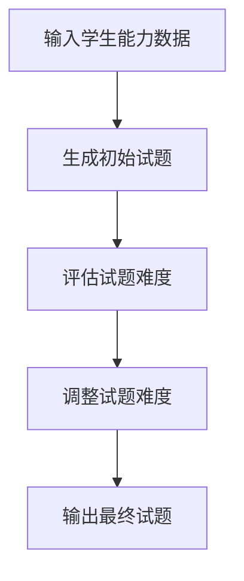
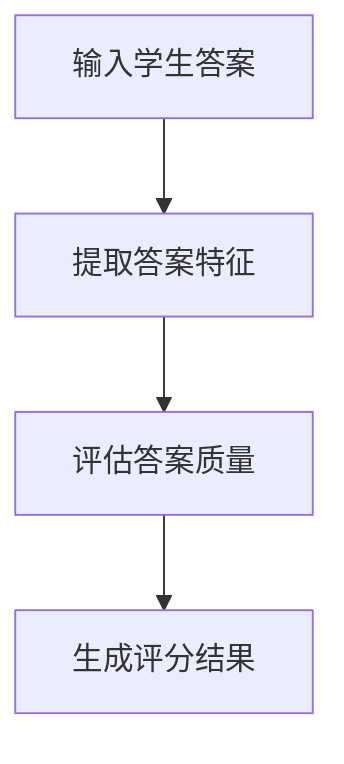
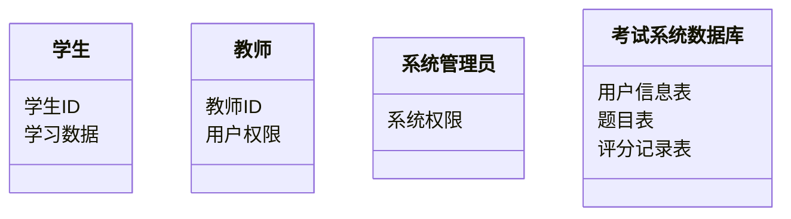
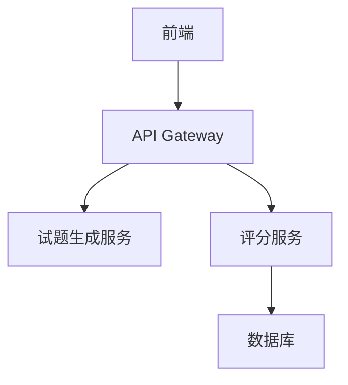

                 


# AI Agent在考试系统中的应用：自适应题目生成与评分

## 关键词：AI Agent, 自适应考试系统, 自动评分系统, 智能教育技术, 个性化学习, 机器学习算法

## 摘要：  
本文探讨了AI Agent在现代考试系统中的应用，特别是自适应题目生成和智能评分技术。通过分析AI Agent的核心原理，结合具体的算法实现，本文详细介绍了如何利用这些技术构建自适应考试系统。通过实际案例分析，本文展示了如何利用AI Agent生成个性化试题，并实现智能评分。最后，本文总结了自适应考试系统的优势，并展望了其未来的发展方向。

## 第1章: 背景介绍

### 1.1 问题背景

#### 1.1.1 传统考试系统的局限性  
传统考试系统在题目生成和评分方面存在诸多限制。首先，传统考试系统通常依赖人工编写试题，这不仅耗时耗力，而且难以满足大规模个性化学习的需求。其次，评分过程通常依赖人工判卷，这不仅效率低下，还容易受到主观因素的影响，导致评分不公。  

#### 1.1.2 AI技术在教育领域的潜力  
随着人工智能技术的快速发展，AI在教育领域的应用越来越广泛。AI技术可以实现个性化学习、智能评分、自适应教学等，为传统教育模式带来了革新。特别是在考试系统中，AI技术可以通过分析学生的学习数据，生成个性化试题，并提供精准的评分结果。  

#### 1.1.3 自适应学习的需求驱动  
自适应学习是一种基于学生个体差异，提供个性化学习内容和策略的教学模式。在考试系统中，自适应学习的需求主要体现在个性化试题生成和动态评分两个方面。AI Agent可以通过分析学生的学习数据，动态调整试题难度和内容，从而满足学生的个性化学习需求。  

### 1.2 问题描述

#### 1.2.1 考试系统的核心功能  
考试系统的核心功能包括试题生成、试题管理、试题评分和结果分析。传统的考试系统通常依赖人工操作，难以满足大规模个性化学习的需求。  

#### 1.2.2 自适应题目生成的需求  
自适应题目生成的需求主要体现在个性化和动态性两个方面。个性化要求试题能够根据学生的知识水平和学习进度进行调整，动态性则要求试题生成能够实时响应学生的学习需求。  

#### 1.2.3 AI Agent在评分中的作用  
AI Agent在评分中的作用主要体现在智能化和精准化两个方面。智能化评分系统可以通过自然语言处理技术实现自动评分，而精准化评分则可以通过机器学习算法实现对评分结果的优化。  

### 1.3 问题解决

#### 1.3.1 AI Agent在考试系统中的角色  
AI Agent在考试系统中扮演着多重角色，既是试题生成的引擎，又是评分系统的智能核心。通过AI Agent，考试系统可以实现试题的自动生成和智能评分，从而提高考试的效率和精准度。  

#### 1.3.2 自适应题目生成的实现路径  
自适应题目生成的实现路径主要包括以下几个步骤：首先，通过分析学生的学习数据，确定学生的知识水平和能力特点；其次，基于这些数据，利用生成模型生成个性化试题；最后，通过评分模型对生成的试题进行评估和优化。  

#### 1.3.3 智能评分系统的构建  
智能评分系统的构建主要包括以下几个步骤：首先，通过自然语言处理技术提取学生答案的关键特征；其次，利用机器学习算法对这些特征进行分析和评分；最后，根据评分结果生成个性化的反馈报告。  

### 1.4 边界与外延

#### 1.4.1 AI Agent在考试系统中的应用边界  
AI Agent在考试系统中的应用边界主要体现在功能范围和技术实现两个方面。功能范围方面，AI Agent主要负责试题生成和评分，而不涉及考试系统的其他功能，如试题管理。技术实现方面，AI Agent的核心是算法实现，而不涉及系统的其他实现细节。  

#### 1.4.2 自适应学习的适用范围  
自适应学习的适用范围主要体现在个性化学习和动态调整两个方面。个性化学习适用于所有学生，而动态调整则适用于需要实时反馈的学习场景。  

#### 1.4.3 与其他教育技术的关联  
AI Agent在考试系统中的应用与其他教育技术密切相关。例如，学习分析技术可以为AI Agent提供学生的学习数据，而自然语言处理技术可以为智能评分系统提供技术支持。  

### 1.5 概念结构与核心要素

#### 1.5.1 AI Agent的基本构成  
AI Agent的基本构成主要包括感知层、决策层和执行层。感知层负责获取输入数据，决策层负责分析数据并生成决策，执行层负责执行决策并输出结果。  

#### 1.5.2 自适应考试系统的功能模块  
自适应考试系统的主要功能模块包括试题生成模块、试题管理模块、评分模块和结果分析模块。  

#### 1.5.3 核心要素的相互关系  
AI Agent和自适应考试系统之间的关系是相互依赖、相互促进的。AI Agent为自适应考试系统提供技术支持，而自适应考试系统则为AI Agent提供应用场景。  

## 第2章: 核心概念与联系

### 2.1 AI Agent的核心原理

#### 2.1.1 AI Agent的基本定义  
AI Agent是一种能够感知环境并采取行动以实现目标的智能实体。在考试系统中，AI Agent主要用于试题生成和评分。  

#### 2.1.2 基于Transformer的生成模型  
基于Transformer的生成模型是一种常用的自然语言处理模型，广泛应用于文本生成任务。在考试系统中，生成模型可以用来生成个性化试题。  

#### 2.1.3 基于强化学习的评分模型  
基于强化学习的评分模型是一种通过不断试错来优化评分结果的技术。在考试系统中，评分模型可以用来实现智能评分。  

### 2.2 自适应考试系统的关键特征

#### 2.2.1 自适应性  
自适应性是指系统能够根据学生的学习情况动态调整试题内容和难度。  

#### 2.2.2 智能性  
智能性是指系统能够通过分析学生的学习数据，实现智能化的试题生成和评分。  

#### 2.2.3 个性化  
个性化是指系统能够根据学生的个体差异，提供个性化的试题和评分结果。  

### 2.3 核心概念对比表

| 概念 | 特征 | 描述 |
|------|------|------|
| AI Agent | 生成能力 | 自动生成试题 |
| 自适应系统 | 个性化 | 根据学生能力调整试题难度 |

### 2.4 ER实体关系图

```mermaid
er
actor: 学生
actor: 教师
actor: 系统管理员
database: 考试系统数据库
database: 用户信息表
database: 题目表
database: 评分记录表
```

## 第3章: 算法原理讲解

### 3.1 生成模型的算法流程



### 3.2 生成模型的数学模型

$$P(\text{试题} | \text{学生能力}) = \text{softmax}(W \cdot \text{输入} + b)$$

### 3.3 评分模型的算法流程



### 3.4 评分模型的数学模型

$$S(\text{答案}) = \sum_{i=1}^{n} w_i \cdot f_i(\text{答案})$$

## 第4章: 系统分析与架构设计

### 4.1 系统分析

#### 4.1.1 问题场景介绍  
考试系统的主要问题包括试题生成效率低、评分不公等。AI Agent的应用可以有效解决这些问题。  

#### 4.1.2 项目介绍  
本项目旨在开发一个基于AI Agent的自适应考试系统，实现试题的自动生成和智能评分。  

### 4.2 系统功能设计

#### 4.2.1 领域模型



#### 4.2.2 系统架构设计



#### 4.2.3 系统接口设计  
系统接口设计主要包括试题生成接口、评分接口和结果查询接口。  

#### 4.2.4 系统交互设计

```mermaid
sequenceDiagram
actor 学生
participant 系统管理员
participant 考试系统数据库
actor 学生 -> 系统管理员: 请求生成试题
系统管理员 -> 考试系统数据库: 查询学生数据
考试系统数据库 -> 系统管理员: 返回学生数据
系统管理员 -> 学生: 生成试题
```

## 第5章: 项目实战

### 5.1 环境安装

#### 5.1.1 安装Python
安装Python 3.8及以上版本。

#### 5.1.2 安装依赖库
安装必要的依赖库，如TensorFlow、Keras等。

### 5.2 核心代码实现

#### 5.2.1 生成模型实现

```python
import tensorflow as tf
from tensorflow.keras.layers import Dense, InputLayer

model = tf.keras.Sequential([
    InputLayer(input_shape=(input_dim,)),
    Dense(units=10, activation='relu'),
    Dense(units=1, activation='sigmoid')
])
model.compile(optimizer='adam', loss='binary_crossentropy', metrics=['accuracy'])
model.fit(X_train, y_train, epochs=10, batch_size=32)
```

#### 5.2.2 评分模型实现

```python
import numpy as np

def score_model(answer, model):
    features = extract_features(answer)
    prediction = model.predict(features)
    return prediction[0][0]
```

### 5.3 代码解读与分析

#### 5.3.1 生成模型代码解读
上述代码实现了基于神经网络的生成模型。首先定义了输入层和两个全连接层，然后编译模型并进行训练。

#### 5.3.2 评分模型代码解读
上述代码实现了基于机器学习的评分模型。首先提取了答案特征，然后利用预训练的模型进行预测，最终返回评分结果。

### 5.4 实际案例分析

#### 5.4.1 案例背景
假设有一个学生，其学习数据表明他在数学方面存在薄弱环节。系统需要为他生成一组针对性的数学试题，并进行智能评分。

#### 5.4.2 案例分析
通过分析学生的学习数据，系统生成了难度适中的数学试题，并利用评分模型对学生的答案进行了自动评分，最终生成了个性化的反馈报告。

## 第6章: 总结与展望

### 6.1 最佳实践 tips

#### 6.1.1 系统优化建议
建议在实际应用中，结合具体场景对系统进行优化，例如优化生成模型的训练数据，提升评分模型的准确率等。

#### 6.1.2 技术路线选择
在技术路线选择上，建议根据实际需求选择合适的AI技术，例如在生成模型中选择适合的算法等。

#### 6.1.3 系统维护与更新
建议定期对系统进行维护和更新，确保系统能够适应新的技术发展和用户需求。

### 6.2 小结
本文详细探讨了AI Agent在考试系统中的应用，特别是自适应题目生成和智能评分技术。通过分析AI Agent的核心原理，结合具体的算法实现，本文展示了如何利用这些技术构建自适应考试系统。

### 6.3 注意事项
在实际应用中，需要注意数据隐私保护和系统安全性，避免数据泄露和系统攻击。

### 6.4 拓展阅读
建议读者进一步阅读相关领域的最新研究成果，例如自适应学习的最新算法和AI技术在教育中的其他应用。

## 作者：AI天才研究院 & 禅与计算机程序设计艺术

