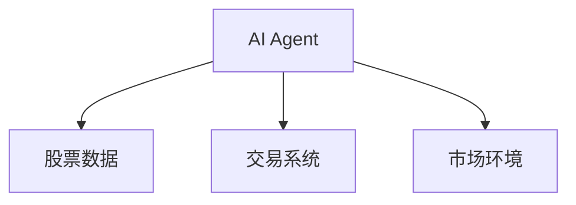
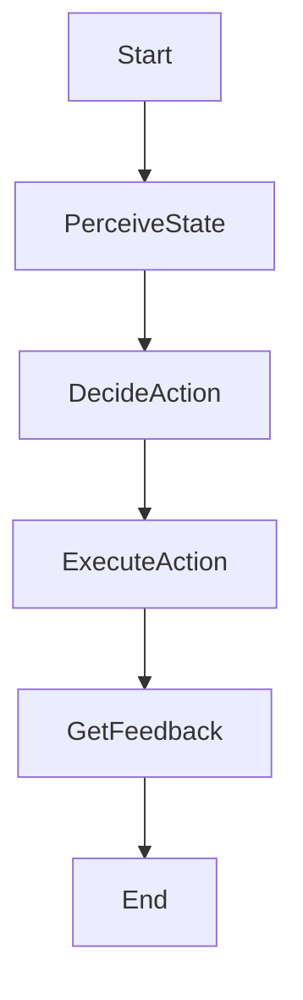
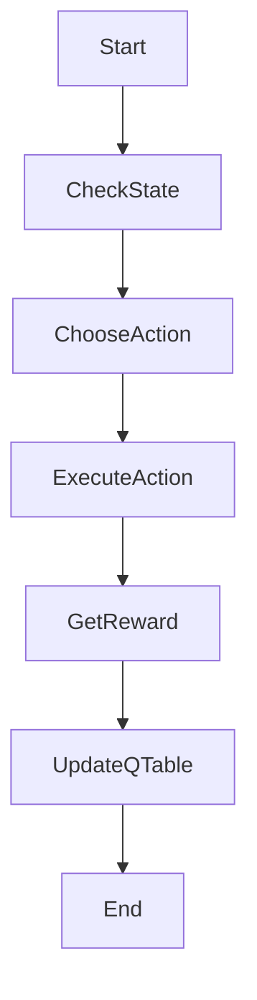
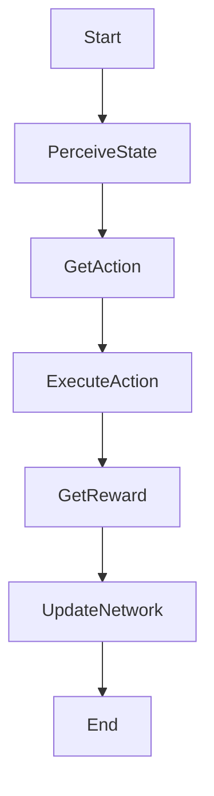
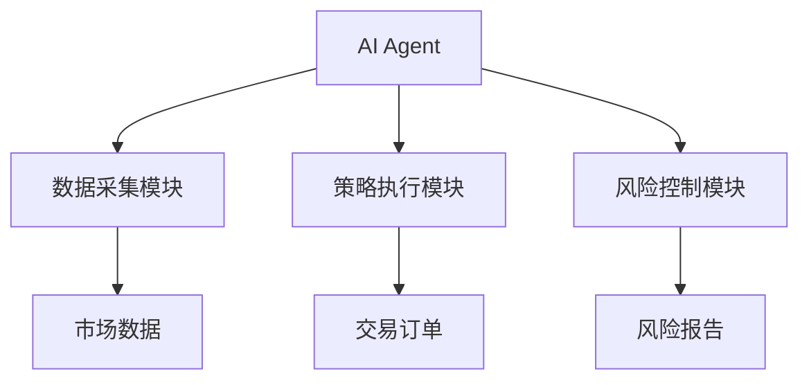
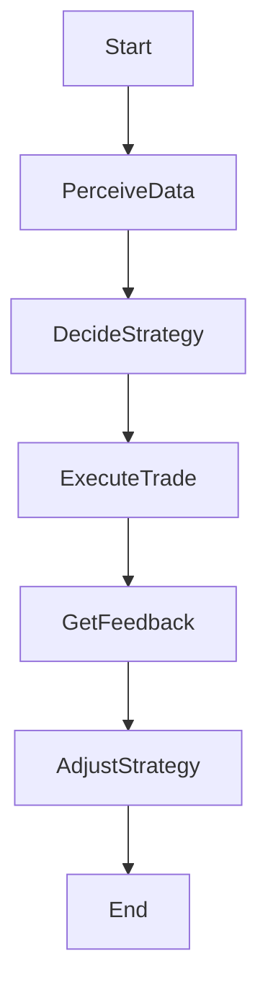

                 


# AI Agent在股票交易中的自动化策略

> 关键词：AI Agent，股票交易，自动化策略，强化学习，DQN算法，机器学习，金融投资

> 摘要：本文深入探讨了AI Agent在股票交易中的应用，从基本概念到核心算法，从系统架构到实际案例，全面解析AI Agent如何实现股票交易的自动化策略。文章结合强化学习、DQN算法等技术，详细阐述了AI Agent在股票交易中的优势、实现原理及实际应用，并通过系统架构图、流程图和代码示例，为读者提供了全面的技术解读。

---

# 第一部分: AI Agent与股票交易的背景介绍

## 第1章: AI Agent与股票交易概述

### 1.1 AI Agent的基本概念
#### 1.1.1 什么是AI Agent
AI Agent（人工智能代理）是指能够感知环境、做出决策并采取行动的智能体。在股票交易中，AI Agent可以用来分析市场数据、制定交易策略并执行交易操作。

#### 1.1.2 AI Agent的核心特点
- **自主性**：能够独立感知环境并做出决策。
- **反应性**：能够实时响应市场变化。
- **学习能力**：通过历史数据和交易结果不断优化策略。
- **可解释性**：决策过程可以被理解和追溯。

#### 1.1.3 AI Agent在金融领域的应用
- **股票交易**：通过算法优化投资组合，实现自动化交易。
- **风险管理**：实时监控市场风险，制定风险控制策略。
- **市场预测**：利用大数据和机器学习模型预测市场走势。

---

### 1.2 股票交易的基本原理
#### 1.2.1 股票交易的定义与流程
股票交易是指通过买入或卖出股票来实现资本增值的过程。通常包括以下几个步骤：
1. 数据采集：收集市场数据，包括价格、成交量等。
2. 策略制定：基于数据制定交易策略。
3. 交易执行：根据策略执行买入或卖出操作。
4. 风险控制：监控交易风险，调整策略。

#### 1.2.2 股票市场的基本特征
- **不确定性**：市场走势难以预测。
- **波动性**：价格波动频繁，受多种因素影响。
- **复杂性**：涉及众多参与者和市场规则。

#### 1.2.3 传统股票交易策略的局限性
- **人工决策的延迟性**：人工决策容易受到情绪影响，且效率低下。
- **信息处理能力有限**：人类无法快速处理大量市场数据。
- **策略优化难度大**：传统策略优化需要大量时间和经验。

---

### 1.3 AI Agent在股票交易中的优势
#### 1.3.1 提高交易效率
AI Agent可以快速分析市场数据，制定最优交易策略，实现高频交易。

#### 1.3.2 增强市场洞察力
通过机器学习算法，AI Agent能够发现隐藏在数据中的模式，捕捉市场机会。

#### 1.3.3 实现自动化操作
AI Agent可以自动执行交易操作，减少人工干预，降低操作成本。

---

## 第2章: AI Agent的核心概念与联系

### 2.1 AI Agent的核心原理
AI Agent在股票交易中的核心原理包括：
- **状态感知**：通过市场数据感知当前市场状态。
- **行动决策**：基于感知的状态制定交易策略。
- **反馈机制**：根据交易结果调整策略。

### 2.2 AI Agent与股票交易的实体关系
以下是一个简单的实体关系图：



### 2.3 AI Agent的核心算法原理
以下是AI Agent的算法流程图：



---

## 第3章: AI Agent的算法原理与数学模型

### 3.1 强化学习算法
强化学习是一种通过试错来优化策略的算法。以下是Q-Learning算法的流程图：



#### 3.1.2 DQN算法
DQN（Deep Q-Network）是一种基于深度学习的强化学习算法。以下是DQN算法的流程图：



---

### 3.2 算法的数学模型
以下是Q-Learning算法的数学模型：

$$ Q(s, a) = Q(s, a) + \alpha (r + \max_{a'} Q(s', a') - Q(s, a)) $$

其中：
- \( Q(s, a) \) 表示状态 \( s \) 下采取行动 \( a \) 的价值。
- \( \alpha \) 表示学习率。
- \( r \) 表示奖励。
- \( \max_{a'} Q(s', a') \) 表示下一个状态的最大价值。

---

### 3.3 DQN算法的实现
以下是DQN算法的Python代码示例：

```python
import numpy as np
import gym

# 初始化环境
env = gym.make('StockTrading-v0')
env.seed(42)

# 定义神经网络
class DQN:
    def __init__(self, state_size, action_size):
        self.state_size = state_size
        self.action_size = action_size
        self.gamma = 0.99
        self.epsilon = 0.5
        self.epsilon_min = 0.01
        self.epsilon_decay = 0.995
        self.model = self.build_model()

    def build_model(self):
        import keras
        model = keras.Sequential()
        model.add(keras.layers.Dense(64, activation='relu', input_dim=self.state_size))
        model.add(keras.layers.Dense(64, activation='relu'))
        model.add(keras.layers.Dense(self.action_size, activation='linear'))
        model.compile(optimizer='adam', loss='mse')
        return model

    def remember(self, state, action, reward, next_state):
        # 记忆单元格
        pass

    def act(self, state):
        if np.random.random() < self.epsilon:
            return np.random.randint(0, self.action_size)
        else:
            return np.argmax(self.model.predict(state))

    def replay(self, batch_size):
        # 回放记忆
        pass

    def decay_epsilon(self):
        self.epsilon = max(self.epsilon_min, self.epsilon * self.epsilon_decay)

# 初始化DQN算法
dqn = DQN(state_size=6, action_size=3)

# 开始训练
for episode in range(1000):
    state = env.reset()
    while True:
        action = dqn.act(state)
        next_state, reward, done, _ = env.step(action)
        dqn.remember(state, action, reward, next_state)
        dqn.replay(32)
        dqn.decay_epsilon()
        state = next_state
        if done:
            break
```

---

### 3.4 本章小结
本章详细介绍了AI Agent的核心算法，包括Q-Learning和DQN算法的原理、流程图和代码实现。通过这些算法，AI Agent可以实现股票交易的自动化策略。

---

## 第4章: AI Agent在股票交易中的系统分析

### 4.1 系统架构设计
以下是股票交易系统的架构图：



### 4.2 系统功能设计
以下是股票交易系统的功能模块：

1. **数据采集模块**：负责采集市场数据，包括股票价格、成交量等。
2. **策略执行模块**：基于AI Agent的决策，执行买入或卖出操作。
3. **风险控制模块**：监控交易风险，调整交易策略。

---

### 4.3 系统交互流程
以下是系统交互流程图：



---

## 第5章: 项目实战与代码实现

### 5.1 环境配置
以下是Python环境配置示例：

```python
import gym
import numpy as np
import matplotlib.pyplot as plt
```

### 5.2 核心代码实现
以下是AI Agent的核心代码实现：

```python
class AI-Agent:
    def __init__(self, state_size, action_size):
        self.state_size = state_size
        self.action_size = action_size
        self.gamma = 0.99
        self.epsilon = 0.5
        self.epsilon_min = 0.01
        self.epsilon_decay = 0.995
        self.model = self.build_model()

    def build_model(self):
        import keras
        model = keras.Sequential()
        model.add(keras.layers.Dense(64, activation='relu', input_dim=self.state_size))
        model.add(keras.layers.Dense(64, activation='relu'))
        model.add(keras.layers.Dense(self.action_size, activation='linear'))
        model.compile(optimizer='adam', loss='mse')
        return model

    def remember(self, state, action, reward, next_state):
        # 记忆单元格
        pass

    def act(self, state):
        if np.random.random() < self.epsilon:
            return np.random.randint(0, self.action_size)
        else:
            return np.argmax(self.model.predict(state))

    def replay(self, batch_size):
        # 回放记忆
        pass

    def decay_epsilon(self):
        self.epsilon = max(self.epsilon_min, self.epsilon * self.epsilon_decay)
```

---

## 第6章: 最佳实践与注意事项

### 6.1 小结
AI Agent在股票交易中的应用前景广阔，但同时也面临诸多挑战。通过不断优化算法和系统架构，可以进一步提升AI Agent的交易效果。

### 6.2 注意事项
- **风险管理**：在实际应用中，必须严格控制风险。
- **模型调优**：根据市场变化不断优化模型参数。
- **法律合规**：遵守相关法律法规，确保交易行为合法合规。

### 6.3 拓展阅读
- 《Reinforcement Learning: Theory and Algorithms》
- 《Deep Learning for Financial Markets》
- 《AI in Trading: Algorithmic and High-Frequency Trading》

---

作者：AI天才研究院/AI Genius Institute & 禅与计算机程序设计艺术 /Zen And The Art of Computer Programming

---

**本文通过详细分析AI Agent在股票交易中的应用，结合强化学习和DQN算法，展示了如何实现股票交易的自动化策略。希望本文能够为读者提供有价值的技术参考和实践指导。**

