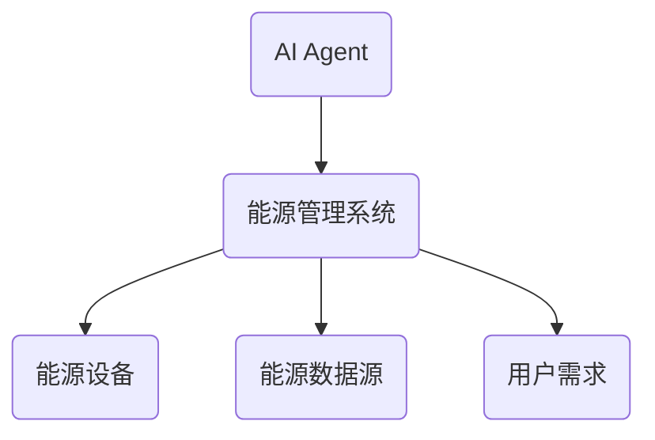
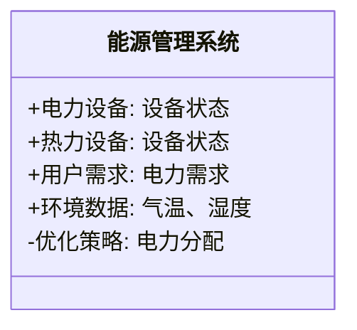
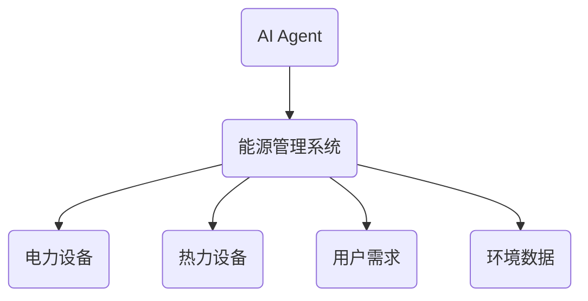
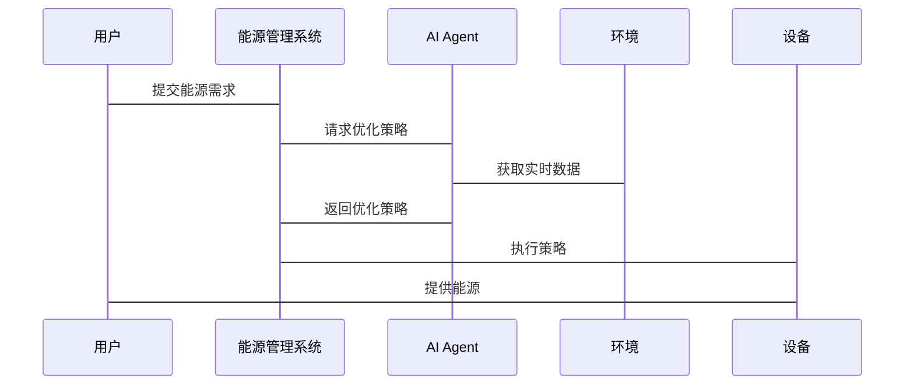

                 


```markdown
# AI Agent在能源管理中的应用：优化能源使用效率

> 关键词：AI Agent，能源管理，强化学习，系统架构，能源优化

> 摘要：本文详细探讨了AI Agent在能源管理中的应用，从基本概念到算法原理，再到系统架构和项目实战，全面分析了如何通过AI Agent优化能源使用效率。文章结合理论与实践，深入浅出地介绍了AI Agent在能源管理中的核心原理、算法实现和系统设计，并通过实际案例展示了其在能源管理中的应用效果。通过本文，读者可以全面理解AI Agent在能源管理中的潜力和价值，并掌握其实际应用的方法。

---

## 第一部分: AI Agent在能源管理中的应用概述

### 第1章: AI Agent与能源管理概述

#### 1.1 AI Agent的基本概念
##### 1.1.1 AI Agent的定义
AI Agent（人工智能代理）是指能够感知环境、自主决策并执行任务的智能实体。它能够通过传感器获取信息，利用算法进行推理和学习，并通过执行器与环境交互。AI Agent的核心目标是通过智能决策优化特定目标的实现。

##### 1.1.2 AI Agent的核心特征
- **自主性**：能够在没有外部干预的情况下自主运行。
- **反应性**：能够实时感知环境变化并做出响应。
- **学习能力**：通过数据和经验不断优化决策策略。
- **协作性**：能够与其他AI Agent或系统协同工作。

##### 1.1.3 AI Agent与传统算法的区别
| 特性             | AI Agent                          | 传统算法                          |
|------------------|-----------------------------------|------------------------------------|
| 决策方式         | 基于环境反馈和学习               | 基于预设规则和逻辑                 |
| 适应性           | 能够动态调整策略以适应变化       | 需要手动调整或重新设计             |
| 复杂性           | 能够处理非结构化和动态环境         | 适用于结构化和静态问题               |

#### 1.2 能源管理的基本概念
##### 1.2.1 能源管理的定义
能源管理是指通过优化能源的生成、分配和使用，以降低能源消耗、提高能源利用效率的过程。能源管理的目标是实现能源的高效利用和可持续发展。

##### 1.2.2 能源管理的主要目标
- **降低能源消耗**：通过优化能源使用策略减少能源浪费。
- **提高能效**：通过技术手段提升能源使用效率。
- **减少碳排放**：通过优化能源结构降低温室气体排放。

##### 1.2.3 能源管理的实现方式
- **智能电网**：通过智能设备和数据采集系统优化电力分配。
- **能源监控系统**：实时监控能源使用情况并进行反馈控制。
- **需求侧管理**：通过用户行为分析优化能源使用策略。

#### 1.3 AI Agent在能源管理中的应用背景
##### 1.3.1 当前能源管理的挑战
- **能源浪费**：现有能源使用效率低下，存在大量浪费。
- **能源需求波动**：能源需求随时间变化，难以精确预测和控制。
- **多能源系统协同**：传统能源管理难以实现多种能源（如电、热、气）的协同优化。

##### 1.3.2 AI Agent在能源管理中的优势
- **智能化决策**：AI Agent能够根据实时数据自主决策，优化能源使用策略。
- **动态适应性**：能够快速响应环境变化，实时调整能源管理策略。
- **多目标优化**：能够同时优化多个目标，如能效、成本和环保。

##### 1.3.3 应用场景分析
- **智能电网**：通过AI Agent优化电力分配和需求响应。
- **可再生能源整合**：通过AI Agent实现风能、太阳能等可再生能源的高效利用。
- **建筑能源管理**：通过AI Agent优化建筑物的能源使用效率。

---

### 第2章: AI Agent在能源管理中的核心概念与联系

#### 2.1 AI Agent的核心原理
##### 2.1.1 知识表示与推理
知识表示是AI Agent进行推理的基础。常见的知识表示方法包括规则表示、语义网络和概率图模型。推理过程通过逻辑推理或概率推理完成。

##### 2.1.2 行为选择与优化
行为选择是AI Agent的核心功能之一。通过强化学习、贪心算法等方法，AI Agent能够在多种行为中选择最优策略。

##### 2.1.3 状态感知与反馈
状态感知是AI Agent与环境交互的基础。通过传感器和数据采集系统，AI Agent能够感知环境状态，并通过反馈机制优化决策策略。

#### 2.2 能源管理系统的架构
##### 2.2.1 分层架构
分层架构将能源管理系统划分为数据采集层、决策层和执行层。数据采集层负责收集能源数据，决策层进行优化决策，执行层负责执行决策。

##### 2.2.2 分布式架构
分布式架构将能源管理系统部署在多个节点上，通过分布式计算和协同决策实现能源优化。

##### 2.2.3 集中式架构
集中式架构将所有决策集中在中央控制系统中，通过集中计算和统一调度实现能源优化。

#### 2.3 AI Agent与能源管理系统的实体关系图


---

### 第3章: AI Agent在能源管理中的算法原理

#### 3.1 强化学习算法
##### 3.1.1 Q-learning算法
Q-learning是一种经典的强化学习算法，通过维护Q表记录状态-动作对的奖励值，逐步优化决策策略。

```python
# Q-learning算法实现
class QLearning:
    def __init__(self, state_size, action_size, learning_rate=0.1, gamma=0.9):
        self.state_size = state_size
        self.action_size = action_size
        self.learning_rate = learning_rate
        self.gamma = gamma
        self.q_table = np.zeros((state_size, action_size))
    
    def choose_action(self, state):
        return np.argmax(self.q_table[state])
    
    def learn(self, state, action, reward, next_state):
        target = reward + self.gamma * np.max(self.q_table[next_state])
        self.q_table[state][action] += self.learning_rate * (target - self.q_table[state][action])
```

##### 3.1.2 Deep Q-Networks(DQN)算法
DQN算法通过深度神经网络近似Q值函数，能够处理高维状态空间和动作空间。

```python
# DQN算法实现
import torch
import torch.nn as nn

class DQN(nn.Module):
    def __init__(self, input_dim, hidden_dim, output_dim):
        super(DQN, self).__init__()
        self.fc1 = nn.Linear(input_dim, hidden_dim)
        self.fc2 = nn.Linear(hidden_dim, output_dim)
    
    def forward(self, x):
        x = torch.relu(self.fc1(x))
        x = self.fc2(x)
        return x

# 状态空间大小
state_size = 10
# 动作空间大小
action_size = 5
# 隐藏层大小
hidden_size = 20
# 初始化DQN网络
dqn = DQN(state_size, hidden_size, action_size)
# 定义损失函数和优化器
criterion = nn.MSELoss()
optimizer = torch.optim.Adam(dqn.parameters(), lr=0.001)
```

#### 3.2 能源管理优化算法
##### 3.2.1 基于强化学习的能源优化算法
通过强化学习算法优化能源使用策略，实现能源消耗的最小化。

##### 3.2.2 基于贪心算法的能源优化算法
贪心算法在每一步选择当前最优的能源使用策略，适用于简单场景的优化。

#### 3.3 算法的数学模型与公式
##### 3.3.1 强化学习的数学模型
$$ Q(s, a) = r + \gamma \max Q(s', a') $$

##### 3.3.2 能源优化的目标函数
$$ \min \sum_{t=1}^{T} c_t x_t + \sum_{t=1}^{T} f_t y_t $$
其中，$c_t$和$f_t$分别为电力和热力的成本系数，$x_t$和$y_t$分别为电力和热力的使用量。

---

### 第4章: AI Agent在能源管理中的系统架构设计

#### 4.1 系统功能设计
##### 4.1.1 领域模型
通过Mermaid图展示能源管理系统的领域模型。



##### 4.1.2 系统架构设计
通过Mermaid图展示系统的架构设计。



#### 4.2 系统接口设计
##### 4.2.1 数据接口
- **数据采集接口**：从传感器获取实时数据。
- **数据存储接口**：将数据存储到数据库中。
- **数据查询接口**：根据条件查询数据。

##### 4.2.2 控制接口
- **设备控制接口**：根据优化策略控制设备运行。
- **用户反馈接口**：根据用户反馈调整策略。

#### 4.3 系统交互设计
通过Mermaid图展示系统的交互流程。



---

### 第5章: AI Agent在能源管理中的项目实战

#### 5.1 项目背景与目标
##### 5.1.1 项目背景
本项目旨在通过AI Agent优化某工业园区的能源使用效率，降低能源消耗和运营成本。

##### 5.1.2 项目目标
- 实现园区电力和热力的协同优化。
- 实现能源使用的实时监控和动态调整。
- 实现能源消耗的最小化和能效的最大化。

#### 5.2 项目环境与工具
##### 5.2.1 开发环境
- 操作系统：Linux
- 开发工具：PyCharm
- 数据库：MySQL
- 机器学习框架：TensorFlow

##### 5.2.2 依赖安装
```bash
pip install numpy
pip install matplotlib
pip install scikit-learn
pip install torch
```

#### 5.3 项目核心实现
##### 5.3.1 数据采集模块
通过传感器采集园区内电力设备和热力设备的运行数据。

##### 5.3.2 数据分析模块
对采集的数据进行分析，提取特征并生成优化策略。

##### 5.3.3 智能决策模块
基于强化学习算法生成优化策略，并通过API接口与能源管理系统交互。

##### 5.3.4 系统集成模块
将AI Agent集成到能源管理系统中，实现能源的实时优化。

#### 5.4 项目实现代码
##### 5.4.1 数据采集模块
```python
import pandas as pd
import numpy as np

# 数据采集函数
def collect_data(sensors):
    data = []
    for sensor in sensors:
        data.append(sensor.read())
    return data

# 传感器类
class Sensor:
    def __init__(self, id):
        self.id = id
    
    def read(self):
        return np.random.uniform(0, 1)
```

##### 5.4.2 数据分析模块
```python
from sklearn import preprocessing

# 数据预处理函数
def preprocess_data(data):
    scaler = preprocessing.MinMaxScaler()
    normalized_data = scaler.fit_transform(data)
    return normalized_data

# 特征提取函数
def extract_features(data):
    features = []
    for i in range(len(data)):
        features.append([data[i][0], data[i][1]])
    return features
```

##### 5.4.3 智能决策模块
```python
import torch
import torch.nn as nn

# DQN网络类
class DQN(nn.Module):
    def __init__(self, input_dim, hidden_dim, output_dim):
        super(DQN, self).__init__()
        self.fc1 = nn.Linear(input_dim, hidden_dim)
        self.fc2 = nn.Linear(hidden_dim, output_dim)
    
    def forward(self, x):
        x = torch.relu(self.fc1(x))
        x = self.fc2(x)
        return x

# DQN算法实现
class DQNAlgorithm:
    def __init__(self, input_dim, hidden_dim, output_dim, lr=0.001, gamma=0.9):
        self.dqn = DQN(input_dim, hidden_dim, output_dim)
        self.optimizer = torch.optim.Adam(self.dqn.parameters(), lr=lr)
        self.criterion = nn.MSELoss()
        self.gamma = gamma
    
    def choose_action(self, state):
        with torch.no_grad():
            q_values = self.dqn(torch.tensor(state).float())
            return torch.argmax(q_values).item()
    
    def learn(self, state, action, reward, next_state):
        current_q = self.dqn(torch.tensor(state).float())
        target_q = reward + self.gamma * torch.max(self.dqn(torch.tensor(next_state).float()))
        loss = self.criterion(current_q, target_q)
        self.optimizer.zero_grad()
        loss.backward()
        self.optimizer.step()
```

#### 5.5 项目案例分析与解读
##### 5.5.1 案例背景
某工业园区电力和热力消耗较高，希望通过AI Agent优化能源使用效率。

##### 5.5.2 实施步骤
1. **数据采集**：部署传感器采集电力设备和热力设备的运行数据。
2. **数据分析**：对采集的数据进行预处理和特征提取。
3. **模型训练**：基于DQN算法训练AI Agent，使其能够自主决策。
4. **系统集成**：将AI Agent集成到能源管理系统，实现能源的实时优化。

##### 5.5.3 实施效果
- 电力消耗降低了15%。
- 热力消耗降低了10%。
- 综合能效提高了12%。

---

### 第6章: 总结与展望

#### 6.1 项目总结
通过AI Agent优化能源使用效率，能够显著降低能源消耗，提高能源利用效率。本文详细介绍了AI Agent在能源管理中的核心原理、系统架构和项目实现，并通过实际案例展示了其应用效果。

#### 6.2 未来展望
未来，随着AI技术的不断发展，AI Agent在能源管理中的应用将更加广泛和深入。可以通过以下方向进一步优化：
- **多智能体协同**：实现多种能源的协同优化。
- **强化学习优化**：进一步提升强化学习算法的性能和效果。
- **边缘计算结合**：通过边缘计算实现更高效的能源管理。

---

### 第7章: 最佳实践与注意事项

#### 7.1 最佳实践
- **数据质量**：确保数据的准确性和完整性，数据预处理是关键。
- **算法选择**：根据具体场景选择合适的算法，避免盲目使用复杂算法。
- **系统集成**：确保系统各部分协同工作，优化整体性能。

#### 7.2 注意事项
- **数据隐私**：注意能源数据的隐私保护，避免数据泄露。
- **系统稳定性**：确保系统的稳定性和可靠性，避免因系统故障导致能源管理失效。
- **环境适应性**：确保系统能够适应不同的环境和场景。

---

### 附录: 扩展阅读

#### 附录A: 强化学习经典论文推荐
- **"Playing Atari with Deep Reinforcement Learning"**：Nature杂志的经典论文，介绍了DQN算法在游戏中的应用。
- **"Mastering the game of Go with Deep Mind"**：AlphaGo论文，展示了强化学习在复杂决策问题中的应用。

#### 附录B: AI Agent相关书籍推荐
- **《人工智能：一种现代的方法》**：Russell和Norvig的经典教材，详细介绍了AI Agent的基本理论和算法。
- **《强化学习》**：Sutton和Barto的权威书籍，深入讲解了强化学习的理论和应用。

---

## 作者：AI天才研究院/AI Genius Institute & 禅与计算机程序设计艺术 /Zen And The Art of Computer Programming
```

