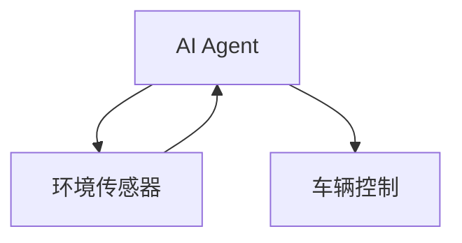
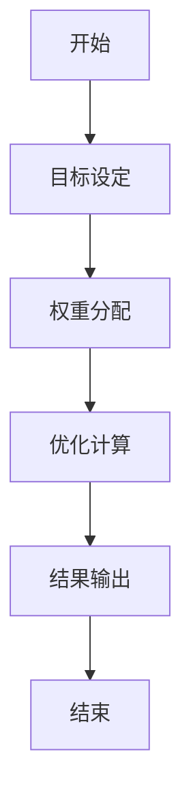
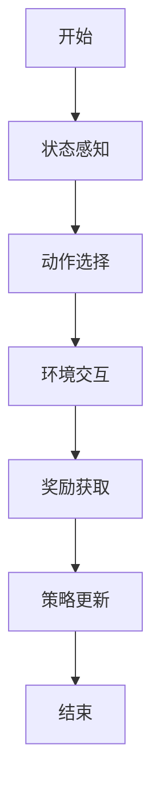
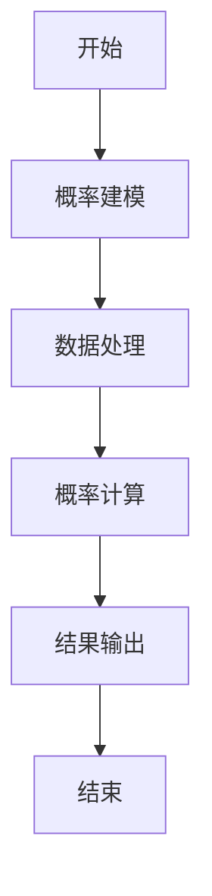
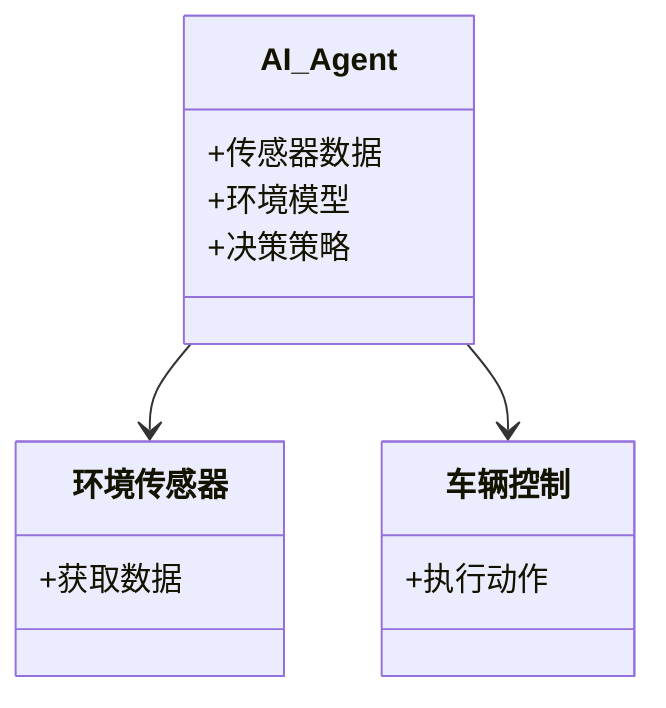

                 


# AI Agent在自动驾驶中的决策系统

## 关键词：
- AI Agent
- 自动驾驶
- 决策系统
- 算法原理
- 系统架构

## 摘要：
本文详细探讨了AI Agent在自动驾驶决策系统中的应用，从核心概念、算法原理到系统架构和项目实战，全面分析了AI Agent在自动驾驶中的重要性及其实现方式。通过对比传统决策系统，深入讲解了基于AI Agent的决策系统的优势，并结合实际案例，展示了其在复杂环境下的决策能力。文章还提供了详细的代码实现和系统设计，为读者提供了一个全面的理解框架。

---

## 第一部分: AI Agent在自动驾驶中的决策系统背景介绍

### 第1章: AI Agent的基本概念

#### 1.1 AI Agent的定义与特点
##### 1.1.1 AI Agent的定义
AI Agent（人工智能代理）是一种能够感知环境并采取行动以实现目标的智能实体。它可以自主决策、学习和适应环境，是自动驾驶系统的核心组成部分。

##### 1.1.2 AI Agent的核心特点
- **自主性**：能够在没有外部干预的情况下独立运行。
- **反应性**：能够实时感知环境并做出反应。
- **学习能力**：通过数据和经验不断优化决策能力。
- **协作性**：能够与其他系统或车辆协同工作。

##### 1.1.3 AI Agent与传统算法的区别
传统的算法通常基于固定的规则和逻辑，而AI Agent能够通过学习和自适应来优化决策过程，具有更强的灵活性和适应性。

#### 1.2 自动驾驶的背景与现状
##### 1.2.1 自动驾驶的发展历程
从早期的自动驾驶概念到现代的L1-L5级别的自动驾驶技术，AI Agent在其中扮演了越来越重要的角色。

##### 1.2.2 当前自动驾驶技术的主要挑战
- **环境复杂性**：城市交通中的多样性和不确定性。
- **决策的正确性**：在复杂场景中做出正确的决策。
- **系统的安全性**：确保系统的安全性和可靠性。

##### 1.2.3 AI Agent在自动驾驶中的作用
AI Agent通过感知、决策和规划，帮助自动驾驶系统在复杂环境中做出实时、正确的决策。

#### 1.3 决策系统在自动驾驶中的重要性
##### 1.3.1 决策系统的定义与作用
决策系统是自动驾驶的核心模块，负责根据环境信息和车辆状态，做出驾驶决策。

##### 1.3.2 决策系统的分类与特点
- **基于规则的决策系统**：依赖预定义的规则和逻辑。
- **基于学习的决策系统**：通过机器学习模型进行决策。
- **混合型决策系统**：结合规则和学习的决策系统。

##### 1.3.3 AI Agent在决策系统中的应用
AI Agent通过感知环境、分析数据和优化决策，帮助自动驾驶系统实现更智能的驾驶行为。

---

## 第二部分: AI Agent在自动驾驶中的核心概念与联系

### 第2章: AI Agent在自动驾驶中的核心原理

#### 2.1 AI Agent的核心原理
AI Agent通过感知、推理和行动来实现目标。在自动驾驶中，它主要负责处理环境信息、规划路径和做出驾驶决策。

#### 2.2 AI Agent的核心模块
##### 2.2.1 感知模块
- **传感器数据处理**：处理来自摄像头、激光雷达、雷达等传感器的数据。
- **环境建模**：将环境信息建模为车辆可以理解的形式。

##### 2.2.2 决策模块
- **路径规划**：计算车辆的行驶路径。
- **行为决策**：根据环境信息做出驾驶行为的决策。

##### 2.2.3 规划模块
- **短期规划**：调整路径以适应实时环境变化。
- **长期规划**：制定全局性的行驶计划。

#### 2.3 AI Agent与传统决策系统的对比
##### 2.3.1 传统决策系统的特点
- 基于预定义的规则和逻辑。
- 无法适应复杂和动态的环境。

##### 2.3.2 基于AI Agent的决策系统的优势
- **灵活性**：能够根据环境变化自适应调整决策。
- **学习能力**：通过数据优化决策模型。

#### 2.4 系统架构设计
##### 2.4.1 系统架构的ER实体关系图
```mermaid
er
actor AI Agent
actor 环境传感器
actor 车辆控制
```

##### 2.4.2 系统架构的流程图


---

## 第三部分: AI Agent在自动驾驶中的算法原理讲解

### 第3章: AI Agent的算法原理

#### 3.1 常见的决策算法
##### 3.1.1 多目标优化算法
- **定义**：在多个目标之间找到最优平衡点。
- **应用场景**：路径规划中的距离、时间、安全性等多目标优化。

##### 3.1.2 强化学习算法
- **定义**：通过奖励机制优化决策策略。
- **应用场景**：自动驾驶中的行为决策和路径规划。

##### 3.1.3 概率推理算法
- **定义**：基于概率模型进行决策。
- **应用场景**：处理环境中的不确定性。

#### 3.2 多目标优化算法的实现
##### 3.2.1 多目标优化算法的流程图


##### 3.2.2 多目标优化算法的数学模型
$$ \text{目标函数：} f(x) = w_1x_1 + w_2x_2 + \dots + w_nx_n $$
$$ \text{约束条件：} g(x) \leq 0 $$

#### 3.3 强化学习算法的实现
##### 3.3.1 强化学习算法的流程图


##### 3.3.2 强化学习算法的伪代码
```python
def强化学习算法():
    初始化策略网络和价值网络
    while True:
        通过策略网络选择动作
        与环境交互，获取奖励
        更新价值网络和策略网络
```

#### 3.4 概率推理算法的实现
##### 3.4.1 概率推理算法的流程图


##### 3.4.2 概率推理算法的数学公式
$$ P(A|B) = \frac{P(B|A)P(A)}{P(B)} $$

---

## 第四部分: AI Agent在自动驾驶中的系统分析与架构设计方案

### 第4章: 系统分析与架构设计

#### 4.1 系统分析
##### 4.1.1 问题场景介绍
自动驾驶系统需要在复杂的城市交通环境中实时做出决策，包括路径规划、避障、超车等。

##### 4.1.2 系统功能设计
- **感知功能**：识别道路、障碍物、行人等。
- **决策功能**：做出驾驶决策。
- **规划功能**：制定行驶路径。

##### 4.1.3 领域模型的Mermaid类图


#### 4.2 系统架构设计
##### 4.2.1 系统架构的Mermaid架构图


##### 4.2.2 系统交互的Mermaid序列图
```mermaid
sequenceDiagram
参与者 AI_Agent
参与者 环境传感器
参与者 车辆控制
AI_Agent -> 环境传感器: 获取数据
环境传感器 -> AI_Agent: 返回数据
AI_Agent -> 车辆控制: 执行动作
车辆控制 -> AI_Agent: 反馈执行结果
```

---

## 第五部分: AI Agent在自动驾驶中的项目实战

### 第5章: 项目实战

#### 5.1 环境搭建与安装
##### 5.1.1 安装Python和必要的库
- Python
- TensorFlow
- NumPy
- Matplotlib
- OpenCV

##### 5.1.2 安装自动驾驶开发环境
- ROS（Robot Operating System）
- Carla（自动驾驶仿真平台）

#### 5.2 系统核心实现
##### 5.2.1 感知模块的实现
```python
import cv2
import numpy as np

def感知环境():
    # 获取传感器数据
    data = 传感器数据
    # 处理数据
    处理后的数据 = 处理(data)
    return 处理后的数据
```

##### 5.2.2 决策模块的实现
```python
import numpy as np

def决策():
    # 获取环境数据
    数据 = 感知环境()
    # 选择动作
    动作 = 选择动作(数据)
    return 动作
```

##### 5.2.3 规划模块的实现
```python
import numpy as np

def规划():
    # 获取决策结果
    结果 = 决策()
    # 计算路径
    路径 = 计算路径(结果)
    return 路径
```

#### 5.3 项目实战案例分析
##### 5.3.1 案例分析：城市道路中的决策过程
- **感知阶段**：识别前方的障碍物和交通信号灯。
- **决策阶段**：根据感知结果做出避让和加速的决策。
- **规划阶段**：制定绕行路径并执行。

##### 5.3.2 代码实现与分析
```python
def自动驾驶系统():
    # 感知环境
    环境数据 = 感知环境()
    # 做出决策
    决策结果 = 决策(环境数据)
    # 规划路径
    路径 = 规划(决策结果)
    # 执行动作
    执行动作(路径)
```

#### 5.4 项目总结
##### 5.4.1 项目关键点总结
- **感知的准确性**：传感器数据的处理和融合。
- **决策的正确性**：算法的选择和优化。
- **规划的合理性**：路径的计算和优化。

##### 5.4.2 项目未来发展方向
- **算法优化**：改进AI Agent的决策算法。
- **系统集成**：与其他车辆和交通系统的协同。

---

## 第六部分: AI Agent在自动驾驶中的最佳实践

### 第6章: 最佳实践

#### 6.1 最佳实践 tips
##### 6.1.1 数据质量的重要性
- 高质量的数据是训练AI Agent的基础。
- 数据的多样性和代表性至关重要。

##### 6.1.2 算法的可解释性
- 确保算法的决策过程是可解释的。
- 避免“黑箱”算法，确保系统的透明性。

##### 6.1.3 系统的安全性
- 确保系统的安全性和可靠性。
- 建立完善的错误处理机制。

#### 6.2 小结
AI Agent在自动驾驶中的应用前景广阔，但同时也面临着诸多挑战。通过不断优化算法和系统架构，可以进一步提升自动驾驶的决策能力和安全性。

#### 6.3 注意事项
##### 6.3.1 数据隐私问题
- 确保数据的隐私和安全。
- 遵守相关法律法规。

##### 6.3.2 系统的实时性
- 确保系统的实时性，避免延迟。
- 优化算法的执行效率。

#### 6.4 拓展阅读
##### 6.4.1 推荐书籍
- 《自动驾驶：从算法到系统》
- 《强化学习：算法与应用》

##### 6.4.2 推荐论文
- "End-to-End Imitation Learning for Autonomous Driving"
- "Deep Reinforcement Learning for Autonomous Vehicles"

---

## 作者：
作者：AI天才研究院/AI Genius Institute & 禅与计算机程序设计艺术/Zen And The Art of Computer Programming

