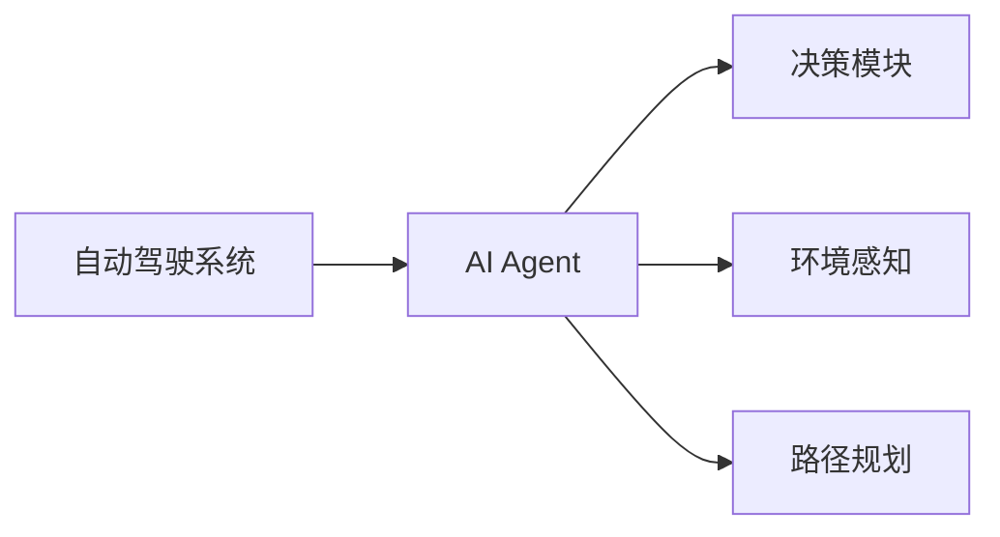
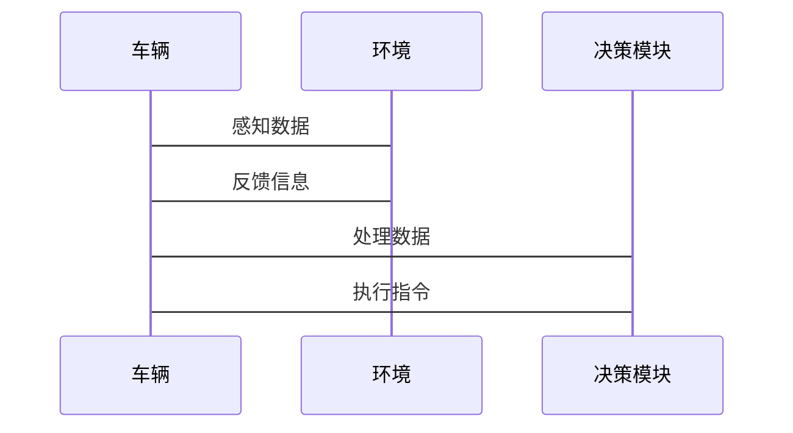

                 


# AI Agent在自动驾驶决策中的应用

## 关键词：AI Agent, 自动驾驶, 决策算法, 强化学习, 多目标优化, 系统架构

## 摘要：  
AI Agent作为自动驾驶决策的核心技术，通过感知环境、推理和规划，帮助车辆做出智能决策。本文将详细介绍AI Agent在自动驾驶中的应用，涵盖其核心概念、算法原理、系统架构及实际案例，探讨其在复杂环境中的决策优化与挑战。

---

# 第1章: 自动驾驶与AI Agent概述

## 1.1 自动驾驶的基本概念

### 1.1.1 自动驾驶的定义与分类  
自动驾驶（Autonomous Driving）是指车辆能够通过传感器、计算系统和执行机构实现独立驾驶，无需人类干预。根据自动化程度的不同，自动驾驶分为L0到L5六个级别：  
- **L0**: 完全依赖人类驾驶。  
- **L1-L5**: 逐步增加自动驾驶功能，L5实现完全自动驾驶。  

### 1.1.2 自动驾驶的发展历程  
自动驾驶技术起源于20世纪，经历了从早期的实验性研究到现代的商业化应用。近年来，随着AI和计算技术的进步，自动驾驶技术迅速发展。

### 1.1.3 自动驾驶的核心技术与挑战  
核心技术包括：传感器技术、环境感知、路径规划、决策控制等。主要挑战在于复杂环境下的决策和安全性问题。

## 1.2 AI Agent在自动驾驶中的作用

### 1.2.1 AI Agent的定义与特点  
AI Agent是具有感知、推理和行动能力的智能体，能够在动态环境中自主决策。其特点包括：自主性、反应性、目标导向和学习能力。

### 1.2.2 AI Agent在自动驾驶中的应用场景  
- **环境感知**: 通过传感器数据识别周围环境。  
- **决策控制**: 根据感知信息做出驾驶决策。  
- **路径规划**: 规划最优行驶路径。  

### 1.2.3 AI Agent与传统自动驾驶算法的对比  
AI Agent结合了传统算法的优势，能够处理复杂场景中的不确定性，实现更智能的决策。

## 1.3 自动驾驶决策系统的核心问题

### 1.3.1 自动驾驶中的决策问题  
决策系统需要处理多目标优化、动态环境和不确定性问题。

### 1.3.2 决策系统的复杂性与挑战  
包括多目标平衡、实时性要求和安全性的挑战。

### 1.3.3 AI Agent在决策系统中的优势  
AI Agent能够处理复杂场景，提供更灵活和高效的决策。

## 1.4 本章小结  
本章介绍了自动驾驶的基本概念、AI Agent的作用及其在决策系统中的优势。

---

# 第2章: AI Agent的核心概念与联系

## 2.1 AI Agent的核心要素

### 2.1.1 目标  
AI Agent的目标是安全、高效地完成驾驶任务。

### 2.1.2 知识  
知识包括道路规则、交通信号和车辆类型等。

### 2.1.3 推理  
推理是基于感知数据做出判断的过程。

### 2.1.4 规划  
规划是制定行驶路径和行动方案。

## 2.2 AI Agent的实体关系图



## 2.3 AI Agent的分类与特点

| 类型       | 特点                     |
|------------|--------------------------|
| 反应式     | 基于当前感知做出反应       |
| 生成式     | 提供创造性解决方案         |
| 学习式     | 通过数据学习提升性能       |

## 2.4 AI Agent与其他技术的对比

| 技术       | 对比点                   |
|------------|--------------------------|
| 传统算法   | 基于规则，缺乏灵活性     |
| 机器学习   | 数据驱动，但无明确目标   |
| 强化学习    | 基于奖励机制优化决策     |

## 2.5 本章小结  
本章详细介绍了AI Agent的核心概念及其与其他技术的联系。

---

# 第3章: AI Agent的算法原理与数学模型

## 3.1 多目标优化算法

### 3.1.1 基本原理  
通过优化目标函数，平衡多个目标（如安全性和效率）。

### 3.1.2 数学模型  
$$ \text{目标函数} = \min \{ f_1(x), f_2(x), \ldots, f_n(x) \} $$

### 3.1.3 应用场景  
在路径规划中，平衡距离最短和时间最短。

## 3.2 强化学习算法

### 3.2.1 基本原理  
通过与环境互动，学习最优策略。

### 3.2.2 数学模型  
$$ Q(s, a) = r + \gamma \max Q(s', a') $$

### 3.2.3 应用场景  
处理动态交通环境中的决策。

## 3.3 图模型算法

### 3.3.1 基本原理  
将环境建模为图结构，进行最短路径计算。

### 3.3.2 数学模型  
$$ \text{路径权重} = \sum_{i=1}^{n} w_i $$

## 3.4 本章小结  
本章介绍了AI Agent在自动驾驶中的核心算法及其数学模型。

---

# 第4章: 系统分析与架构设计

## 4.1 系统架构设计

### 4.1.1 整体架构  


### 4.1.2 功能模块  
- 传感器数据处理  
- 环境感知  
- 决策控制  

## 4.2 系统交互流程



## 4.3 本章小结  
本章详细描述了自动驾驶系统的架构设计及其交互流程。

---

# 第5章: 项目实战与案例分析

## 5.1 项目背景

### 5.1.1 项目目标  
实现AI Agent在十字路口的决策控制。

## 5.2 核心实现

### 5.2.1 环境感知  
使用摄像头和雷达检测交通信号和车辆。

### 5.2.2 决策算法  
基于强化学习实现路径规划。

## 5.3 代码实现

### 5.3.1 环境感知代码  
```python
def detect_traffic_light():
    # 传感器数据处理
    return 'green' if random.random() < 0.8 else 'red'
```

### 5.3.2 决策算法代码  
```python
def decision_making(state):
    # 基于强化学习的决策
    return 'go' if state['light'] == 'green' else 'stop'
```

## 5.4 实际案例分析

### 5.4.1 案例描述  
在十字路口，AI Agent根据交通信号和周围车辆决定是否前行。

### 5.4.2 代码解读  
解释上述代码的功能及其在决策过程中的作用。

## 5.5 本章小结  
本章通过实际案例展示了AI Agent在自动驾驶中的应用。

---

# 第6章: 总结与展望

## 6.1 本章总结  
AI Agent在自动驾驶中的应用前景广阔，能够有效提升决策系统的智能性和可靠性。

## 6.2 未来展望  
未来，AI Agent将在复杂场景中发挥更大作用，实现更高级别的自动驾驶。

## 6.3 最佳实践 Tips  
- 选择合适的算法和模型  
- 注重数据质量和多样性  
- 加强系统安全性和鲁棒性  

## 6.4 本章小结  
总结全文，强调AI Agent的重要性，并展望未来发展。

---

# 作者：AI天才研究院  
# 日期：2023年10月

---

以上内容涵盖了AI Agent在自动驾驶中的各个方面，从基础概念到实际应用，适合深入理解该技术的读者阅读。

