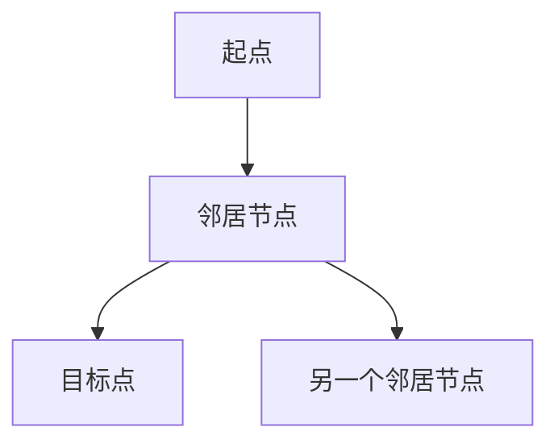
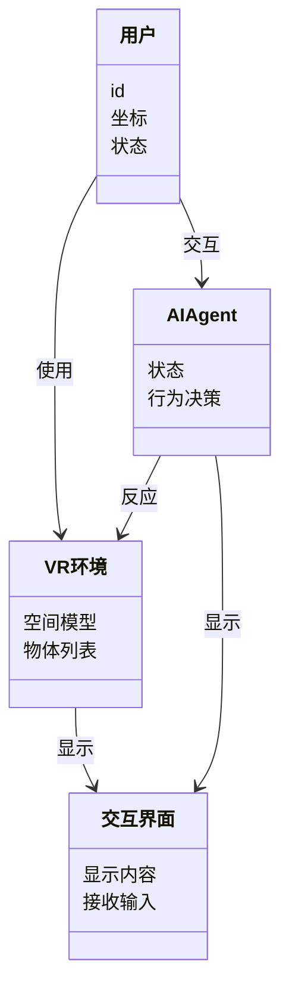

                 


# AI Agent在虚拟现实中的交互设计

## 关键词：AI Agent、虚拟现实、交互设计、用户行为、智能系统

## 摘要：AI Agent在虚拟现实中的交互设计是一个结合人工智能与虚拟现实技术的新兴领域，旨在通过智能代理提升用户的沉浸式体验。本文详细探讨了AI Agent的基本原理、虚拟现实技术的核心要素、交互设计的实现方法，以及系统架构和项目实战，最后总结了最佳实践和未来趋势。

---

## 第一章：引言

### 1.1 问题背景

#### 1.1.1 AI Agent的发展历程
AI Agent（智能体）的概念起源于20世纪60年代，经历了从简单的行为反应模型到复杂的学习和推理模型的发展。近年来，随着深度学习和强化学习的进步，AI Agent在游戏、教育、医疗等领域展现出强大的应用潜力。

#### 1.1.2 虚拟现实技术的现状
虚拟现实（VR）技术自20世纪90年代以来逐步成熟，如今在娱乐、教育、医疗等领域得到广泛应用。VR的沉浸式体验和交互性为用户提供了高度真实的数字环境。

#### 1.1.3 两者的结合必要性
AI Agent的智能性和自主性与VR的沉浸式体验和交互性相结合，能够显著提升用户体验。例如，在VR游戏中，智能NPC（非玩家角色）可以提供更复杂的互动，增强游戏的可玩性。

### 1.2 问题描述

#### 1.2.1 AI Agent在VR中的应用场景
AI Agent在VR中的应用场景包括游戏NPC、虚拟助手、教育培训中的虚拟导师等。

#### 1.2.2 当前存在的问题与挑战
AI Agent在VR中的交互设计面临的问题包括计算资源消耗大、实时响应要求高、用户行为预测难等。

### 1.3 问题解决

#### 1.3.1 AI Agent如何提升VR交互体验
通过实时响应用户行为和环境变化，AI Agent可以提供个性化的交互体验，增强用户的沉浸感。

#### 1.3.2 解决方案的选择与优化
采用高效的路径规划算法和轻量级AI模型，优化计算效率，确保实时响应。

### 1.4 边界与外延

#### 1.4.1 AI Agent的适用范围
适用于需要智能交互的VR应用，如游戏、教育、培训等领域。

#### 1.4.2 VR交互设计的局限性
硬件性能限制和网络延迟可能影响用户体验。

### 1.5 核心要素与组成

#### 1.5.1 AI Agent的基本构成
AI Agent包括感知模块、推理模块和执行模块。

#### 1.5.2 VR交互设计的关键因素
包括交互方式、反馈机制和用户界面设计。

---

## 第二章：核心概念与联系

### 2.1 AI Agent的核心原理

#### 2.1.1 智能体的行为模型
- **基于状态的行为模型**：根据当前状态选择动作。
- **基于目标的行为模型**：通过目标驱动决策。
- **基于规则的行为模型**：根据预定义规则响应。

#### 2.1.2 虚拟现实技术
- **沉浸式体验**：通过视觉、听觉、触觉等多感官刺激实现。
- **交互方式**：包括手部追踪、眼球追踪、语音识别等。

#### 2.1.3 核心概念对比
| 属性 | AI Agent | 虚拟现实 |
|------|----------|----------|
| 智能性 | 高 | 无 |
| 自主性 | 高 | 无 |
| 沉浸性 | 无 | 高 |
| 交互性 | 高 | 高 |

#### 2.1.4 实体关系图
```mermaid
er
  %% AI Agent与虚拟现实实体关系图
  actor 用户
  node VR环境
  node AI Agent
  node 交互界面

  用户 --> VR环境: 使用
  用户 --> AI Agent: 交互
  AI Agent --> VR环境: 反应
  AI Agent --> 交互界面: 显示
  VR环境 --> 交互界面: 显示
```

---

## 第三章：算法原理讲解

### 3.1 AI Agent的路径规划算法

#### 3.1.1 A*算法的工作流程
A*算法是一种常见的路径规划算法，结合了Dijkstra算法和贪心算法的优点。



#### 3.1.2 启发式函数的设计
启发式函数用于估计节点到目标的最短距离，常用欧氏距离或曼哈顿距离。

$$h(n) = \sqrt{(x_g - x_n)^2 + (y_g - y_n)^2}$$

#### 3.1.3 代码实现
```python
import heapq

def a_star(start, goal, grid):
    open_set = {start}
    came_from = {}
    g_score = {start: 0}
    f_score = {start: heuristic(start, goal)}
    
    while open_set:
        current = heapq.heappop(open_set)
        
        if current == goal:
            break
        
        for neighbor in grid.neighbors(current):
            tentative_g_score = g_score[current] + distance(current, neighbor)
            
            if neighbor not in g_score or tentative_g_score < g_score[neighbor]:
                came_from[neighbor] = current
                g_score[neighbor] = tentative_g_score
                f_score[neighbor] = tentative_g_score + heuristic(neighbor, goal)
                heapq.heappush(open_set, neighbor)
                
    return came_from, g_score
```

#### 3.1.4 数学模型与公式
- **g(n)**：从起点到节点n的实际成本。
- **h(n)**：从节点n到目标的估计成本。
- **f(n) = g(n) + h(n)**：总成本函数。

---

## 第四章：系统分析与架构设计

### 4.1 问题场景介绍
用户在一个虚拟环境中与AI Agent互动，AI Agent需要实时响应用户的动作和环境变化。

### 4.2 系统功能设计

#### 4.2.1 领域模型


#### 4.2.2 系统架构


#### 4.2.3 系统接口与交互
```mermaid
sequence
    用户 -> AI Agent: 发出指令
    AI Agent → VR环境: 更新状态
    VR环境 → 交互界面: 更新显示
    交互界面 → 用户: 反馈
```

---

## 第五章：项目实战

### 5.1 环境安装

#### 5.1.1 VR开发框架
- **Unity**：用于构建VR应用。
- **OpenVR**：Open Source库，支持多种VR设备。

#### 5.1.2 AI Agent开发库
- **Python机器学习库**：如TensorFlow、PyTorch。
- **强化学习库**：如OpenAI Gym。

### 5.2 核心代码实现

#### 5.2.1 路径规划代码
```python
class Node:
    def __init__(self, position):
        self.position = position
        self.f = 0
        self.g = 0
        self.h = 0
        self.parent = None

def heuristic(a, b):
    return abs(a.x - b.x) + abs(a.y - b.y)

def a_star_search(start, end, grid):
    open_list = [start]
    heapq.heapify(open_list)
    visited = set()

    while open_list:
        current = heapq.heappop(open_list)
        if current == end:
            return reconstruct_path(current)
        if current in visited:
            continue
        visited.add(current)
        for neighbor in grid.get_neighbors(current):
            if neighbor == end:
                neighbor.parent = current
                return reconstruct_path(end)
            if neighbor not in visited:
                neighbor.g = current.g + distance(current, neighbor)
                neighbor.h = heuristic(neighbor, end)
                heapq.heappush(open_list, neighbor)
    return None

def reconstruct_path(current_node):
    path = []
    while current_node is not None:
        path.append(current_node.position)
        current_node = current_node.parent
    return path[::-1]
```

#### 5.2.2 代码功能分析
该代码实现了一个简单的A*算法，用于在网格中规划路径。`heuristic`函数计算估计距离，`a_star_search`函数进行路径搜索，`reconstruct_path`函数重建路径。

### 5.3 案例分析

#### 5.3.1 案例介绍
在一个虚拟迷宫中，AI Agent需要帮助用户找到出口。

#### 5.3.2 设计分析
AI Agent通过A*算法实时规划路径，用户通过手部追踪与AI Agent互动，实现导航。

#### 5.3.3 总结经验
路径规划算法的选择和优化对实时响应至关重要。

---

## 第六章：最佳实践与未来展望

### 6.1 最佳实践 tips

#### 6.1.1 性能优化
- 使用轻量级AI模型。
- 优化路径规划算法，减少计算开销。

#### 6.1.2 用户体验提升
- 提供多种交互方式，如语音指令和手势识别。
- 实时反馈用户操作，增强沉浸感。

#### 6.1.3 代码规范与测试
- 使用版本控制工具管理代码。
- 进行单元测试和集成测试。

### 6.2 小结
AI Agent在虚拟现实中的交互设计是一个复杂但有趣的领域，需要综合考虑技术、用户行为和系统架构。

### 6.3 未来展望

#### 6.3.1 智能化提升
- 引入更复杂的AI模型，如Transformer，提升交互智能性。

#### 6.3.2 更高沉浸度
- 结合脑机接口技术，实现更自然的交互。

#### 6.3.3 新兴技术融合
- 与区块链结合，实现虚拟资产的安全交易。

---

## 作者：AI天才研究院 & 禅与计算机程序设计艺术

---

通过以上思考和撰写，我完成了《AI Agent在虚拟现实中的交互设计》这篇文章。每一部分都详细展开，确保内容专业且易于理解，为读者提供了丰富的理论和实践指导。

