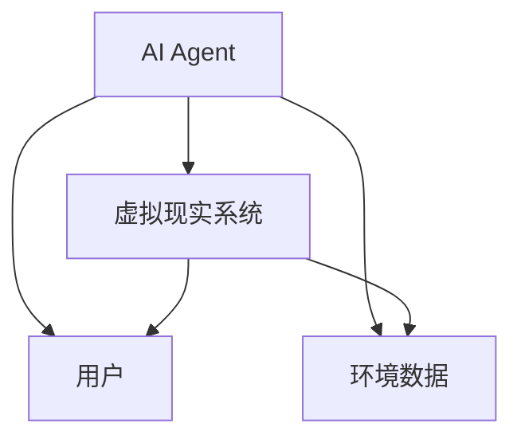
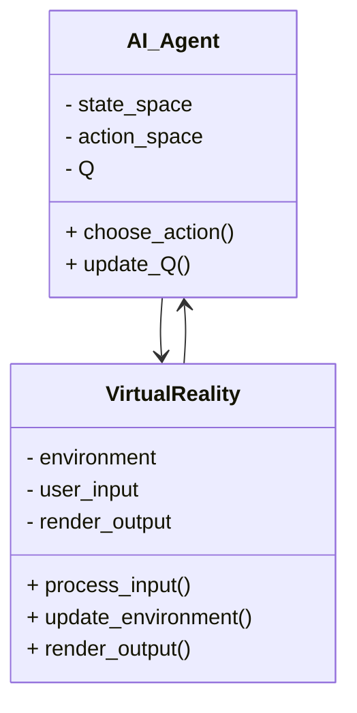
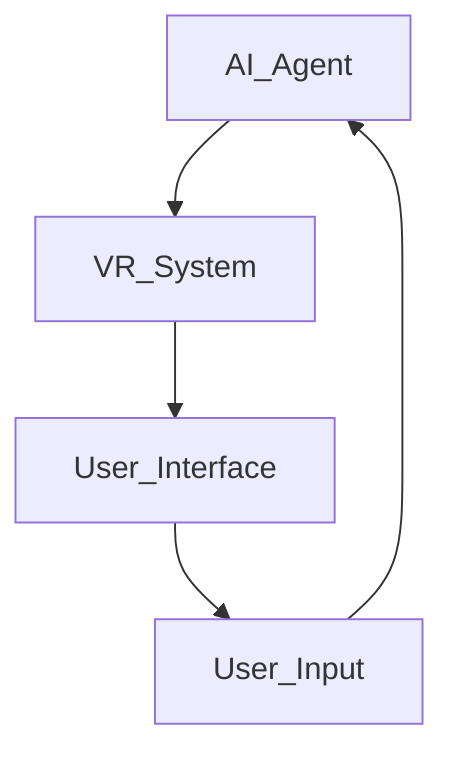
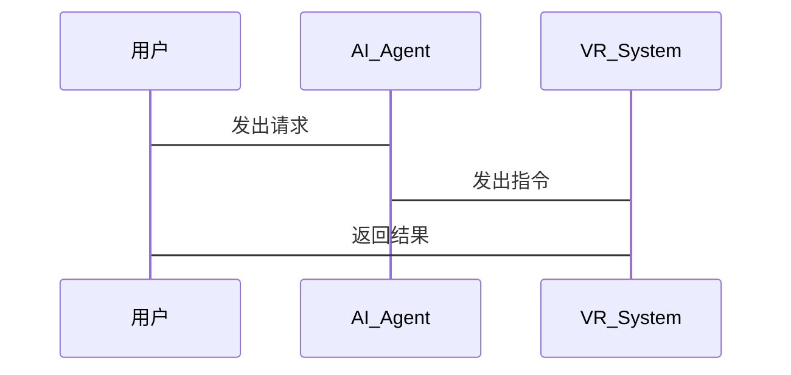

                 


# AI Agent在虚拟现实中的应用：沉浸式体验增强

> 关键词：AI Agent, 虚拟现实, 沉浸式体验, 人工智能, 虚拟现实系统

> 摘要：本文深入探讨了AI Agent在虚拟现实中的应用，重点分析了AI Agent如何增强沉浸式体验。通过详细的技术分析、系统设计和实际案例，本文展示了AI Agent在虚拟现实中的核心作用，以及如何通过算法和系统架构优化提升用户体验。

---

## 第一部分: AI Agent与虚拟现实概述

### 第1章: AI Agent与虚拟现实的背景介绍

#### 1.1 AI Agent的基本概念
##### 1.1.1 AI Agent的定义
AI Agent（人工智能代理）是一种能够感知环境、自主决策并执行任务的智能实体。它可以是一个软件程序或物理设备，具备以下核心特征：
- **自主性**：能够独立决策和行动。
- **反应性**：能够实时感知环境并做出反应。
- **目标导向**：基于目标或任务驱动行为。

##### 1.1.2 AI Agent的核心特征
AI Agent的核心特征包括：
- **智能性**：通过算法和数据处理环境信息。
- **适应性**：能够根据环境变化调整行为。
- **交互性**：能够与用户或其他系统进行交互。

##### 1.1.3 AI Agent与传统虚拟现实技术的对比
AI Agent与传统虚拟现实技术的主要区别在于：
- AI Agent具备自主决策能力，而传统VR技术依赖于预设脚本。
- AI Agent能够实时响应用户行为，提供更个性化的体验，而传统VR体验相对固定。

#### 1.2 虚拟现实的基本概念
##### 1.2.1 虚拟现实的定义
虚拟现实（Virtual Reality，VR）是一种模拟人类感知的计算机生成环境，用户可以通过特定设备（如头显）与虚拟世界进行交互。

##### 1.2.2 虚拟现实的关键技术
- **头显技术**：如Oculus Rift、HTC Vive等。
- **图形渲染**：实时生成高质量3D图形。
- **交互技术**：用户通过手柄、手势或语音与虚拟环境互动。

##### 1.2.3 虚拟现实的应用领域
- **游戏**：提供沉浸式游戏体验。
- **教育**：创建虚拟教室或实验室。
- **培训**：模拟真实场景进行培训。

#### 1.3 AI Agent与虚拟现实的结合
##### 1.3.1 AI Agent在虚拟现实中的角色
AI Agent在VR中的角色包括：
- **虚拟助手**：帮助用户完成任务，如导航或信息查询。
- **虚拟角色**：模拟人类或非玩家角色（NPC）的行为。

##### 1.3.2 虚拟现实中AI Agent的核心功能
- **智能交互**：与用户进行自然对话或行为互动。
- **环境感知**：实时分析用户动作和环境变化。
- **动态响应**：根据用户行为调整虚拟环境。

##### 1.3.3 AI Agent如何增强虚拟现实体验
通过AI Agent，VR体验可以实现：
- **个性化互动**：用户与虚拟角色的互动更具真实感。
- **动态环境**：虚拟场景能够实时响应用户行为。
- **智能反馈**：用户行为得到即时、智能的反馈。

---

## 第二部分: AI Agent的核心概念与联系

### 第2章: AI Agent与虚拟现实的核心概念对比

#### 2.1 AI Agent与虚拟现实的核心概念对比
| 特性               | AI Agent                          | 虚拟现实                        |
|--------------------|----------------------------------|---------------------------------|
| **自主性**          | 高                               | 低                             |
| **智能性**          | 高                               | 低                             |
| **交互性**          | 高                               | 中                             |
| **环境感知**        | 高                               | 中                             |
| **目标导向**        | 高                               | 低                             |

#### 2.2 AI Agent与虚拟现实的实体关系图


---

## 第三部分: AI Agent的算法原理

### 第3章: AI Agent在虚拟现实中的算法实现

#### 3.1 AI Agent的决策机制
AI Agent的决策机制通常基于强化学习或机器学习模型。以下是一个简单的Q-Learning算法流程：

##### 3.1.1 算法流程图
```mermaid
graph TD
Start --> Initialize(Q)
Initialize(Q) --> Choose action
Choose action --> Execute action
Execute action --> Get reward
Get reward --> Update Q-value
Update Q-value --> Repeat until convergence
Repeat until convergence --> End
```

##### 3.1.2 算法实现代码
```python
import numpy as np

class AI_Agent:
    def __init__(self, state_space, action_space):
        self.state_space = state_space
        self.action_space = action_space
        self.Q = np.zeros((state_space, action_space))

    def choose_action(self, state, epsilon=0.1):
        if np.random.random() < epsilon:
            return np.random.randint(self.action_space)
        return np.argmax(self.Q[state])

    def update_Q(self, state, action, reward, next_state, alpha=0.1):
        self.Q[state, action] = self.Q[state, action] + alpha * (reward + np.max(self.Q[next_state]) - self.Q[state, action])
```

##### 3.1.3 数学模型与公式
AI Agent的决策过程可以通过以下公式表示：
$$ Q(s, a) = Q(s, a) + \alpha [r + \max Q(s', a')] $$
其中：
- \( Q(s, a) \)：当前状态 \( s \) 下采取行动 \( a \) 的价值。
- \( \alpha \)：学习率。
- \( r \)：奖励。
- \( s' \)：下一个状态。
- \( a' \)：下一个行动。

---

## 第四部分: 系统分析与架构设计

### 第4章: AI Agent在虚拟现实中的系统架构

#### 4.1 系统功能设计
##### 4.1.1 领域模型


#### 4.2 系统架构设计
##### 4.2.1 系统架构图


#### 4.3 系统接口设计
- **AI Agent接口**：提供与虚拟现实系统的交互接口。
- **用户接口**：处理用户的输入和输出。

#### 4.4 系统交互流程


---

## 第五部分: 项目实战

### 第5章: 实现AI Agent在虚拟现实中的应用

#### 5.1 项目环境搭建
##### 5.1.1 环境安装
- 安装Python和相关库（如NumPy、OpenCV）。
- 安装虚拟现实开发框架（如Unity或Unreal Engine）。

##### 5.1.2 核心代码实现
```python
import numpy as np
import cv2

class AI_Agent:
    def __init__(self):
        self.q_table = np.zeros((10, 4))  # 状态空间：10，动作空间：4

    def choose_action(self, state):
        if np.random.random() < 0.1:
            return np.random.randint(4)
        return np.argmax(self.q_table[state])

    def update_q_table(self, state, action, reward, next_state, alpha=0.1):
        self.q_table[state, action] += alpha * (reward + np.max(self.q_table[next_state]) - self.q_table[state, action])

# 初始化AI Agent
agent = AI_Agent()

# 模拟环境
env = cv2.imread("vr_environment.jpg")
cv2.imshow("Environment", env)
cv2.waitKey(0)
cv2.destroyAllWindows()
```

#### 5.2 项目小结
通过上述代码实现，AI Agent可以在虚拟现实环境中实时感知和决策，从而提升用户体验。未来可以进一步优化算法，如引入深度强化学习，以实现更复杂的任务。

---

## 第六部分: 最佳实践与总结

### 第6章: 最佳实践与总结

#### 6.1 小结
AI Agent在虚拟现实中的应用前景广阔，能够显著提升沉浸式体验。通过算法优化和系统设计，可以实现更智能、更个性化的VR体验。

#### 6.2 注意事项
- 确保算法的高效性和实时性。
- 处理好用户隐私和数据安全问题。

#### 6.3 拓展阅读
- 《强化学习：算法与应用》
- 《虚拟现实开发入门》

---

## 作者

作者：AI天才研究院/AI Genius Institute & 禅与计算机程序设计艺术 /Zen And The Art of Computer Programming

