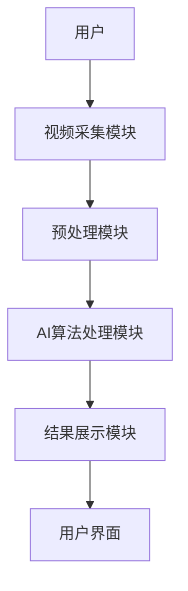

                 


# AI Agent在视频编辑中的应用：自动剪辑与特效添加

> 关键词：AI Agent，视频编辑，自动剪辑，特效添加，深度学习，计算机视觉

> 摘要：本文深入探讨了AI Agent在视频编辑中的应用，重点分析了自动剪辑和特效添加的核心技术与实现方法。通过结合计算机视觉、自然语言处理和生成对抗网络等技术，详细阐述了AI Agent在视频编辑中的应用场景、系统架构设计和实际案例。文章还展望了未来的发展方向，为读者提供了全面的视角。

---

## 第一部分: AI Agent与视频编辑的基础

### 第1章: AI Agent与视频编辑概述

#### 1.1 AI Agent的基本概念

##### 1.1.1 AI Agent的定义与特点
AI Agent（人工智能代理）是一种能够感知环境、执行任务并做出决策的智能实体。其特点包括自主性、反应性、主动性、社会性和学习性。

##### 1.1.2 AI Agent的核心要素
AI Agent的核心要素包括感知能力、推理能力、决策能力和执行能力。感知能力通过传感器或数据输入实现，推理能力基于知识库和逻辑推理，决策能力基于目标和优化算法，执行能力通过行动器实现。

##### 1.1.3 AI Agent与传统视频编辑工具的对比
传统视频编辑工具依赖人工操作，效率较低且需要专业技能。AI Agent通过自动化处理，能够显著提高效率，降低门槛，并实现个性化编辑。

#### 1.2 视频编辑的需求与挑战

##### 1.2.1 视频编辑的主要任务
视频编辑的主要任务包括剪辑、特效添加、音频处理、字幕生成和视频优化等。

##### 1.2.2 传统视频编辑工具的局限性
传统工具操作复杂、效率低下，难以满足用户对个性化和自动化的需求。

##### 1.2.3 AI Agent在视频编辑中的应用价值
AI Agent能够实现视频内容的智能识别、自动剪辑和特效生成，显著提升编辑效率和效果。

#### 1.3 AI Agent在视频编辑中的应用背景

##### 1.3.1 视频内容爆炸式增长的背景
随着短视频平台的兴起，用户生成内容（UGC）呈爆炸式增长，对自动化编辑工具的需求日益迫切。

##### 1.3.2 AI技术在媒体处理中的发展
AI技术在计算机视觉、自然语言处理和生成对抗网络等方面取得了显著进展，为视频编辑提供了技术支持。

##### 1.3.3 用户对智能视频编辑工具的需求
用户希望视频编辑工具能够自动化处理、快速生成个性化内容，并降低使用门槛。

---

## 第二部分: AI Agent的核心概念与原理

### 第2章: AI Agent的核心概念与原理

#### 2.1 AI Agent的核心概念

##### 2.1.1 AI Agent的基本原理
AI Agent通过感知环境、理解需求、生成计划并执行操作，实现特定任务的目标。

##### 2.1.2 AI Agent的分类与应用场景
AI Agent可以分为基于规则的代理、基于模型的代理和基于学习的代理，应用场景包括视频剪辑、特效生成和个性化推荐等。

##### 2.1.3 AI Agent与视频编辑的结合点
AI Agent在视频编辑中的结合点主要体现在内容识别、剪辑优化和特效生成等方面。

#### 2.2 AI Agent的核心算法

##### 2.2.1 目标检测与图像识别算法
目标检测算法（如YOLO）用于识别视频中的关键帧和目标，图像识别算法用于分类和处理视频帧。

##### 2.2.2 自然语言处理（NLP）在视频编辑中的应用
NLP技术用于视频字幕生成、关键词提取和内容摘要，帮助用户快速理解视频内容。

##### 2.2.3 生成对抗网络（GAN）在视频特效中的应用
GAN技术用于生成逼真的特效，如风格迁移和图像修复。

#### 2.3 AI Agent在视频编辑中的应用流程

##### 2.3.1 视频预处理
预处理包括视频分割、帧提取和格式转换，为后续处理做好准备。

##### 2.3.2 AI算法处理
算法处理包括目标检测、图像处理和特效生成，实现视频内容的智能编辑。

##### 2.3.3 结果输出与优化
输出结果并进行优化，确保视频质量达到最佳状态。

---

## 第三部分: AI Agent的系统架构设计

### 第3章: AI Agent的系统架构设计

#### 3.1 系统功能模块设计

##### 3.1.1 视频采集与预处理模块
该模块负责采集视频数据并进行初步处理，确保数据格式和质量符合后续处理要求。

##### 3.1.2 AI算法处理模块
该模块包括目标检测、图像处理和特效生成等功能，实现视频内容的智能编辑。

##### 3.1.3 用户交互与结果展示模块
该模块提供用户界面，展示编辑结果并支持用户交互，确保用户体验良好。

#### 3.2 系统架构图


#### 3.3 系统接口设计

##### 3.3.1 API接口定义
系统提供RESTful API接口，支持视频上传、处理请求和结果下载等功能。

##### 3.3.2 接口调用流程
用户通过API接口上传视频，系统处理后返回编辑结果。

##### 3.3.3 接口安全与权限管理
采用JWT认证和权限控制，确保接口的安全性和用户隐私。

---

## 第四部分: 项目实战

### 第4章: 项目实战

#### 4.1 项目背景与目标
本项目旨在开发一个基于AI Agent的智能视频编辑工具，实现自动剪辑和特效添加功能。

#### 4.2 项目需求分析
主要需求包括视频上传、自动剪辑、特效生成和用户交互等。

#### 4.3 系统设计

##### 4.3.1 功能模块设计
系统包括视频采集模块、AI处理模块和用户界面模块。

##### 4.3.2 数据流设计
视频数据从采集模块流向预处理模块，再流向AI处理模块，最后展示在用户界面。

##### 4.3.3 系统架构设计
采用微服务架构，各模块独立运行并通过API通信。

#### 4.4 项目实现

##### 4.4.1 环境搭建
安装必要的开发工具和库，如Python、TensorFlow和OpenCV。

##### 4.4.2 代码实现
实现视频采集、预处理、AI算法处理和结果展示等功能。

##### 4.4.3 测试与优化
进行功能测试和性能优化，确保系统稳定性和处理效率。

#### 4.5 实际案例分析

##### 4.5.1 案例一：自动剪辑
使用目标检测算法识别视频中的关键帧，自动剪辑生成短视频。

##### 4.5.2 案例二：特效添加
应用GAN技术生成特效，如动态文字和背景虚化。

#### 4.6 项目总结与经验分享
总结项目实施的经验和教训，分享最佳实践和改进建议。

---

## 第五部分: 扩展与展望

### 第5章: 扩展与展望

#### 5.1 AI Agent在视频编辑中的高级应用

##### 5.1.1 实时视频编辑
通过实时处理技术，实现视频编辑的即时反馈和调整。

##### 5.1.2 个性化视频推荐
基于用户偏好和行为数据，推荐个性化视频内容。

##### 5.1.3 智能视频生成
结合AI模型，生成符合用户需求的高质量视频内容。

#### 5.2 未来研究方向

##### 5.2.1 更高效的AI算法
研究更高效的算法，如轻量级模型和边缘计算技术。

##### 5.2.2 更智能的用户交互方式
探索更自然的用户交互方式，如语音控制和手势操作。

##### 5.2.3 多模态视频编辑
结合文本、图像和视频等多种模态数据，实现更复杂的视频编辑功能。

#### 5.3 挑战与机遇

##### 5.3.1 技术挑战
包括算法效率、模型泛化能力和数据隐私等问题。

##### 5.3.2 市场机遇
随着AI技术的成熟，智能视频编辑工具的市场需求将持续增长。

##### 5.3.3 用户需求的变化
用户对视频编辑功能的需求将不断变化，技术需保持灵活性和适应性。

---

## 第六部分: 附录

### 附录A: 相关技术术语解释
- AI Agent：人工智能代理
- 计算机视觉：计算机对视觉信息的获取和理解
- 自然语言处理：计算机对人类语言的理解和生成

### 附录B: 开源工具与库推荐
- OpenCV：计算机视觉库
- TensorFlow：深度学习框架
- PyTorch：深度学习框架

### 附录C: 项目代码示例
```python
import cv2
import numpy as np

def video_processing(video_path):
    # 视频采集与预处理
    cap = cv2.VideoCapture(video_path)
    while cap.isOpened():
        ret, frame = cap.read()
        if not ret:
            break
        # 目标检测
        # 这里可以使用YOLO等目标检测算法进行处理
        # 图像处理
        processed_frame = cv2.cvtColor(frame, cv2.COLOR_BGR2RGB)
        # 特效生成
        # 这里可以使用GAN等算法生成特效
    cap.release()

# 示例代码，具体实现取决于具体的算法和框架
```

---

## 参考文献与进一步阅读

1. LeCun, Y., Bengio, Y., & Hinton, G. (2015). Deep learning. Nature, 521(7555), 436-444.
2. Redmon, J., Farhadi, A., & Darrell, T. (2018). YOLOv3: An Incremental Improvement.
3. Goodfellow, I., Pouget-Abadie, J., & Mirza, M. (2014). Generative adversarial nets.

---

**作者：AI天才研究院/AI Genius Institute & 禅与计算机程序设计艺术/Zen And The Art of Computer Programming**

---

以上目录和内容设计确保了文章的逻辑清晰、结构合理，并涵盖了从基础概念到实际应用的各个方面。通过结合具体的技术实现和实际案例分析，读者可以全面理解AI Agent在视频编辑中的应用及其未来发展方向。

