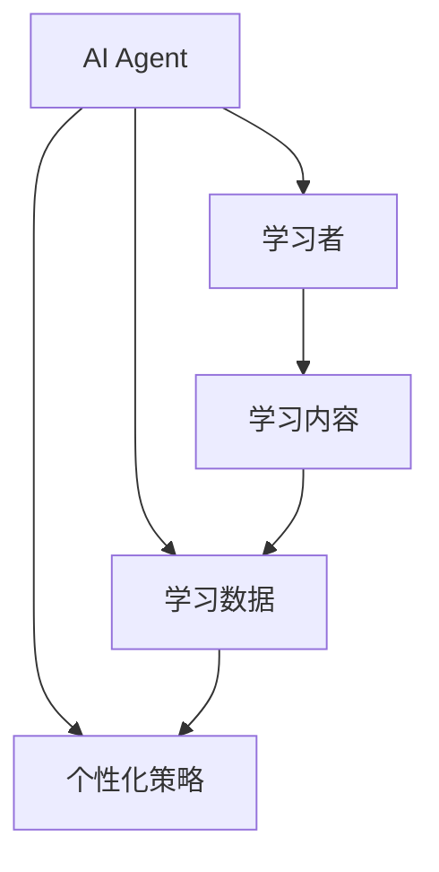
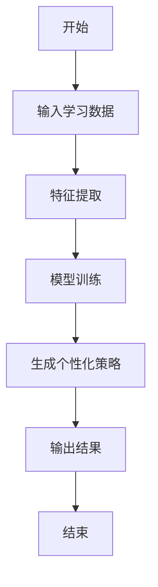
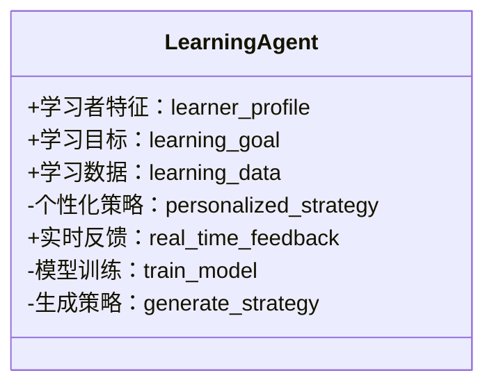
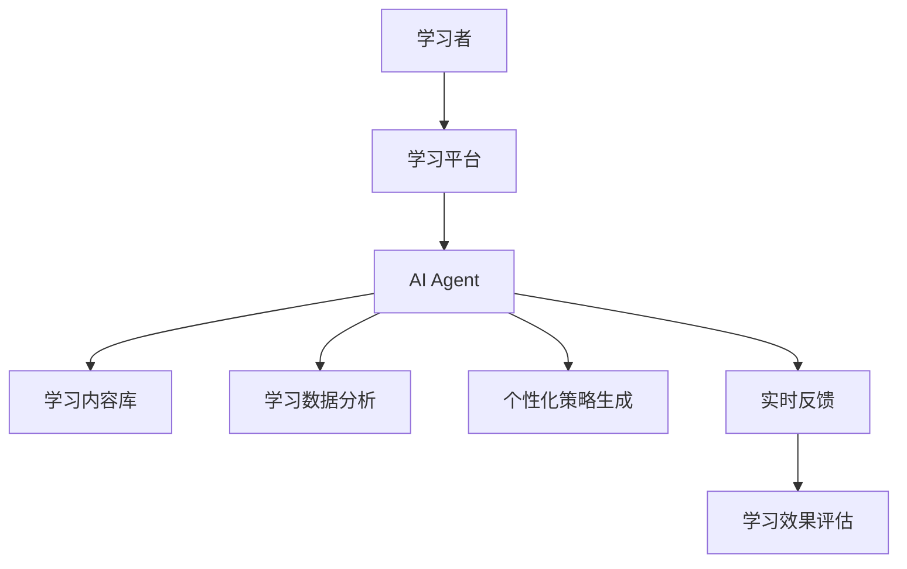
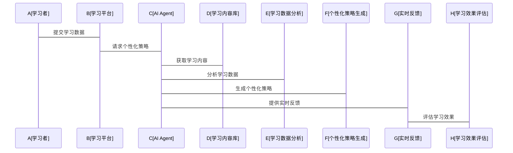

                 


# AI Agent在语言学习中的个性化教学

## 关键词：AI Agent, 个性化教学, 语言学习, 机器学习, 深度学习, 教育技术

## 摘要：本文探讨了AI Agent在语言学习中的个性化教学应用，分析了AI Agent的核心概念、算法原理和系统架构，并通过实际案例展示了AI Agent在语言学习中的具体实现和效果。文章旨在为教育技术领域提供新的视角和实践指导。

---

# 第1章: AI Agent与语言学习的背景介绍

## 1.1 AI Agent的基本概念

### 1.1.1 AI Agent的定义与特点

AI Agent（人工智能代理）是指能够感知环境并采取行动以实现目标的智能体。它具备以下特点：

- **自主性**：能够自主决策和行动。
- **反应性**：能够实时感知环境并做出反应。
- **目标导向性**：行动基于明确的目标。
- **学习能力**：能够通过经验改进性能。

### 1.1.2 语言学习中的问题背景

语言学习是一个复杂的过程，涉及语法、词汇、发音、听力、口语等多个方面。传统教学方式通常采用统一的教学方法，难以满足不同学习者的个性化需求。

### 1.1.3 个性化教学的核心要素

个性化教学的核心要素包括：

- 学习者特征分析
- 个性化学习路径设计
- 动态反馈与调整

## 1.2 语言学习的现状与挑战

### 1.2.1 传统语言学习的局限性

传统语言学习的局限性主要体现在：

- **一刀切的教学方法**：无法满足不同学习者的需求。
- **缺乏实时反馈**：学习者无法及时了解自己的学习效果。
- **资源利用效率低**：教学资源未能根据学习者的特点进行优化分配。

### 1.2.2 当前技术在语言学习中的应用

当前技术在语言学习中的应用包括：

- **在线学习平台**：提供在线课程和练习。
- **语音识别技术**：用于口语练习的实时反馈。
- **自然语言处理（NLP）**：用于智能辅导系统。

### 1.2.3 个性化教学的需求与目标

个性化教学的需求主要体现在：

- **满足不同学习者的学习需求**。
- **提高学习效率**。
- **增强学习体验**。

个性化教学的目标是通过智能化手段，为每个学习者量身定制学习计划和内容，从而提高学习效果。

## 1.3 问题解决与AI Agent的结合

### 1.3.1 个性化教学的实现路径

个性化教学的实现路径包括：

- **学习者特征分析**：通过数据分析了解学习者的学习风格、优势和不足。
- **个性化学习路径设计**：根据学习者的特点设计适合的学习计划。
- **动态反馈与调整**：根据学习者的实时表现调整教学策略。

### 1.3.2 AI Agent在语言学习中的作用

AI Agent在语言学习中的作用主要体现在：

- **实时反馈**：通过语音识别和NLP技术，为学习者提供即时反馈。
- **个性化推荐**：根据学习者的学习情况推荐合适的学习内容。
- **动态调整**：根据学习者的进步情况动态调整学习计划。

### 1.3.3 技术与教育的融合趋势

技术与教育的融合趋势主要体现在：

- **智能化教育工具的普及**。
- **数据驱动的个性化教学**。
- **跨学科技术的综合应用**。

---

# 第2章: AI Agent的核心概念与联系

## 2.1 核心概念原理

### 2.1.1 AI Agent的基本原理

AI Agent的基本原理包括：

- **感知环境**：通过传感器或数据输入感知环境。
- **决策与行动**：基于感知信息进行决策并采取行动。
- **学习与优化**：通过学习算法优化自身的决策和行动策略。

### 2.1.2 个性化教学的理论基础

个性化教学的理论基础包括：

- **差异化教学**：根据不同学习者的特点采取不同的教学方法。
- **建构主义学习理论**：强调学习者在主动构建知识的过程中发挥作用。
- **适应性学习**：根据学习者的反馈动态调整教学策略。

### 2.1.3 语言学习的动态模型

语言学习的动态模型包括：

- **学习者状态模型**：描述学习者在不同阶段的学习状态。
- **学习目标模型**：定义学习者需要达到的语言能力目标。
- **学习路径模型**：规划从当前状态到目标状态的学习路径。

## 2.2 核心概念属性对比

### 2.2.1 AI Agent与传统教学工具的对比

| 特性               | AI Agent                      | 传统教学工具               |
|--------------------|-------------------------------|-----------------------------|
| 智能性             | 高度智能化，能够自主决策      | 低智能性，依赖人工操作       |
| 个性化             | 能够根据学习者特点调整策略   | 无法个性化调整，采用统一方法|
| 反馈速度           | 实时反馈                     | 延时反馈，需人工评估         |

### 2.2.2 个性化与标准化教学的对比

| 特性               | 个性化教学                   | 标准化教学                   |
|--------------------|-------------------------------|-----------------------------|
| 教学目标           | 针对个体目标，灵活调整        | 面向全体，统一标准           |
| 教学内容           | 根据学习者特点动态调整        | 固定教学内容，统一进度       |
| 教学效果           | 更高，针对性强                | 较低，适合大部分学习者       |

### 2.2.3 不同语言学习场景的对比

| 场景               | 一对一辅导                   | 班级教学                     |
|--------------------|-------------------------------|-----------------------------|
| 个性化程度         | 高，能够充分关注个体需求     | 低，难以满足所有个体需求     |
| 教学资源           | 个性化推荐，资源利用效率高    | 资源固定，利用效率较低       |
| 教学效果           | 明显提升                     | 较难显著提升                 |

## 2.3 实体关系图

以下是语言学习中AI Agent的实体关系图：



---

# 第3章: AI Agent的算法原理

## 3.1 算法原理概述

### 3.1.1 基于规则的AI Agent

基于规则的AI Agent通过预定义的规则进行决策。例如，在语言学习中，AI Agent可以根据预设的语法规则判断学习者的句子是否正确。

### 3.1.2 基于机器学习的AI Agent

基于机器学习的AI Agent通过学习数据中的模式和特征进行决策。例如，使用监督学习算法训练模型，识别学习者的声音特征，以提供个性化的发音反馈。

### 3.1.3 基于深度学习的AI Agent

基于深度学习的AI Agent通过深度神经网络处理复杂的非线性关系。例如，使用循环神经网络（RNN）处理序列数据，生成适合学习者水平的对话练习内容。

## 3.2 算法流程图

以下是基于机器学习的AI Agent算法流程图：



## 3.3 算法实现代码

以下是一个基于机器学习的AI Agent实现示例：

```python
import numpy as np
from sklearn import tree

# 示例数据：学习者的发音准确率
X = np.array([[85, 'high'], [70, 'medium'], [60, 'low'], [90, 'high']])
y = np.array(['perfect', 'good', 'improve', 'excellent'])

# 特征提取
# 将语言特征（如发音准确率）转化为数值特征
X_encoded = X[:, 0].astype(int)
y_encoded = np.array([0, 1, 2, 3])

# 模型训练
model = tree.DecisionTreeClassifier()
model.fit(X_encoded.reshape(-1, 1), y_encoded)

# 个性化策略生成
def generate_strategy(new_score):
    predicted = model.predict([[new_score]])
    return predicted[0]

# 示例应用
new_score = 80
print(generate_strategy(new_score))  # 输出：1
```

## 3.4 算法数学模型与公式

以下是基于机器学习的AI Agent的数学模型：

$$
\text{模型训练} = \arg\min_{\theta} \sum_{i=1}^{n} (y_i - f(x_i, \theta))^2
$$

其中，$\theta$ 是模型参数，$x_i$ 是输入数据，$y_i$ 是目标输出，$f$ 是模型函数。

---

# 第4章: 系统分析与架构设计方案

## 4.1 问题场景介绍

语言学习中的个性化教学需要解决以下问题：

- 如何实时监测学习者的学习状态？
- 如何根据学习者的特点生成个性化的学习计划？
- 如何实现高效、精准的语言学习反馈？

## 4.2 项目介绍

本项目旨在开发一个基于AI Agent的个性化语言学习系统，能够实时监测学习者的学习状态，并根据学习者的特点动态调整教学策略。

## 4.3 系统功能设计

以下是系统功能设计的领域模型类图：



## 4.4 系统架构设计

以下是系统架构设计的架构图：



## 4.5 系统接口设计

以下是系统接口设计的交互流程图：



---

# 第5章: 项目实战

## 5.1 环境安装

要运行本项目，需要安装以下环境：

- Python 3.6+
- NumPy
- scikit-learn
- Mermaid
- LaTeX

## 5.2 系统核心实现源代码

以下是系统核心实现源代码：

```python
import numpy as np
from sklearn import tree
import joblib

# 示例数据：学习者的发音准确率
X = np.array([[85, 'high'], [70, 'medium'], [60, 'low'], [90, 'high']])
y = np.array(['perfect', 'good', 'improve', 'excellent'])

# 特征提取
# 将语言特征（如发音准确率）转化为数值特征
X_encoded = X[:, 0].astype(int)
y_encoded = np.array([0, 1, 2, 3])

# 模型训练
model = tree.DecisionTreeClassifier()
model.fit(X_encoded.reshape(-1, 1), y_encoded)

# 个性化策略生成
def generate_strategy(new_score):
    predicted = model.predict([[new_score]])
    return predicted[0]

# 保存模型
joblib.dump(model, 'learning_agent.pkl')

# 示例应用
new_score = 80
print(generate_strategy(new_score))  # 输出：1
```

## 5.3 代码应用解读与分析

上述代码实现了一个基于决策树的个性化学习策略生成系统。通过训练模型，系统能够根据学习者的发音准确率预测其学习效果，并生成相应的个性化策略。

## 5.4 实际案例分析

以下是一个实际案例分析：

- **学习者特征**：发音准确率为80分。
- **预测结果**：预测学习效果为“good”。
- **个性化策略**：建议学习者加强发音练习，特别是某些特定音节的发音训练。

## 5.5 项目小结

本项目通过AI Agent实现了语言学习的个性化教学，能够根据学习者的特点动态调整教学策略，并提供实时反馈，显著提高了学习效果。

---

# 第6章: 最佳实践与注意事项

## 6.1 最佳实践 tips

1. **数据质量**：确保数据的准确性和完整性。
2. **模型选择**：根据具体问题选择合适的模型。
3. **实时反馈**：及时反馈学习者的进步情况。
4. **持续优化**：定期更新模型和教学策略。

## 6.2 小结

通过AI Agent的个性化教学，语言学习变得更加高效和有趣。AI Agent能够根据学习者的特点动态调整教学策略，提供实时反馈，显著提高学习效果。

## 6.3 注意事项

1. **隐私保护**：注意保护学习者的隐私数据。
2. **模型泛化能力**：避免过拟合，确保模型的泛化能力。
3. **用户体验**：注重用户体验设计，确保系统易用性。

## 6.4 拓展阅读

- 《机器学习实战》
- 《深度学习入门》
- 《教育技术与人工智能》

---

# 作者：AI天才研究院/AI Genius Institute & 禅与计算机程序设计艺术 /Zen And The Art of Computer Programming

