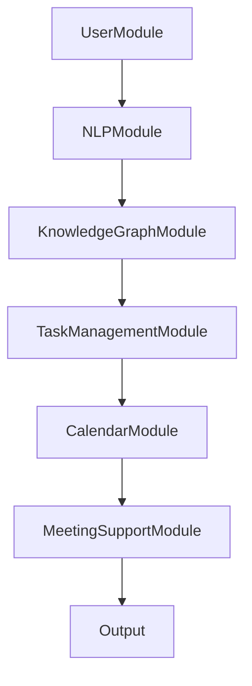
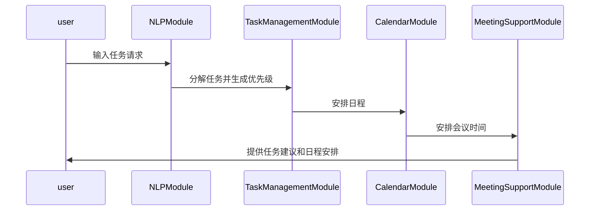

                 


# AI Agent在远程办公支持中的应用与最佳实践

## 关键词：AI Agent, 远程办公, 自然语言处理, 知识图谱, 任务管理, 会议支持

## 摘要：  
随着远程办公的普及，AI Agent（人工智能代理）在提高工作效率、简化任务管理、优化会议流程等方面发挥着越来越重要的作用。本文从AI Agent的基本概念出发，详细探讨其在远程办公中的应用场景，包括任务管理、日程安排、会议支持等，并分析其技术基础，如自然语言处理（NLP）和知识图谱。同时，本文还深入解析AI Agent系统的架构设计，结合实际案例，提供最佳实践和未来发展的建议。  

---

## 第一部分：AI Agent与远程办公支持的背景与概念

### 第1章：AI Agent与远程办公概述

#### 1.1 AI Agent的基本概念
- **1.1.1 什么是AI Agent**  
  AI Agent（人工智能代理）是一种能够感知环境、执行任务并做出决策的智能实体。它通过与用户交互或自动执行操作，帮助用户完成复杂任务。  

- **1.1.2 AI Agent的核心特征**  
  - **自主性**：能够自主决策和执行任务。  
  - **反应性**：能够实时感知环境并做出响应。  
  - **目标导向**：以明确的目标为导向执行任务。  
  - **学习能力**：能够通过数据和经验不断优化自身性能。  

- **1.1.3 AI Agent与传统办公工具的区别**  
  AI Agent不仅能够执行任务，还能通过学习和推理提供智能化的决策支持，而传统办公工具仅限于基本的功能实现。  

#### 1.2 远程办公的背景与挑战
- **1.2.1 远程办公的兴起**  
  疫情推动了远程办公的普及，企业逐渐意识到远程办公的灵活性和效率提升。  

- **1.2.2 远程办公的主要挑战**  
  - **沟通不畅**：缺乏面对面的交流可能导致信息传递不准确。  
  - **效率低下**：远程协作需要更高效的工具支持。  
  - **团队协作困难**：远程环境下难以保持团队的凝聚力和协作效率。  

- **1.2.3 AI Agent在远程办公中的作用**  
  AI Agent通过智能化的任务管理、会议支持和协作工具，帮助解决远程办公中的效率和沟通问题。  

#### 1.3 本章小结  
本章介绍了AI Agent的基本概念及其在远程办公中的重要性，为后续内容奠定了基础。

---

## 第二部分：AI Agent的技术基础

### 第2章：自然语言处理（NLP）基础

#### 2.1 NLP的基本概念
- **2.1.1 什么是NLP**  
  NLP（Natural Language Processing）是研究人类语言的计算机科学，旨在让计算机能够理解、生成和处理人类语言。  

- **2.1.2 NLP的核心任务**  
  - **文本分类**：将文本归类到预定义的类别中。  
  - **实体识别**：从文本中提取关键实体（如人名、地点、组织等）。  
  - **句法分析**：分析句子的语法结构。  
  - **情感分析**：判断文本的情感倾向。  

- **2.1.3 NLP在AI Agent中的应用**  
  AI Agent通过NLP技术实现与用户的自然语言交互，理解用户的意图并执行相应的操作。  

#### 2.2 知识图谱与语义理解
- **2.2.1 知识图谱的定义**  
  知识图谱是一种结构化的知识表示形式，由节点和边组成，节点代表实体或概念，边代表实体之间的关系。  

- **2.2.2 知识图谱的构建过程**  
  - **数据收集**：从多种数据源收集知识。  
  - **数据清洗**：去除冗余和错误数据。  
  - **知识抽取**：从文本中提取实体和关系。  
  - **知识融合**：将多个来源的知识整合到统一的知识图谱中。  

- **2.2.3 语义理解在AI Agent中的应用**  
  AI Agent利用知识图谱进行语义理解，能够准确解析用户的意图并提供相关的知识支持。  

#### 2.3 本章小结  
本章详细介绍了NLP和知识图谱的基本概念及其在AI Agent中的应用，为后续的应用场景分析提供了技术基础。

---

## 第三部分：AI Agent在远程办公中的应用场景

### 第3章：任务管理与日程安排

#### 3.1 任务管理的核心流程
- **3.1.1 任务分解与优先级排序**  
  AI Agent能够将复杂任务分解为简单子任务，并根据优先级排序帮助用户高效完成任务。  

- **3.1.2 任务跟踪与反馈**  
  AI Agent通过实时跟踪任务进度并提供反馈，帮助用户及时调整计划。  

- **3.1.3 AI Agent在任务管理中的角色**  
  AI Agent不仅是任务执行者，还是用户的智能助手，能够提供任务建议和优化方案。  

#### 3.2 日程安排的智能化
- **3.2.1 智能日历的定义**  
  智能日历是一种结合AI技术的日历管理工具，能够根据用户的习惯和任务优先级自动安排日程。  

- **3.2.2 AI Agent在日程安排中的应用**  
  AI Agent能够自动安排会议时间、发送提醒，并根据用户的日程安排优化任务优先级。  

- **3.2.3 与团队成员的日程同步**  
  AI Agent能够帮助团队成员同步日程，确保团队协作的高效性。  

#### 3.3 本章小结  
本章详细介绍了AI Agent在任务管理和日程安排中的应用，展示了其在提升远程办公效率中的重要作用。

### 第4章：会议支持与协作

#### 4.1 会议管理的核心问题
- **4.1.1 会议安排与提醒**  
  AI Agent能够自动安排会议时间，并通过邮件或消息提醒相关人员。  

- **4.1.2 会议记录与总结**  
  AI Agent通过语音识别和自然语言处理技术，自动记录会议内容并生成会议总结。  

- **4.1.3 会议效率的提升**  
  AI Agent能够根据会议内容和参与者的反馈，优化会议流程并减少无效时间。  

#### 4.2 协作工具的智能化
- **4.2.1 协作工具的基本功能**  
  协作工具包括文档协作、任务分配、实时沟通等功能。  

- **4.2.2 AI Agent在协作工具中的应用**  
  AI Agent能够通过自然语言处理技术，帮助用户快速找到所需信息并优化协作流程。  

- **4.2.3 协作工具的未来发展**  
  随着AI技术的不断发展，协作工具将更加智能化，能够提供更精准的任务推荐和自动化支持。  

#### 4.3 本章小结  
本章探讨了AI Agent在会议支持与协作中的应用，展示了其在提升远程办公效率中的潜力。

---

## 第四部分：系统架构与设计

### 第5章：AI Agent远程办公支持系统的架构设计

#### 5.1 系统功能模块划分
- **用户模块**  
  用户模块负责接收用户的输入并触发相应的功能。  
- **NLP模块**  
  NLP模块负责解析用户的意图并生成相应的指令。  
- **知识图谱模块**  
  知识图谱模块用于存储和管理相关知识，支持语义理解。  
- **任务管理模块**  
  任务管理模块负责任务的分解、优先级排序和跟踪。  
- **日程安排模块**  
  日程安排模块负责用户的日程管理与优化。  
- **会议支持模块**  
  会议支持模块负责会议的安排、记录和总结。  

#### 5.2 系统架构图  
以下是系统的架构设计图：  



#### 5.3 系统交互流程
以下是系统的交互流程图：  



#### 5.4 本章小结  
本章详细分析了AI Agent支持系统的架构设计，为后续的项目实施提供了技术依据。

---

## 第五部分：项目实战

### 第6章：AI Agent远程办公支持系统的实现

#### 6.1 环境配置
- **Python版本**：3.8及以上  
- **NLP库**：spaCy或jieba  
- **知识图谱库**：NetworkX或Neo4j  

#### 6.2 核心代码实现
以下是AI Agent的核心代码示例：

```python
class AIAssistant:
    def __init__(self):
        self.nlp = spaCy.load("en_core_web_sm")
        self.knowledge_graph = KnowledgeGraph()

    def process_query(self, query):
        # 解析用户意图
        intent = self.nlp(query).ents[0].label_
        # 根据意图执行操作
        if intent == "task":
            self.task_management(query)
        elif intent == "meeting":
            self.meeting_support(query)
    
    def task_management(self, query):
        # 任务分解与优先级排序
        tasks = self.nlp(query).tokens
        self.TaskManager.sort_priority(tasks)
    
    def meeting_support(self, query):
        # 会议安排与记录
        self.MeetingSupport.schedule_meeting(query)
```

#### 6.3 案例分析
以任务管理为例，用户输入“帮我安排一个下午的会议”，AI Agent通过NLP解析意图后，调用任务管理模块安排会议时间，并通过知识图谱模块生成会议记录。

#### 6.4 本章小结  
本章通过实际案例展示了AI Agent支持系统的实现过程，为读者提供了参考。

---

## 第六部分：最佳实践与未来展望

### 第7章：最佳实践

#### 7.1 系统设计建议
- **模块化设计**：确保系统模块化，便于后续扩展和维护。  
- **数据隐私保护**：加强数据加密和隐私保护，确保用户数据安全。  
- **用户体验优化**：注重用户体验，确保系统易用性和智能化。  

#### 7.2 项目实施注意事项
- **需求分析**：充分了解用户需求，确保系统功能与实际需求匹配。  
- **团队协作**：加强团队协作，确保各模块协同工作。  
- **持续优化**：通过用户反馈不断优化系统性能和用户体验。  

#### 7.3 本章小结  
本章总结了AI Agent系统设计和实施中的最佳实践，为读者提供了宝贵的参考。

### 第8章：未来展望

#### 8.1 技术发展趋势
- **多模态交互**：结合语音、视觉等多种交互方式，提升用户体验。  
- **自适应学习**：通过机器学习技术实现自适应优化。  
- **边缘计算**：将AI Agent部署在边缘设备上，提升响应速度和隐私保护。  

#### 8.2 应用场景扩展
- **智能决策支持**：通过大数据分析和机器学习，提供更精准的决策支持。  
- **跨平台协作**：支持多种平台和设备的无缝协作，实现真正的全球化办公。  

#### 8.3 本章小结  
本章展望了AI Agent在远程办公支持中的未来发展方向，为读者提供了新的思路。

---

## 作者：AI天才研究院 & 禅与计算机程序设计艺术

