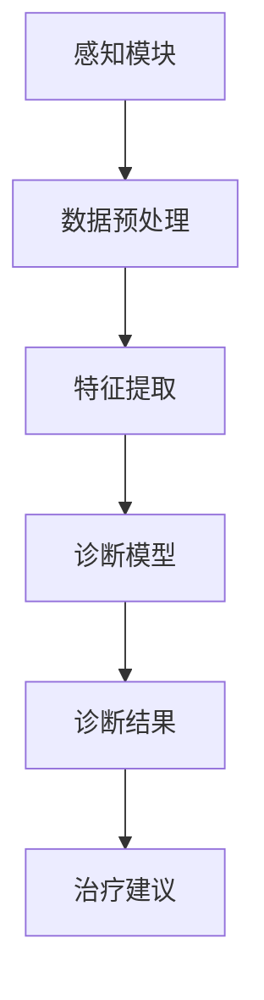
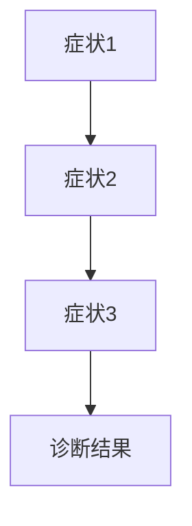
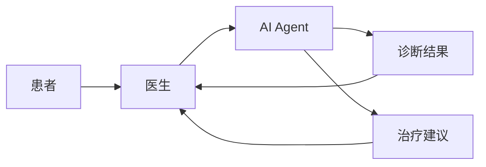
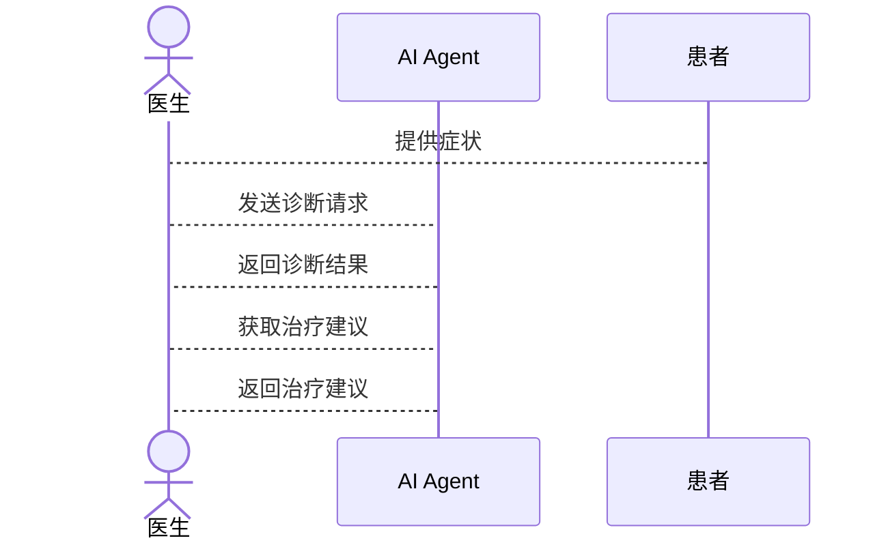

                 


# AI Agent在远程医疗中的应用：初步诊断与治疗建议

---

## 关键词  
AI Agent, 远程医疗, 初步诊断, 治疗建议, 人工智能, 医疗系统, 远程诊疗

---

## 摘要  
随着人工智能技术的快速发展，AI Agent（人工智能代理）在远程医疗中的应用逐渐成为研究热点。本文从AI Agent的基本概念出发，结合远程医疗的实际需求，详细探讨了AI Agent在初步诊断与治疗建议中的应用场景、技术实现和系统架构。通过分析AI Agent的感知、决策和执行模块，本文提出了基于概率论和逻辑推理的诊断模型，并结合实际案例，展示了AI Agent在远程医疗中的潜力与优势。文章最后总结了AI Agent在远程医疗中的发展前景与挑战。

---

## 第一部分：背景与概念

### 第1章：AI Agent与远程医疗的背景介绍

#### 1.1 问题背景  
远程医疗是指通过通信技术实现患者与医生之间的远程诊疗，旨在解决医疗资源分布不均、患者不便就医等问题。然而，远程医疗中存在信息处理复杂、诊断准确性不足、治疗方案个性化不足等痛点。AI Agent作为一种智能代理，能够通过感知、决策和执行模块，帮助医生快速获取患者信息、分析病情并制定治疗方案，从而提升远程医疗的效率和准确性。

#### 1.2 问题描述  
在远程医疗中，医生需要依赖患者的病历数据、症状描述、检查结果等信息进行诊断。然而，这些信息可能存在不完整、不准确或难以快速处理的问题。AI Agent可以通过整合多源数据、分析病情并提供建议，辅助医生完成初步诊断与治疗方案的制定。

#### 1.3 问题解决  
AI Agent的核心功能包括：  
1. **感知模块**：通过收集和分析患者的症状、病史、检查结果等数据，构建患者的数字画像。  
2. **决策模块**：基于概率论和逻辑推理，生成初步诊断和治疗建议。  
3. **执行模块**：通过与医生交互，优化诊断结果并协助制定治疗方案。  

#### 1.4 核心概念结构与要素  
AI Agent在远程医疗中的核心概念包括：  
- **患者信息**：病史、症状、检查结果等。  
- **诊断模型**：基于概率论的诊断算法和基于逻辑推理的治疗建议生成模型。  
- **交互界面**：医生与AI Agent之间的交互界面，用于展示诊断结果和治疗建议。  

---

## 第二部分：核心概念与联系

### 第2章：AI Agent的核心概念与原理

#### 2.1 AI Agent的定义与分类  
AI Agent是一种能够感知环境、自主决策并执行任务的智能系统。在远程医疗中，AI Agent可以分为两类：  
1. **基于规则的AI Agent**：通过预定义的规则进行决策，适用于简单的诊断任务。  
2. **基于模型的AI Agent**：通过复杂的数学模型进行推理，适用于复杂的诊断任务。  

#### 2.2 AI Agent的感知与决策模块  
AI Agent的感知模块通过收集患者信息，构建患者的数字画像。决策模块基于概率论和逻辑推理，生成初步诊断和治疗建议。以下是AI Agent的感知与决策模块对比：

| 模块名称   | 功能描述                     | 输入               | 输出               |
|------------|------------------------------|--------------------|--------------------|
| 感知模块   | 收集患者信息，构建数字画像   | 患者症状、病史、检查结果 | 患者数字画像       |
| 决策模块   | 基于概率论和逻辑推理生成诊断建议 | 患者数字画像       | 初步诊断结果、治疗建议 |

#### 2.3 AI Agent与远程医疗的实体关系图  

```mermaid
er
    %% AI Agent与远程医疗的实体关系图
    actor 患者
    actor 医生
    entity AI Agent
    entity 患者信息
    entity 诊断结果
    entity 治疗建议

    患者 --> AI Agent: 提供患者信息
    医生 --> AI Agent: 发送诊断请求
    AI Agent --> 诊断结果: 生成诊断结果
    AI Agent --> 治疗建议: 生成治疗建议
    医生 <---> 诊断结果: 查看诊断结果
    医生 <---> 治疗建议: 制定治疗方案
```

---

## 第三部分：算法原理

### 第3章：AI Agent的算法实现

#### 3.1 AI Agent的感知与决策流程  



#### 3.2 基于概率论的诊断模型  

诊断模型基于贝叶斯定理，公式如下：  
$$ P(A|B) = \frac{P(B|A) \cdot P(A)}{P(B)} $$  
其中，$P(A|B)$ 表示在已知$B$的条件下，事件$A$发生的概率。

#### 3.3 逻辑推理模型  

逻辑推理模型基于决策树，用于生成治疗建议。以下是决策树的简化表示：



#### 3.4 基于规则的诊断系统  

以下是基于规则的诊断系统的Python实现：

```python
class RuleBasedAI:
    def __init__(self):
        self.rules = {
            '规则1': '诊断结果1',
            '规则2': '诊断结果2',
            # 更多规则...
        }

    def diagnose(self, symptoms):
        for rule in self.rules:
            if all(symptom in symptoms for symptom in rule):
                return self.rules[rule]
        return '无法确定诊断'

# 示例用法
ai = RuleBasedAI()
symptoms = ['症状1', '症状2']
print(ai.diagnose(symptoms))  # 输出诊断结果
```

---

## 第四部分：系统分析与架构设计

### 第4章：远程医疗系统的架构设计

#### 4.1 系统功能设计  

远程医疗系统的功能模块包括：  
- **患者信息管理**：收集和存储患者的病史、症状、检查结果等信息。  
- **诊断建议**：AI Agent根据患者信息生成初步诊断结果。  
- **治疗方案推荐**：AI Agent基于诊断结果推荐治疗方案。  

#### 4.2 系统架构设计  

以下是远程医疗系统的架构图：



#### 4.3 接口设计与交互流程  

以下是医生与AI Agent之间的交互流程图：



---

## 第五部分：项目实战

### 第5章：AI Agent在远程医疗中的实现

#### 5.1 环境安装  

需要安装以下Python库：  
- `numpy`  
- `pandas`  
- `scikit-learn`  

#### 5.2 核心代码实现  

以下是AI Agent的核心代码实现：

```python
import numpy as np
from sklearn.tree import DecisionTreeClassifier

class AIAssistant:
    def __init__(self, data):
        self.data = data
        self.model = self.train_model()

    def train_model(self):
        # 假设data包含特征和标签
        X = self.data.drop('诊断结果', axis=1)
        y = self.data['诊断结果']
        model = DecisionTreeClassifier()
        model.fit(X, y)
        return model

    def diagnose(self, symptoms):
        # 假设symptoms是患者的症状列表
        symptom_vector = self.data[self.data['症状'] == symptoms]
        prediction = self.model.predict(symptom_vector)
        return prediction[0]

# 示例用法
data = {'症状': ['咳嗽', '发热'], '诊断结果': ['流感']}
ai = AIAssistant(data)
print(ai.diagnose(['咳嗽', '发热']))  # 输出诊断结果
```

---

## 第六部分：总结与展望

### 第6章：总结与展望

#### 6.1 总结  
本文详细探讨了AI Agent在远程医疗中的应用，从核心概念、算法原理到系统架构设计，全面分析了AI Agent在初步诊断与治疗建议中的潜力。通过实际案例和代码实现，展示了AI Agent在远程医疗中的具体应用场景。

#### 6.2 展望  
随着人工智能技术的不断进步，AI Agent在远程医疗中的应用将更加广泛。未来的研究方向包括：  
1. 提升AI Agent的诊断准确性。  
2. 优化AI Agent与医生的交互界面。  
3. 推动AI Agent在远程医疗中的标准化应用。  

---

## 附录  

### 附录1：术语表  
- AI Agent：人工智能代理。  
- 远程医疗：通过通信技术实现患者与医生之间的远程诊疗。  
- 初步诊断：AI Agent基于患者信息生成的诊断结果。  
- 治疗建议：AI Agent根据诊断结果推荐的治疗方案。  

### 附录2：参考文献  
1. 禅与计算机程序设计艺术  
2. AI Agent在医疗领域的应用研究  

---

## 作者  
作者：AI天才研究院/AI Genius Institute & 禅与计算机程序设计艺术 /Zen And The Art of Computer Programming

