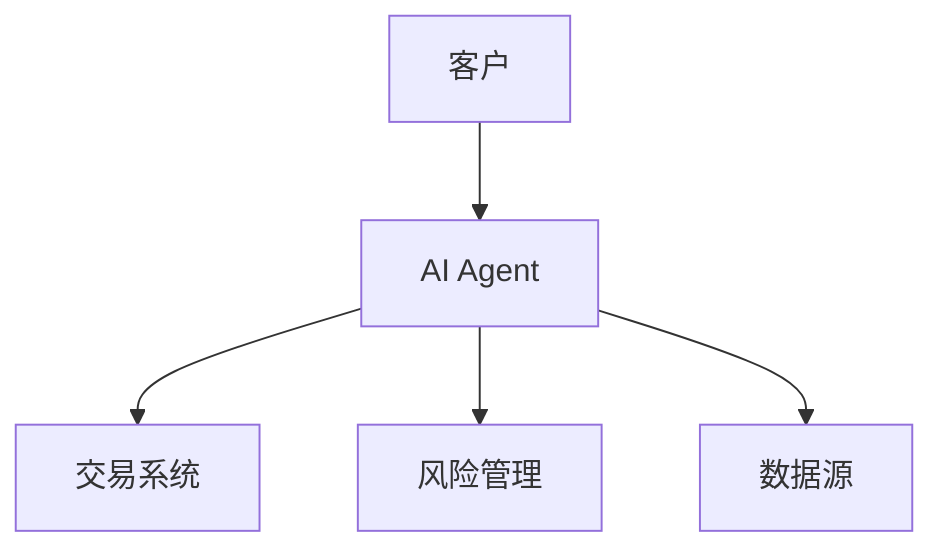
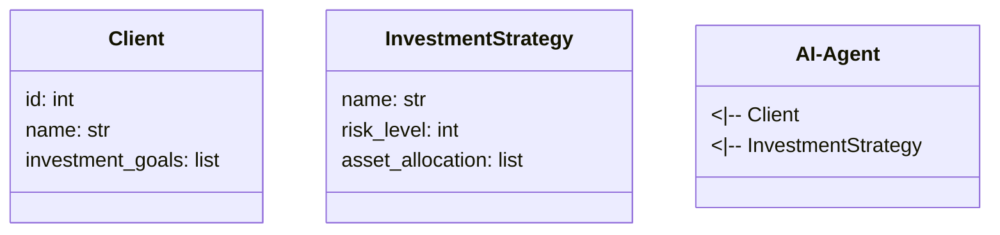
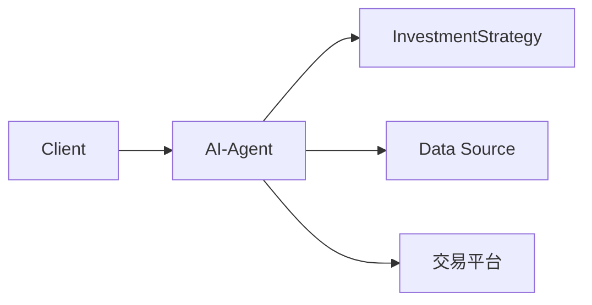

                 


# AI Agent在金融行业的应用与挑战

> 关键词：AI Agent, 金融行业, 智能投顾, 风险管理, 机器学习

> 摘要：本文系统地探讨了AI Agent在金融行业的应用与挑战，从基本概念到核心算法，再到系统架构和项目实战，全面分析了AI Agent在金融行业中的潜力和实际应用。通过详细的技术分析和案例研究，本文旨在为读者提供关于AI Agent在金融行业应用的深刻理解。

---

## 第一部分：AI Agent在金融行业的背景与应用

### 第1章：AI Agent的基本概念与背景

#### 1.1 AI Agent的定义与特点

##### 1.1.1 AI Agent的定义
AI Agent（人工智能代理）是指能够感知环境、自主决策并执行任务的智能实体。它结合了感知、推理、学习和执行能力，能够在复杂环境中完成特定目标。

##### 1.1.2 AI Agent的核心特点
- **自主性**：AI Agent能够自主决策，无需外部干预。
- **反应性**：能够实时感知环境变化并做出反应。
- **学习能力**：通过数据和经验不断优化自身行为。
- **协作性**：能够与其他Agent或系统协作完成复杂任务。

##### 1.1.3 AI Agent与传统算法的区别
AI Agent不仅依赖于预定义的规则，还能够通过学习和适应环境动态调整行为。与传统算法相比，AI Agent更加智能化和动态化。

#### 1.2 AI Agent在金融行业中的背景

##### 1.2.1 金融行业的数字化转型
金融行业正经历数字化转型，AI Agent作为核心驱动力，帮助金融机构实现智能化运营和客户体验提升。

##### 1.2.2 AI Agent在金融行业的优势
- **提高效率**：AI Agent能够快速处理大量数据，优化决策流程。
- **降低风险**：通过实时监控和预测，减少金融风险。
- **个性化服务**：提供定制化金融产品和服务，提升客户满意度。

##### 1.2.3 金融行业对AI Agent的需求
金融机构对智能化、自动化的需求日益增长，AI Agent在智能投顾、风险管理等领域发挥重要作用。

#### 1.3 本书的核心内容与目标

##### 1.3.1 本书的核心目标
全面解析AI Agent在金融行业的应用，探讨其技术原理和实际挑战。

##### 1.3.2 本书的结构安排
从基础概念到算法实现，再到系统设计和项目实战，系统化地介绍AI Agent在金融行业中的应用。

##### 1.3.3 本书的读者群体
适用于金融从业者、技术开发者、学术研究者及对AI Agent感兴趣的读者。

---

### 第2章：AI Agent在金融行业中的应用场景

#### 2.1 智能投顾

##### 2.1.1 智能投顾的定义与特点
智能投顾是基于AI技术的自动化投资顾问服务，根据客户需求提供个性化的投资建议。

##### 2.1.2 AI Agent在智能投顾中的应用
- **客户画像**：通过分析客户数据，生成个性化投资组合。
- **市场预测**：利用AI算法预测市场趋势，优化投资策略。
- **风险控制**：实时监控投资组合，降低风险敞口。

##### 2.1.3 案例分析：智能投顾系统实现
通过具体案例分析，展示AI Agent在智能投顾中的实际应用和效果。

#### 2.2 风险管理

##### 2.2.1 风险管理的定义与特点
风险管理是识别、评估和控制金融风险的过程，确保机构稳健运营。

##### 2.2.2 AI Agent在风险管理中的应用
- **实时监控**：通过AI Agent实时监控市场动态，识别潜在风险。
- **风险建模**：利用机器学习模型预测风险事件，制定应对策略。

##### 2.2.3 案例分析：风险管理系统的实现
通过具体案例分析，展示AI Agent在风险管理中的实际应用和效果。

---

## 第二部分：AI Agent的核心概念与联系

### 第3章：AI Agent的核心概念与联系

#### 3.1 AI Agent的原理

##### 3.1.1 多智能体系统
多智能体系统由多个相互作用的智能体组成，通过协作实现复杂任务。

##### 3.1.2 强化学习
强化学习是一种通过试错机制优化决策的算法，广泛应用于AI Agent的训练。

##### 3.1.3 监督学习
监督学习基于标记数据训练模型，用于分类、回归等任务。

#### 3.2 AI Agent的特征对比

##### 3.2.1 基于规则的AI Agent与基于模型的AI Agent对比
| 特性                | 基于规则的AI Agent          | 基于模型的AI Agent          |
|---------------------|-----------------------------|-----------------------------|
| 决策方式            | 预定义规则                 | 数据驱动模型                |
| 灵活性              | 较低                       | 较高                       |
| 适应性              | 较差                       | 较强                       |

#### 3.3 实体关系图

##### 3.3.1 AI Agent的实体关系图


---

## 第三部分：AI Agent的算法原理

### 第4章：AI Agent的算法原理

#### 4.1 强化学习算法

##### 4.1.1 Q-learning算法
Q-learning是一种经典的强化学习算法，通过状态-动作-奖励机制优化决策。

##### 4.1.2 Q-learning算法流程图


##### 4.1.3 Q-learning算法实现
```python
import numpy as np

class QLAgent:
    def __init__(self, state_space_size, action_space_size):
        self.q_table = np.zeros((state_space_size, action_space_size))
    
    def choose_action(self, state, epsilon=0.1):
        if np.random.random() < epsilon:
            return np.random.randint(0, action_space_size)
        else:
            return np.argmax(self.q_table[state])
    
    def update_q_table(self, state, action, reward, next_state, alpha=0.1):
        self.q_table[state, action] = (1 - alpha) * self.q_table[state, action] + alpha * (reward + np.max(self.q_table[next_state]))
```

#### 4.2 监督学习算法

##### 4.2.1 线性回归算法
线性回归是一种简单而有效的监督学习算法，用于预测连续型输出。

##### 4.2.2 线性回归实现
```python
import numpy as np

class LinearRegression:
    def __init__(self, lr=0.01, iterations=1000):
        self.lr = lr
        self.iterations = iterations
    
    def fit(self, X, y):
        self.X = X
        self.y = y
        self.theta = np.zeros(X.shape[1])
        for _ in range(self.iterations):
            predictions = np.dot(self.X, self.theta)
            gradient = (2 * np.dot(self.X.T, (predictions - self.y)))
            self.theta -= self.lr * gradient
    
    def predict(self, X):
        return np.dot(X, self.theta)
```

---

## 第四部分：AI Agent的系统分析与架构设计

### 第5章：AI Agent的系统分析与架构设计

#### 5.1 智能投顾系统的应用场景

##### 5.1.1 智能投顾系统的功能需求
- **客户画像**：分析客户需求，生成个性化投资组合。
- **市场预测**：预测市场趋势，优化投资策略。
- **风险控制**：实时监控投资组合，降低风险敞口。

#### 5.2 智能投顾系统的领域模型

##### 5.2.1 领域模型类图


#### 5.3 智能投顾系统的架构设计

##### 5.3.1 系统架构设计


---

## 第五部分：AI Agent的项目实战

### 第6章：AI Agent的项目实战

#### 6.1 智能投顾系统的实现

##### 6.1.1 环境安装
- 安装Python和相关库（如NumPy、Pandas、Scikit-learn）。

##### 6.1.2 核心代码实现
```python
import numpy as np
import pandas as pd
from sklearn.linear_model import LinearRegression

class InvestmentAdvisor:
    def __init__(self, data_path):
        self.data = pd.read_csv(data_path)
        self.model = LinearRegression()
    
    def preprocess_data(self):
        # 数据预处理
        self.data = self.data.dropna()
    
    def train_model(self, feature_cols, target_col):
        # 训练模型
        self.model.fit(self.data[feature_cols], self.data[target_col])
    
    def predict_investment(self, input_data):
        # 预测投资
        return self.model.predict(input_data)
```

##### 6.1.3 代码应用解读与分析
展示如何利用上述代码实现智能投顾系统，并解释每一步的作用。

#### 6.2 实际案例分析

##### 6.2.1 案例分析
通过具体案例分析，展示AI Agent在智能投顾中的实际应用和效果。

#### 6.3 项目小结

##### 6.3.1 项目总结
总结项目实现的关键点和成功经验。

##### 6.3.2 项目问题与优化方向
分析项目中存在的问题，并提出优化方向。

---

## 第六部分：AI Agent的最佳实践

### 第7章：AI Agent的最佳实践

#### 7.1 最佳实践

##### 7.1.1 小结
总结本文的核心内容和主要观点。

##### 7.1.2 注意事项
提醒读者在实际应用中需要注意的问题，如数据隐私、模型解释性等。

##### 7.1.3 拓展阅读
推荐一些与AI Agent相关的书籍和资源，供读者深入学习。

---

## 作者信息

作者：AI天才研究院/AI Genius Institute & 禅与计算机程序设计艺术 /Zen And The Art of Computer Programming

---

这篇文章系统地介绍了AI Agent在金融行业的应用与挑战，从基础概念到算法实现，再到系统设计和项目实战，全面分析了AI Agent在金融行业中的潜力和实际应用。通过详细的技术分析和案例研究，本文旨在为读者提供关于AI Agent在金融行业应用的深刻理解。

