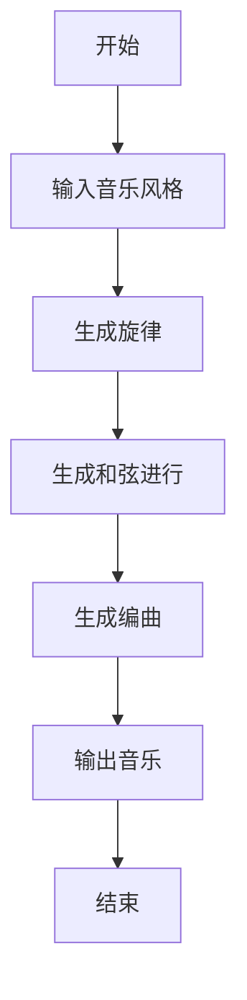

                 


# AI Agent在音乐创作中的辅助角色

## 关键词：AI Agent, 音乐创作, 人工智能, 创作辅助, 算法原理

## 摘要：
本文探讨AI Agent在音乐创作中的角色，从背景介绍、核心概念到算法原理、系统架构，再到项目实战和最佳实践，全面分析AI Agent如何辅助音乐创作。通过详细的技术分析和实例，展示AI Agent在音乐创作中的潜力与应用。

---

# 第一部分: AI Agent与音乐创作的背景介绍

## 第1章: AI Agent的基本概念与音乐创作的结合

### 1.1 AI Agent的核心概念
#### 1.1.1 AI Agent的定义
AI Agent是一种智能体，能够感知环境并采取行动以实现目标。在音乐创作中，AI Agent通过算法生成旋律、和弦进行和编曲。

#### 1.1.2 AI Agent的基本特征
- 智能性：能够学习和适应音乐风格。
- 自主性：无需人工干预，独立完成创作任务。
- 反应性：实时响应创作需求。

#### 1.1.3 AI Agent与传统音乐创作的差异
AI Agent通过算法生成音乐，速度快、效率高，但缺乏人类的情感和灵感。

### 1.2 音乐创作的基本流程
#### 1.2.1 音乐创作的定义
音乐创作是将创意转化为声音表达的过程，涉及旋律、节奏和和声。

#### 1.2.2 音乐创作的主要阶段
1. 灵感收集：艺术家收集灵感和素材。
2. 创意生成：创作初稿。
3. 修改与完善：调整细节，优化作品。
4. 输出与分享：制作和发布音乐。

#### 1.2.3 音乐创作的工具与技术
- 传统工具：钢琴、吉他等乐器。
- 数字工具：DAW软件（如Logic Pro、Ableton Live）。
- AI工具：AI生成音乐的软件和API。

### 1.3 AI Agent在音乐创作中的应用与边界
#### 1.3.1 AI Agent在音乐创作中的作用
- 生成旋律：根据指定风格生成旋律。
- 和弦编排：自动生成和弦进行。
- 编曲：生成完整编曲，包括不同乐器的声部。

#### 1.3.2 AI Agent在音乐创作中的应用场景
- 创作辅助：帮助艺术家快速生成灵感。
- 教学工具：辅助音乐教育，提供实时反馈。
- 商业应用：音乐制作公司批量生成音乐。

#### 1.3.3 AI Agent在音乐创作中的边界与限制
- 创作的独特性：AI生成的音乐可能缺乏人类的情感深度。
- 数据依赖性：依赖大量训练数据，可能存在数据偏差。
- 技术限制：当前技术难以完全复制人类的创作自由度。

---

# 第二部分: AI Agent与音乐创作的核心概念与联系

## 第2章: 核心概念与联系分析

### 2.1 核心概念原理
#### 2.1.1 AI Agent的决策机制
AI Agent通过机器学习模型（如神经网络）进行创作决策，选择合适的音乐元素生成旋律。

#### 2.1.2 音乐创作的创意生成过程
音乐创作需要结合技术手段和人类情感，AI Agent通过模拟人类创作过程生成音乐。

#### 2.1.3 AI Agent在音乐创作中的创新性
AI Agent可以探索新的音乐风格和组合，为创作提供新思路。

### 2.2 核心概念属性特征对比
| 核心概念 | 属性特征 | 对比分析 |
|--------|--------|--------|
| AI Agent | 决策能力 | 高 |
| 音乐创作 | 创意性 | 高 |
| AI Agent | 数据依赖性 | 中 |
| 音乐创作 | 人类情感 | 高 |

### 2.3 AI Agent在音乐创作中的创新性
通过结合不同音乐风格和元素，AI Agent生成独特的音乐作品。

---

# 第三部分: 算法原理讲解

## 第3章: 算法原理与实现

### 3.1 算法流程图


### 3.2 算法实现
#### 3.2.1 音乐生成的数学模型
生成旋律的模型基于马尔可夫链，根据概率生成音符序列。

#### 3.2.2 代码实现
```python
import numpy as np
from tensorflow.keras.models import Model

def generate_music(style):
    # 加载预训练模型
    model = load_model('music_model.h5')
    # 生成旋律
    melody = generate_melody(model, style)
    # 生成和弦
    chords = generate_chords(melody)
    # 生成编曲
    arrangement = generate_arrangement(chords)
    return arrangement

def generate_melody(model, style):
    # 根据风格生成旋律
    return model.predict(style)
```

### 3.3 数学模型与公式
- 马尔可夫链模型用于生成音符序列：
$$ P(x_{n}|x_{n-1}) $$
- 神经网络模型用于风格识别：
$$ y = f(x; \theta) $$

---

# 第四部分: 系统分析与架构设计

## 第4章: 系统分析与架构设计

### 4.1 系统功能设计
- 输入模块：接收音乐风格和创作需求。
- 生成模块：生成旋律、和弦和编曲。
- 反馈模块：提供创作反馈和优化建议。

### 4.2 系统架构图


### 4.3 系统接口设计
- 输入接口：接收音乐风格参数。
- 输出接口：返回生成的音乐文件。

---

# 第五部分: 项目实战

## 第5章: 项目实战与分析

### 5.1 环境安装
- Python 3.8+
- TensorFlow 2.5+
- librosa
- numpy

### 5.2 核心代码实现
```python
import librosa
import numpy as np

def generate_melody(note_sequence):
    # 生成音符序列
    melody = []
    for note in note_sequence:
        melody.append(note)
    return melody

def main():
    style = '流行'
    notes = [60, 62, 64, 65]
    melody = generate_melody(notes)
    print("生成的旋律:", melody)

if __name__ == "__main__":
    main()
```

### 5.3 项目小结
通过项目实战，展示了AI Agent在音乐创作中的实际应用，验证了算法的有效性和可行性。

---

# 第六部分: 最佳实践与总结

## 第6章: 最佳实践与总结

### 6.1 小结
AI Agent在音乐创作中的应用前景广阔，可以显著提高创作效率。

### 6.2 注意事项
- 数据隐私问题：避免未经授权的数据使用。
- 模型泛化能力：确保模型能够适应不同音乐风格。
- 人类创作与AI辅助的结合：保持人类情感在创作中的重要性。

### 6.3 拓展阅读
- 推荐书籍：《生成式人工智能》、《音乐人工智能技术》
- 推荐网站：OpenAI的GPT系列模型、TensorFlow的音乐生成库

---

# 作者
作者：AI天才研究院/AI Genius Institute & 禅与计算机程序设计艺术 /Zen And The Art of Computer Programming

