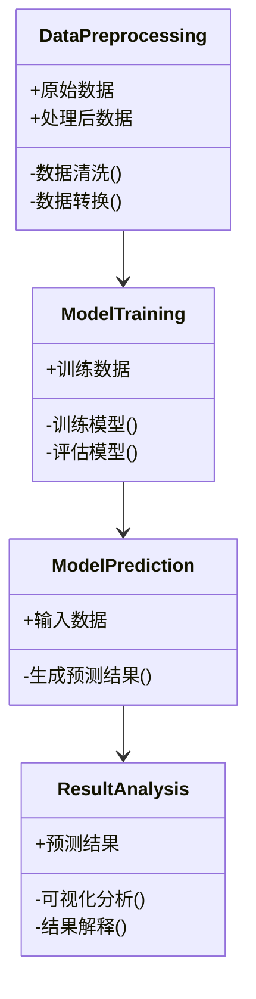
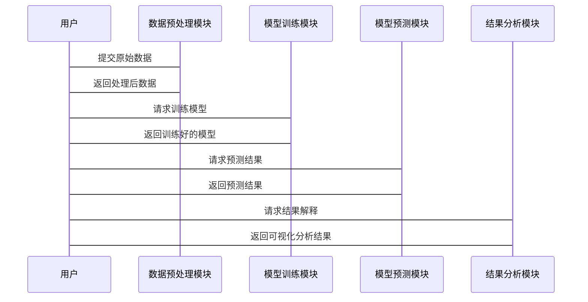

                 


# AI Agent在预测分析中的应用

> 关键词：AI Agent, 预测分析, 机器学习, 数据分析, 系统设计

> 摘要：本文深入探讨了AI Agent在预测分析中的应用，从基本概念、核心原理到算法实现和系统设计，结合实际案例，全面解析了AI Agent如何提升预测分析的效率和准确性。通过详细的技术分析和代码实现，展示了AI Agent在不同场景中的潜力和优势。

---

# 第一部分: AI Agent与预测分析概述

## 第1章: AI Agent与预测分析概述

### 1.1 AI Agent的基本概念

#### 1.1.1 AI Agent的定义与特点
AI Agent（人工智能代理）是指能够感知环境、执行任务并做出决策的智能实体。AI Agent可以是软件程序、机器人或其他智能系统，具备以下特点：
- **自主性**：能够在没有外部干预的情况下运行。
- **反应性**：能够根据环境输入做出实时反应。
- **目标导向**：通过设定目标来驱动行为。
- **学习能力**：能够通过数据和经验改进性能。

#### 1.1.2 预测分析的基本概念
预测分析是利用历史数据和统计模型，预测未来趋势或结果的过程。其核心在于从数据中提取模式，并使用这些模式进行预测。

#### 1.1.3 AI Agent在预测分析中的作用
AI Agent能够通过自动化数据处理、模型训练和结果解释，显著提升预测分析的效率和准确性。AI Agent不仅能够执行预测任务，还能根据结果动态调整策略。

### 1.2 AI Agent与预测分析的关系

#### 1.2.1 AI Agent如何支持预测分析
AI Agent通过以下方式支持预测分析：
- **数据预处理**：清理和转换数据，确保模型输入的准确性。
- **模型训练**：选择合适的算法，训练预测模型。
- **实时预测**：基于实时数据，快速生成预测结果。
- **结果解释**：将复杂的预测结果转化为易于理解的形式。

#### 1.2.2 预测分析在AI Agent中的应用
预测分析为AI Agent提供了决策依据，帮助其在复杂环境中做出最优选择。例如，在智能客服系统中，预测分析可以帮助AI Agent预测客户的需求，从而提供个性化的服务。

### 1.3 预测分析的背景与应用领域

#### 1.3.1 预测分析的背景
随着数据量的爆炸式增长和计算能力的提升，预测分析成为企业和组织提升决策效率的重要手段。大数据和机器学习技术的发展为预测分析提供了强大的技术支持。

#### 1.3.2 预测分析的主要应用领域
预测分析广泛应用于多个领域，包括：
- **金融**：信用评分、欺诈检测。
- **医疗**：疾病预测、治疗方案优化。
- **零售**：销售预测、客户行为分析。
- **交通**：流量预测、路线优化。

#### 1.3.3 AI Agent在预测分析中的优势
AI Agent能够实时处理数据，快速生成预测结果，并根据结果动态调整行为。这使得AI Agent在预测分析中具有高效性和灵活性的优势。

### 1.4 本章小结
本章介绍了AI Agent的基本概念及其在预测分析中的作用，分析了预测分析的背景与应用领域，并总结了AI Agent在预测分析中的独特优势。

---

# 第二部分: AI Agent的核心概念与预测分析原理

## 第2章: AI Agent的核心概念

### 2.1 AI Agent的类型与特点

#### 2.1.1 简单反射型AI Agent
简单反射型AI Agent基于固定的规则集做出反应，适用于任务简单、环境变化小的场景。

#### 2.1.2 基于模型的AI Agent
基于模型的AI Agent通过构建环境模型来做出决策，适用于复杂环境中的任务。

#### 2.1.3 基于目标的AI Agent
基于目标的AI Agent通过优化目标函数来选择最优行动，适用于需要策略优化的场景。

#### 2.1.4 基于效用的AI Agent
基于效用的AI Agent通过最大化效用函数来做出决策，适用于多目标权衡的场景。

### 2.2 预测分析的核心原理

#### 2.2.1 数据驱动的预测原理
数据驱动的预测依赖于大量数据，通过统计学习方法提取数据中的模式。

#### 2.2.2 模型驱动的预测原理
模型驱动的预测基于领域知识构建模型，通过参数估计进行预测。

#### 2.2.3 统计与机器学习的结合
现代预测分析通常结合统计方法和机器学习算法，利用数据的复杂性进行建模。

### 2.3 AI Agent与预测分析的结合

#### 2.3.1 AI Agent在预测分析中的角色
AI Agent可以作为预测模型的执行者，实时获取数据并生成预测结果。

#### 2.3.2 预测分析对AI Agent的支撑
预测分析为AI Agent提供了决策依据，使其能够在复杂环境中做出合理选择。

### 2.4 本章小结
本章分析了AI Agent的不同类型及其特点，并探讨了预测分析的核心原理及其与AI Agent的结合方式。

---

# 第三部分: 预测分析的算法原理与数学模型

## 第3章: 常见预测分析算法

### 3.1 线性回归

#### 3.1.1 线性回归的原理
线性回归是一种简单的预测模型，假设自变量与因变量之间存在线性关系。

#### 3.1.2 线性回归的数学模型
线性回归的数学模型可以表示为：
$$ y = \beta_0 + \beta_1x + \epsilon $$
其中，$\beta_0$是截距，$\beta_1$是回归系数，$\epsilon$是误差项。

#### 3.1.3 线性回归的优缺点
优点：简单易懂，计算效率高。缺点：只能处理线性关系，对非线性数据拟合效果差。

### 3.2 支持向量机（SVM）

#### 3.2.1 SVM的原理
SVM通过构建超平面将数据点分开，适用于分类和回归任务。

#### 3.2.2 SVM的数学模型
SVM的优化目标为：
$$ \min_{\theta} \frac{1}{2}\|\theta\|^2 + C \sum_{i=1}^n \xi_i $$
其中，$\theta$是模型参数，$C$是惩罚参数，$\xi_i$是松弛变量。

#### 3.2.3 SVM的应用场景
适用于高维数据和小样本数据的分类与回归。

### 3.3 决策树

#### 3.3.1 决策树的原理
决策树通过构建树状结构，将数据分成不同的子集，最终形成预测结果。

#### 3.3.2 决策树的数学模型
决策树的预测结果由叶子节点的标签决定，其数学模型可以通过树的结构表示。

#### 3.3.3 决策树的优缺点
优点：易于解释，适合处理非线性数据。缺点：对噪声数据敏感，容易过拟合。

### 3.4 随机森林

#### 3.4.1 随机森林的原理
随机森林通过集成多个决策树，提高模型的准确性和鲁棒性。

#### 3.4.2 随机森林的数学模型
随机森林的预测结果是多个决策树投票的结果，其数学模型可以通过集成学习表示。

#### 3.4.3 随机森林的应用场景
适用于分类、回归和特征重要性分析。

### 3.5 算法选择与优化

#### 3.5.1 算法选择的依据
根据数据类型和任务需求选择合适的算法。

#### 3.5.2 算法优化方法
通过参数调优和模型集成提高预测性能。

---

# 第四部分: 系统分析与架构设计

## 第4章: 系统分析与架构设计

### 4.1 问题场景介绍
假设我们正在开发一个销售预测系统，旨在帮助商家预测未来的销售量，优化库存管理和营销策略。

### 4.2 系统功能设计

#### 4.2.1 领域模型（类图）


### 4.3 系统架构设计

#### 4.3.1 系统架构（架构图）
```mermaid
architecturalDiagram
    DataProcessingModule ---(分解)--> DataPreprocessing
    DataPreprocessing -->(组合)--> ModelTraining
    ModelTraining -->(组合)--> ModelPrediction
    ModelPrediction -->(组合)--> ResultAnalysis
```

#### 4.3.2 系统交互（序列图）


### 4.4 系统接口设计
系统接口包括数据输入接口、模型训练接口、预测结果输出接口和结果分析接口。

### 4.5 本章小结
本章通过构建销售预测系统的案例，详细分析了系统的功能设计、架构设计和交互流程，展示了AI Agent在预测分析系统中的应用。

---

# 第五部分: 项目实战

## 第5章: 项目实战

### 5.1 环境安装与配置

#### 5.1.1 安装Python和必要的库
安装Python和以下库：
- NumPy
- Pandas
- Scikit-learn
- Matplotlib

#### 5.1.2 安装Jupyter Notebook
用于数据可视化和算法实现。

### 5.2 系统核心实现源代码

#### 5.2.1 数据预处理代码
```python
import pandas as pd
import numpy as np

# 加载数据
data = pd.read_csv('销售数据.csv')

# 数据清洗
data.dropna(inplace=True)
data = pd.get_dummies(data)
```

#### 5.2.2 模型训练代码
```python
from sklearn.tree import DecisionTreeRegressor
from sklearn.model_selection import train_test_split
from sklearn.metrics import mean_squared_error

# 划分数据集
X_train, X_test, y_train, y_test = train_test_split(data.drop('销售量', axis=1), data['销售量'], test_size=0.2)

# 训练模型
model = DecisionTreeRegressor()
model.fit(X_train, y_train)

# 评估模型
y_pred = model.predict(X_test)
print('均方误差:', mean_squared_error(y_test, y_pred))
```

#### 5.2.3 模型预测代码
```python
# 预测新数据
new_data = pd.DataFrame({
    '特征1': [值1],
    '特征2': [值2],
    # 其他特征
})
new_prediction = model.predict(new_data)
print('预测销售量:', new_prediction[0])
```

#### 5.2.4 结果分析代码
```python
import matplotlib.pyplot as plt

plt.scatter(y_test, y_pred)
plt.xlabel('真实值')
plt.ylabel('预测值')
plt.show()
```

### 5.3 项目小结
通过实际项目，我们验证了AI Agent在预测分析中的应用价值，展示了从数据预处理到模型训练、预测和结果分析的完整流程。

---

# 第六部分: 总结与展望

## 第6章: 总结与展望

### 6.1 本章总结
本文深入探讨了AI Agent在预测分析中的应用，从基本概念到算法实现，再到系统设计，全面解析了AI Agent在预测分析中的潜力和优势。

### 6.2 未来展望
未来，随着AI技术的进步，AI Agent在预测分析中的应用将更加广泛和深入。结合边缘计算和物联网技术，AI Agent将能够在更复杂的环境中实现预测分析，为决策提供更强大的支持。

---

# 作者：AI天才研究院 & 禅与计算机程序设计艺术

本文由AI天才研究院撰写，转载请注明出处。

