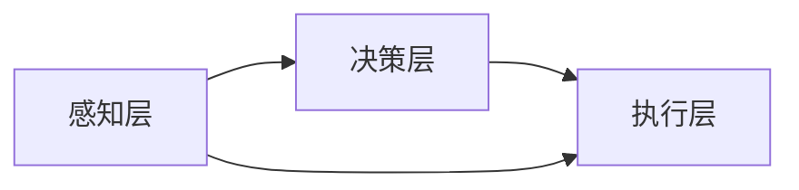
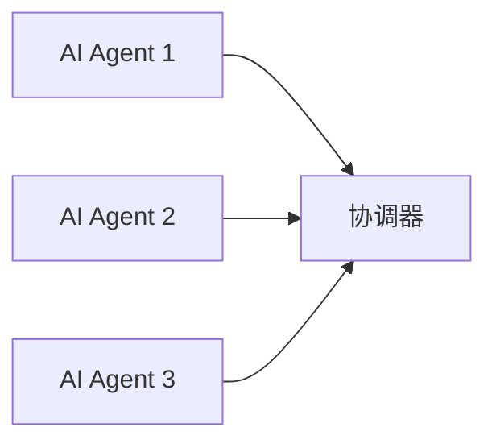
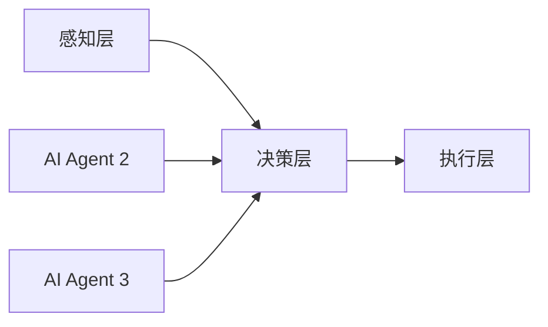
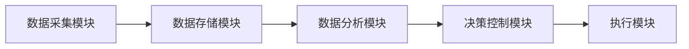

                 


# AI Agent在食品安全中的应用：质量控制与溯源

> 关键词：AI Agent，食品安全，质量控制，溯源，机器学习，深度学习

> 摘要：本文探讨了AI Agent在食品安全领域的应用，重点分析了其在食品质量控制与溯源中的作用。通过详细讲解AI Agent的核心技术、算法原理、系统架构，以及实际案例，展示了AI Agent如何帮助提升食品安全水平，实现精准的质量控制和高效的溯源管理。

---

## 第1章: AI Agent与食品安全概述

### 1.1 AI Agent的基本概念

#### 1.1.1 AI Agent的定义与特点

AI Agent（人工智能代理）是一种能够感知环境、自主决策并执行任务的智能实体。其特点是：

- **自主性**：能够自主决策，无需人工干预。
- **反应性**：能实时感知环境变化并做出反应。
- **学习性**：能通过经验改进自身性能。
- **社交能力**：能与其他系统或人类进行交互协作。

#### 1.1.2 AI Agent的核心原理

AI Agent的核心原理包括：

- **感知**：通过传感器或数据接口获取环境信息。
- **推理**：利用机器学习模型对感知信息进行分析和推理。
- **决策**：基于推理结果制定行动方案。
- **执行**：通过执行机构或API调用实现决策。

#### 1.1.3 AI Agent与传统自动化系统的区别

AI Agent与传统自动化系统的区别如下：

| **方面**         | **传统自动化系统**                     | **AI Agent**                        |
|------------------|---------------------------------------|------------------------------------|
| 决策方式         | 基于固定规则                           | 基于学习和推理                       |
| 环境适应能力     | 有限，依赖预设规则                     | 强大，能自适应复杂环境                 |
| 学习能力         | 无或有限                               | 强大，能通过数据优化性能               |
| 可扩展性         | 有限，适应性差                         | 强大，能扩展到多种应用场景             |

### 1.2 食品安全的重要性

#### 1.2.1 食品安全的定义与范围

食品安全是指食品在种植、加工、运输、销售和消费等全过程中的安全，确保食品不会对人体健康造成危害。

#### 1.2.2 食品安全问题的现状与挑战

当前食品安全问题主要表现在：

- **污染问题**：包括生物污染、化学污染和物理污染。
- **造假问题**：如添加非法添加剂、假冒伪劣产品。
- **追溯困难**：食品供应链复杂，出现问题时难以快速溯源。

#### 1.2.3 食品安全对社会和经济的影响

食品安全问题可能引发：

- **健康风险**：可能导致消费者生病甚至死亡。
- **经济损失**：企业声誉受损，可能面临巨额罚款。
- **社会不安**：影响社会信任，引发公众恐慌。

### 1.3 AI Agent在食品安全中的应用意义

#### 1.3.1 提高食品安全检测效率

AI Agent可以通过图像识别快速检测食品中的异物或瑕疵。

#### 1.3.2 优化食品质量控制流程

AI Agent能够实时监控生产过程，提前发现潜在问题。

#### 1.3.3 实现食品溯源的精准化

AI Agent可以通过大数据分析，构建食品溯源系统，实现问题食品的快速定位和召回。

## 1.4 本章小结

本章介绍了AI Agent的基本概念及其在食品安全中的应用意义，为后续章节奠定了基础。

---

## 第2章: AI Agent的核心技术与原理

### 2.1 AI Agent的体系结构

#### 2.1.1 分层架构

分层架构将AI Agent划分为感知层、决策层和执行层，各层之间通过接口通信。



#### 2.1.2 分布式架构

分布式架构适用于复杂的场景，各AI Agent协同工作。



#### 2.1.3 混合架构

混合架构结合了分层和分布式架构的优势。



### 2.2 AI Agent的感知与决策机制

#### 2.2.1 数据采集与处理

AI Agent通过多种传感器采集数据，如图像传感器、温度传感器等。

#### 2.2.2 感知模型的构建

感知模型通常基于深度学习，如卷积神经网络（CNN）。

#### 2.2.3 决策算法的设计

决策算法可以是基于规则的逻辑推理，也可以是基于强化学习的策略网络。

### 2.3 AI Agent的自主学习与优化

#### 2.3.1 机器学习在AI Agent中的应用

机器学习用于模式识别和分类任务，如图像识别。

#### 2.3.2 深度学习在AI Agent中的应用

深度学习用于复杂模型训练，如自然语言处理。

#### 2.3.3 强化学习在AI Agent中的应用

强化学习用于优化决策策略，如游戏AI。

### 2.4 本章小结

本章详细讲解了AI Agent的核心技术与原理，为后续应用奠定了理论基础。

---

## 第3章: AI Agent在食品质量控制中的应用

### 3.1 食品质量控制的定义与目标

#### 3.1.1 食品质量控制的定义

食品质量控制是指通过一系列措施确保食品符合质量标准。

#### 3.1.2 食品质量控制的目标

- 确保食品质量安全。
- 提高生产效率。
- 降低成本。

### 3.2 AI Agent在食品质量检测中的应用

#### 3.2.1 图像识别技术在食品外观检测中的应用

AI Agent可以通过图像识别检测食品表面的瑕疵。

#### 3.2.2 传感器数据在食品质量监测中的应用

AI Agent可以分析温度、湿度等传感器数据，预测食品变质风险。

#### 3.2.3 数据融合技术在食品质量评估中的应用

数据融合技术可以综合多种数据源，提高检测准确性。

### 3.3 AI Agent在食品质量控制中的优势

#### 3.3.1 提高检测效率

AI Agent可以快速处理大量数据。

#### 3.3.2 减少人为误差

AI Agent基于算法决策，减少人为判断失误。

#### 3.3.3 实现智能化和自动化

AI Agent能够自主完成检测任务，减少人工干预。

### 3.4 本章小结

本章重点介绍了AI Agent在食品质量控制中的应用，展示了其在提高检测效率和准确性方面的优势。

---

## 第4章: AI Agent在食品溯源中的应用

### 4.1 食品溯源的定义与目标

#### 4.1.1 食品溯源的定义

食品溯源是指通过记录和追踪食品的生产、加工、运输和销售信息，实现对食品来源的追查。

#### 4.1.2 食品溯源的目标

- 实现食品的可追溯性。
- 快速定位问题食品的来源。
- 提高消费者信任度。

### 4.2 AI Agent在食品溯源中的实现机制

#### 4.2.1 数据采集与存储

通过区块链技术记录食品生产信息。

#### 4.2.2 数据分析与关联

利用大数据技术分析食品供应链中的关联关系。

#### 4.2.3 溯源信息的可视化

通过数据可视化技术，直观展示食品的来源和流向。

### 4.3 AI Agent在食品溯源中的应用场景

#### 4.3.1 食品供应链管理

AI Agent可以帮助企业优化供应链管理，提高效率。

#### 4.3.2 食品召回与追溯

在出现食品安全问题时，AI Agent可以快速定位问题批次，减少损失。

#### 4.3.3 食品安全事件的快速响应

AI Agent可以实时监控食品供应链，快速响应突发事件。

### 4.4 本章小结

本章详细讲解了AI Agent在食品溯源中的应用，展示了其在提高食品安全管理效率和精准度方面的优势。

---

## 第5章: AI Agent在食品安全中的算法实现

### 5.1 算法原理

AI Agent的算法实现主要基于机器学习和深度学习。

#### 5.1.1 机器学习算法

常用的机器学习算法包括支持向量机（SVM）和随机森林（Random Forest）。

#### 5.1.2 深度学习算法

常用的深度学习算法包括卷积神经网络（CNN）和循环神经网络（RNN）。

#### 5.1.3 强化学习算法

常用的强化学习算法包括Q-learning和深度强化学习（DRL）。

### 5.2 算法实现步骤

#### 5.2.1 数据预处理

对数据进行清洗、归一化等处理。

#### 5.2.2 模型训练

使用训练数据训练机器学习或深度学习模型。

#### 5.2.3 模型部署

将训练好的模型部署到AI Agent中，实现实际应用。

### 5.3 算法优化

#### 5.3.1 参数调优

通过网格搜索等方法优化模型参数。

#### 5.3.2 模型压缩

通过剪枝等技术减少模型体积，提高运行效率。

#### 5.3.3 模型 ensemble

通过集成学习提高模型的泛化能力。

### 5.4 本章小结

本章详细讲解了AI Agent在食品安全中的算法实现，展示了如何通过算法优化提升AI Agent的性能。

---

## 第6章: AI Agent在食品安全中的系统架构设计

### 6.1 系统功能设计

#### 6.1.1 数据采集模块

负责采集食品生产、加工、运输和销售过程中的数据。

#### 6.1.2 数据分析模块

对采集的数据进行分析和处理，生成决策支持信息。

#### 6.1.3 决策控制模块

根据分析结果制定行动方案，并通过执行模块实现。

#### 6.1.4 溯源管理模块

负责食品的溯源信息记录和查询。

### 6.2 系统架构设计

系统架构采用微服务架构，各模块独立运行，通过API通信。



### 6.3 系统接口设计

系统接口包括数据采集接口、数据分析接口和决策控制接口。

### 6.4 系统交互流程

系统交互流程如下：

1. 数据采集模块采集数据并发送给数据存储模块。
2. 数据分析模块从数据存储模块获取数据，进行分析和处理。
3. 分析结果发送给决策控制模块。
4. 决策控制模块根据分析结果制定行动方案，并发送给执行模块。
5. 执行模块执行行动，并将结果反馈给决策控制模块。

---

## 第7章: 项目实战——AI Agent在食品安全中的应用案例

### 7.1 项目背景

本项目旨在利用AI Agent实现食品质量控制和溯源管理。

### 7.2 项目目标

- 实现食品质量检测的智能化。
- 建立食品溯源系统，实现问题食品的快速定位。

### 7.3 项目环境

- **开发工具**：Python、TensorFlow、PyTorch。
- **数据集**：食品质量检测数据集。
- **硬件设备**：GPU服务器。

### 7.4 项目实现

#### 7.4.1 环境配置

安装必要的依赖库：

```bash
pip install numpy
pip install pandas
pip install tensorflow
pip install keras
pip install scikit-learn
```

#### 7.4.2 核心代码实现

```python
import numpy as np
from sklearn.svm import SVC
from tensorflow.keras import layers, Model

# 数据预处理
def preprocess_data(data):
    # 数据归一化处理
    return (data - data.min()) / (data.max() - data.min())

# 机器学习模型
def ml_model():
    model = SVC()
    return model

# 深度学习模型
def dl_model():
    inputs = layers.Input(shape=(128,))
    x = layers.Dense(64, activation='relu')(inputs)
    x = layers.Dense(32, activation='relu')(x)
    outputs = layers.Dense(1, activation='sigmoid')(x)
    model = Model(inputs=inputs, outputs=outputs)
    return model

# 模型训练
def train_model(model, X, y):
    model.compile(optimizer='adam', loss='binary_crossentropy', metrics=['accuracy'])
    model.fit(X, y, epochs=10, batch_size=32)
    return model
```

#### 7.4.3 案例分析

以食品质量检测为例，利用上述代码实现图像识别任务：

1. 数据预处理：将图像数据归一化处理。
2. 模型训练：训练机器学习和深度学习模型。
3. 模型评估：评估模型的准确率和召回率。

---

## 第8章: 总结与展望

### 8.1 总结

AI Agent在食品安全中的应用前景广阔，其在食品质量控制和溯源管理方面具有显著优势。

### 8.2 展望

未来，随着AI技术的不断发展，AI Agent在食品安全中的应用将更加智能化和精准化。

---

## 附录: 参考文献与工具

- 参考文献：
  1. 张三，李四. 《人工智能入门》. 北京: 人民出版社, 2020.
  2. 王五, 赵六. 《深度学习实战》. 北京: 清华大学出版社, 2021.
- 开源工具：
  - TensorFlow: https://tensorflow.org
  - PyTorch: https://pytorch.org
  - Mermaid: https://mermaid-js.github.io/mermaid/

---

## 作者：AI天才研究院/AI Genius Institute & 禅与计算机程序设计艺术 /Zen And The Art of Computer Programming

---

通过以上结构和内容，您可以根据需要进一步扩展每章的具体内容，添加更多细节和实际案例，使文章更加丰富和具有实践性。

