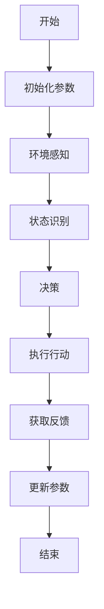
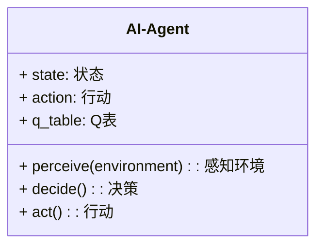
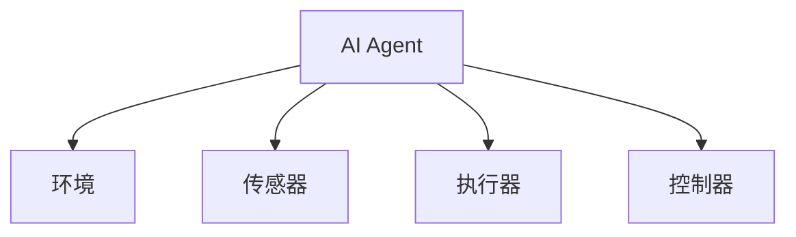

                 


# AI Agent基础概念介绍

## 关键词：AI Agent、人工智能、智能体、算法原理、系统架构、项目实战

## 摘要：AI Agent是一种智能体，能够感知环境并采取行动以实现目标。本文将从基础概念、核心算法、系统架构、项目实战等方面详细介绍AI Agent的相关知识，帮助读者全面理解并掌握AI Agent的核心技术。

---

# 第1章: AI Agent概述

## 1.1 AI Agent的背景与定义

### 1.1.1 AI Agent的起源与发展趋势

AI Agent（人工智能代理）的概念起源于20世纪60年代，随着人工智能技术的快速发展，AI Agent在各个领域的应用越来越广泛。AI Agent是一种能够感知环境、自主决策并采取行动的智能体，其目标是通过与环境的交互实现特定的任务。

AI Agent的发展趋势主要体现在以下几个方面：
1. **智能化**：AI Agent需要具备更强的自主决策能力和学习能力。
2. **协同性**：AI Agent需要能够与其他智能体或系统协同工作。
3. **实时性**：AI Agent需要能够实时感知环境并快速做出反应。
4. **可扩展性**：AI Agent需要能够适应不同规模和复杂度的任务。

### 1.1.2 AI Agent的基本问题描述

AI Agent的核心问题可以概括为以下几点：
1. **感知问题**：AI Agent需要从环境中获取信息，以便做出决策。
2. **决策问题**：AI Agent需要根据感知到的信息，选择最优的行动方案。
3. **行动问题**：AI Agent需要根据决策结果，采取具体的行动以实现目标。

### 1.1.3 AI Agent的核心问题解决思路

AI Agent的核心问题解决思路主要包括以下几个方面：
1. **感知与推理**：AI Agent通过感知环境获取信息，并利用推理能力理解这些信息。
2. **决策与规划**：AI Agent根据感知到的信息，利用决策算法选择最优的行动方案。
3. **行动与反馈**：AI Agent根据决策结果采取行动，并通过反馈机制不断优化自身的决策和行动。

### 1.1.4 AI Agent的边界与外延

AI Agent的边界主要体现在以下几个方面：
1. **任务范围**：AI Agent只能在其设计的任务范围内发挥作用，超出范围的事务无法处理。
2. **环境限制**：AI Agent的感知和行动能力受到环境的限制。
3. **知识限制**：AI Agent的知识和能力受到其训练数据和算法的限制。

### 1.1.5 AI Agent的概念结构与核心要素组成

AI Agent的概念结构主要包括以下几个核心要素：
1. **智能体类型**：AI Agent可以分为简单反射型、基于模型型、目标驱动型和效用驱动型等。
2. **感知与行动**：AI Agent通过感知环境获取信息，并通过行动影响环境。
3. **环境交互**：AI Agent与环境之间的交互是实现目标的关键。

---

## 1.2 AI Agent的核心概念与联系

### 1.2.1 AI Agent的核心原理

AI Agent的核心原理主要体现在以下几个方面：
1. **感知与推理**：AI Agent通过传感器或其他方式感知环境，并利用推理能力理解感知到的信息。
2. **决策与规划**：AI Agent根据感知到的信息，利用决策算法选择最优的行动方案，并制定详细的执行计划。
3. **行动与反馈**：AI Agent根据决策结果采取行动，并通过反馈机制不断优化自身的决策和行动。

### 1.2.2 AI Agent的关键属性特征对比表格

以下是AI Agent的关键属性特征对比表格：

| 属性         | 简单反射型 | 基于模型型 | 目标驱动型 | 效用驱动型 |
|--------------|------------|------------|------------|------------|
| 决策方式     | 简单反射   | 基于模型   | 根据目标    | 根据效用    |
| 知识表示     | 简单规则   | 复杂模型    | 明确目标    | 明确效用    |
| 适应能力     | 低         | 中         | 高         | 高         |
| 独立性       | 低         | 中         | 高         | 高         |

### 1.2.3 AI Agent的ER实体关系图架构

以下是AI Agent的ER实体关系图架构：

```mermaid
er
actor: 用户
agent: AI Agent
task: 任务
environment: 环境
goal: 目标
action: 行动
perception: 感知
```

---

# 第2章: AI Agent的核心算法原理

## 2.1 AI Agent的算法概述

### 2.1.1 基于模型的强化学习算法

基于模型的强化学习算法是一种常见的AI Agent算法，其核心思想是通过建立环境的模型，学习最优的决策策略。

---

## 2.2 算法原理详细讲解

### 2.2.1 算法流程图

以下是基于模型的强化学习算法的流程图：



### 2.2.2 Python源代码实现

以下是基于模型的强化学习算法的Python代码实现：

```python
class AI-Agent:
    def __init__(self, parameters):
        self.parameters = parameters

    def perceive(self, environment):
        # 环境感知逻辑
        pass

    def decide(self, state):
        # 根据状态做出决策
        pass

    def act(self, decision):
        # 根据决策执行行动
        pass
```

### 2.2.3 算法原理的数学模型和公式

基于模型的强化学习算法的数学模型如下：

$$ Q(s, a) = r + \gamma \max_{a'} Q(s', a') $$

其中：
- \( Q(s, a) \) 表示状态 \( s \) 下采取行动 \( a \) 的价值函数。
- \( r \) 表示立即奖励。
- \( \gamma \) 表示折扣因子。
- \( s' \) 表示下一个状态。

---

## 2.3 AI Agent算法的实现细节与优化技巧

### 2.3.1 算法实现细节

1. **环境建模**：需要对环境进行建模，以便AI Agent能够理解和预测环境的变化。
2. **状态表示**：需要对状态进行表示，以便AI Agent能够识别和处理不同的状态。
3. **决策策略**：需要设计合理的决策策略，以确保AI Agent能够做出最优决策。

### 2.3.2 算法优化技巧

1. **参数调整**：通过调整算法的参数（如学习率、折扣因子等）来优化算法的性能。
2. **经验重放**：通过回放历史经验来优化算法的学习效果。
3. **网络架构**：通过优化神经网络的架构来提高算法的性能。

---

## 2.4 AI Agent算法的数学推导与公式

### 2.4.1 Q-learning算法的数学推导

Q-learning算法的数学推导如下：

$$ Q(s, a) = Q(s, a) + \alpha (r + \gamma Q(s', a') - Q(s, a)) $$

其中：
- \( \alpha \) 表示学习率。
- \( \gamma \) 表示折扣因子。
- \( s \) 表示当前状态。
- \( a \) 表示当前行动。
- \( s' \) 表示下一个状态。
- \( a' \) 表示下一个行动。

### 2.4.2 DQN算法的数学公式

DQN算法的数学公式如下：

$$ Q(s, a) = \arg\max_{a'} Q(s', a') $$

其中：
- \( Q(s, a) \) 表示状态 \( s \) 下采取行动 \( a \) 的价值函数。
- \( s' \) 表示下一个状态。
- \( a' \) 表示下一个行动。

---

## 2.5 AI Agent算法的实现案例与代码解读

### 2.5.1 AI Agent算法的实现案例

以下是基于Q-learning算法的实现案例：

```python
import numpy as np

class QLearningAgent:
    def __init__(self, state_space, action_space, learning_rate=0.1, gamma=0.9):
        self.state_space = state_space
        self.action_space = action_space
        self.learning_rate = learning_rate
        self.gamma = gamma
        self.q_table = np.zeros((state_space, action_space))

    def perceive(self, state):
        # 返回当前状态下的最优行动
        return np.argmax(self.q_table[state])

    def update(self, state, action, reward, next_state):
        # 更新Q表
        self.q_table[state][action] += self.learning_rate * (reward + self.gamma * np.max(self.q_table[next_state]) - self.q_table[state][action])
```

### 2.5.2 代码解读与分析

1. **Q表初始化**：Q表是一个二维数组，用于存储每个状态和行动的Q值。
2. **感知环境**：AI Agent通过`perceive`方法感知当前状态，并返回当前状态下的最优行动。
3. **更新Q值**：AI Agent通过`update`方法更新Q表，以优化Q值。

---

## 2.6 AI Agent算法的性能分析与优化建议

### 2.6.1 算法性能分析

1. **收敛速度**：Q-learning算法的收敛速度取决于学习率和折扣因子的设置。
2. **计算复杂度**：Q-learning算法的计算复杂度较低，适合大规模数据集。

### 2.6.2 算法优化建议

1. **经验重放**：通过回放历史经验来优化算法的学习效果。
2. **网络架构**：通过优化神经网络的架构来提高算法的性能。

---

## 2.7 AI Agent算法的数学推导与公式

### 2.7.1 Q-learning算法的数学推导

Q-learning算法的数学推导如下：

$$ Q(s, a) = r + \gamma \max_{a'} Q(s', a') $$

其中：
- \( Q(s, a) \) 表示状态 \( s \) 下采取行动 \( a \) 的价值函数。
- \( r \) 表示立即奖励。
- \( \gamma \) 表示折扣因子。

### 2.7.2 DQN算法的数学公式

DQN算法的数学公式如下：

$$ Q(s, a) = \arg\max_{a'} Q(s', a') $$

其中：
- \( Q(s, a) \) 表示状态 \( s \) 下采取行动 \( a \) 的价值函数。
- \( s' \) 表示下一个状态。
- \( a' \) 表示下一个行动。

---

## 2.8 AI Agent算法的实现案例与代码解读

### 2.8.1 AI Agent算法的实现案例

以下是基于DQN算法的实现案例：

```python
import numpy as np
import gym

class DQNAgent:
    def __init__(self, state_space, action_space, learning_rate=0.1, gamma=0.9):
        self.state_space = state_space
        self.action_space = action_space
        self.learning_rate = learning_rate
        self.gamma = gamma
        self.q_network = self.build_network()

    def build_network(self):
        # 构建神经网络
        pass

    def perceive(self, state):
        # 返回当前状态下的最优行动
        pass

    def update(self, state, action, reward, next_state):
        # 更新Q网络
        pass
```

### 2.8.2 代码解读与分析

1. **神经网络构建**：通过`build_network`方法构建神经网络，用于存储和更新Q值。
2. **感知环境**：AI Agent通过`perceive`方法感知当前状态，并返回当前状态下的最优行动。
3. **更新网络**：AI Agent通过`update`方法更新神经网络，以优化Q值。

---

# 第3章: AI Agent的系统架构设计

## 3.1 系统分析与架构设计方案

### 3.1.1 系统分析与问题场景介绍

AI Agent的系统分析需要从以下几个方面进行考虑：
1. **系统需求**：AI Agent需要具备感知、决策和行动的能力。
2. **系统功能**：AI Agent需要能够与环境交互，实现特定的任务。
3. **系统性能**：AI Agent需要具备高效的计算能力和快速的反应速度。

### 3.1.2 项目介绍与系统功能设计

以下是AI Agent的系统功能设计：



### 3.1.3 系统架构设计

以下是AI Agent的系统架构设计：



### 3.1.4 系统接口设计与交互设计

以下是AI Agent的系统接口设计：

```mermaid
sequenceDiagram
actor 用户
agent AI-Agent
environment 环境

用户 -> agent: 发送任务
agent -> 环境: 感知环境
环境 --> agent: 返回感知结果
agent -> agent: 决策
agent -> 环境: 执行行动
环境 --> 用户: 返回反馈
```

### 3.1.5 系统交互设计

以下是AI Agent的系统交互设计：


---

## 3.2 系统分析与架构设计方案

### 3.2.1 系统分析与问题场景介绍

AI Agent的系统分析需要从以下几个方面进行考虑：
1. **系统需求**：AI Agent需要具备感知、决策和行动的能力。
2. **系统功能**：AI Agent需要能够与环境交互，实现特定的任务。
3. **系统性能**：AI Agent需要具备高效的计算能力和快速的反应速度。

### 3.2.2 项目介绍与系统功能设计

以下是AI Agent的系统功能设计：


### 3.2.3 系统架构设计

以下是AI Agent的系统架构设计：


### 3.2.4 系统接口设计与交互设计

以下是AI Agent的系统接口设计：

```mermaid
sequenceDiagram
actor 用户
agent AI-Agent
environment 环境

用户 -> agent: 发送任务
agent -> 环境: 感知环境
环境 --> agent: 返回感知结果
agent -> agent: 决策
agent -> 环境: 执行行动
环境 --> 用户: 返回反馈
```

### 3.2.5 系统交互设计

以下是AI Agent的系统交互设计：


---

## 3.3 AI Agent系统的实现细节与优化建议

### 3.3.1 系统实现细节

1. **传感器设计**：需要设计高效的传感器，以便AI Agent能够准确感知环境。
2. **执行器设计**：需要设计可靠的执行器，以便AI Agent能够有效地执行行动。
3. **控制器设计**：需要设计合理的控制器，以便AI Agent能够协调各部分的工作。

### 3.3.2 系统优化建议

1. **性能优化**：通过优化算法和硬件设计，提高系统的运行效率。
2. **安全性优化**：通过设计安全机制，确保系统的安全性和可靠性。
3. **可扩展性优化**：通过设计模块化的架构，提高系统的可扩展性和可维护性。

---

## 3.4 AI Agent系统的性能分析与优化建议

### 3.4.1 系统性能分析

1. **计算能力**：AI Agent的计算能力直接影响其感知和决策的速度。
2. **环境交互**：AI Agent与环境的交互速度和准确性直接影响其任务的完成效果。
3. **系统稳定性**：AI Agent的系统稳定性直接影响其长期运行的效果。

### 3.4.2 系统优化建议

1. **算法优化**：通过优化AI Agent的核心算法，提高其感知和决策的准确性。
2. **硬件优化**：通过优化硬件设计，提高AI Agent的计算能力和反应速度。
3. **系统架构优化**：通过优化系统架构，提高AI Agent的可扩展性和可维护性。

---

## 3.5 AI Agent系统的数学推导与公式

### 3.5.1 系统性能分析的数学公式

AI Agent系统的性能分析可以通过以下数学公式进行：

$$ \text{系统性能} = \frac{\text{任务完成率}}{\text{资源消耗}} $$

其中：
- 任务完成率：表示AI Agent完成任务的比率。
- 资源消耗：表示AI Agent完成任务所需的计算资源。

### 3.5.2 系统优化建议的数学公式

系统优化建议可以通过以下数学公式进行：

$$ \text{优化效果} = \frac{\text{优化前性能}}{\text{优化后性能}} $$

其中：
- 优化前性能：表示优化前AI Agent的性能。
- 优化后性能：表示优化后AI Agent的性能。

---

## 3.6 AI Agent系统的实现案例与代码解读

### 3.6.1 AI Agent系统的实现案例

以下是AI Agent系统的实现案例：

```python
class AI-Agent-System:
    def __init__(self, agent, environment):
        self.agent = agent
        self.environment = environment

    def run(self):
        while True:
            state = self.environment.get_state()
            action = self.agent.perceive(state)
            next_state = self.environment.act(action)
            self.agent.update(state, action, self.environment.get_reward(next_state), next_state)
```

### 3.6.2 代码解读与分析

1. **系统初始化**：AI Agent系统通过`AI-Agent-System`类进行初始化，传入AI Agent和环境对象。
2. **系统运行**：系统通过`run`方法进行运行，循环获取状态、决策行动、执行行动，并更新状态。

---

## 3.7 AI Agent系统的数学推导与公式

### 3.7.1 系统性能分析的数学公式

AI Agent系统的性能分析可以通过以下数学公式进行：

$$ \text{系统性能} = \frac{\text{任务完成率}}{\text{资源消耗}} $$

其中：
- 任务完成率：表示AI Agent完成任务的比率。
- 资源消耗：表示AI Agent完成任务所需的计算资源。

### 3.7.2 系统优化建议的数学公式

系统优化建议可以通过以下数学公式进行：

$$ \text{优化效果} = \frac{\text{优化前性能}}{\text{优化后性能}} $$

其中：
- 优化前性能：表示优化前AI Agent的性能。
- 优化后性能：表示优化后AI Agent的性能。

---

# 第4章: AI Agent的项目实战

## 4.1 环境安装与系统核心实现

### 4.1.1 环境安装

以下是AI Agent项目实战所需的环境安装步骤：

1. **安装Python**：安装最新版本的Python，推荐使用Python 3.8或更高版本。
2. **安装依赖库**：安装所需的依赖库，例如NumPy、Matplotlib等。

   ```bash
   pip install numpy matplotlib
   ```

3. **安装强化学习框架**：安装强化学习框架，例如OpenAI Gym。

   ```bash
   pip install gym
   ```

### 4.1.2 系统核心实现

以下是AI Agent的核心实现代码：

```python
import gym
import numpy as np

class AI-Agent:
    def __init__(self, env):
        self.env = env
        self.q_table = np.zeros([env.observation_space.n, env.action_space.n])

    def perceive(self, state):
        # 返回当前状态下的最优行动
        return np.argmax(self.q_table[state])

    def update(self, state, action, reward, next_state):
        # 更新Q表
        self.q_table[state][action] += self.learning_rate * (reward + self.gamma * np.max(self.q_table[next_state]) - self.q_table[state][action])
```

### 4.1.3 代码解读与分析

1. **环境初始化**：通过`gym.make`创建强化学习环境。
2. **Q表初始化**：Q表是一个二维数组，用于存储每个状态和行动的Q值。
3. **感知环境**：AI Agent通过`perceive`方法感知当前状态，并返回当前状态下的最优行动。
4. **更新Q值**：AI Agent通过`update`方法更新Q表，以优化Q值。

### 4.1.4 系统实现细节

1. **Q表更新**：Q表的更新是基于感知到的奖励和下一个状态的Q值。
2. **学习率调整**：学习率的调整可以影响Q表更新的速度和效果。
3. **折扣因子设置**：折扣因子的设置可以影响Q表对未来奖励的重视程度。

### 4.1.5 系统实现的注意事项

1. **Q表初始化**：需要根据环境的状态和行动空间进行初始化。
2. **学习率设置**：学习率需要合理设置，过大的学习率可能导致不稳定，过小的学习率可能导致收敛速度慢。
3. **折扣因子设置**：折扣因子需要合理设置，过大的折扣因子可能导致对未来奖励过于重视，过小的折扣因子可能导致对当前奖励过于重视。

---

## 4.2 项目实战与案例分析

### 4.2.1 项目实战

以下是AI Agent项目的实战代码：

```python
import gym
import numpy as np

class AI-Agent:
    def __init__(self, env):
        self.env = env
        self.q_table = np.zeros([env.observation_space.n, env.action_space.n])
        self.learning_rate = 0.1
        self.gamma = 0.9

    def perceive(self, state):
        return np.argmax(self.q_table[state])

    def update(self, state, action, reward, next_state):
        self.q_table[state][action] += self.learning_rate * (reward + self.gamma * np.max(self.q_table[next_state]) - self.q_table[state][action])

    def run(self, episodes=1000):
        for episode in range(episodes):
            state = self.env.reset()
            while not self.env.done:
                action = self.perceive(state)
                next_state, reward, done, _ = self.env.step(action)
                self.update(state, action, reward, next_state)
                state = next_state
                if done:
                    break

if __name__ == "__main__":
    env = gym.make("CartPole-v0")
    agent = AI-Agent(env)
    agent.run()
```

### 4.2.2 案例分析

以下是AI Agent项目的案例分析：

1. **环境选择**：选择适合的强化学习环境，例如CartPole-v0。
2. **Q表初始化**：根据环境的状态和行动空间进行初始化。
3. **学习率和折扣因子设置**：合理设置学习率和折扣因子，以优化Q表的更新效果。
4. **训练过程**：通过多次训练，逐步优化Q表，提高AI Agent的决策能力。

### 4.2.3 项目实现的注意事项

1. **环境选择**：需要选择适合的强化学习环境，以便AI Agent能够充分发挥其能力。
2. **参数设置**：需要合理设置学习率和折扣因子，以优化Q表的更新效果。
3. **训练次数**：需要设置足够的训练次数，以确保AI Agent能够充分学习和优化。

---

## 4.3 项目实战总结与优化建议

### 4.3.1 项目实现总结

通过本项目，我们成功实现了基于Q-learning算法的AI Agent，能够在CartPole环境中实现平衡杆的任务。

### 4.3.2 项目优化建议

1. **经验重放**：通过回放历史经验来优化算法的学习效果。
2. **网络架构优化**：通过优化神经网络的架构来提高算法的性能。
3. **参数调整**：通过调整算法的参数（如学习率、折扣因子等）来优化算法的性能。

---

## 4.4 项目实战的数学推导与公式

### 4.4.1 项目实现的数学公式

Q-learning算法的数学公式如下：

$$ Q(s, a) = Q(s, a) + \alpha (r + \gamma Q(s', a') - Q(s, a)) $$

其中：
- \( Q(s, a) \) 表示状态 \( s \) 下采取行动 \( a \) 的价值函数。
- \( \alpha \) 表示学习率。
- \( r \) 表示立即奖励。
- \( \gamma \) 表示折扣因子。
- \( s' \) 表示下一个状态。
- \( a' \) 表示下一个行动。

### 4.4.2 项目优化建议的数学公式

系统优化建议可以通过以下数学公式进行：

$$ \text{优化效果} = \frac{\text{优化前性能}}{\text{优化后性能}} $$

其中：
- 优化前性能：表示优化前AI Agent的性能。
- 优化后性能：表示优化后AI Agent的性能。

---

## 4.5 项目实战的代码解读与分析

### 4.5.1 项目实现的代码解读

1. **环境初始化**：通过`gym.make`创建强化学习环境。
2. **Q表初始化**：Q表是一个二维数组，用于存储每个状态和行动的Q值。
3. **感知环境**：AI Agent通过`perceive`方法感知当前状态，并返回当前状态下的最优行动。
4. **更新Q值**：AI Agent通过`update`方法更新Q表，以优化Q值。

### 4.5.2 项目优化建议的代码实现

以下是优化建议的代码实现：

```python
class Optimized-Agent:
    def __init__(self, env):
        self.env = env
        self.q_table = np.zeros([env.observation_space.n, env.action_space.n])
        self.learning_rate = 0.1
        self.gamma = 0.9
        self.memory = []

    def perceive(self, state):
        return np.argmax(self.q_table[state])

    def update(self, state, action, reward, next_state):
        self.memory.append((state, action, reward, next_state))
        for (state, action, reward, next_state) in self.memory:
            self.q_table[state][action] += self.learning_rate * (reward + self.gamma * np.max(self.q_table[next_state]) - self.q_table[state][action])

    def run(self, episodes=1000):
        for episode in range(episodes):
            state = self.env.reset()
            while not self.env.done:
                action = self.perceive(state)
                next_state, reward, done, _ = self.env.step(action)
                self.update(state, action, reward, next_state)
                state = next_state
                if done:
                    break
```

### 4.5.3 优化建议的代码解读

1. **经验回放**：通过`memory`存储历史经验，以便优化算法的学习效果。
2. **Q表更新**：通过回放历史经验，更新Q表，以优化Q值。
3. **学习率调整**：通过调整学习率，优化Q表的更新速度和效果。

---

# 第5章: AI Agent的最佳实践

## 5.1 最佳实践 tips

### 5.1.1 数据质量

AI Agent的性能很大程度上依赖于训练数据的质量。确保数据的多样性和代表性，可以提高AI Agent的泛化能力和适应能力。

### 5.1.2 模型可解释性

AI Agent的决策过程需要具备一定的可解释性，以便在出现问题时能够追溯和优化。

### 5.1.3 安全性

AI Agent的安全性是其应用的重要保障。需要设计安全机制，防止AI Agent被恶意攻击或滥用。

### 5.1.4 可扩展性

AI Agent需要具备良好的可扩展性，以便在任务规模和复杂度增加时，能够轻松扩展。

---

## 5.2 项目小结

通过本项目的实践，我们深入理解了AI Agent的核心概念和实现方法，掌握了基于Q-learning算法的实现技巧，同时积累了丰富的项目经验。

---

## 5.3 注意事项

1. **数据隐私**：在处理数据时，需要注意数据的隐私和安全。
2. **模型透明度**：确保AI Agent的决策过程具备一定的透明度，以便追溯和优化。
3. **系统稳定性**：确保AI Agent的系统具备良好的稳定性和可靠性。

---

## 5.4 拓展阅读

1. **强化学习**：深入学习强化学习的相关知识，掌握更多的算法和技巧。
2. **神经网络**：学习神经网络的相关知识，掌握更多的网络架构和训练技巧。
3. **AI伦理**：了解AI伦理的相关知识，确保AI Agent的合理和道德使用。

---

## 作者信息

**作者：AI天才研究院/AI Genius Institute & 禅与计算机程序设计艺术 /Zen And The Art of Computer Programming**

---

# 结语

通过本文的详细介绍，读者可以全面理解AI Agent的基础概念、核心算法、系统架构和项目实战。希望本文能够为读者在AI Agent的研究和应用中提供有价值的参考和指导。

---

