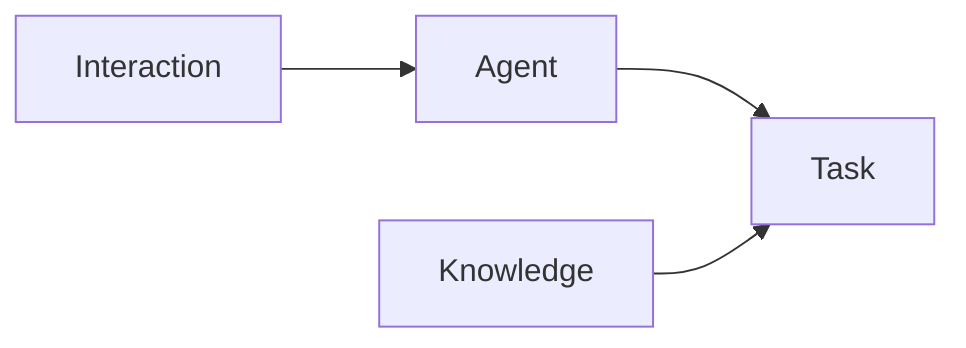
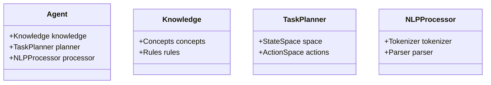
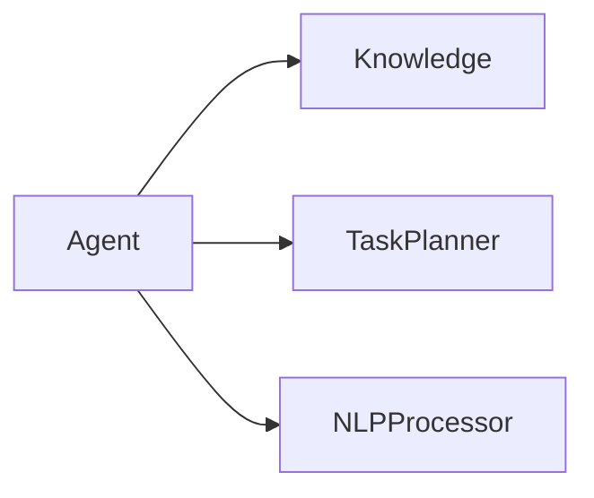
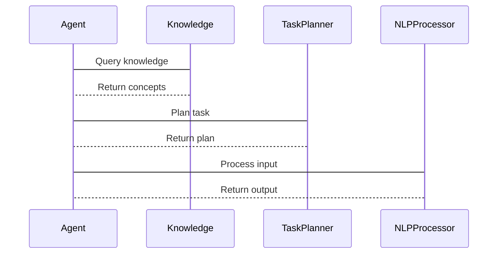

                 


# AI Agent开发中的常见挑战及对策

> 关键词：AI Agent、知识表示、任务规划、自然语言处理、强化学习、系统架构

> 摘要：本文深入探讨了AI Agent开发中的常见挑战，并提出了相应的对策。文章从背景与核心概念、算法原理、系统架构、项目实战、挑战与对策等多个维度展开分析，结合具体案例和代码实现，全面剖析了AI Agent开发的难点与解决方案。

---

# 第一部分: AI Agent开发背景与核心概念

## 第1章: AI Agent概述

### 1.1 AI Agent的基本概念
AI Agent（智能体）是指能够感知环境并采取行动以实现目标的实体。它具备自主性、反应性、目标导向性和社会性等核心特征。

#### 1.1.1 什么是AI Agent
AI Agent是一种能够感知环境、做出决策并执行动作的智能系统，广泛应用于自动驾驶、智能助手、机器人等领域。

#### 1.1.2 AI Agent的核心特征
- **自主性**：能够自主决策，无需外部干预。
- **反应性**：能够实时感知环境并做出响应。
- **目标导向性**：所有行为都围绕实现特定目标展开。
- **社会性**：能够与其他Agent或人类进行交互协作。

#### 1.1.3 AI Agent的分类与应用场景
- **简单反射型Agent**：基于当前感知直接做出反应，适用于实时性要求高的场景。
- **基于模型的反射型Agent**：结合内部模型和外部感知进行决策，适用于复杂环境。
- **目标驱动型Agent**：以目标为导向，通过规划实现复杂任务。
- **实用驱动型Agent**：以效用最大化为目标，适用于多目标优化场景。

### 1.2 AI Agent开发的背景与现状
随着人工智能技术的快速发展，AI Agent在各个领域的应用日益广泛。然而，其开发过程中也面临诸多挑战，如知识表示的复杂性、任务规划的不确定性等。

#### 1.2.1 AI Agent的发展历程
AI Agent的概念起源于20世纪60年代，经历了从简单的行为反应模型到复杂的知识驱动模型的演变。

#### 1.2.2 当前AI Agent技术的热点与趋势
- **强化学习**：通过与环境交互学习最优策略。
- **知识图谱**：利用结构化知识提升Agent的理解能力。
- **人机协作**：结合人类反馈优化Agent行为。

#### 1.2.3 企业级AI Agent应用的挑战与机遇
- **挑战**：复杂环境下的决策不确定性、多目标优化的难度、实时性要求高等。
- **机遇**：智能化转型的需求、5G技术的支持、云计算的普及。

---

## 第2章: AI Agent开发中的常见挑战

### 2.1 知识表示与推理
知识表示是AI Agent理解环境和推理的基础，其复杂性直接影响Agent的决策能力。

#### 2.1.1 知识图谱的构建与管理
知识图谱通过结构化的知识表示，帮助Agent理解复杂的语义关系。

#### 2.1.2 基于符号逻辑的推理算法
符号逻辑推理是一种基于规则的推理方法，适用于知识确定性的场景。

#### 2.1.3 知识表示的动态更新与维护
动态环境要求知识表示能够实时更新，这对知识管理提出了更高的要求。

### 2.2 任务规划与决策
任务规划是AI Agent的核心能力，其难度在于如何在复杂环境中找到最优路径。

#### 2.2.1 基于状态空间的任务规划方法
状态空间规划通过构建状态转移图，寻找从初始状态到目标状态的最优路径。

#### 2.2.2 强化学习在决策中的应用
强化学习通过与环境交互学习最优策略，适用于动态变化的复杂环境。

#### 2.2.3 多目标优化在任务规划中的挑战
多目标优化需要在多个目标之间找到平衡点，这对算法的计算能力和决策策略提出了更高的要求。

### 2.3 自然语言处理与人机交互
自然语言处理是AI Agent与人类交互的关键技术，其准确性直接影响用户体验。

#### 2.3.1 多轮对话中的上下文理解
多轮对话需要Agent具备上下文记忆能力，确保对话的连贯性。

#### 2.3.2 基于意图识别的交互优化
意图识别通过分析用户的语言意图，优化Agent的响应策略。

#### 2.3.3 语义理解的准确性与实时性
语义理解的准确性直接影响用户的体验，而实时性则要求Agent能够在短时间内完成复杂的语义分析。

---

## 第3章: AI Agent开发的核心概念与联系

### 3.1 核心概念原理
AI Agent的核心概念包括知识表示、任务规划和自然语言处理，它们共同支撑Agent的智能行为。

#### 3.1.1 任务规划算法的数学模型
任务规划可以通过图搜索算法（如A*）实现，其数学模型如下：
$$
f(n) = g(n) + h(n)
$$
其中，$g(n)$表示从起点到节点n的实际成本，$h(n)$表示从节点n到目标的估计成本。

#### 3.1.2 知识表示的符号逻辑系统
知识表示可以通过一阶逻辑（FOL）实现，例如：
$$
\forall x \text{Person}(x) \rightarrow \exists y \text{Dog}(y) \land \text{Owning}(x,y)
$$
表示“每个人都至少有一只狗”。

#### 3.1.3 自然语言处理的语义解析框架
语义解析可以通过句法分析和语义角色标注实现，例如：
$$
S = NP \text{主语} + VP \text{谓语}
$$

### 3.2 核心概念对比分析
通过对比分析，可以更好地理解不同技术的优缺点。

#### 3.2.1 不同知识表示方法的优缺点对比
| 方法         | 优点                     | 缺点                     |
|--------------|--------------------------|--------------------------|
| 符号逻辑     | 表达清晰，易于推理       | 不适合处理模糊信息       |
| 知识图谱     | 结构化，支持复杂推理     | 构建和维护成本较高       |
| 概念网络     | 支持动态更新             | 可能存在语义歧义         |

#### 3.2.2 各种任务规划算法的性能对比
| 算法         | 优点                     | 缺点                     |
|--------------|--------------------------|--------------------------|
| A*           | 最优路径搜索             | 对复杂环境的计算成本高   |
| Dijkstra     | 稳定性高                 | 无法处理动态变化的环境   |
| DQN          | 能处理动态环境           | 学习过程需要大量数据     |

#### 3.2.3 不同交互方式的用户体验对比
| 方式         | 优点                     | 缺点                     |
|--------------|--------------------------|--------------------------|
| 文本交互     | 实时性高，成本低         | 体验不够自然           |
| 语音交互     | 自然性强                 | 实时性较低，抗干扰能力差 |

### 3.3 ER实体关系图


---

# 第二部分: AI Agent开发的算法原理

## 第4章: 任务规划算法

### 4.1 基于状态空间的规划算法
基于状态空间的规划算法通过构建状态转移图，寻找最优路径。

#### 4.1.1 A*算法的实现原理
A*算法通过评估函数$f(n) = g(n) + h(n)$选择下一个扩展的节点，确保找到最短路径。

#### 4.1.2 Dijkstra算法在任务规划中的应用
Dijkstra算法适用于单源最短路径问题，但无法处理动态变化的环境。

#### 4.1.3 A*与Dijkstra算法的对比分析
A*算法在Dijkstra算法的基础上引入了启发式函数，能够更快地找到最优路径。

### 4.2 基于强化学习的规划算法
基于强化学习的规划算法通过与环境交互学习最优策略。

#### 4.2.1 Q-Learning算法的数学模型
Q-Learning算法通过以下公式更新Q值：
$$
Q(s, a) = (1 - \alpha) Q(s, a) + \alpha [r + \max Q(s', a')]
$$
其中，$\alpha$是学习率，$r$是奖励，$s'$是下一个状态。

#### 4.2.2 Deep Q-Network (DQN)的实现原理
DQN通过神经网络近似Q值函数，适用于高维状态空间和动作空间。

#### 4.2.3 强化学习在任务规划中的优势与挑战
优势：能够处理动态变化的环境；挑战：需要大量数据和计算资源。

### 4.3 算法实现的代码示例
以下是一个A*算法的Python实现示例：

```python
import heapq

def a_star_search(start, goal, neighbors, cost):
    open_set = {start}
    came_from = {}
    g_score = {start: 0}
    f_score = {start: heuristic(start, goal)}
    heap = []
    heapq.heappush(heap, (f_score[start], start))

    while open_set:
        current = heapq.heappop(heap)
        if current[1] == goal:
            return reconstruct_path(came_from, start, current[1])
        for n in neighbors(current[1]):
            tentative_g_score = g_score[current[1]] + cost(current[1], n)
            if n not in g_score or tentative_g_score < g_score[n]:
                came_from[n] = current[1]
                g_score[n] = tentative_g_score
                f_score[n] = g_score[n] + heuristic(n, goal)
                heapq.heappush(heap, (f_score[n], n))
                open_set.add(n)
    return None

def heuristic(a, b):
    return abs(a[0] - b[0]) + abs(a[1] - b[1])
```

---

## 第5章: 知识表示与推理算法

### 5.1 基于符号逻辑的知识表示
符号逻辑是一种经典的知识表示方法，适用于规则明确的场景。

#### 5.1.1 一阶逻辑（FOL）的数学模型
一阶逻辑通过谓词和量词描述知识，例如：
$$
\forall x \text{Person}(x) \rightarrow \exists y \text{Dog}(y) \land \text{Owning}(x, y)
$$

#### 5.1.2 基于规则的知识推理
规则推理通过预定义的规则进行推理，例如：
$$
\text{如果} \text{Person}(x) \text{并且} \text{Own}(x, y)，\text{那么} \text{Responsible}(x, y)
$$

#### 5.1.3 知识图谱的构建与管理
知识图谱通过实体和关系构建语义网络，支持复杂的语义推理。

### 5.2 基于概率论的知识推理
概率论方法适用于处理不确定性较高的知识表示。

#### 5.2.1 贝叶斯网络的数学模型
贝叶斯网络通过概率分布描述变量之间的依赖关系，例如：
$$
P(A|B) = \frac{P(B|A)P(A)}{P(B)}
$$

#### 5.2.2 证据推理与更新
证据推理通过贝叶斯定理更新概率分布，例如：
$$
P(A|B) = \frac{P(B|A)P(A)}{P(B)}
$$

#### 5.2.3 动态知识更新的挑战
动态知识更新需要实时维护概率分布，对计算能力提出了较高要求。

---

## 第6章: 自然语言处理与人机交互

### 6.1 多轮对话中的上下文理解
多轮对话需要Agent具备上下文记忆能力，确保对话的连贯性。

#### 6.1.1 基于序列标注的语义解析
序列标注技术通过分析对话历史，理解用户的意图。

#### 6.1.2 基于记忆网络的对话管理
记忆网络通过存储对话历史，帮助Agent理解上下文。

#### 6.1.3 对话策略的优化与调优
对话策略需要根据用户反馈不断优化，提升用户体验。

### 6.2 基于意图识别的交互优化
意图识别是实现智能交互的关键技术。

#### 6.2.1 基于词袋模型的意图分类
词袋模型通过统计词语频率进行意图分类，例如：
$$
f(x) = \sum_{i=1}^{n} w_i x_i
$$

#### 6.2.2 基于深度学习的意图识别
深度学习通过神经网络提取高维特征，提升意图识别的准确性。

#### 6.2.3 意图理解的准确性与实时性
意图理解的准确性直接影响用户体验，而实时性则要求Agent能够在短时间内完成复杂的语义分析。

### 6.3 语义理解的准确性与实时性
语义理解是AI Agent与人类交互的核心技术。

#### 6.3.1 基于规则的语义分析
基于规则的语义分析通过预定义的规则进行语义解析。

#### 6.3.2 基于深度学习的语义理解
深度学习通过神经网络提取语义特征，提升语义理解的准确性。

#### 6.3.3 语义理解的优化与提升
语义理解需要结合规则和深度学习，实现更准确的语义解析。

---

# 第三部分: AI Agent开发的系统架构

## 第7章: 系统架构设计

### 7.1 问题场景介绍
AI Agent的开发需要一个模块化的系统架构，确保各部分协同工作。

#### 7.1.1 系统功能设计
系统功能包括知识表示、任务规划、自然语言处理等核心模块。

#### 7.1.2 领域模型设计
领域模型通过类图描述系统模块之间的关系，例如：


#### 7.1.3 系统架构设计
系统架构通过分层设计，确保各模块之间的松耦合，例如：


#### 7.1.4 系统接口设计
系统接口需要定义清晰的输入输出格式，确保模块之间的通信顺畅。

#### 7.1.5 系统交互设计
系统交互通过序列图描述模块之间的协作关系，例如：


---

## 第8章: 系统实现与优化

### 8.1 环境安装与配置
开发AI Agent需要安装相关的依赖库，例如Python的scikit-learn、tensorflow等。

#### 8.1.1 系统核心实现源代码
以下是一个简单的AI Agent实现示例：

```python
class Agent:
    def __init__(self):
        self.knowledge = Knowledge()
        self.planner = TaskPlanner()
        self.nlp = NLPProcessor()

    def process_input(self, input_str):
        knowledge = self.nlp.parse(input_str)
        plan = self.planner.plan(knowledge)
        return self.nlp.generate_output(plan)
```

#### 8.1.2 代码应用解读与分析
代码通过模块化设计，实现了知识表示、任务规划和自然语言处理的核心功能。

#### 8.1.3 系统优化与调优
系统优化需要从算法和架构两方面入手，例如优化知识表示的效率，改进任务规划的算法。

### 8.2 项目实战与案例分析
通过具体的案例分析，帮助读者更好地理解AI Agent的开发过程。

#### 8.2.1 案例分析
以下是一个智能助手开发的案例：

```python
class SmartAssistant(Agent):
    def __init__(self):
        super().__init__()

    def handle_command(self, command):
        response = self.process_input(command)
        return response
```

#### 8.2.2 代码实现与解读
代码通过继承Agent类，实现了智能助手的核心功能，例如处理用户的语音指令。

---

## 第9章: 挑战与对策

### 9.1 知识表示的动态更新
知识表示的动态更新需要实时维护知识库，确保Agent能够适应变化的环境。

#### 9.1.1 知识表示的动态更新策略
动态更新策略包括增量更新和全量更新，需要根据具体场景选择合适的策略。

#### 9.1.2 知识表示的冲突处理
知识表示的冲突处理需要通过规则或算法解决，例如基于优先级的冲突消解。

#### 9.1.3 知识表示的版本控制
知识表示的版本控制需要记录每次更新的历史，确保知识库的可追溯性。

### 9.2 任务规划的多目标优化
任务规划的多目标优化需要在多个目标之间找到平衡点，这对算法的计算能力和决策策略提出了更高的要求。

#### 9.2.1 多目标优化的数学模型
多目标优化的数学模型可以通过加权和的方式实现，例如：
$$
f(x) = \alpha_1 f_1(x) + \alpha_2 f_2(x) + \dots + \alpha_n f_n(x)
$$
其中，$\alpha_i$是各个目标的权重。

#### 9.2.2 多目标优化的算法实现
多目标优化可以通过遗传算法、粒子群优化等方法实现，例如：
```python
def multi_objective_optimization(objectives, weights):
    # 实现多目标优化算法，返回最优解
    pass
```

#### 9.2.3 多目标优化的性能调优
多目标优化的性能调优需要从算法参数和计算资源两方面入手，例如优化算法的收敛速度，增加并行计算能力。

### 9.3 自然语言处理的准确性与实时性
自然语言处理的准确性与实时性直接影响用户体验，需要通过技术手段进行优化。

#### 9.3.1 提高语义理解的准确性
提高语义理解的准确性可以通过优化模型参数、增加训练数据等方式实现。

#### 9.3.2 提升语义理解的实时性
提升语义理解的实时性可以通过优化算法、减少计算复杂度等方式实现。

#### 9.3.3 语义理解的性能调优
语义理解的性能调优需要从模型结构和计算资源两方面入手，例如优化模型的计算效率，增加GPU加速。

---

## 第10章: 总结与展望

### 10.1 本文总结
本文深入探讨了AI Agent开发中的常见挑战，并提出了相应的对策。通过分析知识表示、任务规划和自然语言处理的核心概念，结合具体的算法实现和系统架构设计，为AI Agent的开发提供了理论支持和实践指导。

### 10.2 未来展望
未来，AI Agent的开发将朝着更加智能化、个性化和人性化的方向发展。随着技术的进步，AI Agent将在更多领域得到广泛应用，为人类创造更大的价值。

---

# 作者：AI天才研究院/AI Genius Institute & 禅与计算机程序设计艺术 /Zen And The Art of Computer Programming

---

以上是《AI Agent开发中的常见挑战及对策》的技术博客文章的完整目录和内容框架。

