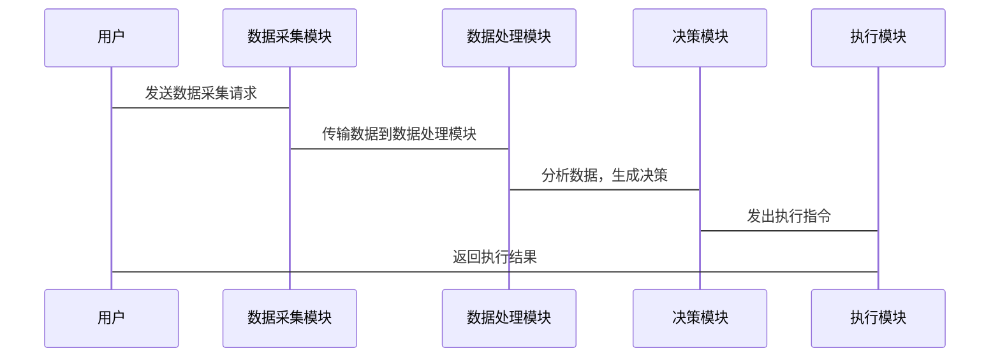

                 


# AI Agent性能优化：监控、分析与调优技巧

> **关键词**：AI Agent，性能优化，监控分析，调优技巧，算法优化，系统架构

> **摘要**：本文深入探讨了AI Agent的性能优化方法，涵盖监控、分析与调优的全过程。通过详细讲解核心概念、算法原理、系统架构设计及项目实战，帮助读者掌握提升AI Agent性能的技巧，解决实际应用中的性能瓶颈问题。

---

# 第1章 AI Agent概述

## 1.1 AI Agent的基本概念

### 1.1.1 什么是AI Agent

AI Agent（人工智能代理）是指能够感知环境并采取行动以实现目标的智能体。它可以是一个软件程序，也可以是一个硬件设备，通过感知和行动与环境交互，完成特定任务。

### 1.1.2 AI Agent的核心特点

- **自主性**：能够自主决策，无需外部干预。
- **反应性**：能够实时感知环境变化并做出反应。
- **目标导向性**：所有行动均以实现目标为导向。
- **学习能力**：通过经验改进性能。

### 1.1.3 AI Agent的应用场景

AI Agent广泛应用于多个领域，如自动驾驶、智能助手、推荐系统、机器人控制等。例如，自动驾驶中的AI Agent需要实时处理传感器数据，做出驾驶决策。

## 1.2 AI Agent的性能优化目标

### 1.2.1 响应速度优化

提升AI Agent的响应速度，减少延迟，提高用户体验。

### 1.2.2 资源利用率提升

优化计算资源、存储资源和网络资源的使用效率，降低能耗。

### 1.2.3 系统稳定性增强

确保AI Agent在高负载或异常情况下仍能稳定运行，减少故障率。

## 1.3 本章小结

本章介绍了AI Agent的基本概念、核心特点及其应用场景，强调了性能优化的重要性，为后续章节的深入分析奠定了基础。

---

# 第2章 性能监控基础

## 2.1 监控指标定义

### 2.1.1 常见监控指标

- **响应时间**：从接收请求到返回结果的时间。
- **吞吐量**：单位时间内处理的请求数量。
- **错误率**：请求中出现错误的比例。
- **资源使用率**：CPU、内存、磁盘的使用情况。

### 2.1.2 指标分类与作用

| 指标分类 | 指标名称 | 作用 |
|----------|----------|------|
| 响应时间 | 响应时间 | 评估系统延迟 |
| 吞吐量   | QPS（每秒查询数） | 评估系统处理能力 |
| 错误率   | 错误率   | 评估系统稳定性 |

## 2.2 监控工具与技术

### 2.2.1 常用监控工具

- **Prometheus**：开源监控和报警工具，支持多种数据源。
- **Grafana**：可视化界面，支持多种时序数据库。
- **ELK（Elasticsearch, Logstash, Kibana）**：用于日志监控和分析。

### 2.2.2 监控数据采集方法

- **指标采集**：通过API接口获取系统运行数据。
- **日志采集**：收集系统日志，分析错误信息。
- **性能计数器**：使用系统内置的性能计数器。

## 2.3 数据可视化与分析

### 2.3.1 数据可视化工具

- **Grafana**：通过图形化界面展示监控数据。
- **Kibana**：用于日志数据的可视化分析。
- **Tableau**：商业智能工具，支持多种数据源。

### 2.3.2 数据分析方法

- **趋势分析**：通过时间序列数据，分析系统性能的变化趋势。
- **异常检测**：利用统计方法或机器学习算法，识别异常数据点。

## 2.4 本章小结

本章介绍了AI Agent性能监控的基础知识，包括监控指标、工具和技术，以及数据可视化与分析的方法，为后续的性能优化提供了数据支持。

---

# 第3章 性能问题分析

## 3.1 数据分析方法

### 3.1.1 基于指标的趋势分析

通过分析监控指标的变化趋势，识别系统性能的瓶颈。例如，使用Prometheus和Grafana分析CPU使用率的趋势。

### 3.1.2 基于日志的异常检测

通过分析系统日志，识别错误和异常情况。例如，使用ELK分析日志，发现频繁发生的错误类型。

## 3.2 常见性能瓶颈分析

### 3.2.1 计算资源不足

- **问题表现**：响应时间增加，错误率上升。
- **原因分析**：CPU或GPU资源被过度占用，导致任务排队。

### 3.2.2 网络延迟问题

- **问题表现**：数据传输速度慢，导致响应时间增加。
- **原因分析**：网络带宽不足或网络拥塞。

### 3.2.3 并发处理能力不足

- **问题表现**：在高并发情况下，系统性能下降。
- **原因分析**：系统架构设计不合理，无法有效处理并发请求。

## 3.3 问题定位与诊断

### 3.3.1 日志分析方法

- **日志解析**：使用工具解析日志，提取关键信息。
- **关联分析**：通过日志时间戳和相关性，找出问题的根本原因。

### 3.3.2 性能分析工具使用

- **性能剖析工具**：使用工具如`perf`或`火焰图`，分析代码执行瓶颈。

## 3.4 本章小结

本章通过数据分析方法和常见性能瓶颈分析，帮助读者识别和定位系统性能问题，为后续的优化提供了方向。

---

# 第4章 性能调优技巧

## 4.1 调优原则

### 4.1.1 以数据驱动为导向

基于监控数据和分析结果，制定调优策略。

### 4.1.2 以问题为导向

针对具体问题，采取相应的优化措施，避免盲目优化。

### 4.1.3 以结果为导向

通过测试和验证，确保调优措施有效。

## 4.2 常见调优方法

### 4.2.1 参数调整

- **调整线程池大小**：根据系统负载，合理设置线程池大小，避免资源浪费和过度竞争。
- **优化缓存策略**：合理使用缓存，减少重复计算。

### 4.2.2 算法优化

- **改进算法复杂度**：通过优化算法，降低计算复杂度。
- **并行计算**：利用多核CPU或分布式计算，提升计算效率。

### 4.2.3 资源分配优化

- **负载均衡**：合理分配任务到不同的节点，避免单点过载。
- **资源预留**：预留足够的资源，应对峰值负载。

## 4.3 本章小结

本章总结了性能调优的原则和常见方法，帮助读者制定有效的调优策略，提升系统性能。

---

# 第5章 系统架构优化

## 5.1 系统架构设计

### 5.1.1 问题场景介绍

在高并发和大规模数据的场景下，传统架构可能面临性能瓶颈。需要设计一个可扩展、高可用的系统架构。

### 5.1.2 系统功能设计

设计一个AI Agent系统，需要考虑以下几个方面：

- **数据采集**：实时采集环境数据。
- **数据处理**：对数据进行清洗、转换和分析。
- **决策制定**：基于分析结果，做出决策。
- **行动执行**：执行决策，与环境交互。

### 5.1.3 系统架构设计

以下是AI Agent系统的架构设计：


### 5.1.4 系统接口设计

以下是AI Agent系统的接口设计：



## 5.2 本章小结

本章通过系统架构设计，展示了如何从整体上优化AI Agent的性能，确保系统在高并发和大规模数据下的稳定运行。

---

# 第6章 项目实战

## 6.1 环境安装

### 6.1.1 安装依赖

```bash
pip install numpy matplotlib scikit-learn
```

## 6.2 核心代码实现

### 6.2.1 数据采集模块

```python
import numpy as np

def collect_data():
    return np.random.rand(1000, 10)
```

### 6.2.2 数据处理模块

```python
from sklearn.preprocessing import StandardScaler

def preprocess(data):
    scaler = StandardScaler()
    return scaler.fit_transform(data)
```

### 6.2.3 决策模块

```python
from sklearn.linear_model import LinearRegression

def make_decision(data):
    model = LinearRegression()
    model.fit(data[:, :-1], data[:, -1])
    return model.predict(data[:, :-1])
```

### 6.2.4 执行模块

```python
def execute_decision(decision):
    print(f"执行决策：{decision}")
```

## 6.3 代码解读与分析

### 6.3.1 数据采集模块

`collect_data()`函数生成随机数据，模拟从传感器获取的数据。

### 6.3.2 数据处理模块

`preprocess()`函数使用标准Scaler对数据进行标准化处理，确保数据在相同范围内。

### 6.3.3 决策模块

`make_decision()`函数使用线性回归模型对数据进行预测，生成决策结果。

### 6.3.4 执行模块

`execute_decision()`函数根据决策结果执行相应动作，并输出结果。

## 6.4 案例分析

### 6.4.1 案例背景

假设我们有一个AI Agent，用于预测股票价格。我们需要优化其性能，提升预测准确性。

### 6.4.2 优化过程

1. 采集股票数据。
2. 对数据进行预处理。
3. 使用回归模型进行预测。
4. 根据预测结果执行交易决策。

## 6.5 本章小结

通过实际案例分析，展示了如何将理论知识应用到实际项目中，提升AI Agent的性能。

---

# 第7章 最佳实践与注意事项

## 7.1 最佳实践

### 7.1.1 定期监控

定期监控系统性能，及时发现潜在问题。

### 7.1.2 持续优化

根据监控数据和用户反馈，持续优化系统性能。

### 7.1.3 备份与恢复

制定完善的备份和恢复策略，确保系统在出现问题时能够快速恢复。

## 7.2 小结

性能优化是一个持续的过程，需要结合理论和实践，不断发现问题并解决问题。

## 7.3 注意事项

- **避免过度优化**：过度优化可能会增加系统的复杂性，反而影响性能。
- **注重代码质量**：代码质量直接影响系统性能，需要注意代码的可读性和可维护性。
- **合理分配资源**：根据系统负载合理分配资源，避免资源浪费。

## 7.4 拓展阅读

建议读者阅读以下书籍和资源，深入学习性能优化的相关知识：

- 《高性能计算》
- 《分布式系统设计与实现》
- 《算法导论》

---

# 作者：AI天才研究院 & 禅与计算机程序设计艺术

---

本文通过系统化的分析和实践，深入探讨了AI Agent的性能优化方法，帮助读者掌握监控、分析与调优的技巧，提升系统性能。希望本文对广大AI开发者和研究人员有所帮助。

