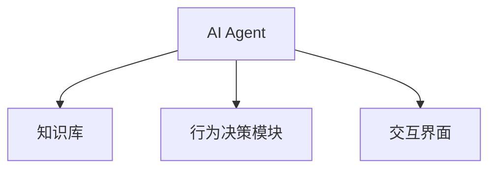

                 

# AI Agent架构设计：从概念到实现

## 关键词：AI Agent、人工智能、架构设计、强化学习、分布式系统、系统架构

## 摘要：  
本文将深入探讨AI Agent的架构设计，从基本概念到实现原理，结合实际应用场景，分析AI Agent的核心概念、算法原理和系统架构设计，帮助读者全面理解AI Agent的设计与实现。

---

# 第1章: AI Agent概述

## 1.1 AI Agent的基本概念

### 1.1.1 什么是AI Agent  
AI Agent（人工智能代理）是指能够感知环境、自主决策并执行任务的智能实体。它可以是一个软件程序、机器人或其他智能系统，具备目标导向性、自主性和适应性。

### 1.1.2 AI Agent的核心特征  
- **自主性**：能够在没有外部干预的情况下自主运行。  
- **反应性**：能够实时感知环境并做出反应。  
- **目标导向性**：基于目标驱动行为。  
- **学习能力**：能够通过经验改进性能。  

### 1.1.3 AI Agent的分类与应用场景  
- **简单反射型Agent**：基于当前输入做出反应，适用于实时交互场景。  
- **基于模型的反射型Agent**：维护环境状态模型，适用于复杂任务。  
- **目标驱动型Agent**：以目标为导向，适用于任务型应用。  
- **效用驱动型Agent**：通过最大化效用函数来决策，适用于资源优化场景。  

应用场景包括智能助手、自动驾驶、游戏AI、机器人控制等。

---

## 1.2 AI Agent与相关概念的对比

### 1.2.1 AI Agent与传统程序的区别  
- AI Agent具备自主性和学习能力，而传统程序通常依赖外部输入和固定的逻辑。  
- AI Agent能够处理不确定性，而传统程序通常在确定性环境下运行。  

### 1.2.2 AI Agent与机器人、聊天机器人的区别  
- AI Agent是一个通用概念，可以是软件或硬件形式。  
- 机器人是AI Agent的一种物理实现形式，聊天机器人是基于文本交互的AI Agent。  

### 1.2.3 AI Agent与分布式系统的关系  
AI Agent可以作为分布式系统中的一个节点，通过协作完成复杂任务。  

---

## 1.3 AI Agent的发展背景与趋势

### 1.3.1 AI Agent的历史发展  
从简单的专家系统到现代的强化学习模型，AI Agent经历了从规则驱动到数据驱动的演变。  

### 1.3.2 当前AI Agent技术的热点与挑战  
- 热点：强化学习、多智能体协作、人机协作。  
- 挑战：处理复杂环境中的不确定性、多智能体协作的效率问题。  

### 1.3.3 未来AI Agent的发展方向  
- 更强的自主性和适应性。  
- 更高效的多智能体协作机制。  
- 更广泛的应用场景。  

---

## 1.4 本章小结  
本章介绍了AI Agent的基本概念、核心特征、分类与应用场景，并对比了相关概念。通过这些内容，读者可以初步理解AI Agent的定义、特点及其与相关技术的区别。

---

# 第2章: AI Agent的核心概念与原理

## 2.1 AI Agent的组成与结构

### 2.1.1 知识表示  
知识表示是AI Agent理解环境的基础。常用的表示方法包括规则表示法、语义网络和知识图谱。  

### 2.1.2 行为选择  
行为选择是AI Agent的核心决策过程，基于当前状态和目标选择最优动作。  

### 2.1.3 感知与交互  
AI Agent通过传感器或接口感知环境，并通过执行器或界面与环境交互。  

---

## 2.2 AI Agent的决策机制

### 2.2.1 状态空间与动作空间  
- **状态空间**：所有可能的状态的集合。  
- **动作空间**：所有可能的动作的集合。  

### 2.2.2 决策树与策略  
- **决策树**：用于描述所有可能的决策路径。  
- **策略**：AI Agent在给定状态下选择动作的规则。  

### 2.2.3 基于强化学习的决策  
强化学习是一种通过试错来优化策略的方法。常用的算法包括Q-Learning和Deep Q-Networks（DQN）。  

---

## 2.3 AI Agent的通信与协作

### 2.3.1 多智能体系统概述  
多智能体系统是多个AI Agent协作完成复杂任务的系统。  

### 2.3.2 智能体之间的通信协议  
通信协议定义了智能体之间的信息传递规则，通常包括消息格式和通信机制。  

### 2.3.3 协作任务分配与协调  
通过任务分配算法（如基于角色的分配）和协调机制（如分布式协调）实现协作。  

---

## 2.4 本章小结  
本章详细讲解了AI Agent的核心概念，包括组成结构、决策机制和通信协作。这些内容为后续的算法和系统设计奠定了基础。

---

# 第3章: AI Agent的算法原理

## 3.1 基于强化学习的AI Agent

### 3.1.1 强化学习的基本原理  
强化学习通过智能体与环境的交互，学习最优策略。奖励机制是强化学习的核心。  

### 3.1.2 Q-Learning算法  
Q-Learning是一种经典的强化学习算法，适用于离散状态和动作空间。  

### 3.1.3 Deep Q-Networks (DQN)算法  
DQN通过深度神经网络近似Q值函数，适用于连续状态空间。  

---

## 3.2 基于监督学习的AI Agent

### 3.2.1 监督学习的基本原理  
监督学习通过标注数据训练模型，适用于分类和回归任务。  

### 3.2.2 分类任务中的AI Agent应用  
例如，在自然语言处理任务中，AI Agent可以通过监督学习进行分类。  

### 3.2.3 回归任务中的AI Agent应用  
例如，在预测任务中，AI Agent可以通过回归模型进行预测。  

---

## 3.3 基于生成模型的AI Agent

### 3.3.1 生成对抗网络（GAN）简介  
GAN由生成器和判别器组成，通过对抗训练生成逼真的数据。  

### 3.3.2 GAN在AI Agent中的应用  
例如，在图像生成任务中，AI Agent可以通过GAN生成高质量图像。  

### 3.3.3 其他生成模型的探索  
如变分自编码器（VAE）等。  

---

## 3.4 本章小结  
本章详细讲解了AI Agent的算法原理，包括强化学习、监督学习和生成模型的应用。这些算法为AI Agent的设计提供了理论基础。

---

# 第4章: AI Agent的系统架构设计

## 4.1 系统架构概述

### 4.1.1 单体架构  
单体架构适用于小型项目，但扩展性较差。  

### 4.1.2 分布式架构  
分布式架构适用于大规模任务，但需要考虑通信和协调问题。  

### 4.1.3 微服务架构  
微服务架构通过模块化设计提高系统的灵活性和可维护性。  

---

## 4.2 系统功能设计

### 4.2.1 知识库设计  
知识库是AI Agent的核心，通常包括规则库、知识图谱等。  

### 4.2.2 行为决策模块  
行为决策模块负责根据当前状态选择最优动作。  

### 4.2.3 交互界面设计  
交互界面是AI Agent与用户或其他系统交互的接口。  

---

## 4.3 系统架构图  
以下是AI Agent的系统架构图：

---

## 4.4 本章小结  
本章详细讲解了AI Agent的系统架构设计，包括架构选择和功能设计。通过这些设计，可以构建高效可靠的AI Agent系统。

---

# 作者：AI天才研究院/AI Genius Institute & 禅与计算机程序设计艺术 /Zen And The Art of Computer Programming

---

以上是《AI Agent架构设计：从概念到实现》的完整内容，涵盖了从概念到实现的全过程。通过本文，读者可以系统地理解AI Agent的架构设计，并能够将其应用于实际场景中。

