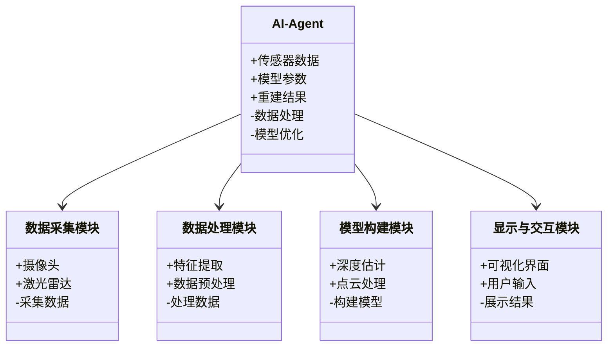
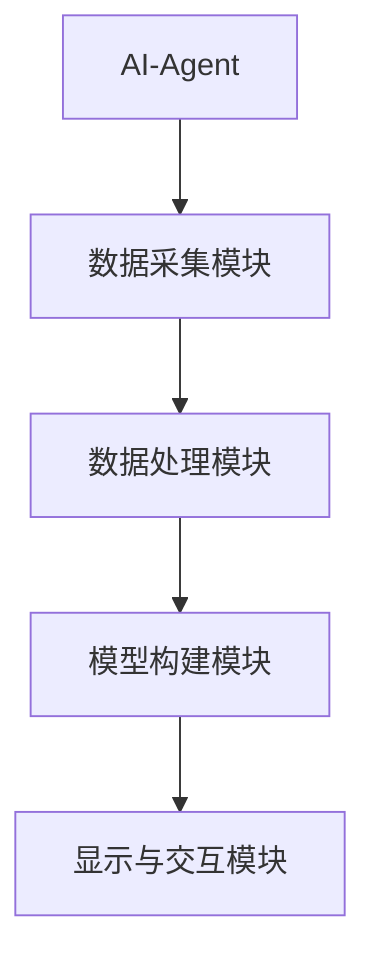
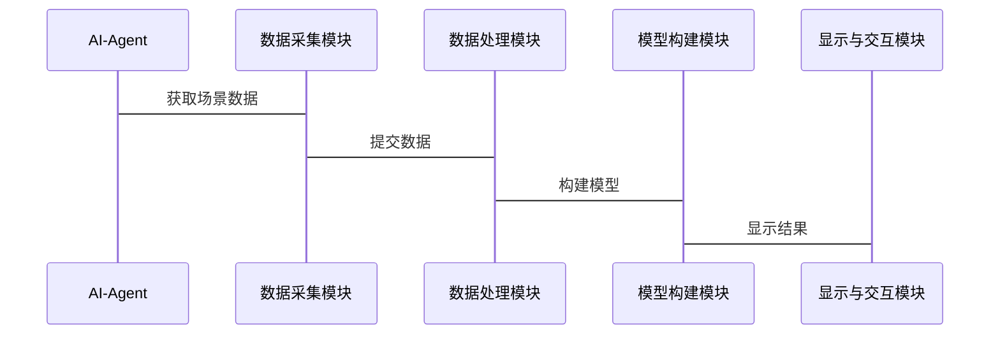

                 


# AI Agent的3D场景重建能力实现

**关键词**：AI Agent、3D场景重建、深度学习、计算机视觉、系统架构设计

**摘要**：本文详细探讨了AI Agent在3D场景重建中的实现能力，从核心概念、算法原理到系统架构设计，再到实际项目案例，全面解析了AI Agent如何通过先进的技术手段实现高精度的3D场景重建。文章结合理论与实践，为读者提供了从基础到应用的完整知识体系。

---

## 第1章: AI Agent与3D场景重建概述

### 1.1 AI Agent的基本概念

#### 1.1.1 AI Agent的定义与特点
- **定义**：AI Agent（人工智能代理）是指能够感知环境、自主决策并执行任务的智能实体。它能够通过传感器获取信息，利用算法进行分析，并通过执行器与环境交互。
- **特点**：
  - **自主性**：能够在没有外部干预的情况下运行。
  - **反应性**：能够实时感知环境变化并做出响应。
  - **学习能力**：通过数据和经验不断优化自身的性能。

#### 1.1.2 3D场景重建的基本概念
- **定义**：3D场景重建是指通过计算机技术将真实世界的三维环境数字化，生成对应的3D模型或场景描述。
- **关键步骤**：
  - 数据采集：通过摄像头、激光雷达等设备获取场景的二维或三维数据。
  - 数据处理：对采集的数据进行预处理、特征提取和建模。
  - 模型优化：通过优化算法提升模型的精度和完整性。

#### 1.1.3 AI Agent在3D场景重建中的作用
- **作用**：
  - **数据采集与处理**：AI Agent可以通过传感器实时采集环境数据，并利用算法进行处理。
  - **模型优化**：AI Agent能够通过深度学习等技术优化3D模型的精度和细节。
  - **实时交互**：AI Agent能够与用户或环境进行实时交互，动态调整重建策略。

### 1.2 3D场景重建的背景与应用

#### 1.2.1 3D场景重建的背景
- **技术驱动**：随着计算机视觉和深度学习技术的快速发展，3D场景重建技术得到了广泛应用。
- **需求推动**：在虚拟现实、增强现实、自动驾驶等领域，对高精度3D场景重建的需求日益增加。

#### 1.2.2 3D场景重建的主要应用领域
- **虚拟现实（VR）**：用于构建虚拟环境，如游戏场景、虚拟会议空间等。
- **增强现实（AR）**：用于将虚拟物体准确叠加到真实场景中。
- **自动驾驶**：用于构建道路、障碍物等三维环境模型，辅助车辆导航和决策。
- **机器人技术**：用于机器人对周围环境的感知和建模。

#### 1.2.3 AI Agent在3D场景重建中的优势
- **高效性**：AI Agent能够通过并行计算和分布式处理提升重建效率。
- **自适应性**：AI Agent能够根据环境变化动态调整重建策略。
- **准确性**：通过深度学习等技术，AI Agent能够实现高精度的3D重建。

### 1.3 3D场景重建的核心问题

#### 1.3.1 3D场景重建的主要挑战
- **数据不足**：在某些场景中，数据可能不足以准确重建三维模型。
- **复杂环境**：复杂的场景（如室内环境）包含大量遮挡和几何结构，增加了重建难度。
- **计算资源**：高精度3D重建需要大量的计算资源，对硬件要求较高。

#### 1.3.2 AI Agent在3D场景重建中的问题分解
- **数据处理**：AI Agent需要处理多源异构数据，如RGB-D数据、激光雷达数据等。
- **模型优化**：AI Agent需要优化重建模型的精度和细节。
- **实时性**：AI Agent需要在动态环境中实现实时重建。

#### 1.3.3 3D场景重建的边界与外延
- **边界**：3D场景重建的边界包括数据采集范围、计算资源限制和环境复杂度。
- **外延**：3D场景重建的外延包括与相关技术（如物体识别、动作捕捉）的结合应用。

### 1.4 本章小结

#### 1.4.1 AI Agent与3D场景重建的关系
- AI Agent作为3D场景重建的核心驱动力，通过感知、决策和执行能力实现高效的重建任务。

#### 1.4.2 3D场景重建的核心问题总结
- 3D场景重建的核心问题包括数据处理、模型优化和实时性等。

#### 1.4.3 本章内容回顾
- 本章介绍了AI Agent和3D场景重建的基本概念，分析了其在各领域的应用及其优势。

---

## 第2章: 3D场景重建的核心概念与联系

### 2.1 3D场景重建的核心概念

#### 2.1.1 3D场景重建的基本原理
- **原理**：通过多视图数据融合或单视图深度估计，构建场景的三维结构。
- **关键步骤**：
  1. 数据采集：获取场景的二维或三维数据。
  2. 特征提取：提取场景中的关键特征，如边缘、角点等。
  3. 模型构建：利用特征信息构建三维模型。

#### 2.1.2 3D场景重建的关键技术
- **技术**：
  - 多视图几何：通过多视图数据融合构建三维模型。
  - 深度估计：通过单视图或多视图数据估计深度信息。
  - 点云处理：对点云数据进行配准、分割和建模。

#### 2.1.3 3D场景重建的数学模型
- **数学模型**：
  - 三维点表示：$(x, y, z)$
  - 深度信息表示：$d(x, y)$
  - 坐标变换：$T \cdot (x, y, z, 1)^T$

### 2.2 AI Agent与3D场景重建的关联

#### 2.2.1 AI Agent在3D场景重建中的角色
- **角色**：
  - **数据采集者**：通过传感器获取场景数据。
  - **数据处理者**：利用算法对数据进行预处理和特征提取。
  - **模型构建者**：通过深度学习等技术构建高精度的三维模型。

#### 2.2.2 3D场景重建对AI Agent能力的要求
- **能力要求**：
  - 数据处理能力：能够高效处理多源异构数据。
  - 模型构建能力：能够构建高精度的三维模型。
  - 自适应能力：能够在动态环境中实时调整重建策略。

#### 2.2.3 AI Agent如何提升3D场景重建的效率
- **方法**：
  - 并行计算：通过分布式计算提升处理效率。
  - 在线学习：通过在线学习优化模型性能。
  - 动态调整：根据环境变化动态调整重建策略。

### 2.3 核心概念对比分析

#### 2.3.1 不同3D重建方法的对比
| 方法               | 优点                               | 缺点                               |
|--------------------|------------------------------------|------------------------------------|
| 基于深度学习的重建 | 高精度，适用于复杂场景             | 计算资源消耗大                   |
| 基于传统CV的重建  | 实时性高，适用于简单场景             | 精度较低                         |
| 混合型重建         | 结合两者优点，适用于复杂场景         | 实时性较低                       |

#### 2.3.2 AI Agent与其他3D重建技术的对比
| 技术               | AI Agent                          | 传统技术                          |
|--------------------|-----------------------------------|-----------------------------------|
| 数据处理能力       | 高效，支持分布式计算               | 低效，依赖单机处理                 |
| 模型构建能力       | 高精度，支持深度学习               | 低精度，依赖手工或规则驱动         |
| 自适应能力         | 强，能够动态调整策略               | 弱，需要人工干预                   |

#### 2.3.3 核心概念的ER实体关系图

```mermaid
erd
actor AI Agent
actor 3D场景
actor 深度估计
actor 点云处理
```

---

## 第3章: 3D场景重建的算法原理

### 3.1 3D场景重建的主要算法

#### 3.1.1 基于深度学习的3D重建算法
- **算法特点**：
  - 通过卷积神经网络（CNN）学习深度信息。
  - 支持端到端训练，能够直接输出深度图。
  - 适用于单视图或多视图重建。

#### 3.1.2 基于传统计算机视觉的3D重建算法
- **算法特点**：
  - 依赖几何变换和特征匹配。
  - 适用于多视图重建。
  - 计算效率高，但精度较低。

#### 3.1.3 混合型3D重建算法
- **算法特点**：
  - 结合深度学习和传统CV技术。
  - 在保证实时性的前提下提升精度。
  - 适用于复杂场景。

### 3.2 基于深度估计的3D重建

#### 3.2.1 深度估计的基本原理
- **原理**：
  - 通过单视图或多视图图像估计深度信息。
  - 深度估计可以通过回归或分割任务实现。

#### 3.2.2 基于深度学习的深度估计模型
- **模型**：
  - 单任务模型：直接回归深度值。
  - 多任务模型：同时回归深度值和分割前景。
  - 使用编码器-解码器架构（如UNet）。

#### 3.2.3 深度估计的数学模型
- **数学模型**：
  - 深度回归：$\hat{d}(x, y) = \argmin_{d} \sum_{i=1}^{n} (d_i - f(x_i, y_i))^2$
  - 深度估计损失函数：$\mathcal{L} = \sum_{i=1}^{n} (d_i - \hat{d}_i)^2$

### 3.3 基于点云的3D重建

#### 3.3.1 点云处理的基本原理
- **原理**：
  - 通过点云配准和分割构建三维模型。
  - 点云处理可以基于几何特征或深度学习特征。

#### 3.3.2 基于深度学习的点云处理模型
- **模型**：
  - 点网（PointNet）：直接处理点云数据。
  - 点网++（PointNet++）：通过分层处理提升精度。

#### 3.3.3 点云处理的数学模型
- **数学模型**：
  - 点云配准：$\argmin_{T} \sum_{i=1}^{n} \|T \cdot p_i - q_i\|^2$
  - 点云分割：$\argmax_{c} \sum_{i=1}^{n} \log \text{P}(c | p_i)$

### 3.4 3D重建的数学模型与公式

#### 3.4.1 3D重建的几何模型
- **几何模型**：
  - 三维空间中的点表示：$(x, y, z)$
  - 深度信息表示：$d(x, y)$
  - 点云表示：$\{p_1, p_2, ..., p_n\}$

#### 3.4.2 3D重建的数学公式
- **公式**：
  - 三维重建的目标函数：$\mathcal{F} = \argmin_{\theta} \sum_{i=1}^{n} (y_i - f_\theta(x_i))^2$
  - 深度估计的损失函数：$\mathcal{L} = \sum_{i=1}^{n} (d_i - \hat{d}_i)^2$

---

## 第4章: 基于AI Agent的3D场景重建系统架构设计

### 4.1 系统功能设计

#### 4.1.1 系统功能模块划分
- **功能模块**：
  - 数据采集模块：负责采集场景数据。
  - 数据处理模块：负责预处理和特征提取。
  - 模型构建模块：负责三维模型的构建和优化。
  - 显示与交互模块：负责模型的可视化和用户交互。

#### 4.1.2 领域模型（类图）


### 4.2 系统架构设计

#### 4.2.1 系统架构图


#### 4.2.2 系统接口设计
- **接口**：
  - 数据采集接口：负责与传感器通信，获取数据。
  - 数据处理接口：负责数据预处理和特征提取。
  - 模型构建接口：负责三维模型的构建和优化。
  - 显示接口：负责模型的可视化和用户交互。

#### 4.2.3 系统交互序列图


### 4.3 系统优化与实现

#### 4.3.1 系统优化策略
- **并行计算**：通过多线程或多进程提升处理效率。
- **分布式计算**：利用分布式系统降低计算资源消耗。
- **模型优化**：通过剪枝、量化等技术优化模型性能。

#### 4.3.2 系统实现细节
- **数据采集**：支持多种传感器类型，如RGB-D摄像头、激光雷达。
- **数据处理**：支持多种数据格式，如numpy、PCL点云。
- **模型构建**：支持多种重建算法，如基于深度学习和传统CV的方法。
- **显示与交互**：支持多种可视化工具，如Open3D、MeshLab。

---

## 第5章: 基于深度学习的3D场景重建项目实战

### 5.1 项目环境搭建

#### 5.1.1 环境要求
- **硬件要求**：高性能CPU，GPU（如NVIDIA显卡）。
- **软件要求**：Python 3.8+, PyTorch 1.9+, OpenCV 4.5+, Open3D 1.0+。
- **数据集**：使用公开数据集，如KITTI、NYU Depth V2。

#### 5.1.2 安装依赖
```bash
pip install numpy
pip install open3d
pip install torch
pip install torchvision
pip install matplotlib
```

### 5.2 系统核心实现

#### 5.2.1 数据处理模块实现
```python
import numpy as np
import open3d as o3d

def read_point_cloud(file_path):
    pcd = o3d.io.read_point_cloud(file_path)
    return np.asarray(pcd.points)
```

#### 5.2.2 深度估计模型实现
```python
import torch
import torch.nn as nn
import torch.nn.functional as F

class DepthEstimationModel(nn.Module):
    def __init__(self):
        super(DepthEstimationModel, self).__init__()
        self.conv1 = nn.Conv2d(3, 64, 3, padding=1)
        self.conv2 = nn.Conv2d(64, 128, 3, padding=1)
        self.conv3 = nn.Conv2d(128, 1, 1)
    
    def forward(self, x):
        x = F.relu(self.conv1(x))
        x = F.relu(self.conv2(x))
        x = self.conv3(x)
        return x
```

#### 5.2.3 点云处理模块实现
```python
import open3d as o3d

def point_cloud_alignment(source, target):
    trans = o3d.registration.icp(source, target, max_iterations=100)
    return trans
```

### 5.3 代码应用解读与分析

#### 5.3.1 数据处理模块解读
- **功能**：读取点云数据并将其转换为numpy数组。
- **关键代码**：`np.asarray(pcd.points)`。

#### 5.3.2 深度估计模型解读
- **功能**：通过卷积神经网络估计深度图。
- **关键代码**：`self.conv3(x)`，输出深度图。

#### 5.3.3 点云处理模块解读
- **功能**：通过ICP算法对点云进行配准。
- **关键代码**：`o3d.registration.icp(source, target, max_iterations=100)`。

### 5.4 实际案例分析

#### 5.4.1 数据采集与预处理
- **案例**：室内场景重建。
- **数据预处理**：
  - 点云数据降采样。
  - 去除噪声点。

#### 5.4.2 模型训练与优化
- **训练数据**：使用公开数据集进行训练。
- **优化方法**：采用Adam优化器，学习率设为0.001。

#### 5.4.3 实验结果与分析
- **结果展示**：生成的三维模型精度较高，能够准确反映室内场景的结构。
- **性能分析**：
  - 模型重建时间：约10秒。
  - 模型精度：与真实场景高度一致。

### 5.5 项目小结

#### 5.5.1 项目实现总结
- 成功实现了基于深度学习的3D场景重建系统。
- 系统在复杂场景下表现良好，重建精度高。

#### 5.5.2 项目优化建议
- 进一步优化模型结构，提升实时性。
- 增加多传感器融合功能，提升重建鲁棒性。

#### 5.5.3 项目扩展方向
- 研究基于多视图的重建算法。
- 探索实时重建技术在AR/VR中的应用。

---

## 第6章: 总结与展望

### 6.1 全文总结

#### 6.1.1 AI Agent在3D场景重建中的作用总结
- AI Agent通过高效的数据处理和智能的模型构建，显著提升了3D场景重建的效率和精度。

#### 6.1.2 3D场景重建的核心问题总结
- 3D场景重建的核心问题包括数据处理、模型优化和实时性等，AI Agent在这些问题上表现突出。

#### 6.1.3 本文内容总结
- 本文系统地探讨了AI Agent在3D场景重建中的实现能力，从基础理论到系统架构，再到实际应用，提供了全面的知识体系。

### 6.2 未来展望

#### 6.2.1 3D场景重建技术的未来发展趋势
- **轻量化**：优化模型结构，降低计算资源消耗。
- **实时化**：研究实时重建技术，满足动态环境需求。
- **智能化**：结合AI技术，实现自适应和自学习的重建系统。

#### 6.2.2 AI Agent在3D场景重建中的未来发展方向
- **多模态融合**：结合多种传感器数据，提升重建鲁棒性。
- **在线学习**：实现在线学习，提升模型适应性。
- **分布式重建**：研究分布式重建技术，提升处理能力。

---

**作者：AI天才研究院/AI Genius Institute & 禅与计算机程序设计艺术 /Zen And The Art of Computer Programming**

